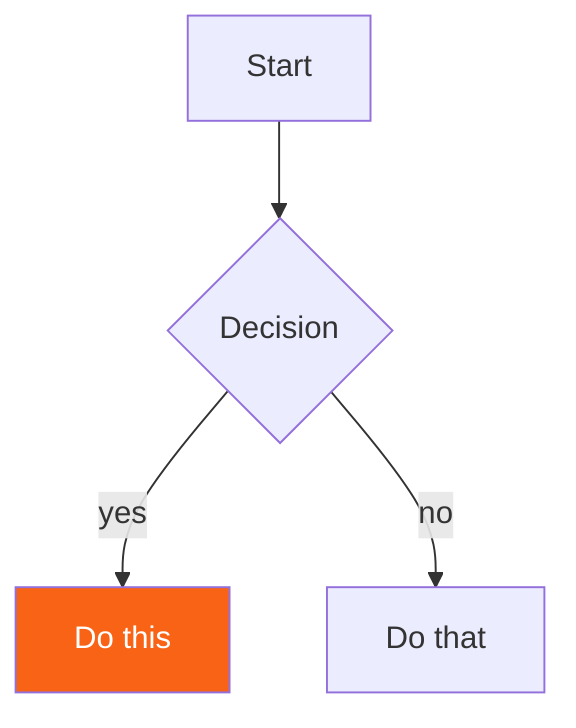

# Author Guide

The rules for creating a new chapter (or improving an existing one). Follow these so the book reads
as one consistent voice, whoever writes a chapter. Use [`content/ownership.md`](content/ownership.md)
as a concrete reference — it's the model every other chapter is built on.

Chapters should work for a wide audience: complete beginners, working programmers new to Rust, and
experienced Rustaceans using later parts as a reference. Write so a motivated beginner is never
lost, while a more experienced reader still finds something worthwhile.

---

## Voice and language

- **Plain, warm English.** Short sentences. Address the reader directly as "you", in a friendly,
  mentor-like tone.
- **Explain jargon inline.** The first time a technical term appears, define it in parentheses —
  for example: "a *closure* (an anonymous function that remembers the variables around it)".
- Prefer concrete examples and analogies over abstract definitions.
- Be complete and correct. Where a subtlety matters, put it in a "Deep Dive" callout rather than
  glossing over it.
- Don't reference content the reader can't see. Link to other chapters instead, e.g.
  "(see the [Ownership](#/ch/ownership) chapter)".

## Chapter structure

1. Begin the file with the H1 heading in this exact form (the kicker is the part name), with nothing
   before it:

   ```html
   <h1><span class="h1-kicker">Part Name</span>Chapter Title</h1>
   ```

   Do not add level/time badges or previous/next links — the app generates those automatically from
   `toc.json`.
2. Follow the heading with a short intro (2–4 sentences) that hooks the reader and explains why the
   topic matters.
3. Develop the body in several `## H2` sections (with `### H3` subsections where useful), teaching
   step by step, simplest ideas first.
4. Include runnable examples, at least one or two visuals, and a handful of callouts throughout.
5. End teaching chapters with a `## Summary` (a tight bulleted recap) and a final `> [!exercise]`
   callout containing two or three hands-on tasks.
6. Where it reads naturally, close the prose by pointing ahead to the next chapter's topic.

A typical chapter runs roughly 1,500–3,000 words. Aim for substance over padding.

## Callouts

Callouts are written as GitHub-style alert blockquotes. The title after the tag is optional, but a
specific title usually reads better than the default:

```markdown
> [!tip] Optional Title
> Body text goes here.
```

Available types: `tip`, `note`, `warning`, `key` (a core idea), `jargon` (define a term), `best`
(the idiomatic approach), `mistake` (a common error and its fix), `deep` (an optional
under-the-hood look), `performance`, `history`, and `exercise` (end-of-chapter tasks).

Use several per chapter — a good baseline is one `key`, one or two `tip`s, a `jargon` box if the
topic has jargon, a `mistake` or `warning`, and the closing `exercise`. Aim for roughly five to nine
callouts total; don't overdo it.

## Code blocks

- **Runnable Rust** (a block containing `fn main`) is written as a plain ` ```rust ` fence. The app
  adds a Run button that compiles on the real Rust Playground, so every such block must compile and
  run on stable Rust, edition 2021.
- **Hidden setup lines**: prefix a line with `# ` to include it when the code runs but hide it from
  the reader — useful for `use` statements and boilerplate. A line starting with `##` renders as a
  literal line beginning with `#`.
- **Non-compiling or fragment snippets** (incomplete code, or code shown failing on purpose) use
  ` ```rust,ignore ` so no Run button appears.
- Keep runnable examples small and self-contained. Prefer inline formatting like
  `println!("{x}")`.
- Other languages use their own fences: ` ```bash `, ` ```toml `, ` ```json `, and ` ```text ` for
  output.
- Verify every runnable block compiles before submitting — see [Verifying code](#verifying-code).

## Visuals

Every chapter should include at least one visual, and ideally two or three. There are two options.

**Mermaid diagrams** — good for flows, decisions, state machines, trees, and sequences:

````

````

Mermaid supports `graph TD/LR`, `flowchart`, `sequenceDiagram`, `stateDiagram-v2`, and
`classDiagram`. Highlight the key node with `style X fill:#f96316,color:#fff`.

**Inline SVG figures** — good for memory layouts, byte diagrams, and side-by-side comparisons. Wrap
them like this:

```html
<figure class="diagram">
<svg viewBox="0 0 640 200" role="img" aria-label="describe the figure">
  ...
</svg>
<figcaption>A short caption. Use <b>bold</b> for the key term.</figcaption>
</figure>
```

Always use the theme CSS variables for colors so figures work in both light and dark mode:

- Text: `fill="var(--text)"`; muted text: `fill="var(--text-mute)"`.
- Boxes: `fill="var(--surface-2)" stroke="var(--border-strong)"`.
- Accent / heap: `fill="var(--rust-100)" stroke="var(--rust-400)"`; arrows: `stroke="var(--rust-500)"`.
- Other accents: `var(--blue)`, `var(--green)`, `var(--purple)`, `var(--teal)`, `var(--red)`.
- Monospace text in SVG: `font: 600 13px var(--font-mono)`; sans-serif: `var(--font-sans)`.

Copy the arrow-marker `<defs>` pattern from `content/ownership.md`, and give each SVG's marker and
gradient ids a unique suffix (for example `arr-vectors`) so multiple diagrams on one page never
collide.

## Tables

Use Markdown tables for comparisons, method references, and complexity summaries — they render with
a colored header automatically. Data-structures and algorithms chapters should include a Big-O
table.

## Cross-linking

Link to another chapter with a hash link using its `id` from `toc.json`, for example
`[borrowing](#/ch/references-borrowing)`.

## Things to avoid

- Don't repeat the chapter title as an H2, and don't add a "Table of contents" — the app provides
  the on-this-page navigation.
- Don't invent crate APIs. Use real, current APIs. For ecosystem chapters, show real `Cargo.toml`
  dependencies. Snippets that depend on crates unavailable on the Playground should be tagged
  `rust,ignore`; the ones that are available there (serde, tokio, rand, regex, anyhow, thiserror,
  itertools) can stay runnable.
- Don't use external images or web fonts — everything is self-contained.
- Don't add `<html>`, `<head>`, front-matter, or meta badges. A chapter file begins at its `<h1>`.

## Registering the chapter

A new chapter isn't visible until it's listed in `toc.json`. Add an entry to the relevant part's
`chapters` array:

```json
{
  "id": "your-chapter-id",
  "title": "Your Chapter Title",
  "file": "your-chapter-id.md",
  "level": "beginner",
  "time": "10 min",
  "summary": "One sentence describing the chapter.",
  "keywords": "space separated terms for search"
}
```

`level` is one of `beginner`, `intermediate`, or `advanced`. The `id` appears in the URL
(`#/ch/your-chapter-id`) and is what other chapters link to.

## Verifying code

Before submitting, compile-check every runnable block with the helper script:

```bash
node tools/verify-code.js                 # check every chapter
node tools/verify-code.js ownership       # check specific chapters
```

It should report zero failures. After adding or editing a chapter, regenerate the search index with
`node tools/build-search-index.js`. See [`CONTRIBUTING.md`](CONTRIBUTING.md) for the full workflow.
