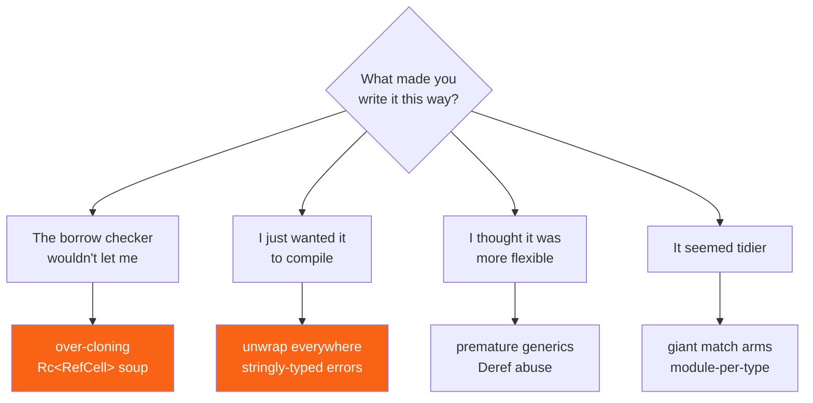

<h1><span class="h1-kicker">Idioms & Design Patterns</span>Anti-Patterns & How to Fix Them</h1>

Every Rust programmer writes these at some point. They're not signs of carelessness — they're what happens when you're fighting the borrow checker at 11pm and something finally compiles. The trouble is that each one trades a moment of relief for lasting pain: worse performance, worse errors, or a design that resists every future change.

This chapter names the eight most common ones, explains what each is really costing you, and shows the fix.

## The anti-pattern map



## 1. `unwrap()` everywhere

The classic. `unwrap()` says "I'm certain this can't fail" — and in a prototype that's fine. In shipped code it means your program's failure mode is a stack trace with no context.

```rust
use std::collections::HashMap;

// ❌ Every unwrap is a panic waiting for the wrong input.
fn port_bad(config: &HashMap<String, String>) -> u16 {
    config.get("port").unwrap().parse().unwrap()
}

// ✅ Propagate, with the caller deciding what to do.
fn port_good(config: &HashMap<String, String>) -> Result<u16, String> {
    let raw = config.get("port").ok_or("no `port` key in config")?;
    raw.parse().map_err(|e| format!("port `{raw}` is not a number: {e}"))
}

// ✅ Or supply a default when absence is genuinely fine.
fn port_default(config: &HashMap<String, String>) -> u16 {
    config.get("port").and_then(|s| s.parse().ok()).unwrap_or(8080)
}

fn main() {
    let mut config = HashMap::new();
    config.insert("port".to_string(), "not-a-number".to_string());

    println!("{:?}", port_good(&config));   // Err with a useful message
    println!("{}", port_default(&config));  // 8080
    // port_bad(&config) would panic: "called `Result::unwrap()` on an `Err` value: ParseIntError"
}
```

| Instead of | Use | When |
|---|---|---|
| `.unwrap()` | `?` | you're in a function returning `Result`/`Option` |
| `.unwrap()` | `.unwrap_or(default)` | there's a sensible fallback |
| `.unwrap()` | `.unwrap_or_else(\|\| …)` | the fallback is expensive to compute |
| `.unwrap()` | `.ok_or(err)?` | converting `Option` → `Result` |
| `.unwrap()` | `.expect("why this can't fail")` | it genuinely can't, and you want the reason in the panic |
| `.unwrap()` on a lock | `.expect("mutex poisoned")` | poisoning really is unrecoverable |

> [!best] `expect` with a reason beats `unwrap`, always
> When a failure truly is impossible — you just checked `is_empty()`, or the regex is a literal you wrote — use `.expect("regex literal is valid")`. It costs nothing, documents your reasoning for the next reader, and if you were wrong the panic message tells you *which* assumption broke instead of just pointing at a line number. Treat a bare `unwrap()` in a diff as a question to answer, not a style nit.

> [!note] `unwrap()` is fine in three places
> Tests, examples, and `main()` in a small binary. In tests a panic *is* the failure report. In `main` you can return `Result` and get the same effect more gracefully, but a panic at the top level is honest. The anti-pattern is `unwrap()` in library code, where you've stolen the caller's ability to decide.

## 2. Cloning to escape the borrow checker

`.clone()` is a legitimate tool. It becomes an anti-pattern when it's a reflex — every borrow error answered with another allocation until the program is a copy machine.

```rust
#[derive(Debug, Clone)]
struct Record {
    id: u32,
    payload: String,
}

// ❌ Clones the whole record and its String, to read one number.
fn id_of_bad(records: &[Record], index: usize) -> u32 {
    let r = records[index].clone();
    r.id
}

// ✅ Just borrow.
fn id_of(records: &[Record], index: usize) -> u32 {
    records[index].id
}

// ❌ Clones every payload to build a report.
fn report_bad(records: &[Record]) -> Vec<String> {
    records.iter().map(|r| r.payload.clone()).collect()
}

// ✅ Borrow the strings — the caller already owns them.
fn report(records: &[Record]) -> Vec<&str> {
    records.iter().map(|r| r.payload.as_str()).collect()
}

fn main() {
    let records = vec![
        Record { id: 1, payload: "alpha".into() },
        Record { id: 2, payload: "beta".into() },
    ];

    println!("{} {}", id_of(&records, 0), id_of_bad(&records, 1));
    println!("{:?}", report(&records));
    println!("{:?}", report_bad(&records));
}
```

The fix is usually one of four moves:

| Symptom | Fix |
|---|---|
| cloning to read a field | borrow the field instead |
| cloning a `String` to return it | return `&str` tied to the input's lifetime |
| cloning because two things need it | restructure so one owns and the other borrows — or use `Rc` deliberately |
| cloning in a loop | hoist it out, or clone once before the loop |
| cloning a large struct to change one field | take `&mut` and mutate |

> [!performance] Clone while learning, then hunt them down
> Do not let this chapter make you afraid of `clone()`. A clone that gets you compiling is worth far more than an hour of borrow-checker wrestling — the [Ownership](#/ch/ownership) chapter says the same thing. The discipline is to come *back*: search for `.clone()` when the feature works, and ask of each one "does this need to own?" Most won't. The ones that do are now deliberate rather than accidental.

## 3. `Rc<RefCell<T>>` as the default

`Rc<RefCell<T>>` gives you shared mutable access — which is exactly what most languages do by default, so it feels like coming home. That's the trap. You've swapped compile-time borrow checking for **runtime** borrow checking, which panics instead of refusing to compile.

```rust
use std::cell::RefCell;
use std::rc::Rc;

#[derive(Debug)]
struct Counter {
    hits: u32,
}

fn main() {
    let shared = Rc::new(RefCell::new(Counter { hits: 0 }));

    // Works, but every access is a runtime check…
    shared.borrow_mut().hits += 1;
    shared.borrow_mut().hits += 1;
    println!("{:?}", shared.borrow());

    // …and this pattern panics at runtime, not compile time:
    let first = shared.borrow();
    let second = shared.try_borrow_mut(); // would PANIC as borrow_mut()
    println!("already borrowed, so try_borrow_mut is Err: {}", second.is_err());
    drop(first);

    // Now it succeeds:
    println!("after dropping the borrow: {}", shared.try_borrow_mut().is_ok());
}
```

| You reached for `Rc<RefCell<T>>` because… | Consider instead |
|---|---|
| two parts of the code need to mutate one thing | pass `&mut T` down the call stack |
| a parent and child point at each other | `Rc` down, `Weak` up (see [Weak & Cycles](#/ch/weak-cycles)) |
| you're building a tree or graph | an arena: `Vec<Node>` with `usize` indices |
| you need shared state across threads | `Arc<Mutex<T>>` — `Rc`/`RefCell` aren't thread-safe at all |
| one field needs mutating through `&self` | `Cell<T>` for `Copy` types — cheaper, can't panic |
| lazy initialization | `OnceCell` / `OnceLock` |

> [!key] Index-based arenas beat pointer graphs in Rust
> The idiomatic way to build a tree or graph in Rust is not pointers at all — it's a `Vec<Node>` where children are stored as `usize` indices. No `Rc`, no `RefCell`, no lifetimes, no cycles to leak, and every node is in contiguous memory. The trade-off is that indices can dangle logically (pointing at a removed node) where a pointer couldn't, so you don't remove — you tombstone. Nearly every serious Rust graph library works this way; see [Designing Your Own Data Structures](#/ch/dsa-design).

> [!warning] `RefCell` moves your bug from compile time to production
> The whole point of the borrow checker is that aliasing mistakes are caught before you ship. `RefCell` keeps the *rule* but enforces it at runtime with a panic. That's a real tool for cases the compiler genuinely can't verify — but if you've wrapped your whole application state in `Rc<RefCell<_>>`, you've opted out of Rust's main feature while keeping all of its syntax. That's the worst of both worlds.

## 4. Stringly-typed everything

Using `String` for values that have structure means every consumer re-parses, re-validates, and re-invents the same checks.

```rust
// ❌ What are the valid values? Nobody knows. Typos compile fine.
fn handle_bad(event: &str, priority: &str) -> String {
    format!("{event} at {priority}")
}

// ✅ The compiler now knows the whole domain.
#[derive(Debug, Clone, Copy, PartialEq)]
enum Event {
    Created,
    Updated,
    Deleted,
}

#[derive(Debug, Clone, Copy, PartialEq, PartialOrd)]
enum Priority {
    Low,
    Normal,
    Urgent,
}

fn handle(event: Event, priority: Priority) -> String {
    // Exhaustive matching means adding a variant forces you to handle it.
    let verb = match event {
        Event::Created => "created",
        Event::Updated => "updated",
        Event::Deleted => "deleted",
    };
    let prefix = if priority >= Priority::Urgent { "!!! " } else { "" };
    format!("{prefix}{verb}")
}

fn main() {
    println!("{}", handle(Event::Deleted, Priority::Urgent));
    println!("{}", handle(Event::Created, Priority::Low));

    // The stringly version happily accepts nonsense:
    println!("{}", handle_bad("crated", "URGENTT"));
}
```

The same applies to errors. `Result<T, String>` throws away every piece of structure a caller might act on:

```rust
use std::fmt;

// ✅ A real error type: callers can match on the cause.
#[derive(Debug)]
enum ConfigError {
    Missing { key: &'static str },
    Invalid { key: &'static str, value: String },
}

impl fmt::Display for ConfigError {
    fn fmt(&self, f: &mut fmt::Formatter) -> fmt::Result {
        match self {
            ConfigError::Missing { key } => write!(f, "missing key `{key}`"),
            ConfigError::Invalid { key, value } => write!(f, "`{key}` has invalid value `{value}`"),
        }
    }
}

impl std::error::Error for ConfigError {}

fn main() {
    let errors = [
        ConfigError::Missing { key: "port" },
        ConfigError::Invalid { key: "port", value: "abc".into() },
    ];

    for e in &errors {
        // Displayable for humans…
        println!("{e}");
        // …and matchable for code, which a String never is.
        let recoverable = matches!(e, ConfigError::Missing { .. });
        println!("  can fall back to a default? {recoverable}");
    }
}
```

> [!mistake] `Result<T, String>` is the most common error-handling mistake in Rust
> It compiles, it reads fine, and it destroys the caller's ability to do anything but log. Was the file missing (create it) or corrupt (report it)? A `String` can't say. Define an enum, or use `thiserror` to generate one in four lines — see [Custom Errors](#/ch/custom-errors) and [Error Strategy](#/ch/error-strategy).

## 5. Premature generics

Generics feel like good engineering. But every type parameter is a constraint on your readers as well as your callers.

```rust
use std::fmt::Debug;

// ❌ Four type parameters and five bounds, for a function used with one type.
fn process_bad<T, U, C, E>(items: C, f: impl Fn(T) -> Result<U, E>) -> Vec<U>
where
    C: IntoIterator<Item = T>,
    U: Debug,
    E: Debug,
{
    items.into_iter().filter_map(|x| f(x).ok()).collect()
}

// ✅ The version you actually needed. Generalize later, if a second caller appears.
fn parse_all(lines: &[&str]) -> Vec<i64> {
    lines.iter().filter_map(|l| l.trim().parse().ok()).collect()
}

fn main() {
    println!("{:?}", parse_all(&[" 1 ", "two", "3"]));
    println!("{:?}", process_bad(vec!["1", "x", "3"], |s: &str| s.parse::<i64>()));
}
```

> [!best] Write it concrete, generalize on the second caller
> The cost of generics is real: harder-to-read signatures, worse error messages (`the trait bound ... is not satisfied` pointing at a call site three files away), longer compile times, and a bigger binary from monomorphization. Write the concrete version. When a genuine second use case arrives, *then* extract the type parameter — you'll know exactly which axis needs to vary, instead of guessing. This is the same argument as "don't build the abstraction you might need."

## 6. `Deref` abuse

Implementing `Deref` on a newtype to get all the inner type's methods for free looks clever. It makes your type lie about what it is.

```rust
use std::ops::Deref;

struct Meters(f64);

// ❌ Now Meters silently behaves like an f64 everywhere.
impl Deref for Meters {
    type Target = f64;
    fn deref(&self) -> &f64 {
        &self.0
    }
}

fn main() {
    let d = Meters(100.0);

    // This is the appeal — f64 methods "just work":
    println!("{}", d.sqrt());

    // And this is the cost: the newtype's whole purpose was to be
    // distinguishable from a bare number, and now it isn't.
    println!("{}", *d + 5.0); // adding a unitless 5 to a distance, silently
}
```

The fix is to expose exactly the operations that make sense:

```rust
#[derive(Debug, Clone, Copy, PartialEq, PartialOrd)]
struct Meters(f64);

impl Meters {
    fn value(&self) -> f64 {
        self.0
    }

    fn plus(self, other: Meters) -> Meters {
        Meters(self.0 + other.0)
    }
}

fn main() {
    let a = Meters(100.0);
    let b = Meters(23.5);

    println!("{:?}", a.plus(b));   // ✅ Meters + Meters
    // a.plus(5.0);                // ❌ won't compile — good!
    println!("{}", a.value());     // explicit escape hatch when you need the number
}
```

> [!warning] `Deref` is for smart pointers, not for inheritance
> `Deref` exists so `Box<T>`, `Rc<T>`, `String`, and `MutexGuard<T>` can transparently act as their contents — types whose entire job is *pointing at* something else. Using it to fake inheritance gives you a type that's implicitly convertible in ways you never audited, and error messages that mention methods you never wrote. The standard library's own guidance is explicit about this. If you want a few methods forwarded, write those few methods, or use a crate like `derive_more`.

## 7. Giant functions and giant `match` arms

```rust
#[derive(Debug)]
enum Command {
    Add { item: String },
    Remove { index: usize },
    List,
}

// ✅ Each arm delegates. The match shows the SHAPE of the program;
// the functions hold the detail.
fn dispatch(cmd: Command, items: &mut Vec<String>) -> String {
    match cmd {
        Command::Add { item } => add(items, item),
        Command::Remove { index } => remove(items, index),
        Command::List => list(items),
    }
}

fn add(items: &mut Vec<String>, item: String) -> String {
    items.push(item);
    format!("{} items", items.len())
}

fn remove(items: &mut Vec<String>, index: usize) -> String {
    if index < items.len() {
        format!("removed {}", items.remove(index))
    } else {
        format!("no item at {index}")
    }
}

fn list(items: &[String]) -> String {
    if items.is_empty() { "empty".to_string() } else { items.join(", ") }
}

fn main() {
    let mut items = Vec::new();
    println!("{}", dispatch(Command::Add { item: "milk".into() }, &mut items));
    println!("{}", dispatch(Command::Add { item: "eggs".into() }, &mut items));
    println!("{}", dispatch(Command::List, &mut items));
    println!("{}", dispatch(Command::Remove { index: 0 }, &mut items));
    println!("{}", dispatch(Command::Remove { index: 9 }, &mut items));
}
```

> [!tip] A `match` arm longer than five lines wants to be a function
> The value of a `match` is that you can see every case at once. Twenty-line arms destroy that — you're back to scrolling. Extract each arm to a named function and the `match` becomes a table of contents for that part of your program. The names also give you something to put in a stack trace and a profiler.

## 8. Fighting the module system

| Anti-pattern | Why it hurts | Do instead |
|---|---|---|
| one module per struct | dozens of two-line files, `use` noise everywhere | group by *feature*, not by type |
| `pub use` re-exporting everything | no real API surface; everything is public forever | curate a small `pub use` prelude |
| `mod utils` | becomes a dumping ground nobody can navigate | name modules after what they do |
| deep nesting (`a::b::c::d::e`) | unreadable paths, painful refactors | flatten to two or three levels |
| `pub` on everything | every internal detail is now a semver promise | default to private; `pub(crate)` for internal sharing |
| `use foo::*` in library code | unclear where names came from, breaks on upstream additions | import explicitly |

> [!note] `pub(crate)` is the underused visibility
> Most items aren't "private to this module" *or* "part of my public API" — they're "shared inside this crate". That's `pub(crate)`, and reaching for it instead of `pub` keeps your published surface small and your refactoring freedom intact. There's also `pub(super)` and `pub(in path)` for finer control. See [Modules, Paths & Visibility](#/ch/modules).

## Summary

- **`unwrap()` everywhere** → propagate with `?`, default with `unwrap_or`, or at minimum say why with `expect`.
- **Reflex cloning** → borrow instead; clone deliberately while learning, then come back and audit each one.
- **`Rc<RefCell<T>>` by default** → pass `&mut` down the stack, use an index-based arena for graphs, `Arc<Mutex>` across threads.
- **Stringly typed** → enums for closed sets, newtypes for validated values, and never `Result<T, String>`.
- **Premature generics** → write it concrete; extract a type parameter when a second caller actually appears.
- **`Deref` abuse** → `Deref` is for smart pointers; forward the methods you actually want.
- **Giant match arms** → one function per arm, so the `match` stays a readable map.
- **Module sprawl** → group by feature, default to private, and reach for `pub(crate)`.

> [!exercise] Try it yourself
> 1. Take `fn get(m: &HashMap<String, String>, k: &str) -> String { m.get(k).unwrap().clone() }` and rewrite it three ways: returning `Option<&str>`, returning `Result<&str, MyError>`, and with a default.
> 2. Find a `.clone()` in code you've written and determine whether the value needs to be owned. If not, remove it and follow the compiler errors.
> 3. Model a traffic light with three `bool` fields, then with an enum. Write a `next()` function for each. Which one can represent a red-and-green light?
> 4. Implement `Deref<Target = String>` on a `Username` newtype, then try to pass a `Username` to a function expecting `&str`. Explain why that's convenient *and* why it defeats the newtype.
> 5. Build a three-node tree with `Rc<RefCell<Node>>`, then rebuild it as a `Vec<Node>` with `usize` child indices. Which version would you rather maintain?

Next: a focused look at the anti-pattern that costs the most — getting **error handling strategy** right across a whole codebase.
