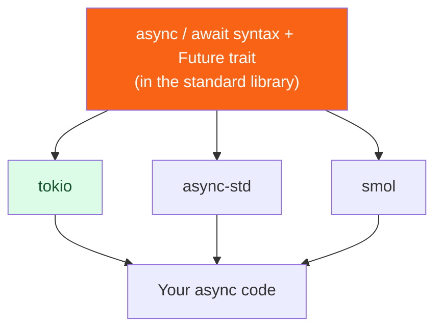

<h1><span class="h1-kicker">Asynchronous Rust</span>Choosing a Runtime</h1>

Rust's standard library deliberately ships `async`/`await` *syntax* but **no runtime** — you bring your own. That's unusual, and it means a real choice: **tokio**, **async-std**, or **smol**. This short chapter helps you choose (spoiler: it's usually tokio), explains why they can't be freely mixed, and closes out the async part of the book.

## Why `std` has no runtime

> [!key] Syntax in the language, runtime in a crate
> Rust put `async`/`await` and the `Future` trait in the standard library, but left the **executor + reactor** (the part that actually drives futures and talks to the OS's I/O) to external crates. Why? Because the *right* runtime depends on the job — a massive web server, a tiny embedded device, and a desktop GUI have very different needs. Keeping the runtime pluggable lets each domain build (or pick) the executor that fits, all sharing the same `async` syntax.

So what exactly is a runtime made of? Three pieces, and knowing them is what makes the "don't mix runtimes" rule below obvious rather than arbitrary:

<figure class="diagram">
<svg viewBox="0 0 640 250" role="img" aria-label="A runtime has three parts: an executor that polls futures, a reactor that registers I/O with the operating system, and a timer that wakes sleeping tasks. The standard library provides only the Future trait above them.">
  <style>
    .rt-h { font: 700 12px var(--font-sans); fill: var(--text); }
    .rt-m { font: 600 10.5px var(--font-mono); fill: var(--text); }
    .rt-c { font: 10.5px var(--font-sans); fill: var(--text-mute); }
    .rt-std { fill: var(--blue-soft); stroke: var(--blue); stroke-width: 1.6; }
    .rt-crate { fill: var(--rust-100); stroke: var(--rust-500); stroke-width: 2; }
    .rt-os { fill: var(--surface-2); stroke: var(--border-strong); stroke-width: 1.4; }
  </style>
  <rect x="20" y="26" width="600" height="34" rx="4" class="rt-std"/>
  <text x="32" y="41" class="rt-h" fill="var(--blue)">std — your async code and the Future trait</text>
  <text x="32" y="55" class="rt-c">async fn · .await · Future::poll · no way to actually RUN any of it</text>
  <rect x="20" y="78" width="600" height="108" rx="4" class="rt-crate"/>
  <text x="32" y="96" class="rt-h" fill="var(--rust-600)">the runtime crate (tokio / async-std / smol) — you add this yourself</text>
  <rect x="34" y="106" width="186" height="68" rx="4" class="rt-os"/>
  <text x="44" y="124" class="rt-m">EXECUTOR</text>
  <text x="44" y="140" class="rt-c">owns the worker threads</text>
  <text x="44" y="154" class="rt-c">calls poll() on futures</text>
  <text x="44" y="168" class="rt-c">runs ready tasks</text>
  <rect x="228" y="106" width="186" height="68" rx="4" class="rt-os"/>
  <text x="238" y="124" class="rt-m">REACTOR</text>
  <text x="238" y="140" class="rt-c">registers sockets/files</text>
  <text x="238" y="154" class="rt-c">with epoll / kqueue / IOCP</text>
  <text x="238" y="168" class="rt-c">wakes the task when ready</text>
  <rect x="422" y="106" width="186" height="68" rx="4" class="rt-os"/>
  <text x="432" y="124" class="rt-m">TIMER</text>
  <text x="432" y="140" class="rt-c">a wheel of deadlines</text>
  <text x="432" y="154" class="rt-c">drives sleep() and timeout()</text>
  <text x="432" y="168" class="rt-c">wakes the task when due</text>
  <rect x="20" y="204" width="600" height="30" rx="4" class="rt-os"/>
  <text x="32" y="223" class="rt-c">the operating system — epoll (Linux) · kqueue (macOS/BSD) · IOCP (Windows)</text>
  <text x="20" y="248" class="rt-c">A library that calls <tspan font-family="var(--font-mono)">tokio::time::sleep</tspan> needs <tspan font-weight="700">tokio's</tspan> timer to exist. That is the whole reason runtimes don't mix.</text>
</svg>
<figcaption><code>std</code> defines what a future <i>is</i>; the runtime supplies the <b>executor</b>, <b>reactor</b>, and <b>timer</b> that make one actually run.</figcaption>
</figure>

## The three main runtimes

| Runtime | Character | Best for |
|---------|-----------|----------|
| **tokio** | Feature-rich, battle-tested, huge ecosystem | Almost everything — especially servers & networking |
| **async-std** | `std`-like API, approachable | Learning; projects wanting a familiar feel |
| **smol** | Tiny, simple, composable | Minimal footprint; understanding how runtimes work |

| | tokio | async-std | smol |
|---|---|---|---|
| Scheduler | work-stealing multi-thread, or current-thread | multi-thread | multi-thread |
| Ecosystem support | **by far the widest** | moderate | small |
| Blocking-work escape hatch | `spawn_blocking` | `spawn_blocking` | `unblock` |
| Non-`Send` tasks | `LocalSet` / `spawn_local` | limited | `LocalExecutor` |
| Dependency weight | heaviest | middling | lightest |
| Used by | axum, actix-web, reqwest, sqlx, tonic | some crates | a few crates |



### tokio — the default choice

**tokio** is the runtime the overwhelming majority of production Rust uses. It has the richest feature set (scheduler, timers, async I/O, sync primitives, tracing integration) and — crucially — the **largest ecosystem**: the big async libraries (the `axum` and `actix-web` web frameworks, the `reqwest` HTTP client, the `sqlx` database toolkit, `tonic` for gRPC) are built on or default to tokio.

> [!best] When in doubt, choose tokio
> Unless you have a specific reason not to, **start with tokio**. It's the safest bet: superb documentation, the widest library support, and the runtime nearly every async crate expects. Add it with the features you need:
> ```toml
> [dependencies]
> tokio = { version = "1", features = ["full"] } # "full" while learning
> ```
> In production you'd trim `features` to just what you use (`rt-multi-thread`, `net`, `time`, `macros`, …) for faster builds and smaller binaries.

`features = ["full"]` is the right default while you're learning, precisely because a missing feature produces a confusing error: the method you wanted simply doesn't exist. Here's what each of the common ones actually buys you:

| Feature | Gives you | You need it for |
|---|---|---|
| `rt` | the current-thread runtime | any async at all |
| `rt-multi-thread` | the work-stealing scheduler | `#[tokio::main]` by default, `Builder::new_multi_thread` |
| `macros` | `#[tokio::main]`, `#[tokio::test]`, `select!` | almost every program |
| `time` | `sleep`, `timeout`, `interval` | timers of any kind |
| `net` | `TcpListener`, `TcpStream`, `UdpSocket` | networking |
| `io-util` | `AsyncReadExt`, `AsyncWriteExt` | `.read_to_end()`, `.write_all()` on async types |
| `fs` | async file operations | reading/writing files |
| `sync` | `Mutex`, `RwLock`, `mpsc`, `oneshot`, `Notify` | sharing state between tasks |
| `process` | async child processes | spawning commands |
| `signal` | `ctrl_c`, Unix signals | graceful shutdown |
| `full` | all of the above | learning, and most applications |

> [!mistake] "no method named `sleep`" usually means a missing feature, not a missing crate
> Trim tokio's features too aggressively and the errors are genuinely misleading — `tokio::time::sleep` becomes "could not find `time` in `tokio`", and `#[tokio::main]` becomes "cannot find attribute `main`". Nothing hints that a feature flag is the cause. If a tokio API that clearly exists in the docs won't resolve, check the **feature listed in the docs.rs sidebar** for that item before anything else. See [Conditional Compilation & Features](#/ch/conditional-compilation).

### async-std and smol

**async-std** offers an API that mirrors `std` closely (`async_std::fs`, `async_std::net`), which can feel more familiar. **smol** is a tiny, elegant runtime that's wonderful for learning how executors work and for minimal-dependency projects. Both are solid — but each has a smaller ecosystem than tokio, so you'll occasionally find a library that assumes tokio.

## The catch: runtimes don't freely mix

Here's the practical gotcha that bites newcomers:

> [!warning] Don't mix runtimes — match your libraries to one
> A library built for **tokio** often expects a tokio runtime to be running (for its timers and I/O), and will **panic** or misbehave under a different one — e.g. *"there is no reactor running, must be called from within a Tokio runtime."* You generally pick **one** runtime for your whole application and use libraries compatible with it. Since most of the async ecosystem targets tokio, this is another reason it's the pragmatic default. (Compatibility shims like `async-compat` exist to bridge occasionally, but "one runtime per app" is the rule.)

> [!jargon] "Runtime-agnostic" crates
> Some libraries are written to work with *any* runtime — they only use the `Future`/`Stream` traits from `std` and the `futures` crate, never a specific runtime's I/O. These are called **runtime-agnostic** and are the friendliest to depend on. When choosing an async library, prefer runtime-agnostic ones, or ones matching the runtime you've committed to.

## A minimal manual runtime setup

If you don't want the `#[tokio::main]` macro, build the runtime explicitly — useful to *see* what the macro hides, and necessary the moment you want to configure anything:

```rust
use tokio::runtime::Builder;

fn main() {
    // `Runtime::new()` gives you the defaults. `Builder` is how you actually
    // configure it — which is the real reason to skip the macro.
    let runtime = Builder::new_multi_thread()
        .worker_threads(2)          // default is one per CPU core
        .thread_name("my-worker")   // shows up in debuggers and panics
        .enable_all()               // turn on the I/O driver and the timer
        .build()
        .unwrap();

    // block_on is the bridge from sync code into async code.
    let result = runtime.block_on(async {
        tokio::time::sleep(std::time::Duration::from_millis(5)).await;
        let doubled = tokio::spawn(async { 21 * 2 }).await.unwrap();
        format!("slept, then a spawned task returned {doubled}")
    });

    println!("{result}");
    println!("worker threads: {}", runtime.metrics().num_workers());

    // A single-threaded runtime: no work-stealing, and tasks needn't be Send.
    let local = Builder::new_current_thread().enable_all().build().unwrap();
    println!("{}", local.block_on(async { "current-thread runtime works too" }));
}
```

`#[tokio::main]` expands to almost exactly the first half of that: build a multi-thread runtime with `enable_all()`, then `block_on` your `main` body.

| You want | Use |
|---|---|
| the defaults, minimum ceremony | `#[tokio::main]` |
| a single-threaded runtime | `#[tokio::main(flavor = "current_thread")]` |
| a fixed worker count | `#[tokio::main(worker_threads = 2)]` |
| anything else configured | `Builder::new_multi_thread()` … `.build()` |
| to run async from inside sync code | `runtime.block_on(…)` |
| a handle to the *current* runtime | `Handle::current()` |
| async in a test | `#[tokio::test]` |

> [!warning] You cannot call `block_on` from inside async code
> This is the single most common tokio panic after the mixing error, and the message is unusually clear about it:
> ```text
> thread 'main' panicked at src/main.rs:38:19:
> Cannot start a runtime from within a runtime. This happens because a function
> (like `block_on`) attempted to block the current thread while the thread is
> being used to drive asynchronous tasks.
> ```
> It's easy to trigger by accident: calling a synchronous helper that internally does `block_on`, or reaching for `block_on` to "just await this one thing" inside an `async fn`. Inside async code you `.await` instead. When you genuinely must run blocking work — a CPU-heavy computation, or a synchronous database driver — hand it to **`tokio::task::spawn_blocking`**, which moves it to a separate pool so it can't stall the executor's worker threads.

## Summary

- Rust's `std` provides async **syntax** (`async`/`await`, the `Future` trait) but **no runtime** — you add one as a crate, so each domain can pick the right executor.
- A runtime is three parts: an **executor** (polls futures on worker threads), a **reactor** (registers I/O with `epoll`/`kqueue`/IOCP), and a **timer**. `std` supplies none of them.
- The main choices are **tokio** (feature-rich, dominant ecosystem), **async-std** (`std`-like), and **smol** (tiny/simple).
- **Choose tokio by default** — it has the best docs and the widest library support; trim its `features` for production.
- **Don't mix runtimes**: pick one per application and use compatible (ideally **runtime-agnostic**) libraries, or a tokio-targeting library will panic under another runtime — because it needs *that* runtime's timer and reactor to exist.
- A missing tokio **feature** looks like a missing API ("could not find `time` in `tokio`"), not like a configuration error. Check the feature in the docs.rs sidebar.
- `#[tokio::main]` is sugar for building a `Runtime` and calling `block_on`. Use **`Builder`** by hand when you need to configure worker count, thread names, or a current-thread flavour.
- **Never call `block_on` inside async code** — you get "Cannot start a runtime from within a runtime". `.await` instead, and send blocking work to **`spawn_blocking`**.

> [!exercise] Try it yourself
> 1. Rewrite a `#[tokio::main]` program using an explicit `Builder` + `block_on`, and confirm identical behavior. Then set `worker_threads(1)` and print `runtime.metrics().num_workers()`.
> 2. In a project, add tokio with only `features = ["rt", "time", "macros"]` and see what compiles (and what needs more). Then remove `time` and read the error — does it mention features at all?
> 3. Call `block_on` inside an `async fn` and trigger the nested-runtime panic on purpose. Then fix it two ways: with `.await`, and with `spawn_blocking`.
> 4. Look up one async crate you like on docs.rs and determine whether it's tokio-specific or runtime-agnostic.

That completes async Rust — from the big picture through futures, tokio, streams, pinning, and runtime choice. Next we venture into the language's sharpest tools: **advanced Rust**, beginning with `unsafe`.
