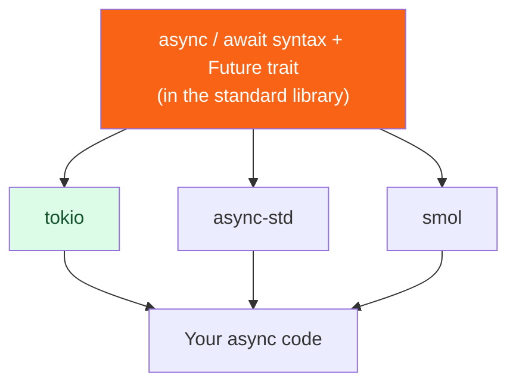

<h1><span class="h1-kicker">Asynchronous Rust</span>Choosing a Runtime</h1>

Rust's standard library deliberately ships `async`/`await` *syntax* but **no runtime** — you bring your own. That's unusual, and it means a real choice: **tokio**, **async-std**, or **smol**. This short chapter helps you choose (spoiler: it's usually tokio), explains why they can't be freely mixed, and closes out the async part of the book.

## Why `std` has no runtime

> [!key] Syntax in the language, runtime in a crate
> Rust put `async`/`await` and the `Future` trait in the standard library, but left the **executor + reactor** (the part that actually drives futures and talks to the OS's I/O) to external crates. Why? Because the *right* runtime depends on the job — a massive web server, a tiny embedded device, and a desktop GUI have very different needs. Keeping the runtime pluggable lets each domain build (or pick) the executor that fits, all sharing the same `async` syntax.

## The three main runtimes

| Runtime | Character | Best for |
|---------|-----------|----------|
| **tokio** | Feature-rich, battle-tested, huge ecosystem | Almost everything — especially servers & networking |
| **async-std** | `std`-like API, approachable | Learning; projects wanting a familiar feel |
| **smol** | Tiny, simple, composable | Minimal footprint; understanding how runtimes work |



### tokio — the default choice

**tokio** is the runtime the overwhelming majority of production Rust uses. It has the richest feature set (scheduler, timers, async I/O, sync primitives, tracing integration) and — crucially — the **largest ecosystem**: the big async libraries (the `axum` and `actix-web` web frameworks, the `reqwest` HTTP client, the `sqlx` database toolkit, `tonic` for gRPC) are built on or default to tokio.

> [!best] When in doubt, choose tokio
> Unless you have a specific reason not to, **start with tokio**. It's the safest bet: superb documentation, the widest library support, and the runtime nearly every async crate expects. Add it with the features you need:
> ```toml
> [dependencies]
> tokio = { version = "1", features = ["full"] } # "full" while learning
> ```
> In production you'd trim `features` to just what you use (`rt-multi-thread`, `net`, `time`, `macros`, …) for faster builds and smaller binaries.

### async-std and smol

**async-std** offers an API that mirrors `std` closely (`async_std::fs`, `async_std::net`), which can feel more familiar. **smol** is a tiny, elegant runtime that's wonderful for learning how executors work and for minimal-dependency projects. Both are solid — but each has a smaller ecosystem than tokio, so you'll occasionally find a library that assumes tokio.

## The catch: runtimes don't freely mix

Here's the practical gotcha that bites newcomers:

> [!warning] Don't mix runtimes — match your libraries to one
> A library built for **tokio** often expects a tokio runtime to be running (for its timers and I/O), and will **panic** or misbehave under a different one — e.g. *"there is no reactor running, must be called from within a Tokio runtime."* You generally pick **one** runtime for your whole application and use libraries compatible with it. Since most of the async ecosystem targets tokio, this is another reason it's the pragmatic default. (Compatibility shims like `async-compat` exist to bridge occasionally, but "one runtime per app" is the rule.)

> [!jargon] "Runtime-agnostic" crates
> Some libraries are written to work with *any* runtime — they only use the `Future`/`Stream` traits from `std` and the `futures` crate, never a specific runtime's I/O. These are called **runtime-agnostic** and are the friendliest to depend on. When choosing an async library, prefer runtime-agnostic ones, or ones matching the runtime you've committed to.

## A minimal manual runtime setup

If you don't want the `#[tokio::main]` macro (say, to configure the runtime), build it explicitly — useful to *see* what the macro hides:

```rust
fn main() {
    // Build a multi-threaded tokio runtime by hand:
    let runtime = tokio::runtime::Runtime::new().unwrap();

    // Drive an async block to completion on it:
    let result = runtime.block_on(async {
        tokio::time::sleep(std::time::Duration::from_millis(5)).await;
        "done on a hand-built runtime"
    });

    println!("{result}");
}
```

## Summary

- Rust's `std` provides async **syntax** (`async`/`await`, the `Future` trait) but **no runtime** — you add one as a crate, so each domain can pick the right executor.
- The main choices are **tokio** (feature-rich, dominant ecosystem), **async-std** (`std`-like), and **smol** (tiny/simple).
- **Choose tokio by default** — it has the best docs and the widest library support; trim its `features` for production.
- **Don't mix runtimes**: pick one per application and use compatible (ideally **runtime-agnostic**) libraries, or a tokio-targeting library will panic under another runtime.
- `#[tokio::main]` is sugar for building a `Runtime` and calling `block_on` — which you can do by hand for more control.

> [!exercise] Try it yourself
> 1. Rewrite a `#[tokio::main]` program using an explicit `Runtime::new()` + `block_on`, and confirm identical behavior.
> 2. In a project, add tokio with only `features = ["rt", "time", "macros"]` and see what compiles (and what needs more).
> 3. Look up one async crate you like on docs.rs and determine whether it's tokio-specific or runtime-agnostic.

That completes async Rust — from the big picture through futures, tokio, streams, pinning, and runtime choice. Next we venture into the language's sharpest tools: **advanced Rust**, beginning with `unsafe`.
