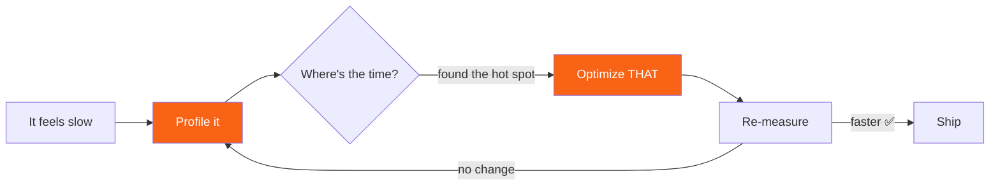

<h1><span class="h1-kicker">Testing & Quality</span>Benchmarking & Profiling</h1>

Rust is *fast* — but only if you measure, rather than guess. This chapter shows how to time code correctly, benchmark it rigorously with the `criterion` crate, and find the true bottlenecks with a profiler. The golden rule of performance work runs through all of it: **measure first, optimize second.**

> [!warning] The #1 benchmarking mistake: debug builds
> Never judge Rust's speed from a `cargo run`. Debug builds skip optimization and can be **10–100× slower** than release builds. Always measure with `--release` (`cargo run --release`, `cargo bench`). More than one "Rust is slow!" blog post has turned out to be a debug-build measurement.

## Quick-and-dirty timing with `Instant`

For a rough measurement, the standard library's `std::time::Instant` is enough. Capture a start time, do the work, and ask how much elapsed:

```rust
use std::time::Instant;

fn main() {
    let start = Instant::now();

    // The work we want to time:
    let sum: u64 = (0..1_000_000).sum();

    let elapsed = start.elapsed();
    println!("Sum = {sum}");
    println!("Took {elapsed:?}"); // e.g. "Took 350µs"
}
```

> [!mistake] Hand-timing is noisy and easy to fool
> A single `Instant` measurement is affected by CPU frequency scaling, other processes, cache warmth, and — sneakily — the **optimizer**, which may delete work whose result you never use, reporting an impossibly fast "0ns." Use `Instant` for a ballpark, but for real comparisons, use a proper benchmarking tool that runs many iterations and does statistics.

## Rigorous benchmarks with `criterion`

The community-standard benchmarking crate is **`criterion`**. It runs your code many times, discards warmup runs, measures statistically, detects performance changes between runs, and even generates HTML charts.

Set it up in `Cargo.toml`:

```toml
[dev-dependencies]
criterion = "0.5"

[[bench]]
name = "my_benchmark"
harness = false
```

Then write a benchmark in `benches/my_benchmark.rs`:

```rust,ignore
use criterion::{black_box, criterion_group, criterion_main, Criterion};

fn fibonacci(n: u64) -> u64 {
    match n {
        0 => 0,
        1 => 1,
        _ => fibonacci(n - 1) + fibonacci(n - 2),
    }
}

fn bench_fib(c: &mut Criterion) {
    c.bench_function("fib 20", |b| {
        // black_box stops the optimizer from precomputing the answer:
        b.iter(|| fibonacci(black_box(20)))
    });
}

criterion_group!(benches, bench_fib);
criterion_main!(benches);
```

Run it with `cargo bench`. Criterion prints timing with confidence intervals and, on later runs, tells you whether your change made things faster or slower.

> [!key] Always wrap inputs in `black_box`
> `black_box(x)` is a function that hands `x` back but hides its value from the optimizer. Without it, the compiler may notice your benchmark's result is constant and **optimize the entire computation away**, giving a meaningless "0 nanoseconds." `black_box` forces the code to actually run. It's the single most important tool for honest benchmarks.

## Finding bottlenecks with a profiler

Benchmarks tell you *how long* something takes; a **profiler** tells you *where* the time goes. Before optimizing, profile — the slow part is very often not where you'd guess.



The most popular tool is a **flame graph** — a visualization where the width of each box shows how much total time a function consumed. The widest boxes are your optimization targets:

```bash
cargo install flamegraph
cargo flamegraph --bin my_app   # produces flamegraph.svg
```

Other great tools: `perf` (Linux), `samply` (cross-platform, browser UI), and `hyperfine` for timing whole command-line runs.

> [!best] The performance workflow
> 1. **Make it work.** Correct first; never optimize broken code.
> 2. **Make it right.** Clean, tested, idiomatic.
> 3. **Measure** — profile to find the *actual* bottleneck (usually surprising).
> 4. **Optimize** only that hot spot, and **re-measure** to confirm it helped.
>
> Most code doesn't need step 4 at all. When it does, this loop stops you wasting effort optimizing code that was never slow.

## Everyday performance wins

Before exotic tricks, these simple habits deliver most real-world speedups:

| Do this | Instead of | Why |
|---------|-----------|-----|
| `cargo build --release` | debug builds | 10–100× faster |
| Pre-size: `Vec::with_capacity(n)` | growing from empty | avoids repeated reallocation |
| Borrow: `&str`, `&[T]` | cloning owned data | skips allocation & copying |
| Iterator chains | manual index loops | inlined & often vectorized |
| `&str` keys / avoid needless `String` | `.to_string()` everywhere | fewer heap allocations |

> [!performance] `opt-level` and LTO for the last few percent
> For maximum speed in a shipped binary, your release profile can enable link-time optimization:
> ```toml
> [profile.release]
> opt-level = 3   # (the default for release)
> lto = true      # optimize across crate boundaries
> codegen-units = 1  # slower compile, faster binary
> ```
> These squeeze out extra performance at the cost of longer compile times — worth it for a final release build, overkill during development.

## Summary

- **Always measure in `--release`** — debug builds are dramatically slower and misleading.
- Use **`Instant`** for rough timing, but real comparisons need a proper tool.
- **`criterion`** runs statistically rigorous benchmarks; always wrap inputs in **`black_box`** so the optimizer can't cheat.
- A **profiler** (flame graphs, `perf`, `samply`) shows *where* time goes — profile before optimizing, because the bottleneck is usually surprising.
- Follow the loop: **work → right → measure → optimize the hot spot → re-measure.** Most everyday wins come from release builds, pre-sizing, borrowing, and iterators.

> [!exercise] Try it yourself
> 1. Time `(0..10_000_000u64).sum()` with `Instant` in both debug (`cargo run`) and release (`cargo run --release`). Compare.
> 2. In a project, add `criterion`, benchmark a `fibonacci(20)` function, and note how `black_box` changes the result.
> 3. Rewrite an index-based loop as an iterator chain and confirm (by timing) that it's no slower.

Correct *and* fast — but is it clean and idiomatic? Rust's tooling has that covered too, automatically: **Clippy and rustfmt**.
