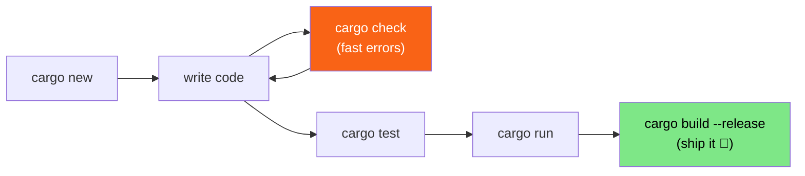

<h1><span class="h1-kicker">Getting Started</span>Cargo: Build Tool & Package Manager</h1>

Cargo is the beating heart of everyday Rust. It compiles your code, runs your tests, formats and lints it, downloads libraries from the internet, and builds your documentation — all through a handful of memorable commands. Get comfortable with Cargo and the whole ecosystem opens up. This chapter is your practical tour.

> [!key] Two jobs, one tool
> Cargo is both a **build tool** (it turns your source into programs) and a **package manager** (it fetches and version-locks the third-party libraries your project depends on). Most languages need two separate tools for this; Rust gives you one that's excellent at both.

## The manifest: `Cargo.toml`

Every project has a `Cargo.toml` file — its **manifest** (the document describing the project and its dependencies). Here's a realistic one:

```toml
[package]
name = "todo_app"
version = "0.1.0"
edition = "2021"
description = "A tiny to-do list"
license = "MIT"

[dependencies]
serde = { version = "1.0", features = ["derive"] }
rand = "0.8"
```

- The **`[package]`** section identifies your project.
- The **`edition`** pins the *edition* of Rust — a named snapshot of the language (2015, 2018, 2021, 2024). Editions let Rust evolve without breaking old code; you opt in when you're ready.
- The **`[dependencies]`** section lists the libraries you use, called **crates**.

> [!jargon] What's a "crate"?
> A **crate** is Rust's word for a package or library — a bundle of Rust code you can share and reuse. The public registry where crates are published is **[crates.io](https://crates.io)**. When you add a dependency, Cargo downloads that crate and everything *it* depends on, automatically.

## Adding dependencies

You rarely edit `[dependencies]` by hand. Instead, let Cargo add and pin the latest version for you:

```bash
cargo add serde --features derive
cargo add rand
```

Then use the crate in your code with `use`:

```rust,ignore
use rand::Rng; // bring the Rng trait into scope

fn main() {
    let roll = rand::thread_rng().gen_range(1..=6);
    println!("You rolled a {roll}!");
}
```

> [!note] Why is that example not runnable here?
> The in-book playground only has a curated set of popular crates available (it *does* include `serde`, `rand`, `regex`, and a few dozen others, but not every crate on earth). On your own machine, after `cargo add rand`, that program compiles and runs perfectly.

### Version numbers & `Cargo.lock`

Crates follow **Semantic Versioning** (*SemVer*), where a version like `1.4.2` means `MAJOR.MINOR.PATCH`. A dependency written as `"1.0"` really means "compatible with 1.x" — Cargo may use `1.9.3` but never `2.0`, because a major-version bump signals breaking changes.

The first time you build, Cargo writes a **`Cargo.lock`** file recording the *exact* versions it chose.

> [!best] To commit `Cargo.lock` or not?
> For **applications** (things you run), commit `Cargo.lock` to version control — it guarantees everyone builds byte-for-byte the same thing. For **libraries** (things others depend on), it's conventional to leave it out. This one rule saves a lot of "works on my machine" pain.

## The commands you'll live in



| Command | Purpose |
|---------|---------|
| `cargo new <name>` | Create a new project (add `--lib` for a library) |
| `cargo run` | Build and run your program |
| `cargo check` | Check for errors *fast*, without building an executable |
| `cargo build` | Build a debug binary into `target/debug/` |
| `cargo build --release` | Build an **optimized** binary into `target/release/` |
| `cargo test` | Run all your tests |
| `cargo doc --open` | Build your project's docs and open them |
| `cargo fmt` | Auto-format your code to the standard style |
| `cargo clippy` | Run the linter for smarter suggestions |
| `cargo add <crate>` | Add a dependency |
| `cargo update` | Update dependencies within their allowed version ranges |

## Debug vs. release builds

By default, Cargo builds in **debug** mode: fast to compile, easy to debug, but *not* optimized. When it's time to measure speed or ship, use `--release`.

> [!performance] The release difference is enormous
> Optimized (`--release`) builds can run **10–100× faster** than debug builds for number-crunching code, because the compiler is allowed to spend time on aggressive optimizations. The trade-off is a slower compile. Rule of thumb: **develop in debug, benchmark and ship in release.** Never judge Rust's performance from a debug build!

You can tune these in `Cargo.toml` with **profiles**:

```toml
[profile.release]
opt-level = 3      # maximum optimization
lto = true         # link-time optimization: smaller, faster binaries
```

## A peek at workspaces

As projects grow, you'll split them into several crates that live together. Cargo's **workspaces** let a group of crates share one `Cargo.lock` and one `target/` directory:

```toml
# Cargo.toml at the repository root
[workspace]
members = ["app", "core", "cli"]
```

We'll dedicate a whole chapter to [workspaces](#/ch/workspaces) later — for now, just know Cargo scales smoothly from one file to a hundred crates.

> [!tip] Discover Cargo's superpowers
> Run `cargo --list` to see every subcommand, and install community ones like `cargo-watch` (auto-rebuild on save) with `cargo install cargo-watch`. Then `cargo watch -x run` re-runs your program every time you save a file — a lovely, tight feedback loop.

## Summary

- **`Cargo.toml`** is your project's manifest: name, edition, and the **crates** it depends on.
- Add libraries with **`cargo add`**; Cargo fetches them (and their dependencies) from **crates.io**.
- **`Cargo.lock`** pins exact versions — commit it for applications, skip it for libraries.
- **`cargo check`** is your fast error-checker; **`cargo run`** builds and runs; **`cargo build --release`** produces the optimized binary you ship.
- Profiles in `Cargo.toml` let you tune optimization; **workspaces** let many crates cooperate.

> [!exercise] Try it yourself
> 1. Create a project with `cargo new playground_test`, then time `cargo build` versus `cargo build --release`.
> 2. Run `cargo add rand`, then write the dice-roll program from above and `cargo run` it a few times.
> 3. Run `cargo doc --open` and explore the documentation Cargo generates for your project — even the empty one has docs!

You now have the tools. Time to actually learn the language — starting with how Rust stores and names values: **variables and mutability**.
