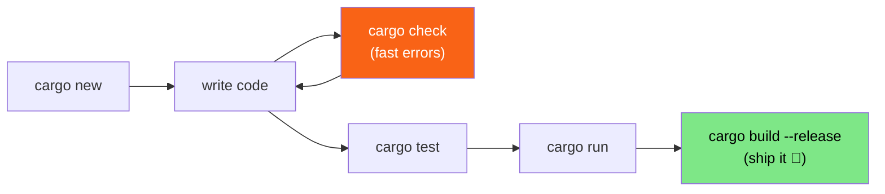

<h1><span class="h1-kicker">Getting Started</span>Cargo: Build Tool & Package Manager</h1>

Cargo is the beating heart of everyday Rust. It compiles your code, runs your tests, formats and lints it, downloads libraries from the internet, and builds your documentation — all through a handful of memorable commands. Get comfortable with Cargo and the whole ecosystem opens up. This chapter is your practical tour.

> [!key] Two jobs, one tool
> Cargo is both a **build tool** (it turns your source into programs) and a **package manager** (it fetches and version-locks the third-party libraries your project depends on). Most languages need two separate tools for this; Rust gives you one that's excellent at both.

## The manifest: `Cargo.toml`

Every project has a `Cargo.toml` file — its **manifest** (the document describing the project and its dependencies). Here's a realistic one:

```toml
[package]
name = "todo_app"
version = "0.1.0"
edition = "2021"
description = "A tiny to-do list"
license = "MIT"

[dependencies]
serde = { version = "1.0", features = ["derive"] }
rand = "0.8"
```

- The **`[package]`** section identifies your project.
- The **`edition`** pins the *edition* of Rust — a named snapshot of the language (2015, 2018, 2021, 2024). Editions let Rust evolve without breaking old code; you opt in when you're ready.
- The **`[dependencies]`** section lists the libraries you use, called **crates**.

> [!jargon] What's a "crate"?
> A **crate** is Rust's word for a package or library — a bundle of Rust code you can share and reuse. The public registry where crates are published is **[crates.io](https://crates.io)**. When you add a dependency, Cargo downloads that crate and everything *it* depends on, automatically.

## Adding dependencies

You rarely edit `[dependencies]` by hand. Instead, let Cargo add and pin the latest version for you:

```bash
cargo add serde --features derive
cargo add rand
```

Then use the crate in your code with `use`:

```rust
use rand::Rng; // bring the Rng trait into scope

fn main() {
    let roll = rand::thread_rng().gen_range(1..=6);
    println!("You rolled a {roll}!");

    // Roll five times to see it really is random.
    let hand: Vec<u32> = (0..5).map(|_| rand::thread_rng().gen_range(1..=6)).collect();
    println!("Five rolls: {hand:?}");
}
```

Press **Run** on that one — it works, because `rand` happens to be one of the crates this book's playground provides.

> [!note] Which crates run in this book?
> The playground has a curated set of popular crates rather than all of crates.io — `serde`, `rand`, `regex`, `tokio`, `itertools`, `anyhow`, `thiserror` and a few dozen more. Examples using those get a **Run** button; examples using anything else are marked `ignore` and you'll need to run them locally after `cargo add`. The full list is in [Crates You Can Use in the Playground](#/ch/appendix-crates).

### Kinds of dependency

Not everything belongs in `[dependencies]`. Cargo has three sections, and using the right one keeps your published crate lean:

```toml
[dependencies]
# Needed to BUILD and RUN your crate. Shipped to everyone who uses it.
serde = { version = "1.0", features = ["derive"] }

[dev-dependencies]
# Needed only for `cargo test`, `cargo bench`, and examples.
# NOT compiled for people who depend on your crate.
criterion = "0.5"
tempfile = "3"

[build-dependencies]
# Needed only by build.rs, which runs before your crate compiles.
cc = "1"
```

| Section | Compiled when | Reaches your users? |
|---|---|---|
| `[dependencies]` | always | **yes** |
| `[dev-dependencies]` | tests, benches, examples | no |
| `[build-dependencies]` | running `build.rs` | no |
| `[target.'cfg(windows)'.dependencies]` | only for matching targets | only on that platform |

> [!mistake] Putting a test-only crate in `[dependencies]`
> If your test helper — `tempfile`, `criterion`, a mocking library — sits in `[dependencies]` rather than `[dev-dependencies]`, every downstream user compiles and ships it too. That's slower builds and a larger binary for everybody, for code that only ever runs in *your* test suite. It's an easy mistake because both sections work; the compiler never complains.

### What `features = [...]` means

You'll see that bracket syntax constantly, and it's worth knowing early. A **feature** is an optional part of a crate that you switch on:

```toml
serde = { version = "1.0", features = ["derive"] }
tokio = { version = "1", features = ["full"] }
reqwest = { version = "0.12", default-features = false, features = ["rustls-tls"] }
```

`serde` without `derive` gives you the traits but not the `#[derive(Serialize)]` macro — so you'd have to write the implementations by hand. Turning a feature on adds capability and compile time; turning defaults off (`default-features = false`) trims a crate down to what you actually use. There's a whole chapter on this later: [Conditional Compilation & Features](#/ch/conditional-compilation).

### Version numbers & `Cargo.lock`

Crates follow **Semantic Versioning** (*SemVer*), where a version like `1.4.2` means `MAJOR.MINOR.PATCH`. A dependency written as `"1.0"` really means "compatible with 1.x" — Cargo may use `1.9.3` but never `2.0`, because a major-version bump signals breaking changes.

The first time you build, Cargo writes a **`Cargo.lock`** file recording the *exact* versions it chose. Those are two different files doing two different jobs, and confusing them is the source of most dependency puzzlement:

<figure class="diagram">
<svg viewBox="0 0 640 250" role="img" aria-label="Cargo.toml states a flexible version range, the resolver picks exact versions and records them in Cargo.lock, then sources are cached and compiled into the target directory">
  <style>
    .cg-h { font: 700 12px var(--font-sans); fill: var(--text); }
    .cg-m { font: 600 11px var(--font-mono); fill: var(--text); }
    .cg-c { font: 10.5px var(--font-sans); fill: var(--text-mute); }
    .cg-want { fill: var(--blue-soft); stroke: var(--blue); stroke-width: 1.5; }
    .cg-lock { fill: var(--rust-100); stroke: var(--rust-500); stroke-width: 2; }
    .cg-net { fill: var(--surface-2); stroke: var(--border-strong); stroke-width: 1.5; }
    .cg-out { fill: var(--green-soft); stroke: var(--green); stroke-width: 1.5; }
  </style>
  <rect x="20" y="34" width="180" height="70" rx="5" class="cg-want"/>
  <text x="32" y="52" class="cg-h" fill="var(--blue)">Cargo.toml</text>
  <text x="32" y="70" class="cg-c">what you ASK for</text>
  <text x="32" y="88" class="cg-m">rand = "0.8"</text>
  <text x="32" y="122" class="cg-c">you write this,</text>
  <text x="32" y="136" class="cg-c">by hand or via cargo add</text>
  <rect x="240" y="34" width="180" height="70" rx="5" class="cg-lock"/>
  <text x="252" y="52" class="cg-h" fill="var(--rust-600)">Cargo.lock</text>
  <text x="252" y="70" class="cg-c">what you actually GOT</text>
  <text x="252" y="88" class="cg-m">rand 0.8.5</text>
  <text x="252" y="122" class="cg-c">Cargo writes this —</text>
  <text x="252" y="136" class="cg-c">never edit it yourself</text>
  <rect x="460" y="20" width="160" height="46" rx="5" class="cg-net"/>
  <text x="472" y="38" class="cg-h">crates.io</text>
  <text x="472" y="55" class="cg-c">downloaded once</text>
  <rect x="460" y="76" width="160" height="46" rx="5" class="cg-net"/>
  <text x="472" y="94" class="cg-m">~/.cargo/registry</text>
  <text x="472" y="111" class="cg-c">cached source, shared</text>
  <rect x="240" y="176" width="180" height="46" rx="5" class="cg-out"/>
  <text x="252" y="194" class="cg-m">./target/</text>
  <text x="252" y="211" class="cg-c">compiled output</text>
  <path d="M202 69 L236 69" stroke="var(--rust-500)" stroke-width="2.5" marker-end="url(#arr-cg)"/>
  <text x="196" y="30" class="cg-c">the resolver picks</text>
  <path d="M422 60 L456 46" stroke="var(--text-mute)" stroke-width="1.8" marker-end="url(#arr-cg2)"/>
  <path d="M456 99 L424 82" stroke="var(--text-mute)" stroke-width="1.8" marker-end="url(#arr-cg2)"/>
  <path d="M330 108 L330 172" stroke="var(--green)" stroke-width="2.5" marker-end="url(#arr-cg3)"/>
  <text x="20" y="196" class="cg-c">"0.8" is a <tspan font-weight="700">range</tspan>, so a fresh</text>
  <text x="20" y="210" class="cg-c">checkout could pick 0.8.6.</text>
  <text x="20" y="224" class="cg-c">The lockfile is what makes</text>
  <text x="20" y="238" class="cg-c">builds reproducible.</text>
  <defs>
    <marker id="arr-cg" markerWidth="9" markerHeight="9" refX="7" refY="3" orient="auto"><path d="M0,0 L7,3 L0,6 Z" fill="var(--rust-500)"/></marker>
    <marker id="arr-cg2" markerWidth="9" markerHeight="9" refX="7" refY="3" orient="auto"><path d="M0,0 L7,3 L0,6 Z" fill="var(--text-mute)"/></marker>
    <marker id="arr-cg3" markerWidth="9" markerHeight="9" refX="7" refY="3" orient="auto"><path d="M0,0 L7,3 L0,6 Z" fill="var(--green)"/></marker>
  </defs>
</svg>
<figcaption><code>Cargo.toml</code> is a <b>request</b> (a version range); <code>Cargo.lock</code> is the <b>answer</b> (exact versions). You edit the first; Cargo owns the second.</figcaption>
</figure>

The version string is a *requirement*, and it has more forms than people realize:

| You write | It means | Would accept |
|---|---|---|
| `"1.2.3"` | `^1.2.3` — caret is the default | 1.2.3 up to but not including 2.0.0 |
| `"1.2"` | `^1.2` | 1.2.0 up to but not including 2.0.0 |
| `"1"` | `^1` | any 1.x.y |
| `"~1.2.3"` | patch updates only | 1.2.3 up to but not including 1.3.0 |
| `"=1.2.3"` | exactly this | only 1.2.3 |
| `">=1.2, <1.5"` | an explicit range | 1.2.x up to 1.4.x |
| `"*"` | anything | ⚠️ don't — crates.io rejects it for publishing |
| `"0.8"` | `^0.8` | 0.8.x only — **not** 0.9 |

> [!warning] Pre-1.0 versions treat the *minor* number as breaking
> For a `0.x` crate, `"0.8"` will **not** accept `0.9`. That's deliberate: below 1.0 a crate is declaring its API unstable, so Cargo treats each minor bump as a major one. This surprises people who write `"0.8"` expecting to drift forward and then find they're pinned. It's also why upgrading `rand` from 0.8 to 0.9 is a real migration rather than a free update.

> [!best] To commit `Cargo.lock` or not?
> For **applications** (things you run), commit `Cargo.lock` to version control — it guarantees everyone builds byte-for-byte the same thing. For **libraries** (things others depend on), it's conventional to leave it out. This one rule saves a lot of "works on my machine" pain.

> [!mistake] `cargo update` does not upgrade across a major version
> `cargo update` moves you *within* your declared ranges — `1.2.3` to `1.9.0`, never to `2.0`. If a crate releases 2.0 and you want it, you must edit `Cargo.toml` (or run `cargo add rand@0.9`). People routinely run `cargo update`, see nothing change, and conclude the tool is broken. `cargo outdated` shows you what's being held back and why.

## The commands you'll live in



| Command | Purpose |
|---------|---------|
| `cargo new <name>` | Create a new project (add `--lib` for a library) |
| `cargo run` | Build and run your program |
| `cargo check` | Check for errors *fast*, without building an executable |
| `cargo build` | Build a debug binary into `target/debug/` |
| `cargo build --release` | Build an **optimized** binary into `target/release/` |
| `cargo test` | Run all your tests |
| `cargo doc --open` | Build your project's docs and open them |
| `cargo fmt` | Auto-format your code to the standard style |
| `cargo clippy` | Run the linter for smarter suggestions |
| `cargo add <crate>` | Add a dependency |
| `cargo update` | Update dependencies within their allowed version ranges |

## Debug vs. release builds

By default, Cargo builds in **debug** mode: fast to compile, easy to debug, but *not* optimized. When it's time to measure speed or ship, use `--release`.

> [!performance] The release difference is enormous
> Optimized (`--release`) builds can run **10–100× faster** than debug builds for number-crunching code, because the compiler is allowed to spend time on aggressive optimizations. The trade-off is a slower compile. Rule of thumb: **develop in debug, benchmark and ship in release.** Never judge Rust's performance from a debug build!

You can tune these in `Cargo.toml` with **profiles**:

```toml
[profile.release]
opt-level = 3      # maximum optimization
lto = true         # link-time optimization: smaller, faster binaries
```

## A peek at workspaces

As projects grow, you'll split them into several crates that live together. Cargo's **workspaces** let a group of crates share one `Cargo.lock` and one `target/` directory:

```toml
# Cargo.toml at the repository root
[workspace]
members = ["app", "core", "cli"]
```

We'll dedicate a whole chapter to [workspaces](#/ch/workspaces) later — for now, just know Cargo scales smoothly from one file to a hundred crates.

> [!tip] Discover Cargo's superpowers
> Run `cargo --list` to see every subcommand, and install community ones like `cargo-watch` (auto-rebuild on save) with `cargo install cargo-watch`. Then `cargo watch -x run` re-runs your program every time you save a file — a lovely, tight feedback loop.

## Summary

- **`Cargo.toml`** is your project's manifest: name, edition, and the **crates** it depends on.
- Add libraries with **`cargo add`**; Cargo fetches them (and their dependencies) from **crates.io**.
- `Cargo.toml` is a **request** (a version *range*); **`Cargo.lock`** is the **answer** (exact versions). Commit the lockfile for applications, skip it for libraries.
- A bare `"1.2"` means `^1.2` — but for **pre-1.0 crates** the minor number is treated as breaking, so `"0.8"` will not accept `0.9`.
- `cargo update` only moves *within* your declared ranges; crossing a major version needs a manifest edit.
- Use **`[dev-dependencies]`** for test-only crates so your users don't compile them, and `[build-dependencies]` for `build.rs`.
- **`features = [...]`** switches on optional parts of a crate; `default-features = false` trims it down.
- **`cargo check`** is your fast error-checker; **`cargo run`** builds and runs; **`cargo build --release`** produces the optimized binary you ship.
- Profiles in `Cargo.toml` let you tune optimization; **workspaces** let many crates cooperate.

> [!exercise] Try it yourself
> 1. Create a project with `cargo new playground_test`, then time `cargo build` versus `cargo build --release`.
> 2. Run `cargo add rand`, then write the dice-roll program from above and `cargo run` it a few times.
> 3. Open the `Cargo.lock` Cargo generated. How many crates are in it? Compare that to the one line you put in `Cargo.toml`.
> 4. Change `rand = "0.8"` to `rand = "0.9"`, run `cargo build`, and read what happens. Then try `cargo update` on the original and explain why it didn't do the same thing.
> 5. Add `tempfile` to `[dev-dependencies]`, then try to `use tempfile::…` from `src/main.rs`. Read the error — why can't you?
> 6. Run `cargo doc --open` and explore the documentation Cargo generates for your project — even the empty one has docs!

You now have the tools. Time to actually learn the language — starting with how Rust stores and names values: **variables and mutability**.
