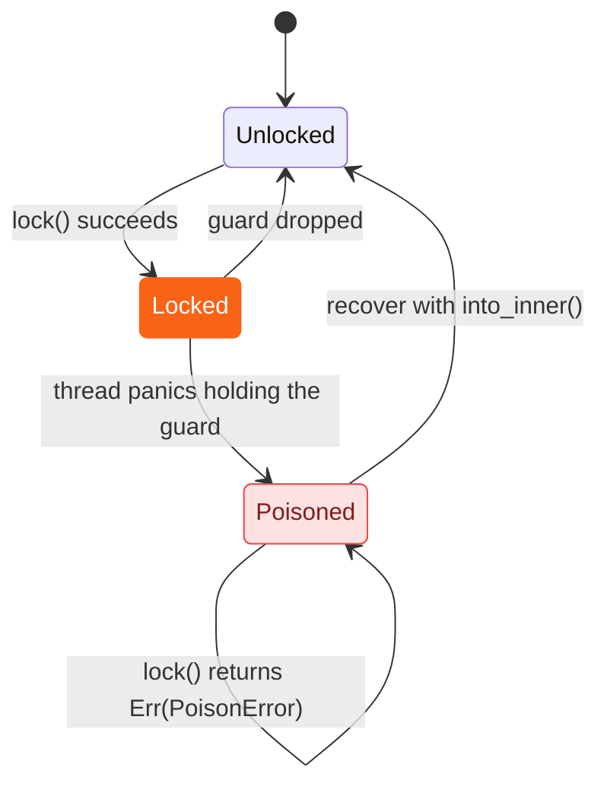

<h1><span class="h1-kicker">Smart Pointers</span>Cell and Lock Guards</h1>

You already know `RefCell<T>` lets you mutate data through a shared reference, checking borrows at runtime instead of compile time. But `RefCell` is only half the story. This chapter covers its lighter, single-threaded cousin `Cell<T>` — and, more importantly, the *guard* types that make shared mutation safe across threads: `MutexGuard`, `RwLockReadGuard`, and `RwLockWriteGuard`. All of them are smart pointers in the same sense as `Box`: they wrap data, they implement `Deref`, and their `Drop` implementation does something meaningful.

> [!jargon] Interior mutability
> *Interior mutability* means mutating a value through a shared reference (`&T`) instead of an exclusive one (`&mut T`). Ordinarily the borrow checker forbids this — see [References & Borrowing](#/ch/references-borrowing) — but `Cell`, `RefCell` (covered in the [previous chapter](#/ch/refcell)), `Mutex`, and `RwLock` all provide it safely, each with a different mechanism for making sure two mutations never collide.

## Why we need Cell and guards

`RefCell<T>` solves interior mutability for a single thread, using a plain integer to track borrows at runtime. That leaves two gaps.

| The gap | Why the simpler tool can't do it | The answer |
|---|---|---|
| I just want to swap a small `Copy` value (a counter, a flag, an id) without paying for runtime borrow tracking | `RefCell` checks a borrow flag and can panic on every access — overhead you don't need for a plain get/set | `Cell<T>` |
| I need shared mutable state visible to *multiple threads* | `RefCell`'s borrow flag is a plain integer, not atomic — two threads could race on it and corrupt it | `Mutex<T>` |
| I want many threads to read at once, and only occasionally need exclusive write access | A `Mutex` serializes even simultaneous reads, one thread at a time | `RwLock<T>` |

## How to create one

| To create | Use | Notes |
|---|---|---|
| A `Cell<T>` | `Cell::new(value)` | works for any `T`; `.get()` additionally needs `T: Copy` |
| A `Mutex<T>` | `Mutex::new(value)` | wrap in `Arc` (see [Rc and Arc](#/ch/rc-arc)) to share across threads |
| A lock (guard) | `mutex.lock()` (blocks) or `mutex.try_lock()` (fails fast) | returns a `Result`, because the lock can be *poisoned* |
| An `RwLock<T>` | `RwLock::new(value)` | also wrap in `Arc` to share |
| A read guard | `rwlock.read()` / `.try_read()` | many can exist at once |
| A write guard | `rwlock.write()` / `.try_write()` | exclusive — blocks every reader and writer |
| Unwrap back out | `.into_inner()` on any of the three | consumes the wrapper; no locking needed since you own it outright |

```rust
use std::cell::Cell;
use std::sync::{Mutex, RwLock};

fn main() {
    let counter = Cell::new(0);           // interior mutability, single-threaded, Copy types
    counter.set(counter.get() + 1);
    println!("Cell counter: {}", counter.get());

    let locked = Mutex::new(String::from("shared"));
    {
        let mut guard = locked.lock().unwrap(); // blocks until the lock is free
        guard.push_str(" data");
    } // <- guard drops here, unlocking automatically
    println!("Mutex value: {}", locked.lock().unwrap());

    let rw = RwLock::new(vec![1, 2, 3]);
    {
        let mut w = rw.write().unwrap();
        w.push(4);
    }
    let readers_see = rw.read().unwrap();
    println!("RwLock value: {:?}", *readers_see);
}
```

## Cell<T>: mutation without a borrow check

`Cell` is the simplest of the four. It has no borrow flag, no panics, and no guard — you only ever move whole values in and out.

```rust
use std::cell::Cell;

fn main() {
    let flag = Cell::new(false);
    flag.set(true);
    println!("flag = {}", flag.get());

    let name = Cell::new(String::from("Ferris"));
    let old = name.replace(String::from("Corro")); // swap in a new value, get the old one back
    println!("was: {old}, now: {}", name.into_inner()); // into_inner consumes the Cell
}
```

`.get()` specifically needs `T: Copy`, because it hands you back a duplicate of the value while the original stays inside the `Cell`. Non-`Copy` types like `String` can still go in and out — just through `.replace()`, `.take()`, or `.into_inner()` instead.

> [!mistake] `.get()` on a non-`Copy` type
> ```rust,ignore
> use std::cell::Cell;
>
> fn main() {
>     let name = Cell::new(String::from("Ferris"));
>     let copy = name.get(); // ❌ error[E0599]: the method `get` exists, but its
>                             //    trait bound `String: Copy` is not satisfied
>     println!("{copy}");
> }
> ```
> `String` isn't `Copy`, so there's no cheap way to duplicate it out of the `Cell`. ✅ Fix: use `.take()` (needs `T: Default`), `.replace(new_value)`, or `.into_inner()` if you're done with the `Cell` entirely. If you genuinely need a borrowed `&String`, reach for `RefCell<String>` instead.

## Guards: smart pointers that unlock themselves

> [!key] A guard *is* a smart pointer
> `MutexGuard<'_, T>` isn't a wrapper around a smart pointer — it *is* one, in exactly the sense the [Deref & Drop](#/ch/deref-drop) chapter described for `Box`. It implements `Deref<Target = T>` so you can use it like a `&T`, `DerefMut` so you can use it like a `&mut T`, and its `Drop` implementation releases the lock. You never call `.unlock()` yourself — the guard does it when it goes out of scope, even if a panic unwinds through the code in between.

That's the structural difference between the two tools in this chapter: `Cell` never lets a reference escape, so it needs no guard at all, while `Mutex` hands you one:

<figure class="diagram">
<svg viewBox="0 0 640 200" role="img" aria-label="Cell copies values in and out directly with no guard object, while Mutex hands out a MutexGuard that dereferences to the data and unlocks automatically when dropped">
  <style>
    .cg-h { font: 700 12px var(--font-sans); fill: var(--text); }
    .cg-m { font: 600 11px var(--font-mono); fill: var(--text); }
    .cg-c { font: 10.5px var(--font-sans); fill: var(--text-mute); }
    .cg-box { fill: var(--surface-2); stroke: var(--border-strong); stroke-width: 1.5; }
    .cg-hot { fill: var(--rust-100); stroke: var(--rust-500); stroke-width: 2; }
  </style>
  <text x="20" y="24" class="cg-h">Cell&lt;T&gt; — no guard</text>
  <rect x="20" y="36" width="220" height="44" rx="4" class="cg-box"/>
  <text x="34" y="64" class="cg-m">Cell&lt;i32&gt; = 7</text>
  <path d="M60 80 L60 108" stroke="var(--rust-500)" stroke-width="2" marker-end="url(#arr-cellguards)"/>
  <path d="M200 80 L200 108" stroke="var(--rust-500)" stroke-width="2" marker-end="url(#arr-cellguards)"/>
  <text x="20" y="126" class="cg-m">.get() → 7</text>
  <text x="160" y="126" class="cg-m">.set(9)</text>
  <text x="20" y="150" class="cg-c">Values are copied in and out —</text>
  <text x="20" y="166" class="cg-c">no reference ever escapes the Cell.</text>
  <text x="360" y="24" class="cg-h">Mutex&lt;T&gt; — via a guard</text>
  <rect x="360" y="36" width="150" height="44" rx="4" class="cg-box"/>
  <text x="372" y="64" class="cg-m">Mutex&lt;Vec&lt;i32&gt;&gt;</text>
  <path d="M512 58 L548 58" stroke="var(--rust-500)" stroke-width="2" marker-end="url(#arr-cellguards)"/>
  <text x="512" y="50" class="cg-c">lock()</text>
  <rect x="552" y="36" width="68" height="44" rx="4" class="cg-hot"/>
  <text x="560" y="56" class="cg-m">Mutex</text>
  <text x="560" y="70" class="cg-m">Guard</text>
  <path d="M586 80 C 586 128, 440 128, 435 80" stroke="var(--red)" stroke-width="2" fill="none" marker-end="url(#arr-cellguards)"/>
  <text x="420" y="146" class="cg-c">Drop → unlocks the Mutex.</text>
  <text x="360" y="166" class="cg-c">Deref/DerefMut let you use the guard</text>
  <text x="360" y="182" class="cg-c">exactly like &amp;mut Vec&lt;i32&gt;.</text>
  <defs>
    <marker id="arr-cellguards" markerWidth="9" markerHeight="9" refX="7" refY="3" orient="auto">
      <path d="M0,0 L7,3 L0,6 Z" fill="var(--rust-500)"/>
    </marker>
  </defs>
</svg>
<figcaption>A <b>Cell</b> copies values directly; a <b>MutexGuard</b> is a smart pointer whose <code>Drop</code> impl does the unlocking for you.</figcaption>
</figure>

```rust
use std::sync::Mutex;

fn main() {
    let data = Mutex::new(vec![1, 2, 3]);

    let mut guard = data.lock().unwrap();
    guard.push(4);
    drop(guard); // release the lock early, before doing slow unrelated work

    // Another lock() call here succeeds immediately — no one is holding it.
    println!("{:?}", data.lock().unwrap());
}
```

> [!jargon] Why "guard"?
> A **guard** is a value that represents temporary permission to access something, and gives that permission back automatically when it's dropped. The name isn't tied to one type — `MutexGuard`, `RwLockReadGuard`/`RwLockWriteGuard`, and even `Ref`/`RefMut` from the [previous chapter](#/ch/refcell) are all guards.

> [!best] Keep the critical section small
> Hold a guard for as little time as possible. Do the slow work — I/O, heavy computation — *outside* the lock, and only take the guard to read or write the shared data itself. A guard held across a loop, a blocking call, or an `.await` point is a common source of contention and deadlocks; see [Fearless Concurrency](#/ch/shared-state) for patterns that keep critical sections short.

Here's a `Mutex` shared across real threads, incremented from two of them:

```rust
use std::sync::{Arc, Mutex};
use std::thread;

fn main() {
    let counter = Arc::new(Mutex::new(0));
    let mut handles = Vec::new();

    for _ in 0..2 {
        let counter = Arc::clone(&counter);
        handles.push(thread::spawn(move || {
            for _ in 0..100 {
                let mut n = counter.lock().unwrap();
                *n += 1;
            } // <- the guard drops at the end of each loop iteration, releasing the lock
        }));
    }

    for handle in handles {
        handle.join().unwrap();
    }

    println!("total: {}", *counter.lock().unwrap()); // always exactly 200
}
```

Every increment is safe because the guard's scope forces the lock to be released between iterations — no thread can ever see a half-written value. This pattern (`Arc<Mutex<T>>`, cloned once per thread) is the standard way to share mutable state across threads; see [Threads](#/ch/threads) and [Send and Sync](#/ch/send-sync) for the full picture of why it's safe to send across a thread boundary at all.

> [!deep] What "poisoned" means
> If a thread panics *while holding* the lock, the `Mutex` is marked **poisoned** — a flag meaning "the data might have been left half-updated." The next `.lock()` call doesn't panic; it returns `Err(PoisonError<MutexGuard<T>>)`. You can still recover the guard with `.into_inner()` on that error if you're confident the data is still usable.

A `Mutex` therefore has three states, not two:



Once poisoned, a `Mutex` stays poisoned — every later `.lock()` returns `Err`. That's deliberate: the flag is a durable warning that some invariant may be broken, not a transient error.

```rust
use std::sync::{Arc, Mutex};
use std::thread;

fn main() {
    let data = Arc::new(Mutex::new(vec![1, 2, 3]));

    let clone = Arc::clone(&data);
    let handle = thread::spawn(move || {
        let _guard = clone.lock().unwrap();
        panic!("oops, something went wrong while holding the lock");
    });
    let _ = handle.join(); // the panic is caught here; we choose to continue

    // Bind the Result to a variable first — see the warning below.
    let outcome = data.lock();
    match outcome {
        Ok(guard) => println!("lock is fine: {:?}", *guard),
        Err(poisoned) => {
            let guard = poisoned.into_inner(); // recover the guard anyway
            println!("recovered poisoned lock: {:?}", *guard);
        }
    }
}
```

> [!warning] `match mutex.lock() { … }` as the last expression won't compile
> That `let outcome = …` line isn't stylistic — writing the match directly on `data.lock()` fails to
> compile at the end of a scope:
> ```text
> error[E0597]: `data` does not live long enough
>   |           ^^^^------- a temporary with access to the borrow is created here
>   | `data` dropped here while still borrowed
> ```
> The scrutinee of a `match` is a **temporary that lives until the end of the enclosing block**, so
> the `Result<MutexGuard<'_, T>>` is still alive when `data` is dropped — and the guard borrows
> `data`. Binding the `Result` to a variable first ends its temporary at the `let`, before `data`
> goes out of scope. (Adding a semicolon after the match's closing brace also works, which is what
> the compiler suggests.) This is the same "guards live longer than you think" trap as the
> deadlock below, wearing a different hat.

> [!mistake] Locking twice on the same thread
> ```rust,ignore
> use std::sync::Mutex;
>
> fn main() {
>     let m = Mutex::new(5);
>     let _first = m.lock().unwrap();
>     let _second = m.lock().unwrap(); // ❌ never returns — this thread already holds the lock
> }
> ```
> `std::sync::Mutex` isn't *reentrant*: a second `.lock()` from the same thread doesn't know it already owns the lock, so it waits for a release that will never come. The exact behavior here is technically unspecified by the standard library, but in practice it deadlocks on every major platform. ✅ Fix: never call `.lock()` again before the first guard is dropped — restructure the code so the first guard's scope ends first, or read everything you need in one locking pass.

## RwLock: many readers, one writer

`RwLock<T>` relaxes `Mutex`'s all-or-nothing exclusivity: any number of readers can hold `RwLockReadGuard`s at the same time, but a writer holding `RwLockWriteGuard` has the data entirely to itself.

<figure class="diagram">
<svg viewBox="0 0 640 220" role="img" aria-label="A Mutex serializes every access one thread at a time, while an RwLock lets many readers proceed concurrently but gives a writer exclusive access that blocks all readers">
  <style>
    .rl-h { font: 700 12px var(--font-sans); }
    .rl-m { font: 600 10.5px var(--font-mono); fill: var(--text); }
    .rl-c { font: 10.5px var(--font-sans); fill: var(--text-mute); }
    .rl-wait { fill: var(--surface-2); stroke: var(--border-strong); stroke-width: 1.3; stroke-dasharray: 4 3; }
    .rl-go { fill: var(--green-soft); stroke: var(--green); stroke-width: 1.6; }
    .rl-excl { fill: var(--rust-100); stroke: var(--rust-500); stroke-width: 2; }
  </style>
  <text x="20" y="18" class="rl-h" fill="var(--text-mute)">Mutex — one at a time, even for reads</text>
  <rect x="20" y="28" width="86" height="24" rx="3" class="rl-go"/><text x="30" y="45" class="rl-m">read A</text>
  <rect x="116" y="28" width="86" height="24" rx="3" class="rl-wait"/><text x="126" y="45" class="rl-m">read B</text>
  <rect x="212" y="28" width="86" height="24" rx="3" class="rl-wait"/><text x="222" y="45" class="rl-m">read C</text>
  <text x="312" y="45" class="rl-c">B and C wait — reads are serialized too</text>
  <text x="20" y="88" class="rl-h" fill="var(--green)">RwLock — read()  ·  many at once</text>
  <rect x="20" y="98" width="86" height="24" rx="3" class="rl-go"/><text x="30" y="115" class="rl-m">read A</text>
  <rect x="116" y="98" width="86" height="24" rx="3" class="rl-go"/><text x="126" y="115" class="rl-m">read B</text>
  <rect x="212" y="98" width="86" height="24" rx="3" class="rl-go"/><text x="222" y="115" class="rl-m">read C</text>
  <text x="312" y="115" class="rl-c">all three proceed concurrently ✅</text>
  <text x="20" y="152" class="rl-h" fill="var(--rust-600)">RwLock — write()  ·  exclusive</text>
  <rect x="20" y="162" width="86" height="24" rx="3" class="rl-excl"/><text x="30" y="179" class="rl-m">write X</text>
  <rect x="116" y="162" width="86" height="24" rx="3" class="rl-wait"/><text x="126" y="179" class="rl-m">read B</text>
  <rect x="212" y="162" width="86" height="24" rx="3" class="rl-wait"/><text x="222" y="179" class="rl-m">read C</text>
  <text x="312" y="179" class="rl-c">a writer blocks every reader and writer</text>
  <text x="20" y="210" class="rl-c">The invariant is the same as the borrow checker's: <tspan font-weight="700">many shared, or one exclusive — never both.</tspan></text>
</svg>
<figcaption><code>RwLock</code> enforces the same <b>shared XOR exclusive</b> rule as <code>&amp;</code>/<code>&amp;mut</code>, but at runtime and across threads.</figcaption>
</figure>


```rust
use std::sync::{Arc, RwLock};
use std::thread;

fn main() {
    let shared = Arc::new(RwLock::new(vec![10, 20, 30]));
    let mut handles = Vec::new();

    for id in 0..3 {
        let shared = Arc::clone(&shared);
        handles.push(thread::spawn(move || {
            let readers_see = shared.read().unwrap(); // many readers can hold this at once
            println!("reader {id} sees {:?}", *readers_see);
        }));
    }

    for handle in handles {
        handle.join().unwrap();
    }

    let mut writer = shared.write().unwrap(); // exclusive — waits for every reader to finish
    writer.push(40);
    println!("after write: {:?}", *writer);
}
```

The three `reader {id} sees ...` lines can print in any order — the threads genuinely run concurrently — but the final `after write` line is always last, because `.write()` can't proceed until every read guard has been dropped.


## Choosing between Cell, RefCell, Mutex, and RwLock

| Type | Thread-safe? | Guard/return | Blocks or panics when | Best for |
|---|---|---|---|---|
| `Cell<T>` | single-threaded only | none — values move in/out directly | never (no runtime check at all) | small `Copy` values: counters, flags, ids |
| `RefCell<T>` | single-threaded only | `Ref<T>` / `RefMut<T>` | panics if borrow rules are violated at runtime | non-`Copy` data needing a real `&T`/`&mut T`, single-threaded |
| `Mutex<T>` | yes | `MutexGuard<T>` | blocks the calling thread until the lock is free | shared mutable state across threads, exclusive access |
| `RwLock<T>` | yes | `RwLockReadGuard<T>` / `RwLockWriteGuard<T>` | blocks writers behind readers and vice versa | read-heavy shared state across threads |

> [!performance] Cell costs nothing; locks cost a syscall
> `Cell::get`/`.set` compile down to a plain memory read or write — no flag, no atomic, no possibility of blocking. `RefCell` adds a single non-atomic integer check. `Mutex`/`RwLock` are the most expensive of the four: an uncontended lock is usually a fast atomic operation, but a *contended* one can involve the OS scheduler parking your thread — orders of magnitude slower. Reach for the cheapest tool that's still correct: `Cell`/`RefCell` for single-threaded code, `Mutex`/`RwLock` only once data genuinely crosses a thread boundary.

## The full API

**`Cell<T>`**

| Method | Returns | Purpose |
|---|---|---|
| `Cell::new(value)` | `Cell<T>` | wrap a value for interior mutability |
| `.get()` | `T` | copy the current value out (`T: Copy` required) |
| `.set(value)` | `()` | overwrite the value, dropping the old one |
| `.replace(value)` | `T` | overwrite and return the old value |
| `.replace_with(f)` | `T` | overwrite using a closure that sees the old value; returns the old value |
| `.take()` | `T` | replace with `T::default()`, return the old value (`T: Default` required) |
| `.into_inner()` | `T` | consume the `Cell`, return the value directly |
| `.get_mut()` | `&mut T` | exclusive borrow — no runtime check needed, since `&mut self` already proves exclusivity |
| `.as_ptr()` | `*mut T` | a raw pointer to the value, for `unsafe` code |

**`Mutex<T>` and `MutexGuard`**

| Item | Signature (roughly) | Purpose |
|---|---|---|
| `Mutex::new(value)` | `Mutex<T>` | wrap a value behind a lock |
| `.lock()` | `LockResult<MutexGuard<T>>` | block until the lock is free; `Err` if poisoned |
| `.try_lock()` | `TryLockResult<MutexGuard<T>>` | fail immediately instead of blocking |
| `.into_inner()` | `LockResult<T>` | consume the `Mutex`; no locking needed |
| `.get_mut()` | `LockResult<&mut T>` | an exclusive `&mut Mutex<T>` already proves no one else holds the lock |
| `MutexGuard: Deref<Target = T>` | `&T` | read through the guard |
| `MutexGuard: DerefMut<Target = T>` | `&mut T` | write through the guard |
| `MutexGuard: Drop` | — | releases the lock |

**`RwLock<T>` and its guards**

| Item | Signature (roughly) | Purpose |
|---|---|---|
| `RwLock::new(value)` | `RwLock<T>` | wrap a value behind a reader/writer lock |
| `.read()` | `LockResult<RwLockReadGuard<T>>` | block until no writer holds it; many readers may coexist |
| `.write()` | `LockResult<RwLockWriteGuard<T>>` | block until no readers or writer hold it |
| `.try_read()` / `.try_write()` | `TryLockResult<...>` | fail immediately instead of blocking |
| `.into_inner()` | `LockResult<T>` | consume the `RwLock`; no locking needed |
| `RwLockReadGuard: Deref<Target = T>` | `&T` | read-only access |
| `RwLockWriteGuard: Deref + DerefMut` | `&T` / `&mut T` | read and write access |
| both guards: `Drop` | — | release the respective lock |

## Summary

- **`Cell<T>`** gives interior mutability for values with zero runtime checking — just `.get()`/`.set()`, no guard, no panic. `.get()` needs `T: Copy`; other methods don't.
- **Guards** (`MutexGuard`, `RwLockReadGuard`, `RwLockWriteGuard`) are smart pointers: `Deref` for access, `Drop` for automatic, exception-safe unlocking.
- **`Mutex<T>`** gives one thread exclusive access at a time; **`RwLock<T>`** lets many readers coexist with a single exclusive writer.
- A **poisoned** lock means a thread panicked while holding it — recover the data with `.into_inner()` on the `PoisonError` if it's still usable.
- Keep the time a guard is held as short as possible; a lock held too long is the seed of contention and deadlocks.

> [!exercise] Try it yourself
> 1. Take the `Cell::new(String::from("Ferris"))` example and call `.get()` on it instead of `.replace()`/`.into_inner()`. Read the compiler error — which trait is missing, and why does `.get()` specifically require it?
> 2. Extend the two-thread counter example to use four threads and 1,000 increments each. Confirm the final total is always exactly correct — why is that guaranteed here, even without any extra synchronization beyond the `Mutex`?
> 3. In the "locking twice" example, restructure the code so both values come from a single `lock()` call instead of two, and confirm it no longer hangs.
> 4. Run the poisoning example, then change `poisoned.into_inner()` to `.unwrap()` instead. What does the panic message tell you about `PoisonError`?
> 5. Replace the `RwLock<Vec<i32>>` reader example with a `Mutex<Vec<i32>>` instead, spawning the same three "reader" threads. Time roughly how differently the two versions behave as you increase the thread count, and explain why.

Cell and these guard types round out interior mutability for well-behaved data — but combining `Rc<T>` with `RefCell<T>` can create reference cycles that never get freed. The next chapter, on weak references, shows how to prevent that leak.