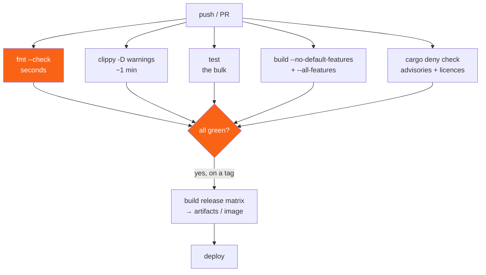

<h1><span class="h1-kicker">Performance & Production</span>CI/CD for Rust</h1>

Rust's compiler is thorough, which is exactly why continuous integration matters more than you'd expect: the checks that make Rust safe only protect the configurations you actually build. A `cfg` branch nobody compiles, a feature combination nobody tries, a dependency with a new advisory — CI is where you find those.

It's also where Rust's one weakness bites: builds are slow. Half of this chapter is about making them fast.

## What a good Rust pipeline checks



| Job | Catches | Cost |
|---|---|---|
| `cargo fmt --check` | formatting churn in diffs | seconds |
| `cargo clippy -- -D warnings` | real bugs, not just style | ~1 min |
| `cargo test` / `cargo nextest run` | regressions | the bulk of the time |
| `cargo test --doc` | doc examples that stopped compiling | moderate |
| `--no-default-features` | the minimal build path rotting | moderate |
| `--all-features` | feature combinations nobody tries | moderate |
| `cargo deny check` | new CVEs, forbidden licences | seconds |
| `cargo build --target <other>` | platform-specific breakage | moderate |
| MSRV build | accidentally using a newer API | moderate |
| `cargo semver-checks` | publishing a breaking patch release | moderate |

## A pipeline worth copying

```yaml
name: CI

on:
  push:
    branches: [main]
  pull_request:

# Cancel superseded runs on the same branch — saves a lot of CI minutes.
concurrency:
  group: ${{ github.workflow }}-${{ github.ref }}
  cancel-in-progress: true

env:
  CARGO_TERM_COLOR: always
  # Fewer debug symbols → much faster CI builds. CI doesn't debug.
  CARGO_PROFILE_TEST_DEBUG: 0
  RUSTFLAGS: "-D warnings"

jobs:
  # Fast feedback: fails in seconds if someone forgot to format.
  fmt:
    runs-on: ubuntu-latest
    steps:
      - uses: actions/checkout@v4
      - uses: dtolnay/rust-toolchain@stable
        with:
          components: rustfmt
      - run: cargo fmt --all --check

  clippy:
    runs-on: ubuntu-latest
    steps:
      - uses: actions/checkout@v4
      - uses: dtolnay/rust-toolchain@stable
        with:
          components: clippy
      - uses: Swatinem/rust-cache@v2
      - run: cargo clippy --all-targets --all-features -- -D warnings

  test:
    strategy:
      fail-fast: false
      matrix:
        os: [ubuntu-latest, macos-latest, windows-latest]
    runs-on: ${{ matrix.os }}
    steps:
      - uses: actions/checkout@v4
      - uses: dtolnay/rust-toolchain@stable
      - uses: Swatinem/rust-cache@v2
      - uses: taiki-e/install-action@nextest
      - run: cargo nextest run --all-features
      # nextest does not run doc tests, so run them separately.
      - run: cargo test --doc --all-features

  features:
    runs-on: ubuntu-latest
    steps:
      - uses: actions/checkout@v4
      - uses: dtolnay/rust-toolchain@stable
      - uses: Swatinem/rust-cache@v2
      - run: cargo check --no-default-features
      - run: cargo check --all-features

  msrv:
    runs-on: ubuntu-latest
    steps:
      - uses: actions/checkout@v4
      # Must match the rust-version in Cargo.toml.
      - uses: dtolnay/rust-toolchain@1.74.0
      - uses: Swatinem/rust-cache@v2
      - run: cargo check --all-features

  deny:
    runs-on: ubuntu-latest
    steps:
      - uses: actions/checkout@v4
      - uses: EmbarkStudios/cargo-deny-action@v2
```

> [!best] Put `fmt` in its own fast job
> A formatting failure should tell you in fifteen seconds, not after a six-minute test run. Splitting the cheap checks into their own jobs means the feedback arrives roughly in order of how easy it is to fix. It also parallelizes: `fmt`, `clippy`, and `test` run simultaneously rather than serially.

> [!tip] `concurrency` with `cancel-in-progress` pays for itself immediately
> Without it, pushing three commits to a branch in five minutes runs three full pipelines, and you only care about the last one. With it, the first two are cancelled the moment the next push lands. On a busy repository this is often the single biggest reduction in CI minutes available, and it's four lines.

## Making Rust CI fast

This is the part people get wrong. A naive Rust pipeline spends most of its time recompiling dependencies that haven't changed.

<figure class="diagram">
<svg viewBox="0 0 640 240" role="img" aria-label="A timeline comparing a serial uncached Rust pipeline against parallel cached jobs, showing a large reduction in wall-clock time">
  <style>
    .ci-h { font: 700 12px var(--font-sans); }
    .ci-m { font: 600 10px var(--font-mono); fill: var(--text); }
    .ci-c { font: 11px var(--font-sans); fill: var(--text-mute); }
    .ci-dep { fill: var(--red-soft); stroke: var(--red); stroke-width: 1.2; }
    .ci-work { fill: var(--green-soft); stroke: var(--green); stroke-width: 1.2; }
    .ci-axis { stroke: var(--border-strong); stroke-width: 1; }
  </style>
  <text x="20" y="18" class="ci-h" fill="var(--red)">Serial, no cache — 14 min wall clock</text>
  <g class="ci-m">
    <rect x="20" y="28" width="86" height="20" class="ci-dep"/><text x="112" y="43" class="ci-c">fmt (deps rebuilt)</text>
    <rect x="20" y="52" width="150" height="20" class="ci-dep"/>
    <rect x="170" y="52" width="40" height="20" class="ci-work"/><text x="216" y="67" class="ci-c">clippy</text>
    <rect x="20" y="76" width="150" height="20" class="ci-dep"/>
    <rect x="170" y="76" width="110" height="20" class="ci-work"/><text x="286" y="91" class="ci-c">test</text>
    <rect x="20" y="100" width="150" height="20" class="ci-dep"/>
    <rect x="170" y="100" width="60" height="20" class="ci-work"/><text x="236" y="115" class="ci-c">features</text>
  </g>
  <text x="20" y="138" class="ci-c">Red = recompiling dependencies that did not change. Most of the pipeline.</text>
  <text x="20" y="172" class="ci-h" fill="var(--green)">Parallel jobs + rust-cache — 3 min wall clock</text>
  <g class="ci-m">
    <rect x="20" y="182" width="14" height="16" class="ci-work"/><text x="40" y="195" class="ci-c">fmt (15s, no build at all)</text>
    <rect x="20" y="200" width="42" height="16" class="ci-work"/><text x="68" y="213" class="ci-c">clippy — warm cache</text>
    <rect x="20" y="218" width="110" height="16" class="ci-work"/><text x="136" y="231" class="ci-c">test — the only long job now</text>
  </g>
  <line x1="20" y1="152" x2="600" y2="152" class="ci-axis"/>
  <text x="560" y="148" class="ci-c">time →</text>
</svg>
<figcaption>Caching removes the dependency rebuild (red); running jobs in parallel means wall-clock time is the <b>slowest single job</b>, not their sum.</figcaption>
</figure>

| Technique | Saving | How |
|---|---|---|
| **cache `~/.cargo` and `target/`** | often 5–10× | `Swatinem/rust-cache@v2` |
| `CARGO_PROFILE_TEST_DEBUG: 0` | 20–40% | debug info is large and CI never debugs |
| `cargo nextest` | 30–60% on test time | better parallelism, per-test processes |
| split jobs to run in parallel | wall-clock only | separate `fmt`/`clippy`/`test` jobs |
| `cargo check` instead of `build` where possible | 3–5× | skips codegen and linking |
| `cancel-in-progress` | varies, often large | the `concurrency` block |
| `sccache` | helps across branches | shared compilation cache |
| a faster linker (`lld`/`mold`) | 10–30% of link time | `.cargo/config.toml` |
| `--locked` | avoids resolver work; also correctness | `cargo test --locked` |
| skip the docs job on PRs | moderate | `if: github.ref == 'refs/heads/main'` |

> [!key] `Swatinem/rust-cache` over the generic cache action
> The generic `actions/cache` on `target/` grows without bound, caches stale artifacts forever, and eventually slows things down. `Swatinem/rust-cache` is Rust-aware: it keys on your lockfile and toolchain, prunes intermediate artifacts that don't help, and cleans up your own crate's stale output. It's a one-line change with the largest single effect on Rust CI time. Set `key: ${{ matrix.target }}` when you build multiple targets so they don't fight over one cache.

> [!warning] `RUSTFLAGS` set in CI invalidates the cache
> Any change to `RUSTFLAGS` — including setting `-D warnings` in one job but not another — makes the artifacts incompatible, so those jobs cannot share a cache. Either set it consistently across every job (as in the pipeline above), or pass `-D warnings` as a Clippy argument (`cargo clippy -- -D warnings`) rather than through the environment. Mixing the two guarantees full rebuilds.

## Clippy is a bug-finder, not a linter

Treating Clippy as optional style advice is a mistake — a large fraction of its lints catch genuine defects. Configure it deliberately in your crate root:

```rust
// lib.rs or main.rs — project-wide lint policy.
#![warn(clippy::all)]
#![warn(clippy::pedantic)]
#![warn(missing_docs)]
#![deny(clippy::unwrap_used)]           // force expect() with a reason, or ?
#![deny(clippy::panic)]                 // in library code
#![warn(clippy::todo, clippy::dbg_macro)]
// Some pedantic lints are noisy; turn off the ones you disagree with, with a reason.
#![allow(clippy::module_name_repetitions)] // module::ModuleThing reads fine to us

fn main() {
    // Clippy would flag several things here in a real crate.
    let items = vec![1, 2, 3];

    // clippy::needless_range_loop would catch this:
    // for i in 0..items.len() { println!("{}", items[i]); }
    for item in &items {
        println!("{item}");
    }

    println!("{}", items.len());
}
```

Since Rust 1.74 you can also configure lints in `Cargo.toml`, which is cleaner and applies across a workspace:

```toml
[lints.rust]
unsafe_code = "forbid"
missing_docs = "warn"

[lints.clippy]
all = { level = "warn", priority = -1 }
pedantic = { level = "warn", priority = -1 }
unwrap_used = "deny"
module_name_repetitions = "allow"

# In a workspace, members opt in with:
# [lints]
# workspace = true
```

| Lint group | What it is |
|---|---|
| `clippy::correctness` | almost certainly a bug — **deny** these |
| `clippy::suspicious` | probably wrong; worth a look |
| `clippy::complexity` | simplifiable code |
| `clippy::perf` | measurable performance wins |
| `clippy::style` | idiomatic-Rust conventions |
| `clippy::pedantic` | stricter; some are noisy, most are good |
| `clippy::nursery` | in development; occasionally wrong |
| `clippy::cargo` | manifest issues (missing metadata, etc.) |

> [!best] `deny(clippy::unwrap_used)` in libraries is transformative
> It forces every `unwrap()` to become a `?`, an `unwrap_or`, or an `expect("reason")` — and writing the reason is what makes you notice the ones that can actually fail. Pair it with `#![forbid(unsafe_code)]` if your crate has no `unsafe`; that turns "we don't use unsafe" from a claim into a compiler-enforced fact, which is genuinely valuable to your users. Both are one-line changes with lasting effect.

## Coverage

```yaml
  coverage:
    runs-on: ubuntu-latest
    steps:
      - uses: actions/checkout@v4
      - uses: dtolnay/rust-toolchain@stable
        with:
          components: llvm-tools-preview
      - uses: taiki-e/install-action@cargo-llvm-cov
      - uses: Swatinem/rust-cache@v2
      - run: cargo llvm-cov --all-features --lcov --output-path lcov.info
      - uses: codecov/codecov-action@v4
        with:
          files: lcov.info
```

> [!note] Coverage is a diagnostic, not a target
> `cargo llvm-cov` is genuinely useful for spotting whole modules nobody tests, or error paths that never execute. It becomes harmful the moment it's a gate with a number attached: people write tests that touch lines without asserting anything, and 90% coverage of weak tests is worse than 60% of strong ones. Look at *which* lines are uncovered and ask whether they matter. Uncovered error handling is a real finding; an uncovered `Display` impl usually isn't.

## Automated releases

Tag-triggered pipelines that build every platform and attach the binaries:

```yaml
name: Release
on:
  push:
    tags: ['v*.*.*']

permissions:
  contents: write        # needed to create the release

jobs:
  build:
    strategy:
      fail-fast: false
      matrix:
        include:
          - { os: ubuntu-latest,  target: x86_64-unknown-linux-musl,  cross: true }
          - { os: ubuntu-latest,  target: aarch64-unknown-linux-musl, cross: true }
          - { os: macos-latest,   target: aarch64-apple-darwin,       cross: false }
          - { os: macos-latest,   target: x86_64-apple-darwin,        cross: false }
          - { os: windows-latest, target: x86_64-pc-windows-msvc,     cross: false }
    runs-on: ${{ matrix.os }}
    steps:
      - uses: actions/checkout@v4
      - uses: dtolnay/rust-toolchain@stable
        with:
          targets: ${{ matrix.target }}
      - uses: Swatinem/rust-cache@v2
        with:
          key: ${{ matrix.target }}
      - if: matrix.cross
        uses: taiki-e/install-action@cross
      - name: Build
        run: ${{ matrix.cross && 'cross' || 'cargo' }} build --release --locked --target ${{ matrix.target }}
      - name: Package
        shell: bash
        run: |
          BIN=myapp
          DIR=$BIN-${{ github.ref_name }}-${{ matrix.target }}
          mkdir "$DIR"
          if [ "${{ matrix.os }}" = "windows-latest" ]; then
            cp "target/${{ matrix.target }}/release/$BIN.exe" "$DIR/"
            7z a "$DIR.zip" "$DIR"
          else
            cp "target/${{ matrix.target }}/release/$BIN" "$DIR/"
            tar czf "$DIR.tar.gz" "$DIR"
          fi
      - uses: softprops/action-gh-release@v2
        with:
          files: |
            *.tar.gz
            *.zip

  publish:
    needs: build
    runs-on: ubuntu-latest
    steps:
      - uses: actions/checkout@v4
      - uses: dtolnay/rust-toolchain@stable
      - run: cargo publish --locked
        env:
          CARGO_REGISTRY_TOKEN: ${{ secrets.CARGO_REGISTRY_TOKEN }}
```

| Tool | Automates |
|---|---|
| `cargo-dist` | the whole release pipeline, including installers |
| `release-plz` | version bumps, changelog, and publishing from commits |
| `cargo-release` | the manual-but-scripted version-and-tag flow |
| `taiki-e/install-action` | fast installs of cargo tools in CI (prebuilt binaries) |
| `dependabot` / `renovate` | dependency update PRs |

> [!best] `cargo-dist` if you distribute a binary to end users
> It generates the release workflow, builds every platform, produces installers (shell script, PowerShell, Homebrew, npm, MSI), and writes the install instructions. Hand-maintaining the matrix above is fine for one or two platforms and becomes a chore at five. `release-plz` is the complement for libraries: it derives the version bump and changelog from conventional commits and publishes to crates.io.

> [!warning] Always `--locked` in CI and release builds
> Without it, Cargo may silently update dependencies within your declared ranges, which means the artifact you release was built against versions you never tested. `--locked` fails the build if `Cargo.lock` would need to change — turning a silent difference into a loud error. Applications should commit `Cargo.lock` and always use `--locked`; libraries commit it too these days (it only affects their own CI, not consumers).

## Dependency hygiene, automated

```toml
# .github/dependabot.yml
version: 2
updates:
  - package-ecosystem: cargo
    directory: "/"
    schedule:
      interval: weekly
    open-pull-requests-limit: 5
    groups:
      # One PR for all patch bumps instead of fifteen.
      patch-updates:
        update-types: ["patch"]

  - package-ecosystem: github-actions
    directory: "/"
    schedule:
      interval: monthly
```

```yaml
# A scheduled audit — advisories appear against code you already shipped.
name: Audit
on:
  schedule:
    - cron: '0 6 * * 1'      # Mondays
  workflow_dispatch:
jobs:
  audit:
    runs-on: ubuntu-latest
    steps:
      - uses: actions/checkout@v4
      - uses: EmbarkStudios/cargo-deny-action@v2
```

> [!key] The security audit must run on a schedule, not only on push
> This is the point people miss. A new advisory can be published against a dependency version you shipped three months ago and haven't touched since — a push-triggered job will never see it, because there are no pushes. A weekly `cargo deny check` is what actually catches it. Add `workflow_dispatch` too so you can trigger it by hand when a headline vulnerability lands.

## Common CI failures and their causes

| Symptom | Usual cause |
|---|---|
| passes locally, fails in CI | uncommitted file, or a stale local `target/` masking an error |
| passes on Linux, fails on Windows | path separators, or `\r\n` line endings in test fixtures |
| passes on `main`, fails on the MSRV job | you used an API newer than `rust-version` |
| flaky test | shared global state, a real timing dependency, or filesystem collisions |
| tests pass individually, fail together | tests writing to the same file or port — use `tempfile` and port 0 |
| cache never hits | `RUSTFLAGS` differs between jobs, or the cache key includes something volatile |
| `--all-features` fails | two features that can't coexist — see [Conditional Compilation](#/ch/conditional-compilation) |
| `--no-default-features` fails | code outside a `cfg` that needs `std` or a default dep |
| doc test fails, unit tests pass | an example in a doc comment drifted from the API |
| suddenly fails with no code change | a new advisory, or a dependency published a breaking patch |

> [!mistake] Flaky tests are almost always shared state
> Rust runs tests in parallel threads within one process by default, so two tests that both write `test_output.txt`, both bind port 8080, or both mutate a `static mut` will intermittently collide. The fixes are mechanical: use the `tempfile` crate for files, bind port `0` and read back the assigned port, and give each test its own fixture. Reaching for `--test-threads=1` hides the problem and makes your suite slower; `cargo nextest` (process-per-test) hides it too. Fix the sharing.

## Summary

- CI protects the configurations you don't build locally: **other platforms, `--no-default-features`, `--all-features`, your MSRV**, and new advisories.
- Split into **parallel jobs** so cheap checks fail fast, and add a **`concurrency`** block with `cancel-in-progress`.
- The single biggest speed win is **`Swatinem/rust-cache@v2`**; then `CARGO_PROFILE_TEST_DEBUG: 0`, `cargo nextest`, and `cargo check` where `build` isn't needed.
- Don't let **`RUSTFLAGS`** differ between jobs — it silently prevents cache sharing.
- Treat **Clippy as a bug-finder**: deny `correctness`, consider `deny(clippy::unwrap_used)` and `forbid(unsafe_code)`, and declare it all in `[lints]` in `Cargo.toml`.
- Coverage is a **diagnostic, not a target** — look at which lines are uncovered, not the percentage.
- Build releases from **tags** with a `fail-fast: false` matrix, always **`--locked`**; use `cargo-dist` for binaries and `release-plz` for libraries.
- Run **`cargo deny check` on a schedule**, because advisories land against code you already shipped.
- **Flaky tests are shared state.** Fix the sharing rather than serializing the suite.

> [!exercise] Try it yourself
> 1. Add a `fmt --check` job to a project and deliberately misformat a file. How fast does CI tell you?
> 2. Add `Swatinem/rust-cache@v2` to an existing workflow and compare the build time of a run before and after (on the second run, so the cache is warm).
> 3. Add `#![deny(clippy::unwrap_used)]` to a crate you've written. How many places break, and how many of them could genuinely fail?
> 4. Add a `--no-default-features` check job. Does your crate actually build that way?
> 5. Write two tests that both create `output.txt` in the current directory, run the suite a few times, and watch them flake. Then fix it with `tempfile`.
> 6. Set up a scheduled `cargo deny check`. Trigger it manually with `workflow_dispatch` and read the report.

Next: once it's deployed and passing CI, you still need to know what it's doing in production — **observability**.
