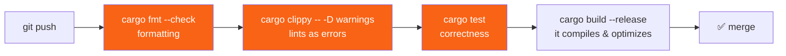

<h1><span class="h1-kicker">Testing & Quality</span>Clippy, rustfmt & Lints</h1>

Two tools that ship with Rust will quietly make you a better Rust programmer: **`rustfmt`** formats your code to the community standard, and **`clippy`** is a brilliant linter (a tool that flags questionable code) with over 700 checks that teach idiomatic Rust as you go. Together they end formatting debates and catch mistakes the compiler allows but shouldn't. Turn them on today.

## rustfmt: never argue about formatting again

`rustfmt` reformats your code into the one true Rust style — consistent indentation, spacing, line-wrapping, and import ordering. Run it across your whole project with:

```bash
cargo fmt
```

That's it. It reformats every file in place. Because *everyone* uses the same tool with the same defaults, all Rust code looks familiar, and code reviews never waste time on style.

Take this messily-formatted code:

```rust,ignore
fn  main(){let x=vec![1,2,3];
        for i in x{println!("{}",i)}}
```

After `cargo fmt` it becomes clean and canonical:

```rust
fn main() {
    let x = vec![1, 2, 3];
    for i in x {
        println!("{i}")
    }
}
```

> [!best] Format automatically, not manually
> Configure your editor to **run `rustfmt` on save** (the `rust-analyzer` extension does this with one setting). Then you never think about formatting again — you type roughly, hit save, and it snaps into shape. Add `cargo fmt --check` to your CI so no unformatted code is ever merged.

## Clippy: a mentor that reads your code

`clippy` goes far beyond the compiler. It knows hundreds of patterns that are *legal* but *unidiomatic, slow, or bug-prone*, and it suggests the better way — often with the exact fix:

```bash
cargo clippy
```

For example, given this common beginner code:

```rust,ignore
let name = "Ferris".to_string();
if name.len() > 0 {              // clippy warns here
    println!("{}", name);
}
```

Clippy says:

```text
warning: length comparison to zero
  |
  |     if name.len() > 0 {
  |        ^^^^^^^^^^^^^^^ help: using `!is_empty` is clearer: `!name.is_empty()`
```

It caught a needlessly obscure check and taught you the idiomatic `!name.is_empty()`. Multiply that by 700+ lints and you have a tireless mentor.

> [!tip] Clippy is the fastest way to learn idiomatic Rust
> Run `cargo clippy` on your code and *read every suggestion*. Each one teaches a small lesson: prefer `if let` over `match` with one arm, avoid a needless `clone()`, use `?` instead of a manual `match`, collect instead of pushing in a loop. New Rustaceans who habitually run Clippy pick up idioms in weeks that would otherwise take months.

## Controlling lints with attributes

Lints have three levels — **`warn`** (default for most), **`deny`** (a hard error), and **`allow`** (silence it). You can adjust any lint with an attribute, scoped to an item, a module, or the whole crate:

```rust
// Silence one lint for a single function where you know better:
#[allow(clippy::too_many_arguments)]
fn configure(a: i32, b: i32, c: i32, d: i32, e: i32, f: i32, g: i32, h: i32) {
    // ... a builder would be cleaner, but this is intentional here.
    let _ = (a, b, c, d, e, f, g, h);
}

fn main() {
    configure(1, 2, 3, 4, 5, 6, 7, 8);
    println!("configured");
}
```

You can also set crate-wide policy at the top of `main.rs`/`lib.rs`:

```rust,ignore
#![warn(clippy::all)]              // enable Clippy's standard lints
#![deny(warnings)]                 // treat any warning as a build error (strict!)
#![allow(clippy::module_name_repetitions)] // opt out of one you disagree with
```

> [!warning] Reach for `#[allow]` sparingly and with a reason
> It's tempting to silence a lint to make a warning disappear. Resist — the lint is usually right. When you *do* allow one, it should be a deliberate, documented decision ("this clone is required because…"), not a reflex. A codebase littered with unexplained `#[allow]`s has simply turned off its safety net.

## Putting quality on autopilot with CI

The professional setup runs all four quality gates automatically on every push, so problems are caught before they merge:



```bash
# The four commands every Rust CI pipeline runs:
cargo fmt --check                 # fail if not formatted
cargo clippy -- -D warnings       # fail on any lint warning
cargo test                        # fail if any test fails
cargo build --release             # fail if it doesn't build optimized
```

> [!best] Adopt this from day one
> Even for a solo hobby project, wiring up `fmt`, `clippy`, `test`, and a release `build` in CI takes ten minutes and pays off forever. It keeps your code consistently formatted, idiomatic, correct, and shippable — automatically, without discipline or memory on your part.

## Summary

- **`cargo fmt`** formats your code to the universal Rust style — run it on save and end all formatting debates.
- **`cargo clippy`** is a 700+ lint linter that catches unidiomatic, slow, or buggy patterns and *teaches* you the better way — the fastest route to idiomatic Rust.
- Tune lints with **`#[allow]` / `#[warn]` / `#[deny]`** attributes, per item or crate-wide — but silence sparingly, with a reason.
- Wire **`fmt --check`**, **`clippy -- -D warnings`**, **`test`**, and a release **`build`** into CI so quality is enforced automatically.

> [!exercise] Try it yourself
> 1. Write some deliberately messy code, run `cargo fmt`, and watch it clean up.
> 2. Write `if v.len() == 0 { … }` and run `cargo clippy` — read (and apply) its suggestion.
> 3. Add `#![deny(warnings)]` to a small project and fix everything it flags. Notice how much it teaches.

You can now build Rust that's correct, fast, clean, and idiomatic. Next we go deeper into how Rust manages memory with **smart pointers** — starting with the simplest, `Box`.
