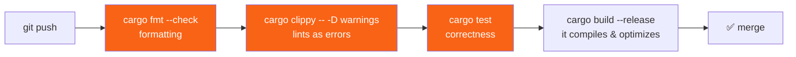

<h1><span class="h1-kicker">Testing & Quality</span>Clippy, rustfmt & Lints</h1>

Two tools that ship with Rust will quietly make you a better Rust programmer: **`rustfmt`** formats your code to the community standard, and **`clippy`** is a brilliant linter (a tool that flags questionable code) with over 700 checks that teach idiomatic Rust as you go. Together they end formatting debates and catch mistakes the compiler allows but shouldn't. Turn them on today.

## rustfmt: never argue about formatting again

`rustfmt` reformats your code into the one true Rust style — consistent indentation, spacing, line-wrapping, and import ordering. Run it across your whole project with:

```bash
cargo fmt
```

That's it. It reformats every file in place. Because *everyone* uses the same tool with the same defaults, all Rust code looks familiar, and code reviews never waste time on style.

Take this messily-formatted code:

```rust,ignore
fn  main(){let x=vec![1,2,3];
        for i in x{println!("{}",i)}}
```

After `cargo fmt` it becomes clean and canonical:

```rust
fn main() {
    let x = vec![1, 2, 3];
    for i in x {
        println!("{i}")
    }
}
```

> [!best] Format automatically, not manually
> Configure your editor to **run `rustfmt` on save** (the `rust-analyzer` extension does this with one setting). Then you never think about formatting again — you type roughly, hit save, and it snaps into shape. Add `cargo fmt --check` to your CI so no unformatted code is ever merged.

`rustfmt` has very few knobs on purpose — the whole point is that everyone's code looks the same, so there's little to configure. The handful that exist go in a `rustfmt.toml` at your project root:

| Setting | Default | Changes |
|---|---|---|
| `max_width` | 100 | the line-wrap column |
| `edition` | matches `Cargo.toml` | which edition's style to target |
| `imports_granularity` | `Preserve` | `Crate` merges all imports from one crate onto one line |
| `group_imports` | `Preserve` | `StdExternalCrate` sorts std / external / your-crate imports into groups |
| `reorder_imports` | `true` | alphabetizes imports within a group |

> [!note] Most of `rustfmt`'s configuration is nightly-only
> Options beyond this short list require `cargo +nightly fmt`, and the project deliberately keeps them experimental — wide customization is exactly what `rustfmt` exists to prevent. If you find yourself wanting more control than the table above, that's usually a sign to accept the default rather than fight it; every other Rust codebase you'll ever read uses it too.

## Clippy: a mentor that reads your code

`clippy` goes far beyond the compiler. It knows hundreds of patterns that are *legal* but *unidiomatic, slow, or bug-prone*, and it suggests the better way — often with the exact fix:

```bash
cargo clippy
```

For example, given this common beginner code:

```rust,ignore
let name = "Ferris".to_string();
if name.len() > 0 {              // clippy warns here
    println!("{}", name);
}
```

Clippy says:

```text
warning: length comparison to zero
  |
  |     if name.len() > 0 {
  |        ^^^^^^^^^^^^^^^ help: using `!is_empty` is clearer: `!name.is_empty()`
```

It caught a needlessly obscure check and taught you the idiomatic `!name.is_empty()`. Multiply that by 700+ lints and you have a tireless mentor.

> [!tip] Clippy is the fastest way to learn idiomatic Rust
> Run `cargo clippy` on your code and *read every suggestion*. Each one teaches a small lesson: prefer `if let` over `match` with one arm, avoid a needless `clone()`, use `?` instead of a manual `match`, collect instead of pushing in a loop. New Rustaceans who habitually run Clippy pick up idioms in weeks that would otherwise take months.

## Controlling lints with attributes

Lints have four levels, and the level decides what happens when the pattern is found:

| Level | Effect |
|---|---|
| `allow` | silent — the check still runs, but nothing is reported |
| `warn` | prints a warning; the build still succeeds (the default for most lints) |
| `deny` | a **hard compile error** for this lint specifically |
| `forbid` | like `deny`, but can't be downgraded again later — not even by a closer `#[allow]` |

You can adjust any lint with an attribute, scoped to an item, a module, or the whole crate:

```rust
// Silence one lint for a single function where you know better:
#[allow(clippy::too_many_arguments)]
fn configure(a: i32, b: i32, c: i32, d: i32, e: i32, f: i32, g: i32, h: i32) {
    // ... a builder would be cleaner, but this is intentional here.
    let _ = (a, b, c, d, e, f, g, h);
}

fn main() {
    configure(1, 2, 3, 4, 5, 6, 7, 8);
    println!("configured");
}
```

You can also set crate-wide policy at the top of `main.rs`/`lib.rs`:

```rust,ignore
#![warn(clippy::all)]              // enable Clippy's standard lints
#![deny(clippy::correctness)]      // these are almost certainly real bugs
#![allow(clippy::module_name_repetitions)] // opt out of one you disagree with
```

Attributes **nest**, and the innermost one wins — which is precisely how the `configure` example above works: a crate-wide `warn` still lets one function locally `allow` the same lint.

<figure class="diagram">
<svg viewBox="0 0 640 220" role="img" aria-label="A lint attribute set at the crate level is overridden by a module-level attribute, which is in turn overridden by a function-level attribute, with the innermost scope always winning" >
  <style>
    .lf-h { font: 700 12px var(--font-sans); }
    .lf-m { font: 600 11px var(--font-mono); fill: var(--text); }
    .lf-c { font: 10.5px var(--font-sans); fill: var(--text-mute); }
    .lf-crate { fill: var(--surface-2); stroke: var(--border-strong); stroke-width: 1.5; }
    .lf-mod { fill: var(--blue-soft); stroke: var(--blue); stroke-width: 1.5; }
    .lf-fn { fill: var(--rust-100); stroke: var(--rust-500); stroke-width: 2; }
  </style>
  <rect x="20" y="20" width="600" height="180" rx="6" class="lf-crate"/>
  <text x="34" y="42" class="lf-m">#![warn(clippy::too_many_arguments)]</text>
  <text x="34" y="58" class="lf-c">crate-wide default — applies everywhere unless overridden</text>
  <rect x="50" y="76" width="540" height="112" rx="6" class="lf-mod"/>
  <text x="64" y="98" class="lf-m">mod config { #![deny(clippy::too_many_arguments)] }</text>
  <text x="64" y="114" class="lf-c">this module: same lint, upgraded to a hard error</text>
  <rect x="80" y="132" width="480" height="42" rx="6" class="lf-fn"/>
  <text x="94" y="154" class="lf-m">#[allow(clippy::too_many_arguments)] fn configure(...)</text>
  <text x="94" y="168" class="lf-c">this ONE function: silenced — innermost scope wins</text>
  <text x="20" y="208" class="lf-c">Only <tspan font-family="var(--font-mono)">forbid</tspan> resists this — an inner <tspan font-family="var(--font-mono)">#[allow]</tspan> cannot undo a <tspan font-family="var(--font-mono)">#![forbid(...)]</tspan> from an outer scope.</text>
</svg>
<figcaption>Lint attributes form a scope, just like variables. The <b>closest</b> attribute to the code wins — except <code>forbid</code>, which cannot be overridden by anything nested inside it.</figcaption>
</figure>

> [!warning] Reach for `#[allow]` sparingly and with a reason
> It's tempting to silence a lint to make a warning disappear. Resist — the lint is usually right. When you *do* allow one, it should be a deliberate, documented decision ("this clone is required because…"), not a reflex. A codebase littered with unexplained `#[allow]`s has simply turned off its safety net.

> [!mistake] `#![deny(warnings)]` in source code is a trap, not a safety net
> It looks strict and responsible — but it denies *every* warning, including ones a future compiler or Clippy version introduces that have nothing to do with your change. Upgrade your toolchain six months from now and a brand-new lint can turn your crate's build into a hard failure, for code that hasn't changed at all. The professional pattern is to keep source code at `warn` and enforce strictness **only in CI**, with `cargo clippy -- -D warnings` as a command-line flag — that way a stricter check is a CI policy you control, not a landmine baked into the crate that ships to users.

> [!tip] Let Clippy fix what it can
> Many suggestions are mechanical enough to apply automatically:
> ```bash
> cargo clippy --fix
> cargo fix --edition   # similarly, for edition-migration lints
> ```
> Always run this on a clean git state and review the diff — it's a huge time-saver for the common cases, but Clippy is still a suggestion engine, not an oracle.

## Putting quality on autopilot with CI

The professional setup runs all four quality gates automatically on every push, so problems are caught before they merge:



```bash
# The four commands every Rust CI pipeline runs:
cargo fmt --check                 # fail if not formatted
cargo clippy -- -D warnings       # fail on any lint warning
cargo test                        # fail if any test fails
cargo build --release             # fail if it doesn't build optimized
```

Notice that's the flag from the trap above, used the *right* way: `-D warnings` on the command line is a CI policy, not a line baked into your source that ships with every download of your crate.

> [!best] Adopt this from day one
> Even for a solo hobby project, wiring up `fmt`, `clippy`, `test`, and a release `build` in CI takes ten minutes and pays off forever. It keeps your code consistently formatted, idiomatic, correct, and shippable — automatically, without discipline or memory on your part. See [CI/CD for Rust](#/ch/ci-cd) for a complete pipeline, the Clippy lint-group breakdown (`correctness`, `perf`, `pedantic`, and more), and how to declare all of this once in `Cargo.toml` under `[lints]` instead of scattering attributes through your source.

## Summary

- **`cargo fmt`** formats your code to the universal Rust style — run it on save and end all formatting debates. Its configuration is deliberately minimal.
- **`cargo clippy`** is a 700+ lint linter that catches unidiomatic, slow, or buggy patterns and *teaches* you the better way — the fastest route to idiomatic Rust.
- Four levels: **`allow`**, **`warn`**, **`deny`** (a hard error), **`forbid`** (can't be downgraded by anything nested inside it). The **innermost** attribute wins.
- Tune lints with **`#[allow]` / `#[warn]` / `#[deny]`** attributes, per item or crate-wide — but silence sparingly, with a reason.
- **Don't bake `#![deny(warnings)]` into source** — a future compiler or Clippy version can break your build for unrelated code. Enforce strictness with `-D warnings` **in CI only**.
- `cargo clippy --fix` applies mechanical suggestions automatically — review the diff.
- Wire **`fmt --check`**, **`clippy -- -D warnings`**, **`test`**, and a release **`build`** into CI so quality is enforced automatically.

> [!exercise] Try it yourself
> 1. Write some deliberately messy code, run `cargo fmt`, and watch it clean up.
> 2. Write `if v.len() == 0 { … }` and run `cargo clippy` — read (and apply) its suggestion.
> 3. Set `#![warn(clippy::too_many_arguments)]` at the crate level, then `#[allow]` it on one function and `#[deny]` it on one module. Confirm each scope behaves differently.
> 4. Run `cargo clippy --fix` on a small project with a few obvious lints and review what it changed.
> 5. Explain in one sentence why `-D warnings` belongs in a CI command rather than in `lib.rs`.

You can now build Rust that's correct, fast, clean, and idiomatic. Next we go deeper into how Rust manages memory with **smart pointers** — starting with the simplest, `Box`.
