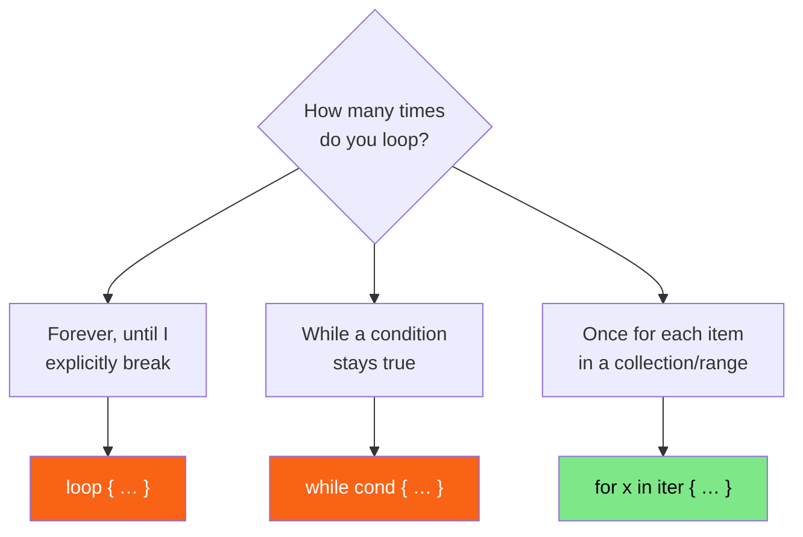

<h1><span class="h1-kicker">Rust Foundations</span>Control Flow</h1>

So far our programs run straight from top to bottom. Real programs need to make **decisions** ("if the user is logged in, show the dashboard") and **repeat** work ("for each item in the cart, add up the price"). These two abilities — branching and looping — are called *control flow*, and this chapter covers all of Rust's tools for both.

## Making decisions with `if`

An `if` expression runs a block of code only when a condition is `true`:

```rust
fn main() {
    let number = 7;

    if number % 2 == 0 {
        println!("{number} is even");
    } else {
        println!("{number} is odd");
    }
}
```

> [!warning] The condition must be a real `bool`
> Unlike C, Python, or JavaScript, Rust will **not** treat `0`, `""`, or `null` as "falsy." The condition of an `if` must be exactly a `bool`. Writing `if number { … }` (where `number` is an integer) is a compile error. This prevents a whole family of subtle bugs — you must say what you mean: `if number != 0 { … }`.

Chain multiple conditions with `else if`:

```rust
fn main() {
    let score = 85;
    let grade = if score >= 90 { "A" }
                else if score >= 80 { "B" }
                else if score >= 70 { "C" }
                else { "F" };
    println!("Grade: {grade}");
}
```

### `if` is an expression

Notice what we just did — we assigned the result of `if` to a variable. Because `if` is an **expression** (it evaluates to a value), you can use it wherever a value is expected. This is Rust's clean replacement for the ternary `? :` operator found in other languages:

```rust
fn main() {
    let is_raining = true;
    let activity = if is_raining { "read a book" } else { "go for a walk" };
    println!("Today I'll {activity}.");
}
```

> [!key] `if`/`else` branches must agree on a type
> When you use `if` to produce a value, every branch must evaluate to the **same type** — that's how the compiler knows the type of the whole expression. `let x = if cond { 5 } else { "five" };` fails, because one branch is a number and the other is text.

## Repeating with loops

Rust has three loop keywords: `loop`, `while`, and `for`. Here's how to choose:



### `loop`: repeat forever (until you `break`)

`loop` runs its body over and over until you stop it with `break`. Uniquely, `break` can **return a value** from the loop:

```rust
fn main() {
    let mut counter = 0;

    let result = loop {
        counter += 1;
        if counter == 10 {
            break counter * 2; // break out AND return this value
        }
    };

    println!("The loop returned {result}"); // 20
}
```

### `while`: loop while a condition holds

When you want to repeat as long as something is true, `while` is the clearest choice:

```rust
fn main() {
    let mut countdown = 3;
    while countdown > 0 {
        println!("{countdown}…");
        countdown -= 1;
    }
    println!("Liftoff! 🚀");
}
```

### `for`: loop over each item

The `for` loop is the one you'll reach for most. It iterates over each element of a collection or a **range**, and it's both the safest and the most idiomatic:

```rust
fn main() {
    let colors = ["red", "green", "blue"];

    for color in colors {
        println!("Color: {color}");
    }

    // Ranges: 1..=5 means 1 through 5 inclusive
    for n in 1..=5 {
        println!("{n} squared is {}", n * n);
    }
}
```

> [!jargon] What's a "range"?
> A **range** is a lightweight way to express a sequence of numbers. `0..5` is the *half-open* range 0,1,2,3,4 (start included, end excluded) — perfect for indexing. `1..=5` is the *inclusive* range 1,2,3,4,5. Ranges are used constantly with `for`.

Ranges are iterators, so they compose with the usual adapters:

```rust
fn main() {
    print!("countdown: ");
    for n in (1..=5).rev() { print!("{n} "); }          // 5 4 3 2 1

    print!("\nevens:     ");
    for n in (0..20).step_by(4) { print!("{n} "); }      // 0 4 8 12 16

    print!("\nzipped:    ");
    for (letter, number) in "abc".chars().zip(1..) {     // 1.. is unbounded
        print!("{letter}{number} ");
    }
    println!();
}
```

### The three ways to iterate — and the one that surprises people

`for x in collection` **consumes** the collection. That's a deliberate choice, and it's the first ownership error most people meet:

```rust,ignore
let names = vec![String::from("ada"), String::from("grace")];

for name in names {          // ← this MOVES `names` into the loop
    println!("{name}");
}

println!("{names:?}");        // ❌ error[E0382]: borrow of moved value: `names`
```

Add an `&` and the loop borrows instead:

```rust
fn main() {
    let names = vec![String::from("ada"), String::from("grace")];

    for name in &names {              // borrow each item: name is &String
        println!("hello, {name}");
    }
    println!("still here: {names:?}"); // ✅ names was only borrowed

    let mut scores = vec![10, 20, 30];
    for score in &mut scores {         // mutable borrow: score is &mut i32
        *score += 5;                   // deref to modify the element
    }
    println!("bumped: {scores:?}");

    // Consuming on purpose — useful when you want the owned items:
    let owned: Vec<String> = names.into_iter().map(|n| n.to_uppercase()).collect();
    println!("consumed into: {owned:?}");
}
```

| You write | Each item is | The collection afterwards |
|---|---|---|
| `for x in &v` | `&T` — read only | still yours |
| `for x in &mut v` | `&mut T` — modify in place | still yours, now changed |
| `for x in v` | `T` — owned | **moved away, gone** |

> [!key] `&v`, `&mut v`, and `v` are shorthand for three different iterators
> Under the hood these call `v.iter()`, `v.iter_mut()`, and `v.into_iter()` respectively — `for` just picks the right one from the `&`. That's why the item type changes: `iter()` yields `&T`, `iter_mut()` yields `&mut T`, and `into_iter()` yields `T` by taking ownership of the collection.
>
> The rule of thumb: **start with `&v`**. Use `&mut v` when you're editing elements in place, and plain `v` only when you genuinely want to consume the collection and never use it again. If you hit `E0382: borrow of moved value` after a `for` loop, a missing `&` is almost always the cause.

> [!best] Prefer `for` over manual indexing
> You *could* write `while i < arr.len() { … arr[i] … i += 1; }`, but it's error-prone (off-by-one bugs, forgetting to increment) and every access does a bounds check. A `for item in &arr` loop is clearer, faster, and impossible to get wrong. When you also need the index, use `.enumerate()`:
> ```rust
> fn main() {
>     let team = ["Ana", "Ben", "Cy"];
>     for (i, name) in team.iter().enumerate() {
>         println!("{}. {name}", i + 1);
>     }
> }
> ```

## `break`, `continue`, and loop labels

- **`break`** exits the loop entirely.
- **`continue`** skips to the next iteration.

```rust
fn main() {
    let mut total = 0;
    for n in 1..=20 {
        if n % 2 != 0 { continue; }  // skip odd numbers
        if n > 12 { break; }          // stop once we pass 12
        total += n;
    }
    println!("Sum of even numbers up to 12: {total}"); // 2+4+6+8+10+12 = 42
}
```

When you have nested loops, a plain `break` only exits the *inner* one. **Loop labels** (names starting with `'`) let you break or continue an *outer* loop directly:

```rust
fn main() {
    'outer: for row in 0..3 {
        for col in 0..3 {
            if row + col == 3 {
                println!("Stopping at ({row}, {col})");
                break 'outer; // break the OUTER loop, not just the inner
            }
            println!("visiting ({row}, {col})");
        }
    }
}
```

> [!tip] `while let` for looping over a changing value
> There's a fourth looping pattern you'll love once you learn enums: `while let Some(x) = stack.pop() { … }` keeps looping as long as a pattern matches. We cover it fully in [Pattern Matching](#/ch/pattern-matching) — just know it exists.

## Summary

- **`if`/`else`** branch on a condition that must be a real **`bool`**; `if` is an **expression**, so it can produce a value (and all branches must share a type).
- **`loop`** repeats forever until `break` — and `break` can return a value.
- **`while`** repeats as long as a condition is true.
- **`for … in …`** iterates over collections and **ranges** (`0..5`, `1..=5`); it's the safest, most idiomatic loop. Add **`.enumerate()`** when you need the index.
- **`break`** exits, **`continue`** skips; **loop labels** (`'name`) let you control an outer loop from within an inner one.

> [!exercise] Try it yourself
> 1. Use a `for` loop and a range to print the first 10 multiples of 3.
> 2. Rewrite the countdown example using `loop` + `break` instead of `while`.
> 3. Use `.enumerate()` to print a numbered list of your three favorite foods.
> 4. Write a nested loop that finds the first pair `(a, b)` from `1..=5` where `a * b == 12`, using a labeled `break` to stop immediately.

You've now completed the **Foundations** — you can store data, define functions, and control the flow of a program. Next comes the idea that truly sets Rust apart and unlocks everything else: **ownership**.
