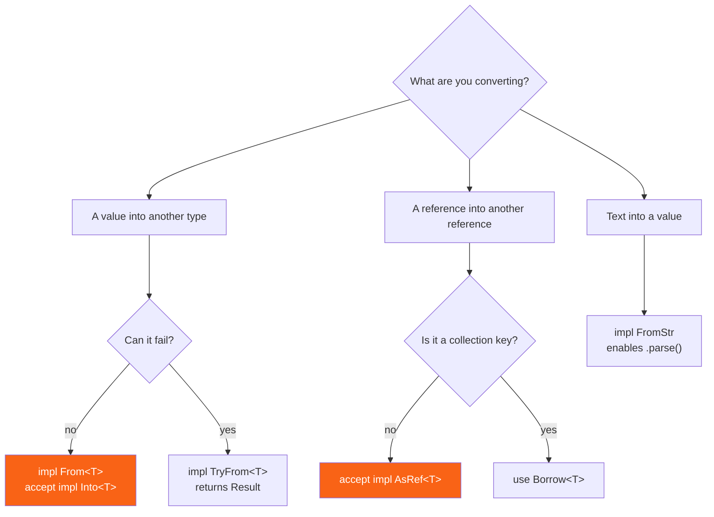

<h1><span class="h1-kicker">Idioms & Design Patterns</span>Conversions: From, Into, AsRef & Cow</h1>

Rust has no implicit conversions. A function that wants a `String` will not quietly accept a `&str`, and an `i64` will not silently become an `i32`. Instead, the language gives you a small family of conversion traits — and once you know which one to reach for, your APIs become dramatically nicer to call while staying completely explicit about cost.

This chapter is the map of that family: what each trait means, which one to implement, and which one to accept in a function signature.

## The conversion family

There are six traits doing the real work, and they divide along two questions: **can it fail?** and **does it take ownership?**

<figure class="diagram">
<svg viewBox="0 0 640 260" role="img" aria-label="A grid classifying conversion traits by whether they consume the value and whether they can fail">
  <style>
    .cv-h { font: 700 12px var(--font-sans); fill: var(--text); }
    .cv-m { font: 600 13px var(--font-mono); fill: var(--text); }
    .cv-c { font: 11px var(--font-sans); fill: var(--text-mute); }
    .cv-own { fill: var(--rust-100); stroke: var(--rust-400); stroke-width: 1.5; }
    .cv-bor { fill: var(--blue-soft); stroke: var(--blue); stroke-width: 1.5; }
    .cv-fal { fill: var(--surface-2); stroke: var(--border-strong); stroke-width: 1.5; }
  </style>
  <text x="175" y="22" class="cv-h">always succeeds</text>
  <text x="420" y="22" class="cv-h">can fail</text>
  <text x="20" y="66" class="cv-h">consumes</text>
  <text x="20" y="82" class="cv-h">the value</text>
  <rect x="160" y="36" width="220" height="70" rx="5" class="cv-own"/>
  <text x="176" y="60" class="cv-m">From / Into</text>
  <text x="176" y="80" class="cv-c">String::from("hi")</text>
  <text x="176" y="96" class="cv-c">let s: String = "hi".into()</text>
  <rect x="400" y="36" width="220" height="70" rx="5" class="cv-fal"/>
  <text x="416" y="60" class="cv-m">TryFrom / TryInto</text>
  <text x="416" y="80" class="cv-c">u8::try_from(300i32) → Err</text>
  <text x="416" y="96" class="cv-c">returns Result</text>
  <text x="20" y="176" class="cv-h">borrows</text>
  <text x="20" y="192" class="cv-h">the value</text>
  <rect x="160" y="146" width="220" height="70" rx="5" class="cv-bor"/>
  <text x="176" y="170" class="cv-m">AsRef / Borrow</text>
  <text x="176" y="190" class="cv-c">&amp;String → &amp;str</text>
  <text x="176" y="206" class="cv-c">free: no allocation</text>
  <rect x="400" y="146" width="220" height="70" rx="5" class="cv-fal"/>
  <text x="416" y="170" class="cv-m">FromStr</text>
  <text x="416" y="190" class="cv-c">"42".parse::&lt;i32&gt;()</text>
  <text x="416" y="206" class="cv-c">text → value, returns Result</text>
  <text x="20" y="244" class="cv-c">Also: <tspan font-family="var(--font-mono)">ToOwned</tspan> goes borrowed → owned, and <tspan font-family="var(--font-mono)">Cow</tspan> defers the choice until you know whether you need to change anything.</text>
</svg>
<figcaption>Four quadrants, four traits. <b>From</b> is the one you implement; <b>Into</b> is the one you accept.</figcaption>
</figure>

| Trait | Signature | Fails? | Typical use |
|---|---|---|---|
| `From<T>` | `fn from(T) -> Self` | no | **implement this one** |
| `Into<U>` | `fn into(self) -> U` | no | **accept this one** in parameters |
| `TryFrom<T>` | `fn try_from(T) -> Result<Self, E>` | yes | narrowing, validation |
| `TryInto<U>` | `fn try_into(self) -> Result<U, E>` | yes | the caller-side mirror |
| `FromStr` | `fn from_str(&str) -> Result<Self, E>` | yes | powers `.parse()` |
| `AsRef<T>` | `fn as_ref(&self) -> &T` | no | cheap reference conversion |
| `Borrow<T>` | `fn borrow(&self) -> &T` | no | like `AsRef`, but promises `Hash`/`Eq` agree |
| `ToOwned` | `fn to_owned(&self) -> Self::Owned` | no | `&str` → `String`, `&[T]` → `Vec<T>` |

> [!key] Implement `From`, never `Into`
> A blanket implementation in the standard library says: *if `T: From<U>`, then `U: Into<T>` automatically.* So writing one `From` gives you the `Into` for free, in the right direction. Implementing `Into` directly is both more work and less useful. The only reason you'd ever do it is for a conversion where you don't own either type — and even then, prefer a plain named function.

## `From` and `Into`: infallible conversions

```rust
#[derive(Debug)]
struct Celsius(f64);

#[derive(Debug)]
struct Fahrenheit(f64);

// Write ONE impl…
impl From<Celsius> for Fahrenheit {
    fn from(c: Celsius) -> Self {
        Fahrenheit(c.0 * 9.0 / 5.0 + 32.0)
    }
}

fn main() {
    let boiling = Celsius(100.0);

    // …and get both call styles.
    let f1 = Fahrenheit::from(Celsius(0.0));  // explicit — reads well at a call site
    let f2: Fahrenheit = boiling.into();      // inferred — reads well in a pipeline
    println!("{f1:?} {f2:?}");

    // From also gives you this for free, which is the real payoff:
    fn report(temp: impl Into<Fahrenheit>) {
        println!("{:?}", temp.into());
    }
    report(Celsius(37.0));      // ✅ accepts Celsius
    report(Fahrenheit(98.6));   // ✅ and Fahrenheit, via the reflexive From<T> for T
}
```

That last trick is the whole reason to care. **Accepting `impl Into<T>` means callers stop writing conversions.**

```rust
#[derive(Debug)]
struct Config {
    name: String,
    retries: u32,
}

impl Config {
    // Accepts &str, String, Box<str>, Cow<str> — anything that can become a String.
    fn new(name: impl Into<String>) -> Self {
        Config { name: name.into(), retries: 3 }
    }
}

fn main() {
    let a = Config::new("literal");                    // &str — no .to_string() needed
    let b = Config::new(String::from("owned"));        // String — no clone
    let c = Config::new(format!("built-{}", 42));      // a temporary, moved straight in

    println!("{a:?}\n{b:?}\n{c:?}");
}
```

> [!best] `impl Into<String>` for constructors, `&str` for read-only parameters
> If the function is going to **store** the text, take `impl Into<String>`: callers pass a literal without allocating twice, or hand over a `String` they already own without cloning. If the function only **reads** the text and throws it away, take `&str` — that's simpler, avoids a generic, and compiles faster. The wrong default is `String` by value, which forces every caller with a `&str` to allocate.

## `TryFrom` and `TryInto`: conversions that can fail

When a conversion has failure cases, the fallible pair is the right answer — and it's where you put your validation.

```rust
use std::convert::TryFrom;

#[derive(Debug)]
struct Port(u16);

#[derive(Debug)]
enum PortError {
    Reserved(u16),
    OutOfRange(i64),
}

impl TryFrom<i64> for Port {
    type Error = PortError;

    fn try_from(n: i64) -> Result<Self, Self::Error> {
        let p = u16::try_from(n).map_err(|_| PortError::OutOfRange(n))?;
        if p < 1024 {
            return Err(PortError::Reserved(p));
        }
        Ok(Port(p))
    }
}

fn main() {
    println!("{:?}", Port::try_from(8080i64));   // Ok(Port(8080))
    println!("{:?}", Port::try_from(80i64));     // Err(Reserved(80))
    println!("{:?}", Port::try_from(99_999i64)); // Err(OutOfRange(99999))

    // The numeric conversions in std are the everyday case:
    let big: i64 = 300;
    let small: Result<u8, _> = u8::try_from(big);
    println!("300 as u8: {small:?}");            // Err — doesn't fit

    let ok: u8 = u8::try_from(200i64).unwrap();
    println!("200 as u8: {ok}");
}
```

> [!mistake] `as` silently mangles numbers — `try_from` tells you
> `300i64 as u8` compiles happily and gives you **44** (the low byte). No warning, no panic, just a wrong number that will surface as a bug three layers away. `u8::try_from(300i64)` returns `Err`. Use `as` only when truncation is genuinely what you want (bit manipulation, deliberate hashing) and `try_from` everywhere else. This is one of the few places Rust lets you have a silent footgun, kept for C interop and performance.

> [!warning] `as` on floats saturates, and on negatives wraps
> `(-1i32) as u32` is 4294967295. `1e10f64 as i32` clamps to `i32::MAX` rather than being undefined (Rust fixed this in 1.45), and `f64::NAN as i32` is 0. All defined, none of them what a reader expects. When converting between floats and integers on real data, check the range yourself or use `try_from` after rounding.

## `FromStr`: powering `.parse()`

`FromStr` is what makes `"42".parse::<i32>()` work. Implement it and your own type joins in:

```rust
use std::str::FromStr;

#[derive(Debug, PartialEq)]
struct Rgb(u8, u8, u8);

impl FromStr for Rgb {
    type Err = String;

    fn from_str(s: &str) -> Result<Self, Self::Err> {
        let hex = s.strip_prefix('#').ok_or("must start with #")?;
        if hex.len() != 6 {
            return Err(format!("expected 6 hex digits, got {}", hex.len()));
        }
        let parse = |range: std::ops::Range<usize>| {
            u8::from_str_radix(&hex[range], 16).map_err(|e| e.to_string())
        };
        Ok(Rgb(parse(0..2)?, parse(2..4)?, parse(4..6)?))
    }
}

fn main() {
    // .parse() now works on your type, for free:
    let colour: Rgb = "#ff8800".parse().unwrap();
    println!("{colour:?}");

    println!("{:?}", "#zzz".parse::<Rgb>());   // Err
    println!("{:?}", "ff8800".parse::<Rgb>()); // Err — no #

    // And so does turbofish form, and collect into Results:
    let all: Result<Vec<Rgb>, _> = ["#000000", "#ffffff"].iter().map(|s| s.parse::<Rgb>()).collect();
    println!("{all:?}");
}
```

> [!tip] `collect()` into a `Result` short-circuits
> That last line is a gem: an iterator of `Result<T, E>` can `collect()` into a `Result<Vec<T>, E>`. If every item is `Ok`, you get `Ok(vec)`. The moment one fails, iteration stops and you get that single `Err`. It's the cleanest way to parse a whole list and bail on the first bad entry — no loop, no `mut`, no early-return boilerplate.

## `AsRef`: cheap, borrowed conversions

`From`/`Into` take ownership. When you only need to *look* at something, `AsRef` converts between references for free:

```rust
use std::path::Path;

// Accepts &str, String, &Path, PathBuf, &OsStr — anything path-shaped.
fn describe(path: impl AsRef<Path>) -> String {
    let p = path.as_ref();
    format!("{} (extension: {:?})", p.display(), p.extension())
}

// Accepts &str, String, Box<str>, and more — all without allocating.
fn shout(text: impl AsRef<str>) -> String {
    text.as_ref().to_uppercase()
}

fn main() {
    println!("{}", describe("notes/todo.md"));
    println!("{}", describe(String::from("/tmp/data.json")));

    println!("{}", shout("hello"));
    println!("{}", shout(String::from("world")));
}
```

| Accept this | To be callable with | Cost |
|---|---|---|
| `&str` | `&str`, `&String` (auto-deref) | free, simplest |
| `impl AsRef<str>` | `&str`, `String`, `Box<str>`, `Cow<str>` | free |
| `impl Into<String>` | all of the above, and you keep it | one allocation, only if needed |
| `impl AsRef<Path>` | `&str`, `String`, `&Path`, `PathBuf` | free — **always** use this for paths |
| `&[T]` | `&Vec<T>`, arrays, slices | free, simplest |
| `impl IntoIterator<Item = T>` | any collection, any iterator | free |

> [!best] `impl AsRef<Path>` is the standard for anything filesystem-shaped
> Every path-taking function in `std::fs` does this — that's why `File::open("x.txt")` and `File::open(some_path_buf)` both work. If your function takes a file location, copy the pattern. Taking `&str` forces `PathBuf` users to convert; taking `&Path` forces string users to convert; `impl AsRef<Path>` serves everyone at zero runtime cost.

### `AsRef` versus `Borrow`

They look identical. The difference is a *promise*, not a signature:

```rust
use std::collections::HashMap;

fn main() {
    // Borrow is why this works: HashMap<String, _> can be queried with &str,
    // because String: Borrow<str> AND their Hash/Eq agree.
    let mut m: HashMap<String, i32> = HashMap::new();
    m.insert(String::from("key"), 1);
    println!("{:?}", m.get("key")); // no allocation to look up

    // AsRef makes no such promise — it's purely "give me a view".
    fn len_of(s: impl AsRef<str>) -> usize {
        s.as_ref().len()
    }
    println!("{}", len_of(String::from("four")));
}
```

> [!jargon] `Borrow`'s extra contract
> `Borrow<T>` adds one requirement `AsRef<T>` doesn't: the borrowed form must **hash and compare identically** to the owned form. That's what lets `HashMap<String, V>` accept a `&str` for lookup — the map can trust that `"key"` hashes the same as `String::from("key")`. Use `Borrow` when writing generic code over collection keys; use `AsRef` for everything else. In practice you'll implement neither very often, but knowing which one a signature uses tells you what it guarantees.

## `Cow`: decide later whether to allocate

`Cow` (*clone on write*) holds either a borrow or an owned value. It's the right return type for functions that *usually* have nothing to change:

```rust
use std::borrow::Cow;

/// Replace tabs with spaces — but only allocate if there were any tabs.
fn detab(input: &str) -> Cow<'_, str> {
    if input.contains('\t') {
        Cow::Owned(input.replace('\t', "    "))
    } else {
        Cow::Borrowed(input) // the common case: zero allocations
    }
}

fn main() {
    let clean = detab("no tabs here");
    let messy = detab("has\ta\ttab");

    // Both are used exactly like a &str:
    println!("{} ({} bytes)", clean, clean.len());
    println!("{} ({} bytes)", messy, messy.len());

    // You can ask which one you got:
    println!("clean borrowed? {}", matches!(clean, Cow::Borrowed(_)));
    println!("messy borrowed? {}", matches!(messy, Cow::Borrowed(_)));

    // into_owned() gets you a String either way.
    let owned: String = messy.into_owned();
    println!("{owned}");
}
```

> [!performance] `Cow` pays off when the "no change needed" path dominates
> Imagine sanitizing a million log lines where 99% contain nothing to escape. Returning `String` allocates a million times. Returning `Cow` allocates ten thousand times. That's the whole idea — and it's why `String::from_utf8_lossy` and many `regex` methods return `Cow`. But don't reach for it by reflex: it adds a lifetime parameter to your signatures, which propagates. If the change happens most of the time, just return `String` and keep the API simple.

## `ToOwned` and the `to_*` naming convention

Rust's naming conventions tell you the cost of a conversion before you read the docs:

| Prefix | Cost | Takes | Example |
|---|---|---|---|
| `as_` | free — a reference cast | `&self` | `s.as_str()`, `v.as_slice()`, `s.as_bytes()` |
| `to_` | expensive — allocates or computes | `&self` | `s.to_string()`, `s.to_uppercase()`, `v.to_vec()` |
| `into_` | consumes — may be free or not | `self` | `s.into_bytes()`, `v.into_boxed_slice()` |

```rust
fn main() {
    let owned = String::from("Hello");

    // as_: free view, no allocation — these only BORROW `owned`
    let view: &str = owned.as_str();
    let bytes: &[u8] = owned.as_bytes();
    println!("view = {view}, {} bytes", bytes.len());

    // to_: allocates a new value, the original is untouched
    let copy: String = view.to_owned();     // or .to_string()
    let loud: String = view.to_uppercase();
    println!("copy = {copy}, loud = {loud}");

    // into_: CONSUMES the original. The borrows above must be finished first —
    // which the compiler enforces, so you can never read freed memory.
    let raw: Vec<u8> = owned.into_bytes();
    // println!("{owned}");                 // ❌ owned was consumed
    println!("raw = {raw:?}");
}
```

> [!best] Follow these prefixes in your own code
> Naming a method `as_config()` when it clones a whole tree, or `to_id()` when it just returns a field reference, actively misleads every reader — including you in six months. The convention is one of the most valuable things Rust's standard library established: a reviewer can spot an accidental allocation in a hot loop just by scanning for `to_`. See [API Design](#/ch/api-design) for the full naming guide.

## Which one should I use?



## Summary

- Rust has **no implicit conversions**; a small family of traits makes every conversion explicit and cheap to spot.
- Implement **`From`** — you get **`Into`** for free, in the useful direction. Never implement `Into` directly.
- Accept **`impl Into<T>`** when you'll store the value, and **`impl AsRef<T>`** when you'll only look at it. Use **`impl AsRef<Path>`** for anything filesystem-shaped.
- Use **`TryFrom`/`TryInto`** when conversion can fail, and put your validation there. Prefer them over **`as`**, which silently truncates.
- Implement **`FromStr`** to make your type work with **`.parse()`**; `collect()` into a `Result` to parse a whole list and stop at the first error.
- **`Borrow`** is `AsRef` plus a promise that hashing and equality agree — that's why `HashMap<String, V>` accepts `&str` lookups.
- Return **`Cow`** when the "nothing to change" path dominates; return `String` when it doesn't.
- Honour the naming convention: **`as_`** is free, **`to_`** allocates, **`into_`** consumes.

> [!exercise] Try it yourself
> 1. Write `struct Meters(f64)` and `struct Feet(f64)` with a `From<Meters> for Feet`. Then write `fn print_feet(x: impl Into<Feet>)` and call it with both types.
> 2. Implement `TryFrom<&str> for Rgb` (alongside the `FromStr` above) so that `Rgb::try_from("#00ff00")` works. What's duplicated, and how could one delegate to the other?
> 3. Write `fn line_count(path: impl AsRef<Path>) -> std::io::Result<usize>` and call it with a `&str`, a `String`, and a `PathBuf` — without a single conversion at the call sites.
> 4. Write `fn trim_quotes(s: &str) -> Cow<'_, str>` that strips surrounding `"` only when present. Verify with `matches!` that the unquoted case borrows.
> 5. Take `300i64` and convert it to `u8` with both `as` and `try_from`. Print both results and explain to a colleague why one of them is a bug waiting to happen.

Next: the patterns that shape whole APIs rather than single conversions — **builders, newtypes, typestates**, and the rest of Rust's design-pattern vocabulary.
