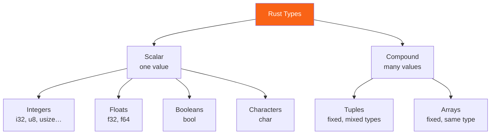

<h1><span class="h1-kicker">Rust Foundations</span>Data Types</h1>

Every value in Rust has a **type** — a label that tells the compiler what kind of data it is (a whole number? a piece of text? a list?) and what you're allowed to do with it. Because Rust checks types at compile time, whole categories of bugs (like adding a number to a word) are caught before your program ever runs. This chapter is a tour of Rust's built-in types.

> [!key] Rust is statically typed — but it reads your mind
> **Statically typed** means every value's type is known at compile time. But you rarely have to *write* types: Rust's **type inference** figures them out from context. You write `let x = 5;` and the compiler quietly notes "that's an `i32`." You only annotate when it's genuinely ambiguous.

Rust's types split into two families: **scalar** types (a single value) and **compound** types (several values grouped together).



## Integers: whole numbers

An **integer** is a number without a fractional part. Rust offers integers in several sizes, and in **signed** (can be negative, prefix `i`) or **unsigned** (zero and positive only, prefix `u`) flavors:

| Size | Signed | Unsigned |
|------|--------|----------|
| 8-bit | `i8` | `u8` |
| 16-bit | `i16` | `u16` |
| 32-bit | `i32` *(default)* | `u32` |
| 64-bit | `i64` | `u64` |
| 128-bit | `i128` | `u128` |
| pointer-sized | `isize` | `usize` |

```rust
fn main() {
    let temperature: i32 = -8;       // signed: can be negative
    let apples: u32 = 40;            // unsigned: 0 and up
    let big: u64 = 18_000_000_000;   // underscores make big numbers readable
    println!("{temperature}°, {apples} apples, {big} atoms");
}
```

> [!jargon] Signed vs. unsigned; `usize`
> **Signed** integers reserve one bit for the sign, so they represent negatives. **Unsigned** integers can't be negative but reach twice as high. The special **`usize`** type is as wide as your computer's memory addresses (64 bits on modern machines); it's the type Rust uses for indexing and sizes.

> [!tip] When in doubt, use `i32`
> `i32` is Rust's default integer type and is a great choice for general-purpose counting and math — it's fast on every platform. Only reach for a specific size when you have a reason (e.g. `u8` for a byte, `usize` for an index).

### Integer overflow

What happens if a `u8` (which maxes out at 255) is pushed to 256? This is **overflow**, and Rust treats it seriously:

> [!warning] Overflow behaves differently in debug vs. release
> In a **debug** build, an overflowing operation **panics** (crashes with an error) so you catch the bug immediately. In a **release** build, it silently *wraps around* (256 becomes 0) for speed. Don't rely on wrapping by accident! If you *want* explicit wrapping, say so with methods like `wrapping_add`, `checked_add` (returns `None` on overflow), or `saturating_add` (clamps to the max).

```rust
fn main() {
    let x: u8 = 250;
    println!("checked: {:?}", x.checked_add(10)); // None — it would overflow
    println!("saturating: {}", x.saturating_add(10)); // 255 — clamped
    println!("wrapping: {}", x.wrapping_add(10)); // 4 — wraps around
}
```

## Floating-point: numbers with decimals

For fractional numbers, Rust has `f64` (the default, double precision) and `f32` (single precision):

```rust
fn main() {
    let pi = 3.14159;        // inferred as f64
    let half: f32 = 0.5;
    let area = pi * 2.0 * 2.0;
    println!("A circle of radius 2 has area ≈ {area:.2}"); // :.2 = 2 decimals
}
```

> [!note] Floats are approximations
> Because computers store decimals in binary, `0.1 + 0.2` isn't exactly `0.3` — a quirk shared by nearly every language. Never compare floats with `==` for equality; instead check they're *close enough* (e.g. `(a - b).abs() < 1e-9`).

## Booleans and characters

A **`bool`** is either `true` or `false`. A **`char`** is a single *Unicode* character — and because it's Unicode, it can hold far more than a letter:

```rust
fn main() {
    let is_rust_fun: bool = true;
    let letter = 'R';
    let emoji = '🦀';       // a char can be any Unicode scalar value!
    let heart = '❤';
    println!("{is_rust_fun}, {letter}, {emoji}, {heart}");
}
```

> [!mistake] Single vs. double quotes matter
> `'a'` (single quotes) is a **`char`** — exactly one character. `"a"` (double quotes) is a **string** — a sequence of characters. Mixing them up is a classic early error: `let c: char = "a";` won't compile.

## Tuples: a fixed group of mixed types

A **tuple** bundles a fixed number of values, which may be of *different* types, into one compound value:

```rust
fn main() {
    let person: (&str, i32, f64) = ("Ada", 36, 1.7);

    // Destructure it into named pieces:
    let (name, age, height) = person;
    println!("{name} is {age} and {height}m tall.");

    // Or access by position with a dot:
    println!("First element: {}", person.0);
}
```

The empty tuple `()` is special — it's called the **unit type**, and it means "no meaningful value." Functions that don't return anything actually return `()`.

## Arrays: a fixed group of one type

An **array** holds a fixed number of values that must **all be the same type**. Its length is part of its type and can never change:

```rust
fn main() {
    let days = ["Mon", "Tue", "Wed", "Thu", "Fri"];
    let zeros = [0; 4]; // shorthand for [0, 0, 0, 0]

    println!("The third day is {}", days[2]); // indexing starts at 0
    println!("zeros has {} elements", zeros.len());
}
```

> [!warning] Out-of-bounds access is caught
> If you index past the end of an array (`days[99]`), Rust **panics at runtime** rather than reading random memory like C would. This *bounds checking* is a key safety feature — it turns a dangerous security bug into a clean, immediate crash.

> [!tip] Arrays are rigid on purpose — you'll usually want a `Vec`
> Arrays have a fixed size known at compile time, which makes them fast and stack-allocated. But most of the time you want a list that can grow and shrink — that's a **`Vec`** (vector), which gets its own [chapter](#/ch/vectors) soon. Use arrays for fixed-size data (like the 7 days of the week or an RGB color `[u8; 3]`).

## Summary

- Every value has a **type**, checked at compile time; **type inference** means you rarely write them out.
- **Integers** come in signed (`i8`…`i128`, `isize`) and unsigned (`u8`…`u128`, `usize`) sizes — default to **`i32`**. Overflow panics in debug, wraps in release.
- **Floats** are `f64` (default) and `f32`; treat them as approximations.
- **`bool`** is `true`/`false`; **`char`** is a single Unicode character (yes, including 🦀).
- **Tuples** group a fixed number of mixed-type values; **arrays** group a fixed number of same-type values with compile-time length and safe bounds checking.

> [!exercise] Try it yourself
> 1. Make a tuple describing a book `(title, pages, price)` and destructure it into three variables.
> 2. Create an array of five favorite numbers and print the sum of the first and last (`arr[0] + arr[4]`).
> 3. Trigger an overflow: set `let x: u8 = 255;` then `println!("{}", x.checked_add(1).is_none());` and predict the output before running.

Next, we'll package logic into reusable units: **functions**.
