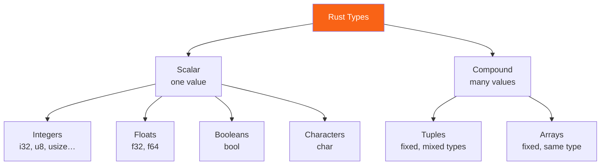

<h1><span class="h1-kicker">Rust Foundations</span>Data Types</h1>

Every value in Rust has a **type** — a label that tells the compiler what kind of data it is (a whole number? a piece of text? a list?) and what you're allowed to do with it. Because Rust checks types at compile time, whole categories of bugs (like adding a number to a word) are caught before your program ever runs. This chapter is a tour of Rust's built-in types.

> [!key] Rust is statically typed — but it reads your mind
> **Statically typed** means every value's type is known at compile time. But you rarely have to *write* types: Rust's **type inference** figures them out from context. You write `let x = 5;` and the compiler quietly notes "that's an `i32`." You only annotate when it's genuinely ambiguous.

> [!note] This chapter vs. the full type catalogue
> There are two chapters about types, and they do different jobs. **This one** teaches the built-in types you'll use from day one — how to write them, convert between them, and avoid the traps (overflow, lossy casts, `NaN`, `char` vs byte). **[Every Type in Rust, from Basic to Advanced](#/ch/type-system)** is the exhaustive *reference*: every type in the language including `str`, `Box`, `Cow`, trait objects, ZSTs and the never type, with memory layouts and a full `size_of` table. Read this chapter now; keep that one bookmarked for "how big is this?" and "what exactly is a DST?"

Rust's types split into two families: **scalar** types (a single value) and **compound** types (several values grouped together).



## Integers: whole numbers

An **integer** is a number without a fractional part. Rust offers integers in several sizes, and in **signed** (can be negative, prefix `i`) or **unsigned** (zero and positive only, prefix `u`) flavors:

| Size | Signed | Unsigned |
|------|--------|----------|
| 8-bit | `i8` | `u8` |
| 16-bit | `i16` | `u16` |
| 32-bit | `i32` *(default)* | `u32` |
| 64-bit | `i64` | `u64` |
| 128-bit | `i128` | `u128` |
| pointer-sized | `isize` | `usize` |

```rust
fn main() {
    let temperature: i32 = -8;       // signed: can be negative
    let apples: u32 = 40;            // unsigned: 0 and up
    let big: u64 = 18_000_000_000;   // underscores make big numbers readable
    println!("{temperature}°, {apples} apples, {big} atoms");
}
```

> [!jargon] Signed vs. unsigned; `usize`
> **Signed** integers reserve one bit for the sign, so they represent negatives. **Unsigned** integers can't be negative but reach twice as high. The special **`usize`** type is as wide as your computer's memory addresses (64 bits on modern machines); it's the type Rust uses for indexing and sizes.

> [!tip] When in doubt, use `i32`
> `i32` is Rust's default integer type and is a great choice for general-purpose counting and math — it's fast on every platform. Only reach for a specific size when you have a reason (e.g. `u8` for a byte, `usize` for an index).

### Writing numeric literals

Rust gives you several ways to spell a number, and a suffix to pin its type:

```rust
fn main() {
    let decimal = 98_222;        // underscores are visual separators only
    let hex = 0xff;              // 255
    let octal = 0o77;            // 63
    let binary = 0b1111_0000;    // 240
    let byte = b'A';             // 65 — a u8 byte literal (ASCII only)

    // A suffix pins the type without a separate annotation:
    let small = 5u8;
    let big = 5_000_000_000i64;
    let precise = 2.5f32;

    println!("{decimal} {hex} {octal} {binary} {byte}");
    println!("{small} {big} {precise}");

    // Every integer type carries its own limits as associated constants:
    println!("u8:  {} … {}", u8::MIN, u8::MAX);
    println!("i32: {} … {}", i32::MIN, i32::MAX);
    println!("a usize is {} bits on this machine", usize::BITS);
}
```

### Integer overflow

What happens if a `u8` (which maxes out at 255) is pushed to 256? This is **overflow**, and Rust treats it seriously:

> [!warning] Overflow behaves differently in debug vs. release
> In a **debug** build, an overflowing operation **panics** (crashes with an error) so you catch the bug immediately. In a **release** build, it silently *wraps around* (256 becomes 0) for speed. Don't rely on wrapping by accident! If you *want* explicit wrapping, say so with methods like `wrapping_add`, `checked_add` (returns `None` on overflow), or `saturating_add` (clamps to the max).

```rust
fn main() {
    let x: u8 = 250;
    println!("checked: {:?}", x.checked_add(10)); // None — it would overflow
    println!("saturating: {}", x.saturating_add(10)); // 255 — clamped
    println!("wrapping: {}", x.wrapping_add(10)); // 4 — wraps around
}
```

## Floating-point: numbers with decimals

For fractional numbers, Rust has `f64` (the default, double precision) and `f32` (single precision):

```rust
fn main() {
    let pi = 3.14159;        // inferred as f64
    let half: f32 = 0.5;
    let area = pi * 2.0 * 2.0;
    println!("A circle of radius 2 has area ≈ {area:.2}"); // :.2 = 2 decimals
}
```

> [!note] Floats are approximations
> Because computers store decimals in binary, `0.1 + 0.2` isn't exactly `0.3` — a quirk shared by nearly every language. Never compare floats with `==` for equality; instead check they're *close enough* (e.g. `(a - b).abs() < 1e-9`).

Floats also have three values that aren't ordinary numbers, and they have consequences:

```rust
fn main() {
    // The classic demonstration:
    println!("0.1 + 0.2      = {}", 0.1 + 0.2);
    println!("== 0.3?          {}", 0.1 + 0.2 == 0.3);
    println!("close enough?    {}", ((0.1 + 0.2) - 0.3_f64).abs() < 1e-10);

    // The three special values:
    let inf = f64::INFINITY;
    let neg_inf = f64::NEG_INFINITY;
    let nan = f64::NAN;
    println!("\n1.0/0.0 = {}", 1.0_f64 / 0.0);
    println!("0.0/0.0 = {}  (Not a Number)", 0.0_f64 / 0.0);

    // NaN is not equal to ANYTHING — including itself:
    println!("NaN == NaN?      {}", nan == nan);
    println!("nan.is_nan()?    {}", nan.is_nan());
    println!("inf > everything? {}", inf > f64::MAX && neg_inf < f64::MIN);
}
```

> [!key] Why floats can't be `Ord`, sorted, or used as `HashMap` keys
> `NaN == NaN` is `false`, which breaks the mathematical rule that everything equals itself (*reflexivity*). Traits encode that rule: `Eq` requires reflexive equality and `Ord` requires a *total* order, so `f64` implements only **`PartialEq`** and **`PartialOrd`** — never `Eq` or `Ord`. The practical fallout: `vec_of_floats.sort()` doesn't compile (use `sort_by(|a, b| a.partial_cmp(b).unwrap())` or `total_cmp`), and an `f64` can't be a `HashMap` key or land in a `BTreeMap`. If that bites, the usual fixes are to store a scaled integer (cents instead of dollars) or use a wrapper crate like `ordered-float`. This is the same rule you'll meet again in [Appendix C](#/ch/appendix-derivable), which is why a struct containing an `f64` can't `#[derive(Eq, Hash)]`.

## Converting between number types

Rust performs **no implicit numeric conversion at all**. Adding a `u8` to an `i32` is a compile error, not a silent promotion:

```rust,ignore
let a: u8 = 10;
let b: i32 = 20;
let sum = a + b;   // ❌ error[E0308]: expected `u8`, found `i32`
```

That strictness prevents an entire class of C bugs where a value quietly changes meaning. You convert deliberately, and there are three ways — each with a different safety story:

```rust
fn main() {
    let small: u8 = 200;

    // 1. `as` — always compiles, NEVER fails, may silently mangle the value.
    let widened = small as u32;      // 200 — safe here, but `as` won't warn you either way
    let truncated = 300_i32 as u8;   // 44!  the high bits are simply discarded
    let negative = -1_i32 as u8;     // 255! two's-complement reinterpretation
    println!("as:   {widened}, {truncated}, {negative}");

    // 2. `From`/`into` — only exists when the conversion CANNOT lose data.
    let safe: u32 = u32::from(small);   // u8 → u32 always fits
    let also: i64 = i64::from(42_i32);
    println!("from: {safe}, {also}");
    // let bad = u8::from(300_i32);     // ❌ doesn't compile — no such impl

    // 3. `TryFrom` — for conversions that MIGHT fail; returns a Result.
    let ok = u8::try_from(200_i32);
    let nope = u8::try_from(300_i32);
    println!("try:  {ok:?}");
    println!("try:  {nope:?}");   // Err(TryFromIntError)

    // Float → int with `as` truncates toward zero, and saturates at the limits:
    println!("floats: {} {} {}", 3.9_f64 as i32, -3.9_f64 as i32, 1e10_f64 as i32);
}
```

<figure class="diagram">
<svg viewBox="0 0 670 205" role="img" aria-label="Three conversion routes compared. as always compiles and may silently truncate or reinterpret. From only exists for lossless widening conversions. TryFrom returns a Result for conversions that might not fit.">
  <style>
    .cv-h { font: 700 11.5px var(--font-sans); }
    .cv-m { font: 600 10.5px var(--font-mono); fill: var(--text); }
    .cv-c { font: 10px var(--font-sans); fill: var(--text-mute); }
    .cv-as { fill: var(--red-soft); stroke: var(--red); stroke-width: 1.5; }
    .cv-fr { fill: var(--green-soft); stroke: var(--green); stroke-width: 1.5; }
    .cv-tf { fill: var(--blue-soft); stroke: var(--blue); stroke-width: 1.5; }
  </style>
  <text x="12" y="16" class="cv-h">Which conversion should I use?</text>
  <rect x="12" y="26" width="212" height="120" rx="8" class="cv-fr"/>
  <text x="24" y="46" class="cv-h" fill="var(--green)">From / .into()</text>
  <text x="24" y="66" class="cv-m">u32::from(my_u8)</text>
  <text x="24" y="86" class="cv-c">Only compiles when the target</text>
  <text x="24" y="100" class="cv-c">can hold EVERY input value.</text>
  <text x="24" y="120" class="cv-c">Cannot fail. Cannot lose data.</text>
  <text x="24" y="136" class="cv-c">✓ prefer this</text>
  <rect x="232" y="26" width="212" height="120" rx="8" class="cv-tf"/>
  <text x="244" y="46" class="cv-h" fill="var(--blue)">TryFrom / .try_into()</text>
  <text x="244" y="66" class="cv-m">u8::try_from(my_i32)?</text>
  <text x="244" y="86" class="cv-c">For narrowing, where the value</text>
  <text x="244" y="100" class="cv-c">might not fit.</text>
  <text x="244" y="120" class="cv-c">Returns Result — you decide.</text>
  <text x="244" y="136" class="cv-c">✓ when it might not fit</text>
  <rect x="452" y="26" width="206" height="120" rx="8" class="cv-as"/>
  <text x="464" y="46" class="cv-h" fill="var(--red)">as</text>
  <text x="464" y="66" class="cv-m">300i32 as u8  →  44</text>
  <text x="464" y="86" class="cv-c">Always compiles. Never errors.</text>
  <text x="464" y="100" class="cv-c">Truncates / reinterprets bits</text>
  <text x="464" y="114" class="cv-c">silently if it doesn't fit.</text>
  <text x="464" y="136" class="cv-c">⚠ only when truncation is intended</text>
  <text x="12" y="172" class="cv-c">`as` is the only one that can lose data without telling you — and it is also the only one that works for float↔int.</text>
  <text x="12" y="190" class="cv-c">Reach for it when you genuinely mean "give me the low bits" or "round this float", not as the default.</text>
</svg>
<figcaption>Prefer <code>From</code> when it can't fail, <code>TryFrom</code> when it might, and <code>as</code> only when truncation is what you actually want.</figcaption>
</figure>

> [!warning] `as` is a cast, not a conversion — it never fails and never warns
> `300_i32 as u8` gives you `44`, and the compiler says nothing. It's doing exactly what you asked: keep the low 8 bits and discard the rest. This is genuinely useful for bit manipulation and for `usize` index juggling, and it's a bug factory when used as a general-purpose "make the types match" tool. If a value *shouldn't* be out of range, use `try_from` and handle the `Err` — you'll find real bugs that way. A useful habit: whenever you write `as` between integer types, ask yourself "what should happen if this doesn't fit?" If you don't like the answer "silently mangle it," use `TryFrom`.

## Booleans and characters

A **`bool`** is either `true` or `false`. A **`char`** is a single *Unicode* character — and because it's Unicode, it can hold far more than a letter:

```rust
fn main() {
    let is_rust_fun: bool = true;
    let letter = 'R';
    let emoji = '🦀';       // a char can be any Unicode scalar value!
    let heart = '❤';
    println!("{is_rust_fun}, {letter}, {emoji}, {heart}");
}
```

> [!mistake] Single vs. double quotes matter
> `'a'` (single quotes) is a **`char`** — exactly one character. `"a"` (double quotes) is a **string** — a sequence of characters. Mixing them up is a classic early error: `let c: char = "a";` won't compile.

> [!mistake] A `char` is 4 bytes, not 1
> Coming from C, `char` suggests "one byte." In Rust a `char` is a **Unicode scalar value** and always occupies **4 bytes**, so it holds `'🦀'` as easily as `'A'`. The one-byte type is **`u8`** — that's what a `b'A'` literal produces, and what text is actually *stored* as. Hence `"héllo".len()` is 6, not 5: `len()` counts bytes and `é` needs two. [Strings & Text](#/ch/strings) covers the consequences; [the type catalogue](#/ch/type-system) has the byte-level diagrams.

`bool` and `char` also take part in conversions, with a few useful rules:

```rust
fn main() {
    // bool → integer is defined: false is 0, true is 1.
    println!("{} {}", true as u8, false as u8);

    // char → u32 always works (it IS a code point):
    println!("'A' = {}, '🦀' = {}", 'A' as u32, '🦀' as u32);

    // u8 → char always works (every byte is a valid code point):
    println!("{}", 65u8 as char);

    // u32 → char might NOT — not every number is a valid scalar value:
    println!("{:?}", char::from_u32(0x1F980));  // Some('🦀')
    println!("{:?}", char::from_u32(0xD800));   // None — surrogate, not allowed

    // Handy classification methods:
    for c in ['7', 'x', ' ', 'Ω'] {
        println!("{c:?}: digit={} alpha={} whitespace={}",
                 c.is_numeric(), c.is_alphabetic(), c.is_whitespace());
    }
}
```

## Tuples: a fixed group of mixed types

A **tuple** bundles a fixed number of values, which may be of *different* types, into one compound value:

```rust
fn main() {
    let person: (&str, i32, f64) = ("Ada", 36, 1.7);

    // Destructure it into named pieces:
    let (name, age, height) = person;
    println!("{name} is {age} and {height}m tall.");

    // Or access by position with a dot:
    println!("First element: {}", person.0);
}
```

The empty tuple `()` is special — it's called the **unit type**, and it means "no meaningful value." Functions that don't return anything actually return `()`.

> [!mistake] `(x)` is not a tuple — you need the trailing comma
> Parentheses around a single value are just grouping, so `(5)` is an `i32`, not a one-element tuple. The one-element tuple is written **`(5,)`**, with a trailing comma. The same comma is harmless on longer tuples (`(1, 2,)`), which is why rustfmt adds it in multi-line layouts.
> ```rust
> fn main() {
>     let not_a_tuple = (5);      // i32
>     let actual_tuple = (5,);    // (i32,)
>     println!("{} {}", not_a_tuple, actual_tuple.0);
> }
> ```

Tuples are best for small, obvious groupings and for returning several values at once. Once a tuple has more than about three fields, or the fields stop being self-explanatory, reach for a [struct](#/ch/structs) — `person.age` reads better than `person.1`.

## Arrays: a fixed group of one type

An **array** holds a fixed number of values that must **all be the same type**. Its length is part of its type and can never change:

```rust
fn main() {
    let days = ["Mon", "Tue", "Wed", "Thu", "Fri"];
    let zeros = [0; 4]; // shorthand for [0, 0, 0, 0]

    println!("The third day is {}", days[2]); // indexing starts at 0
    println!("zeros has {} elements", zeros.len());
}
```

> [!warning] Out-of-bounds access is caught
> If you index past the end of an array (`days[99]`), Rust **panics at runtime** rather than reading random memory like C would. This *bounds checking* is a key safety feature — it turns a dangerous security bug into a clean, immediate crash.

> [!tip] Arrays are rigid on purpose — you'll usually want a `Vec`
> Arrays have a fixed size known at compile time, which makes them fast and stack-allocated. But most of the time you want a list that can grow and shrink — that's a **`Vec`** (vector), which gets its own [chapter](#/ch/vectors) soon. Use arrays for fixed-size data (like the 7 days of the week or an RGB color `[u8; 3]`).

The length being part of the *type* has one consequence worth seeing early — `[i32; 3]` and `[i32; 4]` are genuinely different types:

```rust
fn sum_three(arr: [i32; 3]) -> i32 {
    arr.iter().sum()
}

// A slice parameter accepts ANY length — usually what you want:
fn sum_any(items: &[i32]) -> i32 {
    items.iter().sum()
}

fn main() {
    println!("{}", sum_three([1, 2, 3]));
    // println!("{}", sum_three([1, 2, 3, 4])); // ❌ expected `[i32; 3]`, found `[i32; 4]`

    println!("{}", sum_any(&[1, 2, 3]));
    println!("{}", sum_any(&[1, 2, 3, 4]));      // ✅ any length
    println!("{}", sum_any(&vec![1, 2, 3, 4, 5])); // ✅ Vec coerces to a slice too

    // Common array operations:
    let grid = [[0u8; 3]; 2];                     // a 2×3 array of arrays
    println!("{} rows × {} cols", grid.len(), grid[0].len());
    println!("contains 3? {}", [1, 2, 3].contains(&3));
}
```

> [!best] Take `&[T]`, not `[T; N]`
> A function that accepts `&[i32]` works with arrays of *every* length, with `Vec`s, and with sub-ranges (`&v[1..4]`) — all for free, because they all coerce to a slice. A function that accepts `[i32; 3]` works with exactly one. Unless you specifically need a compile-time-fixed length (see [Const Generics](#/ch/const-generics) for doing that generically), take a slice. The same reasoning as preferring `&str` over `String` in parameters — see [The Slice Type](#/ch/slices).

## Summary

- Every value has a **type**, checked at compile time; **type inference** means you rarely write them out.
- **Integers** come in signed (`i8`…`i128`, `isize`) and unsigned (`u8`…`u128`, `usize`) sizes — default to **`i32`**. Overflow panics in debug, wraps in release; say what you mean with `checked_`/`wrapping_`/`saturating_`.
- Literals can be **decimal, `0x`, `0o`, `0b`, or `b'…'`**, with `_` separators and a type suffix (`5u8`).
- **Rust never converts numbers implicitly.** Use **`From`/`into`** when it can't fail, **`TryFrom`** when it might, and **`as`** only when you actually want truncation — `300i32 as u8` is `44`, silently.
- **Floats** are `f64` (default) and `f32`; they're approximations, and `NaN != NaN` is why they're only `PartialOrd`, so they can't be `sort()`ed or used as map keys.
- **`bool`** is `true`/`false`; **`char`** is a single Unicode scalar value — **4 bytes**, not one. The byte type is `u8`.
- **Tuples** group a fixed number of mixed-type values (mind the `(x,)` comma); **arrays** group a fixed number of same-type values, with the length baked into the type — prefer **`&[T]` parameters** so any length works.
- For the exhaustive catalogue of every type, memory layouts, and `size_of` for everything, see [Every Type in Rust](#/ch/type-system).

> [!exercise] Try it yourself
> 1. Make a tuple describing a book `(title, pages, price)` and destructure it into three variables.
> 2. Create an array of five favorite numbers and print the sum of the first and last (`arr[0] + arr[4]`).
> 3. Trigger an overflow: set `let x: u8 = 255;` then `println!("{}", x.checked_add(1).is_none());` and predict the output before running.
> 4. Write the number 255 five ways — decimal, hex, octal, binary, and with a `u8` suffix — and confirm they all print the same.
> 5. Convert `300i32` to a `u8` three ways: with `as`, with `u8::try_from`, and with `u8::from`. Which compiles, which errors at runtime, and which won't compile at all?
> 6. Print `0.1 + 0.2 == 0.3`, then write a `close_enough(a, b)` helper using an epsilon and check it returns `true`.
> 7. Try to `.sort()` a `Vec<f64>`. Read the error, then fix it with `sort_by(|a, b| a.partial_cmp(b).unwrap())`.
> 8. Write `fn total(items: &[i32]) -> i32` and call it with an array, a `Vec`, and a sub-slice `&v[1..3]`. Then change the parameter to `[i32; 3]` and see which calls break.

Next, we'll package logic into reusable units: **functions**.
