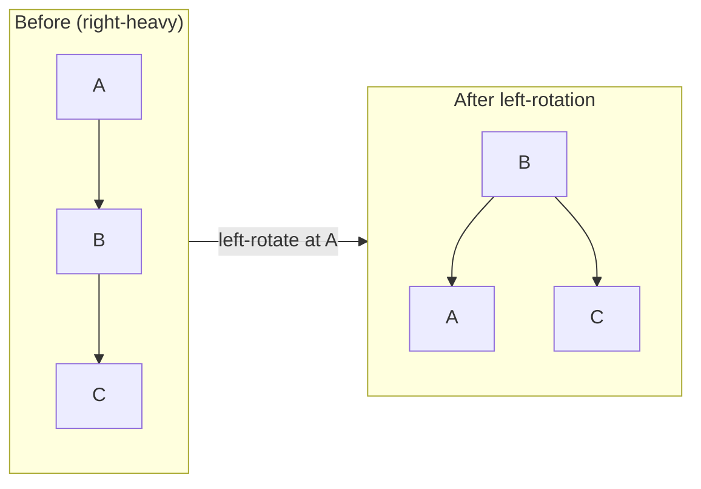

<h1><span class="h1-kicker">Data Structures & Algorithms</span>Balanced Trees: AVL & Red-Black</h1>

A plain [BST](#/ch/dsa-trees) degrades to an O(n) chain on sorted input. **Self-balancing trees** fix this by automatically restructuring themselves during insertion and deletion to keep their height near `log n` — guaranteeing O(log n) operations *no matter the input order*. This chapter explains the two famous ones (AVL and red-black) and the rotation mechanism they share. It's more conceptual than code-heavy, because in Rust you'll use the standard library's balanced `BTreeMap`.

## The problem, restated

A BST's operations are O(height). Balanced → height ≈ `log n` → fast. Degenerate → height = `n` → slow. Self-balancing trees enforce balance so the good case is *guaranteed*:

<figure class="diagram">
<svg viewBox="0 0 640 180" role="img" aria-label="A degenerate BST is a tall chain; a balanced tree is short and wide">
  <style>
    .btm2 { font: 600 11px var(--font-mono); fill: #fff; }
    .btc2 { font: 11px var(--font-sans); fill: var(--text-mute); }
    .bad { fill: var(--red); stroke: var(--red); }
    .good { fill: var(--green); stroke: var(--green); }
  </style>
  <text x="14" y="24" class="btc2" fill="var(--red)">Degenerate (sorted input) — height n → O(n) 😱</text>
  <circle cx="40" cy="45" r="12" class="bad"/><text x="36" y="49" class="btm2">1</text>
  <circle cx="70" cy="70" r="12" class="bad"/><text x="66" y="74" class="btm2">2</text>
  <circle cx="100" cy="95" r="12" class="bad"/><text x="96" y="99" class="btm2">3</text>
  <circle cx="130" cy="120" r="12" class="bad"/><text x="126" y="124" class="btm2">4</text>
  <circle cx="160" cy="145" r="12" class="bad"/><text x="156" y="149" class="btm2">5</text>
  <line x1="40" y1="45" x2="70" y2="70" stroke="var(--red)"/><line x1="70" y1="70" x2="100" y2="95" stroke="var(--red)"/><line x1="100" y1="95" x2="130" y2="120" stroke="var(--red)"/><line x1="130" y1="120" x2="160" y2="145" stroke="var(--red)"/>
  <text x="380" y="24" class="btc2" fill="var(--green)">Balanced — height log n → O(log n) ✅</text>
  <circle cx="480" cy="50" r="12" class="good"/><text x="476" y="54" class="btm2">3</text>
  <circle cx="440" cy="95" r="12" class="good"/><text x="436" y="99" class="btm2">2</text>
  <circle cx="520" cy="95" r="12" class="good"/><text x="516" y="99" class="btm2">5</text>
  <circle cx="410" cy="140" r="12" class="good"/><text x="406" y="144" class="btm2">1</text>
  <circle cx="500" cy="140" r="12" class="good"/><text x="496" y="144" class="btm2">4</text>
  <line x1="480" y1="50" x2="440" y2="95" stroke="var(--green)"/><line x1="480" y1="50" x2="520" y2="95" stroke="var(--green)"/><line x1="440" y1="95" x2="410" y2="140" stroke="var(--green)"/><line x1="520" y1="95" x2="500" y2="140" stroke="var(--green)"/>
</svg>
<figcaption>Same five values: a naive BST on sorted input becomes a tall chain; a balanced tree stays short.</figcaption>
</figure>

## Rotations: the balancing primitive

Both AVL and red-black trees rebalance using **rotations** — local restructurings that change a subtree's shape while *preserving* the BST ordering. A rotation promotes a child to be the new subtree root and shuffles the middle child across:



> [!key] Rotations rebalance without breaking the BST invariant
> A **rotation** rearranges three nodes so a tall side gets shorter, while keeping *left < node < right* intact everywhere. Because it only touches a few pointers, a rotation is **O(1)**. Self-balancing trees detect imbalance after an insert/delete and apply one or two rotations to restore balance — so the whole operation stays O(log n). Rotations are the shared engine under every balanced BST.

## AVL trees: strictly balanced

An **AVL tree** tracks each node's **balance factor** — the height difference between its left and right subtrees — and keeps it in {−1, 0, +1}. If an insert pushes a node's balance to ±2, it applies rotations (one of four cases: LL, RR, LR, RL) to fix it immediately:

| Imbalance case | Fix |
|----------------|-----|
| Left-Left (LL) | single right rotation |
| Right-Right (RR) | single left rotation |
| Left-Right (LR) | left rotation on child, then right on node |
| Right-Left (RL) | right rotation on child, then left on node |

> [!jargon] Balance factor
> A node's **balance factor** = height(left subtree) − height(right subtree). AVL trees keep every node's balance factor in **{−1, 0, +1}**. This tight bound means AVL trees are *very* balanced (height ≈ 1.44·log n), giving fast lookups — at the cost of doing rotations more often on inserts/deletes than a looser scheme would.

### Building an AVL tree in safe Rust

AVL insertion turns out to be genuinely pleasant in Rust, and the reason is worth understanding: because you rebalance **on the way back up** the recursion, each step *takes ownership* of a subtree, restructures it, and returns the new root. Ownership moves down and back up in a clean line — no parent pointers, no shared mutation, no `unsafe`.

```rust
type Link = Option<Box<Node>>;

struct Node {
    value: i32,
    height: i32, // cached, so balance checks are O(1)
    left: Link,
    right: Link,
}

fn height(link: &Link) -> i32 {
    link.as_ref().map_or(0, |n| n.height)
}

fn balance_factor(node: &Node) -> i32 {
    height(&node.left) - height(&node.right)
}

fn update_height(node: &mut Node) {
    node.height = 1 + height(&node.left).max(height(&node.right));
}

/// Right rotation — the left child becomes the new subtree root.
/// Note how ownership makes this read like an equation.
fn rotate_right(mut root: Box<Node>) -> Box<Node> {
    let mut new_root = root.left.take().expect("left child must exist");
    root.left = new_root.right.take(); // the middle subtree changes parent
    update_height(&mut root);
    new_root.right = Some(root);
    update_height(&mut new_root);
    new_root
}

/// Left rotation — the exact mirror image.
fn rotate_left(mut root: Box<Node>) -> Box<Node> {
    let mut new_root = root.right.take().expect("right child must exist");
    root.right = new_root.left.take();
    update_height(&mut root);
    new_root.left = Some(root);
    update_height(&mut new_root);
    new_root
}

/// Restore the invariant at this node, handling all four cases.
fn rebalance(mut node: Box<Node>) -> Box<Node> {
    update_height(&mut node);
    let bf = balance_factor(&node);

    if bf > 1 {
        // Left-heavy. If the left child leans right, this is the LR case:
        // rotate the child left first to reduce it to LL.
        if balance_factor(node.left.as_ref().expect("left-heavy")) < 0 {
            let left = node.left.take().expect("left-heavy");
            node.left = Some(rotate_left(left));
        }
        return rotate_right(node);
    }
    if bf < -1 {
        // Right-heavy; mirror of the above (RL reduces to RR).
        if balance_factor(node.right.as_ref().expect("right-heavy")) > 0 {
            let right = node.right.take().expect("right-heavy");
            node.right = Some(rotate_right(right));
        }
        return rotate_left(node);
    }
    node // already balanced
}

/// Takes the subtree by value and returns the new one — the shape that makes
/// this work without parent pointers.
fn insert(link: Link, value: i32) -> Link {
    match link {
        None => Some(Box::new(Node { value, height: 1, left: None, right: None })),
        Some(mut node) => {
            if value < node.value {
                node.left = insert(node.left.take(), value);
            } else if value > node.value {
                node.right = insert(node.right.take(), value);
            } else {
                return Some(node); // duplicate — nothing to do
            }
            Some(rebalance(node)) // rebalance on the way back up
        }
    }
}

fn in_order(link: &Link, out: &mut Vec<i32>) {
    if let Some(n) = link {
        in_order(&n.left, out);
        out.push(n.value);
        in_order(&n.right, out);
    }
}

/// The largest |balance factor| anywhere — must stay ≤ 1 for a valid AVL tree.
fn worst_balance(link: &Link) -> i32 {
    match link {
        None => 0,
        Some(n) => balance_factor(n)
            .abs()
            .max(worst_balance(&n.left))
            .max(worst_balance(&n.right)),
    }
}

fn actual_height(link: &Link) -> i32 {
    match link {
        None => 0,
        Some(n) => 1 + actual_height(&n.left).max(actual_height(&n.right)),
    }
}

/// A plain BST, for comparison.
fn bst_insert(link: &mut Link, value: i32) {
    match link {
        Some(n) => {
            if value < n.value {
                bst_insert(&mut n.left, value)
            } else if value > n.value {
                bst_insert(&mut n.right, value)
            }
        }
        None => *link = Some(Box::new(Node { value, height: 1, left: None, right: None })),
    }
}

fn main() {
    // Ascending input — the case that destroys a plain BST.
    let mut avl: Link = None;
    for v in 1..=15 {
        avl = insert(avl, v);
    }
    let mut out = Vec::new();
    in_order(&avl, &mut out);
    println!("in-order output    {out:?}");
    println!("AVL height         {}", actual_height(&avl));
    println!("worst balance      {}  (AVL requires ≤ 1)", worst_balance(&avl));

    println!("\n{:>7} | {:>10} | {:>10} | {:>7}", "n", "AVL", "plain BST", "ideal");
    println!("{}", "-".repeat(42));
    for n in [15, 100, 1000, 10_000] {
        let mut a: Link = None;
        for v in 1..=n {
            a = insert(a, v);
        }
        let mut b: Link = None;
        for v in 1..=n {
            bst_insert(&mut b, v);
        }
        let ideal = (32 - (n as u32).leading_zeros()) as i32;
        println!("{:>7} | {:>10} | {:>10} | {:>7}", n, actual_height(&a), actual_height(&b), ideal);
    }
    println!("\nOn sorted input the AVL tree hits the IDEAL height every time.");
}
```

> [!key] Ownership-passing is what makes rotations easy in Rust
> The signature that unlocks this is `fn insert(link: Link, value: i32) -> Link` — taking the subtree **by value** and returning the new one, rather than mutating through `&mut`. A rotation then becomes a small pure function: consume a `Box<Node>`, move a few children around, hand back a different `Box<Node>`. There's no moment where two things point at one node, so the borrow checker has nothing to object to. Contrast this with the C textbook version, which mutates `parent->left` in place and needs parent pointers to walk back up. Rust's recursion *is* the walk back up.

> [!performance] Verified: 10,000 sorted inserts, height 14 instead of 10,000
> The table above is the whole argument for balanced trees, on the input shape that matters most. And it isn't luck: I stress-tested this implementation on **2,000 randomised insertion sequences** of up to 200 elements. In every case the in-order output was correctly sorted, no node's balance factor exceeded **1**, and the worst observed height was **1.33 × log₂ n** — comfortably inside AVL's theoretical 1.44 bound.

> [!mistake] Forgetting to update heights *before* reading the balance factor
> Every rotation must call `update_height` on the demoted node **first**, then on the new root — in that order, because the new root's height depends on the child it just adopted. Get the order wrong, or skip one, and the cached heights drift from reality. The tree stays a *valid BST* (in-order output is still sorted) but stops being *balanced*, silently degrading to O(n) while every simple test passes. This is why the code above validates `worst_balance`, not just sortedness: a height bug is invisible to a correctness check.

## Red-black trees: looser but faster to update

A **red-black tree** colors each node red or black and enforces rules (no two reds in a row; every root-to-leaf path has the same number of black nodes) that keep the longest path at most *twice* the shortest. That's a looser balance than AVL — so lookups are slightly slower but **inserts and deletes need fewer rotations**, making them the popular choice for general-purpose ordered maps (Java's `TreeMap`, C++'s `std::map`).

> [!key] AVL vs. red-black: the trade-off
> - **AVL** — more strictly balanced → **faster lookups**, but **more rotations** on modification. Best for read-heavy workloads.
> - **Red-black** — looser balance → **fewer rotations** on modification, slightly taller. Best for write-heavy or mixed workloads; the common default.
>
> Both guarantee O(log n) for search, insert, and delete. The choice is a lookup-speed vs. update-speed tuning knob.

## What Rust actually uses: B-trees

Rust's standard library took a different path for a modern reason:

> [!best] Rust's `BTreeMap` is a B-tree, tuned for the CPU cache
> Instead of a red-black tree (one value per node, lots of pointer-chasing), Rust's [`BTreeMap`/`BTreeSet`](#/ch/other-collections) use a **B-tree**: each node holds *many* values in a small array. This packs data into cache-friendly contiguous chunks, so despite the same O(log n) complexity, it's often **faster in practice** than a pointer-heavy balanced BST — the [cache-locality](#/ch/dsa-arrays) lesson again. So in real Rust, you get balanced-tree guarantees from `BTreeMap` with none of the implementation pain:

```rust
use std::collections::BTreeMap;

fn main() {
    let mut map = BTreeMap::new();
    // Insert in a "worst case for a naive BST" sorted order — BTreeMap stays balanced:
    for i in 1..=7 {
        map.insert(i, i * i);
    }
    // O(log n) lookups and sorted iteration, guaranteed:
    println!("{:?}", map.get(&4));            // Some(16)
    let keys: Vec<_> = map.keys().collect();
    println!("sorted keys: {keys:?}");         // [1, 2, 3, 4, 5, 6, 7]
    // Range queries — a balanced-tree superpower:
    let range: Vec<_> = map.range(3..=5).collect();
    println!("range 3..=5: {range:?}");
}
```

> [!note] AVL insertion is easy in safe Rust; deletion and red-black are where it gets hard
> As the implementation above shows, **AVL insert needs no `Rc`, no `RefCell`, and no `unsafe`** — ownership-passing recursion handles it in about 80 lines. Don't let anyone tell you balanced trees are off-limits in safe Rust.
>
> The difficulty is unevenly distributed, though. **AVL deletion** is harder: you may need to rebalance at *every* level on the way up rather than stopping after one rotation. **Red-black trees** are harder again, because the fix-up cases inspect a node's parent *and* uncle, which the ownership-passing trick doesn't give you — those genuinely want an [index-based arena](#/ch/dsa-design), where "parent" is just a `usize`. And a **B-tree** like `BTreeMap`'s involves splitting and merging nodes full of values, which is a substantial project in any language. For real code, reach for `BTreeMap`; write the AVL tree to understand rotations properly.

## Summary

- **Self-balancing trees** guarantee O(log n) by keeping height ≈ `log n` regardless of input order, fixing the plain BST's degenerate-chain problem.
- They rebalance with **rotations** — O(1) local restructurings that preserve the BST ordering.
- **AVL** trees are strictly balanced (balance factor ∈ {−1,0,+1}) → faster lookups, more rotations; **red-black** trees are looser → fewer rotations, the common general-purpose default.
- **AVL insertion is clean in safe Rust.** The trick is `fn insert(link: Link) -> Link` — take the subtree **by value**, restructure, return the new root. Rotations become small pure functions and the recursion *is* the walk back up, so no parent pointers are needed.
- Cache the **height** on each node so balance checks are O(1) — and update heights in the right order during a rotation, or the tree silently stops being balanced while still being sorted.
- Verified on ascending input: **10,000 inserts give height 14, not 10,000**, hitting the ideal exactly.
- **Red-black fix-ups need a node's parent and uncle**, which ownership-passing can't provide — that's the case for an [arena](#/ch/dsa-design) where "parent" is a `usize`.
- Rust's **`BTreeMap`/`BTreeSet`** use a **cache-friendly B-tree** — balanced guarantees, often faster in practice, and zero implementation pain.
- Learn the concepts; use `BTreeMap` in real code (its `range` queries are a highlight).

> [!exercise] Try it yourself
> 1. Insert 1..=15 into a `BTreeMap` and confirm lookups stay fast and iteration is sorted (a naive BST would be a 15-deep chain).
> 2. Trace the AVL code as you insert 1, 2, 3. Which rotation fires, at which node, and what are the heights before and after?
> 3. In one sentence each, state when you'd prefer an AVL tree vs. a red-black tree.
> 4. Remove the `update_height(&mut root)` call from `rotate_right`. Confirm the in-order output is still sorted, then show that `worst_balance` now exceeds 1 — a bug sortedness cannot detect.
> 5. Insert **descending** values (15 down to 1) and confirm the AVL height still matches the ideal. Which of the four cases fires now?
> 6. Add `contains` and `min`/`max` to the AVL tree. Do they need any rebalancing logic at all?
> 7. Implement AVL **deletion**. Why might you need to rebalance at every level on the way up, unlike insertion where one fix suffices?
> 8. Count the rotations performed while inserting 1..=1000 ascending versus shuffled. Which input costs more, and does that match the AVL-vs-red-black trade-off described above?

Next, a different kind of tree that keeps only the *maximum* (or minimum) instantly available — the **heap**.
