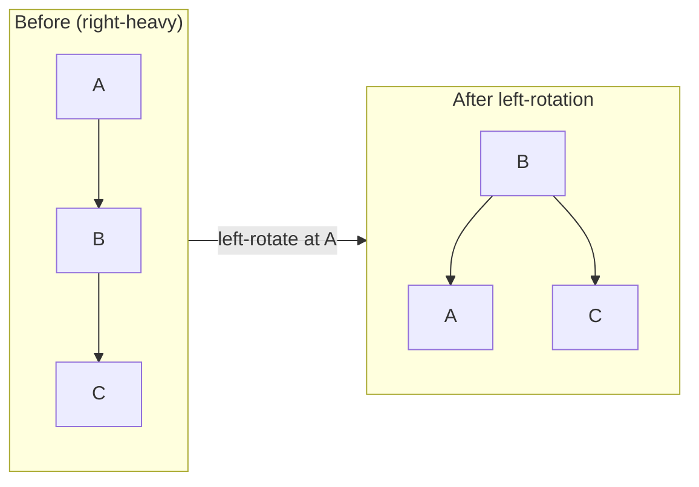

<h1><span class="h1-kicker">Data Structures & Algorithms</span>Balanced Trees: AVL & Red-Black</h1>

A plain [BST](#/ch/dsa-trees) degrades to an O(n) chain on sorted input. **Self-balancing trees** fix this by automatically restructuring themselves during insertion and deletion to keep their height near `log n` — guaranteeing O(log n) operations *no matter the input order*. This chapter explains the two famous ones (AVL and red-black) and the rotation mechanism they share. It's more conceptual than code-heavy, because in Rust you'll use the standard library's balanced `BTreeMap`.

## The problem, restated

A BST's operations are O(height). Balanced → height ≈ `log n` → fast. Degenerate → height = `n` → slow. Self-balancing trees enforce balance so the good case is *guaranteed*:

<figure class="diagram">
<svg viewBox="0 0 640 180" role="img" aria-label="A degenerate BST is a tall chain; a balanced tree is short and wide">
  <style>
    .btm2 { font: 600 11px var(--font-mono); fill: #fff; }
    .btc2 { font: 11px var(--font-sans); fill: var(--text-mute); }
    .bad { fill: var(--red); stroke: var(--red); }
    .good { fill: var(--green); stroke: var(--green); }
  </style>
  <text x="14" y="24" class="btc2" fill="var(--red)">Degenerate (sorted input) — height n → O(n) 😱</text>
  <circle cx="40" cy="45" r="12" class="bad"/><text x="36" y="49" class="btm2">1</text>
  <circle cx="70" cy="70" r="12" class="bad"/><text x="66" y="74" class="btm2">2</text>
  <circle cx="100" cy="95" r="12" class="bad"/><text x="96" y="99" class="btm2">3</text>
  <circle cx="130" cy="120" r="12" class="bad"/><text x="126" y="124" class="btm2">4</text>
  <circle cx="160" cy="145" r="12" class="bad"/><text x="156" y="149" class="btm2">5</text>
  <line x1="40" y1="45" x2="70" y2="70" stroke="var(--red)"/><line x1="70" y1="70" x2="100" y2="95" stroke="var(--red)"/><line x1="100" y1="95" x2="130" y2="120" stroke="var(--red)"/><line x1="130" y1="120" x2="160" y2="145" stroke="var(--red)"/>
  <text x="380" y="24" class="btc2" fill="var(--green)">Balanced — height log n → O(log n) ✅</text>
  <circle cx="480" cy="50" r="12" class="good"/><text x="476" y="54" class="btm2">3</text>
  <circle cx="440" cy="95" r="12" class="good"/><text x="436" y="99" class="btm2">2</text>
  <circle cx="520" cy="95" r="12" class="good"/><text x="516" y="99" class="btm2">5</text>
  <circle cx="410" cy="140" r="12" class="good"/><text x="406" y="144" class="btm2">1</text>
  <circle cx="500" cy="140" r="12" class="good"/><text x="496" y="144" class="btm2">4</text>
  <line x1="480" y1="50" x2="440" y2="95" stroke="var(--green)"/><line x1="480" y1="50" x2="520" y2="95" stroke="var(--green)"/><line x1="440" y1="95" x2="410" y2="140" stroke="var(--green)"/><line x1="520" y1="95" x2="500" y2="140" stroke="var(--green)"/>
</svg>
<figcaption>Same five values: a naive BST on sorted input becomes a tall chain; a balanced tree stays short.</figcaption>
</figure>

## Rotations: the balancing primitive

Both AVL and red-black trees rebalance using **rotations** — local restructurings that change a subtree's shape while *preserving* the BST ordering. A rotation promotes a child to be the new subtree root and shuffles the middle child across:



> [!key] Rotations rebalance without breaking the BST invariant
> A **rotation** rearranges three nodes so a tall side gets shorter, while keeping *left < node < right* intact everywhere. Because it only touches a few pointers, a rotation is **O(1)**. Self-balancing trees detect imbalance after an insert/delete and apply one or two rotations to restore balance — so the whole operation stays O(log n). Rotations are the shared engine under every balanced BST.

## AVL trees: strictly balanced

An **AVL tree** tracks each node's **balance factor** — the height difference between its left and right subtrees — and keeps it in {−1, 0, +1}. If an insert pushes a node's balance to ±2, it applies rotations (one of four cases: LL, RR, LR, RL) to fix it immediately:

| Imbalance case | Fix |
|----------------|-----|
| Left-Left (LL) | single right rotation |
| Right-Right (RR) | single left rotation |
| Left-Right (LR) | left rotation on child, then right on node |
| Right-Left (RL) | right rotation on child, then left on node |

> [!jargon] Balance factor
> A node's **balance factor** = height(left subtree) − height(right subtree). AVL trees keep every node's balance factor in **{−1, 0, +1}**. This tight bound means AVL trees are *very* balanced (height ≈ 1.44·log n), giving fast lookups — at the cost of doing rotations more often on inserts/deletes than a looser scheme would.

## Red-black trees: looser but faster to update

A **red-black tree** colors each node red or black and enforces rules (no two reds in a row; every root-to-leaf path has the same number of black nodes) that keep the longest path at most *twice* the shortest. That's a looser balance than AVL — so lookups are slightly slower but **inserts and deletes need fewer rotations**, making them the popular choice for general-purpose ordered maps (Java's `TreeMap`, C++'s `std::map`).

> [!key] AVL vs. red-black: the trade-off
> - **AVL** — more strictly balanced → **faster lookups**, but **more rotations** on modification. Best for read-heavy workloads.
> - **Red-black** — looser balance → **fewer rotations** on modification, slightly taller. Best for write-heavy or mixed workloads; the common default.
>
> Both guarantee O(log n) for search, insert, and delete. The choice is a lookup-speed vs. update-speed tuning knob.

## What Rust actually uses: B-trees

Rust's standard library took a different path for a modern reason:

> [!best] Rust's `BTreeMap` is a B-tree, tuned for the CPU cache
> Instead of a red-black tree (one value per node, lots of pointer-chasing), Rust's [`BTreeMap`/`BTreeSet`](#/ch/other-collections) use a **B-tree**: each node holds *many* values in a small array. This packs data into cache-friendly contiguous chunks, so despite the same O(log n) complexity, it's often **faster in practice** than a pointer-heavy balanced BST — the [cache-locality](#/ch/dsa-arrays) lesson again. So in real Rust, you get balanced-tree guarantees from `BTreeMap` with none of the implementation pain:

```rust
use std::collections::BTreeMap;

fn main() {
    let mut map = BTreeMap::new();
    // Insert in a "worst case for a naive BST" sorted order — BTreeMap stays balanced:
    for i in 1..=7 {
        map.insert(i, i * i);
    }
    // O(log n) lookups and sorted iteration, guaranteed:
    println!("{:?}", map.get(&4));            // Some(16)
    let keys: Vec<_> = map.keys().collect();
    println!("sorted keys: {keys:?}");         // [1, 2, 3, 4, 5, 6, 7]
    // Range queries — a balanced-tree superpower:
    let range: Vec<_> = map.range(3..=5).collect();
    println!("range 3..=5: {range:?}");
}
```

> [!note] Implementing a full AVL/red-black tree in Rust is a serious exercise
> Because balanced trees involve parent pointers and in-place rewiring, a *from-scratch* implementation in safe Rust wrestles hard with the borrow checker (often needing `Rc<RefCell>` or index-based "arena" allocation, or `unsafe`). It's a great advanced learning project — but for real code, `BTreeMap` gives you all the benefits with none of the fight. Understand the *concepts* here (invariant, rotations, the AVL/red-black trade-off); reach for `BTreeMap` in practice.

## Summary

- **Self-balancing trees** guarantee O(log n) by keeping height ≈ `log n` regardless of input order, fixing the plain BST's degenerate-chain problem.
- They rebalance with **rotations** — O(1) local restructurings that preserve the BST ordering.
- **AVL** trees are strictly balanced (balance factor ∈ {−1,0,+1}) → faster lookups, more rotations; **red-black** trees are looser → fewer rotations, the common general-purpose default.
- Rust's **`BTreeMap`/`BTreeSet`** use a **cache-friendly B-tree** — balanced guarantees, often faster in practice, and zero implementation pain.
- Learn the concepts; use `BTreeMap` in real code (its `range` queries are a highlight).

> [!exercise] Try it yourself
> 1. Insert 1..=15 into a `BTreeMap` and confirm lookups stay fast and iteration is sorted (a naive BST would be a 15-deep chain).
> 2. Sketch, on paper, a left rotation on a 3-node right-heavy subtree and verify the BST invariant still holds.
> 3. In one sentence each, state when you'd prefer an AVL tree vs. a red-black tree.

Next, a different kind of tree that keeps only the *maximum* (or minimum) instantly available — the **heap**.
