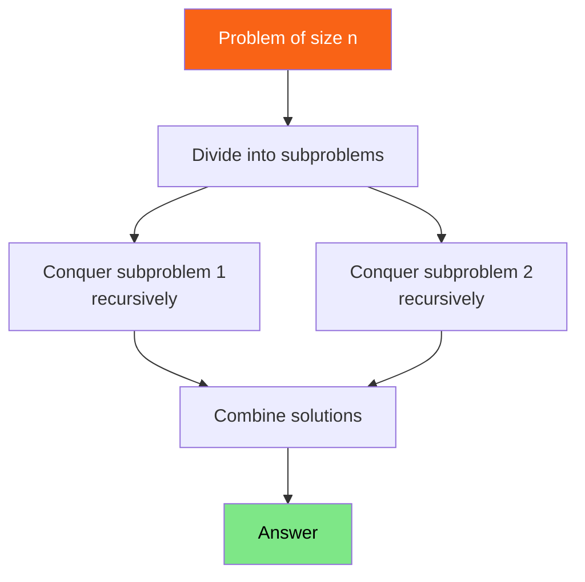

<h1><span class="h1-kicker">Data Structures & Algorithms</span>Divide & Conquer</h1>

**Divide and conquer** is a problem-solving strategy with three steps: **divide** the problem into smaller subproblems, **conquer** each by solving it recursively, and **combine** the sub-solutions into the answer. You've already seen it in [merge sort](#/ch/dsa-sorting) and [binary search](#/ch/dsa-searching). This chapter names the pattern, shows more examples, and gives you the tool to analyze its cost: the Master Theorem.

## The three steps



> [!key] Divide and conquer vs. plain recursion
> All divide-and-conquer *is* recursion, but with a signature shape: the problem splits into **multiple independent subproblems of the same kind** (usually halves), which are combined. Merge sort splits into two halves, sorts each, and merges. Plain recursion (like factorial) reduces to *one* smaller subproblem. The "multiple subproblems + combine" structure is what makes divide-and-conquer powerful — and what often yields that magic O(n log n).

## Example: fast exponentiation

Computing `base^exp` naively takes O(exp) multiplications. Divide and conquer does it in **O(log exp)**: to compute `x^n`, compute `x^(n/2)` once and square it:

```rust
// x^n in O(log n) multiplications by halving the exponent.
fn power(base: i64, exp: u32) -> i64 {
    if exp == 0 {
        return 1; // base case: x^0 = 1
    }
    let half = power(base, exp / 2); // conquer ONE subproblem, reuse it
    let squared = half * half;        // combine
    if exp % 2 == 0 {
        squared            // even: x^n = (x^(n/2))²
    } else {
        squared * base     // odd:  x^n = (x^(n/2))² × x
    }
}

fn main() {
    println!("{}", power(2, 10)); // 1024
    println!("{}", power(3, 5));   // 243
    // power(2, 1000) would take ~10 multiplications, not 1000!
}
```

## Example: quickselect (find the k-th smallest)

Need the k-th smallest element but *not* a full sort? **Quickselect** uses quicksort's partition step but only recurses into the *one* half containing the answer — averaging O(n) instead of sorting's O(n log n):

```rust
// Find the k-th smallest element (0-indexed) in O(n) average time.
fn quickselect(arr: &mut [i32], k: usize) -> i32 {
    let pivot_index = partition(arr);
    if k == pivot_index {
        arr[k]                              // found it
    } else if k < pivot_index {
        quickselect(&mut arr[..pivot_index], k)             // recurse LEFT only
    } else {
        let right = &mut arr[pivot_index + 1..];
        quickselect(right, k - pivot_index - 1)             // recurse RIGHT only
    }
}

fn partition(arr: &mut [i32]) -> usize {
    let pivot = arr.len() - 1;
    let mut i = 0;
    for j in 0..pivot {
        if arr[j] <= arr[pivot] {
            arr.swap(i, j);
            i += 1;
        }
    }
    arr.swap(i, pivot);
    i
}

fn main() {
    let mut data = [7, 2, 9, 1, 5, 3];
    let median_idx = data.len() / 2;
    println!("k-th smallest: {}", quickselect(&mut data, median_idx));
}
```

Recursing into only *one* half (not both, like merge sort) is what makes quickselect O(n) instead of O(n log n) — a beautiful illustration of how the "combine" step's cost shapes the whole.

## Example: counting inversions

Some problems have no obvious "divide" step until you notice that the *merge* can do extra work for free. **Counting inversions** — pairs that are out of order, a measure of how unsorted a list is — looks inherently quadratic, but merge sort's combine step can count them at no extra asymptotic cost:

```rust
/// Sort and count inversions (pairs i < j where a[i] > a[j]) in O(n log n).
fn count_inversions(a: &[i32]) -> (Vec<i32>, u64) {
    if a.len() <= 1 {
        return (a.to_vec(), 0);
    }
    let mid = a.len() / 2;
    let (left, left_inversions) = count_inversions(&a[..mid]);
    let (right, right_inversions) = count_inversions(&a[mid..]);

    let mut merged = Vec::with_capacity(a.len());
    let (mut i, mut j) = (0, 0);
    let mut crossing = 0u64;

    while i < left.len() && j < right.len() {
        if left[i] <= right[j] {
            merged.push(left[i]);
            i += 1;
        } else {
            // left[i..] are ALL greater than right[j], because left is sorted —
            // so this one comparison reveals that many inversions at once.
            crossing += (left.len() - i) as u64;
            merged.push(right[j]);
            j += 1;
        }
    }
    merged.extend_from_slice(&left[i..]);
    merged.extend_from_slice(&right[j..]);

    (merged, left_inversions + right_inversions + crossing)
}

/// The obvious O(n²) version, to check against.
fn brute_force(a: &[i32]) -> u64 {
    let mut count = 0;
    for i in 0..a.len() {
        for j in i + 1..a.len() {
            if a[i] > a[j] {
                count += 1;
            }
        }
    }
    count
}

fn main() {
    for input in [vec![1, 2, 3, 4], vec![4, 3, 2, 1], vec![2, 4, 1, 3, 5], vec![5, 5, 5], vec![]] {
        let (sorted, fast) = count_inversions(&input);
        let slow = brute_force(&input);
        // Format to a String first — `{:<16?}` on a Vec pads each ELEMENT.
        println!("{:<18} → {:<18} inversions {fast}  (brute {slow}) {}",
            format!("{input:?}"),
            format!("{sorted:?}"),
            if fast == slow { "✓" } else { "✗" });
    }
    println!("\nA sorted list has 0; a reversed list of n has n(n-1)/2 — the maximum.");
}
```

> [!key] Why one comparison can count many inversions
> The line that makes this O(n log n) rather than O(n²) is `crossing += left.len() - i`. When `right[j]` is smaller than `left[i]`, it must also be smaller than **every remaining element of `left`** — because `left` is already sorted. So a single comparison accounts for a whole batch of inversions at once, and the total work stays proportional to the merge.
>
> This is the general lesson for divide and conquer: the interesting content usually lives in the **combine** step. Splitting is mechanical; what you can compute *while* merging is where new algorithms come from. Closest-pair-of-points and Karatsuba below both work the same way.

## Example: Karatsuba multiplication

Schoolbook multiplication of two `n`-digit numbers takes `n²` digit products. In 1960 Karatsuba found that **three** half-size multiplications suffice where you'd expect four — and that one saved multiplication changes the exponent:

```rust
/// Karatsuba multiplication, counting the recursive base multiplications.
fn karatsuba(x: u64, y: u64, mults: &mut u64) -> u64 {
    if x < 10 || y < 10 {
        *mults += 1;
        return x * y; // base case: a single digit product
    }

    let digits = x.max(y).ilog10() + 1;
    let half = digits / 2;
    let p = 10u64.pow(half);
    let (x1, x0) = (x / p, x % p); // high and low halves
    let (y1, y0) = (y / p, y % p);

    let z0 = karatsuba(x0, y0, mults); // low × low
    let z2 = karatsuba(x1, y1, mults); // high × high
    // The trick: (x1+x0)(y1+y0) expands to z2 + middle + z0,
    // so the middle term costs ONE multiplication instead of two.
    let z1 = karatsuba(x1 + x0, y1 + y0, mults) - z2 - z0;

    z2 * p * p + z1 * p + z0
}

/// Digit products the schoolbook method would need.
fn schoolbook_mults(x: u64, y: u64) -> u64 {
    let dx = if x < 10 { 1 } else { x.ilog10() + 1 };
    let dy = if y < 10 { 1 } else { y.ilog10() + 1 };
    (dx * dy) as u64
}

fn main() {
    println!("{:>12} {:>12} {:>20} {:>10} {:>11}", "x", "y", "product", "karatsuba", "schoolbook");
    println!("{}", "-".repeat(70));
    for (x, y) in [(12u64, 34u64), (1234, 5678), (12345678, 87654321)] {
        let mut mults = 0;
        let product = karatsuba(x, y, &mut mults);
        assert_eq!(product, x * y);
        println!("{x:>12} {y:>12} {product:>20} {mults:>10} {:>11}", schoolbook_mults(x, y));
    }
    println!("\nT(n) = 3T(n/2) + O(n)  →  O(n^log2(3)) = O(n^1.585), beating O(n^2).");
    println!("Three subproblems instead of four is the entire difference.");
}
```

> [!performance] 33 multiplications instead of 64
> For two eight-digit numbers, Karatsuba does **33** base multiplications where the schoolbook method does **64**. Feed the recurrence to the Master Theorem: `a = 3`, `b = 2`, `f(n) = O(n)`, so `n^(log₂ 3) = n^1.585` grows faster than `f(n)` — case 1, leaves dominate, **O(n^1.585)**.
>
> Two honest caveats. This simple version splits by digit count, so **uneven splits** (a nine-digit number) waste some of the advantage — production implementations pad to a convenient size. And the constant factor is worse: three multiplications plus several additions and subtractions beats four multiplications only once `n` is large enough. That's why real bignum libraries use schoolbook below a threshold (often ~30–60 digits) and switch to Karatsuba above it — and to even faster FFT-based methods for very large inputs.

## Analyzing cost: the Master Theorem

How do we find the Big-O of a divide-and-conquer algorithm? Its running time follows a **recurrence** like `T(n) = a·T(n/b) + f(n)`, where you split into `a` subproblems of size `n/b` and spend `f(n)` work dividing/combining. The **Master Theorem** reads off the answer:

<figure class="diagram">
<svg viewBox="0 0 640 175" role="img" aria-label="The Master Theorem relates the number and size of subproblems to the overall complexity">
  <style>
    .mtm { font: 600 12px var(--font-mono); fill: var(--text); }
    .mtc { font: 11px var(--font-sans); fill: var(--text-mute); }
    .mth { font: 700 12px var(--font-sans); }
    .fbox { fill: var(--surface-2); stroke: var(--border-strong); stroke-width: 1.2; }
  </style>
  <rect x="120" y="14" width="400" height="30" class="fbox"/>
  <text x="180" y="34" class="mtm">T(n) = a·T(n/b) + f(n)</text>
  <text x="20" y="72" class="mtc">a = # subproblems · b = shrink factor · f(n) = divide+combine work</text>
  <rect x="20" y="86" width="600" height="24" class="fbox"/><text x="30" y="103" class="mtm">Merge sort: 2·T(n/2) + O(n)  →  O(n log n)</text>
  <rect x="20" y="114" width="600" height="24" class="fbox"/><text x="30" y="131" class="mtm">Binary search: 1·T(n/2) + O(1)  →  O(log n)</text>
  <rect x="20" y="142" width="600" height="24" class="fbox"/><text x="30" y="159" class="mtm">Fast power: 1·T(n/2) + O(1)  →  O(log n)</text>
</svg>
<figcaption>The Master Theorem turns a divide-and-conquer recurrence into a Big-O by comparing the subproblem work to the combine work.</figcaption>
</figure>

> [!tip] The intuition without the formula
> You don't need to memorize the Master Theorem's cases. Just reason about the **recursion tree**: how many levels deep (usually `log n`, since you halve), and how much total work per level. Merge sort does O(n) work at *every* level across `log n` levels → **O(n log n)**. Binary search does O(1) work at each of `log n` levels → **O(log n)**. Count "work per level × number of levels" and you'll get the answer for most divide-and-conquer algorithms.

Making that concrete for merge sort on 8 elements — the work per level is what drives the result:

| Level | Subproblems | Size each | Work per subproblem | Work at this level |
|---|---|---|---|---|
| 0 | 1 | 8 | merge 8 | 8 |
| 1 | 2 | 4 | merge 4 | 8 |
| 2 | 4 | 2 | merge 2 | 8 |
| 3 | 8 | 1 | base case | 8 |
| | | | | **8 × 4 levels = 32** |

The rightmost column is constant, and there are `log₂ 8 + 1 = 4` levels — hence `n log n`. Change the per-level work and the answer changes with it: binary search does O(1) per level (only one subproblem survives), giving O(log n); quickselect does O(n) at the top but the levels *shrink geometrically*, summing to O(n) rather than O(n log n).

### The three cases, for reference

When you do want the formula, `T(n) = a·T(n/b) + f(n)` has three outcomes, decided by comparing `f(n)` against `n^(log_b a)` — the total work in the leaves:

| Case | Condition | Result | Dominated by | Example |
|---|---|---|---|---|
| 1 | `f(n)` grows **slower** | `O(n^(log_b a))` | the **leaves** | binary tree traversal: `2T(n/2) + O(1)` → O(n) |
| 2 | `f(n)` grows **the same** | `O(n^(log_b a) · log n)` | **every level equally** | merge sort: `2T(n/2) + O(n)` → O(n log n) |
| 3 | `f(n)` grows **faster** | `O(f(n))` | the **root** | `2T(n/2) + O(n²)` → O(n²) |

> [!key] The whole theorem is "who does the most work: the top, the bottom, or everyone equally?"
> That's genuinely all it says. Split into `a` subproblems of size `n/b` and the leaf count is `n^(log_b a)`. Compare that against the combine work `f(n)`:
> - Leaves win → the recursion's *branching* dominates (case 1).
> - Tie → every level costs the same, so multiply by the number of levels, `log n` (case 2).
> - Root wins → the top-level combine dominates and the recursion is almost free (case 3).
>
> Merge sort is the tie case, which is why that `log n` factor appears. Quickselect avoids it by recursing into only *one* half — the levels then shrink geometrically instead of staying constant, and `n + n/2 + n/4 + … = 2n`. That single difference between "recurse into both halves" and "recurse into one" is worth more than the theorem itself.

## When divide and conquer shines

> [!best] Recognize the divide-and-conquer opportunity
> Reach for divide and conquer when a problem **splits naturally into independent, same-shaped subproblems**: sorting (merge/quick sort), searching sorted data (binary search), the closest-pair-of-points problem, large-number multiplication (Karatsuba), matrix multiplication (Strassen), and many geometry problems. The tell-tale sign: "if I could solve this for the two halves, combining would be easy." Bonus: independent subproblems are trivially **parallelizable** — this is exactly what [Rayon's `join`](#/ch/rayon) exploits.

## Summary

- **Divide and conquer** = **divide** into subproblems, **conquer** (solve recursively), **combine** — a structured recursion with *multiple* same-shaped subproblems.
- Examples: **merge/quick sort** (O(n log n)), **binary search** & **fast power** (O(log n)), **quickselect** (O(n) average — recurses into only *one* half).
- Analyze cost via the recurrence `T(n) = a·T(n/b) + f(n)` — or intuitively, **work per level × number of levels**.
- The Master Theorem just asks **who does the most work: the leaves, the root, or every level equally?** Merge sort is the tie case, which is where its `log n` comes from.
- **Recursing into one half instead of both** turns constant per-level work into a geometric series — that's why quickselect is O(n) and merge sort O(n log n).
- The interesting content usually lives in the **combine** step: counting inversions rides along with merge sort at no extra cost, because one comparison against a sorted half reveals a whole batch at once.
- **Karatsuba** does three half-size multiplications instead of four — **33 vs 64** digit products for eight digits — giving O(n^1.585). Its constant factor is worse, so real libraries switch over only above a threshold.
- It shines when problems split into independent subproblems, and those subproblems are naturally **parallelizable**.

> [!exercise] Try it yourself
> 1. Use `power` to compute `2^30` and confirm it takes far fewer multiplications than the naive loop.
> 2. Build the recursion-tree table above for merge sort on 16 elements. What changes, and what stays the same?
> 3. Modify `count_inversions` to count only inversions **spanning the two halves**, and confirm the totals still add up.
> 4. Feed `count_inversions` a reversed list of 100 elements. Does it return `n(n-1)/2`? Why is that the maximum possible?
> 5. Run Karatsuba on two nine-digit numbers and explain why the multiplication count doesn't beat schoolbook there.
> 6. Apply the Master Theorem to `T(n) = 4T(n/2) + O(n)`. Which case is it, and what algorithm has that shape?
> 7. Parallelise `count_inversions` with [`rayon::join`](#/ch/rayon) so the two halves run concurrently. What makes this safe without any locking?
> 8. Implement **quickselect's** worst case: find an input where it degrades to O(n²), then fix it by choosing a random pivot.

We've covered the foundational algorithms. Now we build the classic *data structures* — starting with the one that famously fights Rust's borrow checker: the **linked list**.
