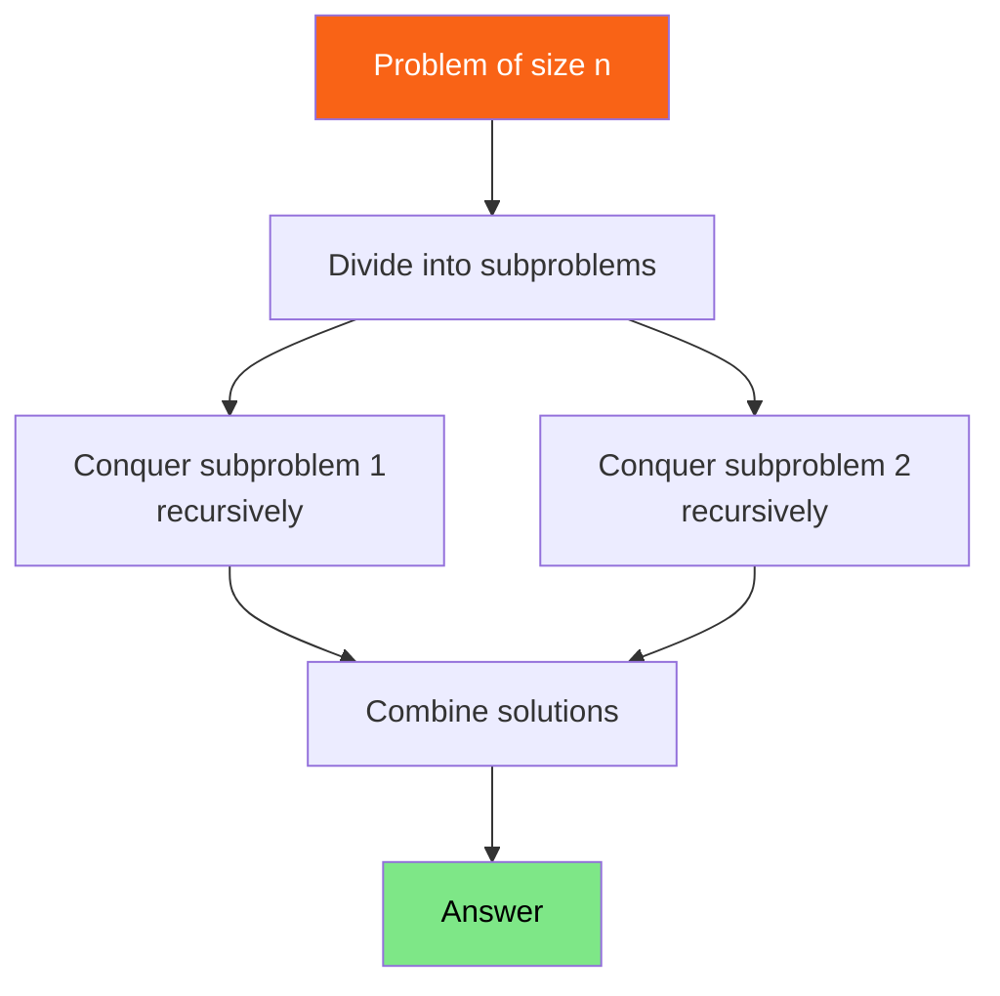

<h1><span class="h1-kicker">Data Structures & Algorithms</span>Divide & Conquer</h1>

**Divide and conquer** is a problem-solving strategy with three steps: **divide** the problem into smaller subproblems, **conquer** each by solving it recursively, and **combine** the sub-solutions into the answer. You've already seen it in [merge sort](#/ch/dsa-sorting) and [binary search](#/ch/dsa-searching). This chapter names the pattern, shows more examples, and gives you the tool to analyze its cost: the Master Theorem.

## The three steps



> [!key] Divide and conquer vs. plain recursion
> All divide-and-conquer *is* recursion, but with a signature shape: the problem splits into **multiple independent subproblems of the same kind** (usually halves), which are combined. Merge sort splits into two halves, sorts each, and merges. Plain recursion (like factorial) reduces to *one* smaller subproblem. The "multiple subproblems + combine" structure is what makes divide-and-conquer powerful — and what often yields that magic O(n log n).

## Example: fast exponentiation

Computing `base^exp` naively takes O(exp) multiplications. Divide and conquer does it in **O(log exp)**: to compute `x^n`, compute `x^(n/2)` once and square it:

```rust
// x^n in O(log n) multiplications by halving the exponent.
fn power(base: i64, exp: u32) -> i64 {
    if exp == 0 {
        return 1; // base case: x^0 = 1
    }
    let half = power(base, exp / 2); // conquer ONE subproblem, reuse it
    let squared = half * half;        // combine
    if exp % 2 == 0 {
        squared            // even: x^n = (x^(n/2))²
    } else {
        squared * base     // odd:  x^n = (x^(n/2))² × x
    }
}

fn main() {
    println!("{}", power(2, 10)); // 1024
    println!("{}", power(3, 5));   // 243
    // power(2, 1000) would take ~10 multiplications, not 1000!
}
```

## Example: quickselect (find the k-th smallest)

Need the k-th smallest element but *not* a full sort? **Quickselect** uses quicksort's partition step but only recurses into the *one* half containing the answer — averaging O(n) instead of sorting's O(n log n):

```rust
// Find the k-th smallest element (0-indexed) in O(n) average time.
fn quickselect(arr: &mut [i32], k: usize) -> i32 {
    let pivot_index = partition(arr);
    if k == pivot_index {
        arr[k]                              // found it
    } else if k < pivot_index {
        quickselect(&mut arr[..pivot_index], k)             // recurse LEFT only
    } else {
        let right = &mut arr[pivot_index + 1..];
        quickselect(right, k - pivot_index - 1)             // recurse RIGHT only
    }
}

fn partition(arr: &mut [i32]) -> usize {
    let pivot = arr.len() - 1;
    let mut i = 0;
    for j in 0..pivot {
        if arr[j] <= arr[pivot] {
            arr.swap(i, j);
            i += 1;
        }
    }
    arr.swap(i, pivot);
    i
}

fn main() {
    let mut data = [7, 2, 9, 1, 5, 3];
    let median_idx = data.len() / 2;
    println!("k-th smallest: {}", quickselect(&mut data, median_idx));
}
```

Recursing into only *one* half (not both, like merge sort) is what makes quickselect O(n) instead of O(n log n) — a beautiful illustration of how the "combine" step's cost shapes the whole.

## Analyzing cost: the Master Theorem

How do we find the Big-O of a divide-and-conquer algorithm? Its running time follows a **recurrence** like `T(n) = a·T(n/b) + f(n)`, where you split into `a` subproblems of size `n/b` and spend `f(n)` work dividing/combining. The **Master Theorem** reads off the answer:

<figure class="diagram">
<svg viewBox="0 0 640 175" role="img" aria-label="The Master Theorem relates the number and size of subproblems to the overall complexity">
  <style>
    .mtm { font: 600 12px var(--font-mono); fill: var(--text); }
    .mtc { font: 11px var(--font-sans); fill: var(--text-mute); }
    .mth { font: 700 12px var(--font-sans); }
    .fbox { fill: var(--surface-2); stroke: var(--border-strong); stroke-width: 1.2; }
  </style>
  <rect x="120" y="14" width="400" height="30" class="fbox"/>
  <text x="180" y="34" class="mtm">T(n) = a·T(n/b) + f(n)</text>
  <text x="20" y="72" class="mtc">a = # subproblems · b = shrink factor · f(n) = divide+combine work</text>
  <rect x="20" y="86" width="600" height="24" class="fbox"/><text x="30" y="103" class="mtm">Merge sort: 2·T(n/2) + O(n)  →  O(n log n)</text>
  <rect x="20" y="114" width="600" height="24" class="fbox"/><text x="30" y="131" class="mtm">Binary search: 1·T(n/2) + O(1)  →  O(log n)</text>
  <rect x="20" y="142" width="600" height="24" class="fbox"/><text x="30" y="159" class="mtm">Fast power: 1·T(n/2) + O(1)  →  O(log n)</text>
</svg>
<figcaption>The Master Theorem turns a divide-and-conquer recurrence into a Big-O by comparing the subproblem work to the combine work.</figcaption>
</figure>

> [!tip] The intuition without the formula
> You don't need to memorize the Master Theorem's cases. Just reason about the **recursion tree**: how many levels deep (usually `log n`, since you halve), and how much total work per level. Merge sort does O(n) work at *every* level across `log n` levels → **O(n log n)**. Binary search does O(1) work at each of `log n` levels → **O(log n)**. Count "work per level × number of levels" and you'll get the answer for most divide-and-conquer algorithms.

## When divide and conquer shines

> [!best] Recognize the divide-and-conquer opportunity
> Reach for divide and conquer when a problem **splits naturally into independent, same-shaped subproblems**: sorting (merge/quick sort), searching sorted data (binary search), the closest-pair-of-points problem, large-number multiplication (Karatsuba), matrix multiplication (Strassen), and many geometry problems. The tell-tale sign: "if I could solve this for the two halves, combining would be easy." Bonus: independent subproblems are trivially **parallelizable** — this is exactly what [Rayon's `join`](#/ch/rayon) exploits.

## Summary

- **Divide and conquer** = **divide** into subproblems, **conquer** (solve recursively), **combine** — a structured recursion with *multiple* same-shaped subproblems.
- Examples: **merge/quick sort** (O(n log n)), **binary search** & **fast power** (O(log n)), **quickselect** (O(n) average — recurses into only *one* half).
- Analyze cost via the recurrence `T(n) = a·T(n/b) + f(n)` — or intuitively, "work per level × number of levels" over the recursion tree.
- It shines when problems split into independent subproblems, and those subproblems are naturally **parallelizable**.

> [!exercise] Try it yourself
> 1. Use `power` to compute `2^30` and confirm it takes far fewer multiplications than the naive loop.
> 2. Implement "count inversions" (pairs out of order) as a modified merge sort in O(n log n).
> 3. Draw the recursion tree for merge-sorting 8 elements and count the work per level to see the O(n log n).

We've covered the foundational algorithms. Now we build the classic *data structures* — starting with the one that famously fights Rust's borrow checker: the **linked list**.
