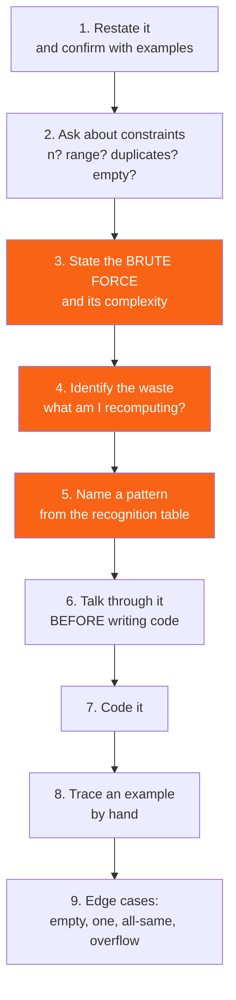

<h1><span class="h1-kicker">Data Structures & Algorithms</span>Interview Preparation</h1>

You've now covered every data structure and algorithm in this course. This chapter is about *retrieval* — how to look at an unfamiliar problem under time pressure and know which of those tools applies. That's a different skill from knowing the algorithms, and it's the one interviews actually test.

It's also the skill that makes you faster at real work, because "this is a graph problem" is a useful thought at any desk.

## The recognition table

Most problems announce themselves if you know the signals. This is the table worth internalizing.

| The problem says… | Reach for | Complexity |
|---|---|---|
| "sorted array", "find a value" | binary search | O(log n) |
| "find the smallest/largest that satisfies…" | binary search **on the answer** | O(n log n) |
| "contiguous subarray/substring" | sliding window | O(n) |
| "pair summing to a target", "sorted, two ends" | two pointers | O(n) |
| "have I seen this before?", "duplicates" | `HashSet` / `HashMap` | O(n) |
| "top K", "K largest/smallest" | `BinaryHeap` of size K | O(n log k) |
| "median of a stream" | two heaps | O(log n) per item |
| "next greater/smaller element" | monotonic stack | O(n) |
| "sliding window maximum" | monotonic deque | O(n) |
| "valid parentheses", "undo" | stack | O(n) |
| "shortest path, unweighted" | BFS | O(V+E) |
| "shortest path, weighted non-negative" | Dijkstra | O((V+E) log V) |
| "shortest path with negative edges" | Bellman–Ford | O(V·E) |
| "all pairs shortest paths" | Floyd–Warshall | O(V³) |
| "connected components", "islands" | DFS/BFS or union-find | O(V+E) |
| "cycle detection", "course prerequisites" | topological sort | O(V+E) |
| "are these in the same group?", "merge groups" | union-find | ~O(1) amortized |
| "count of overlapping intervals" | sort by start + heap, or sweep line | O(n log n) |
| "prefix", "autocomplete", "dictionary" | trie | O(len) |
| "range sum/min query" | prefix sums / segment tree / Fenwick | O(1) / O(log n) |
| "count ways", "minimum cost to reach" | dynamic programming | varies |
| "optimal substructure + overlapping subproblems" | DP with memoization | varies |
| "generate all", "every combination" | backtracking | exponential |
| "locally best choice works" | greedy — **prove it first** | O(n log n) |
| "assign A to B one-to-one" | bipartite matching | O(E·√V) |
| "maximum throughput", "minimum to disconnect" | max flow / min cut | O(V²·E) |
| "in-place, O(1) extra space" | two pointers, or XOR tricks | O(n) |
| "the array itself indexes 1..n" | cyclic sort / index-as-hash | O(n) |
| "count inversions" | modified merge sort | O(n log n) |
| "K-th smallest" | quickselect | O(n) average |

> [!key] Recognition beats recall
> Under time pressure you won't derive Dijkstra from first principles — but you don't need to. What you need is the two-second jump from "shortest path with weights" to "Dijkstra, priority queue, distance array". Practising *recognition* — reading a problem and naming the tool before writing anything — is a far better use of preparation time than re-implementing algorithms you already understand.

## The four patterns worth drilling

Most array and string problems are one of these four. Learn them cold.

### Two pointers

```rust
/// Two pointers from opposite ends — works because the array is SORTED.
fn two_sum_sorted(nums: &[i32], target: i32) -> Option<(usize, usize)> {
    let (mut lo, mut hi) = (0usize, nums.len().checked_sub(1)?);
    while lo < hi {
        let sum = nums[lo] + nums[hi];
        if sum == target {
            return Some((lo, hi));
        } else if sum < target {
            lo += 1; // need a bigger sum
        } else {
            hi -= 1; // need a smaller sum
        }
    }
    None
}

/// Same-direction pointers: one reads, one writes. In-place, O(1) space.
fn remove_duplicates(nums: &mut Vec<i32>) -> usize {
    if nums.is_empty() {
        return 0;
    }
    let mut write = 1;
    for read in 1..nums.len() {
        if nums[read] != nums[write - 1] {
            nums[write] = nums[read];
            write += 1;
        }
    }
    nums.truncate(write);
    write
}

fn is_palindrome(s: &str) -> bool {
    let chars: Vec<char> = s.chars().filter(|c| c.is_alphanumeric()).map(|c| c.to_ascii_lowercase()).collect();
    let (mut lo, mut hi) = (0usize, chars.len());
    while lo + 1 < hi {
        hi -= 1;
        if chars[lo] != chars[hi] {
            return false;
        }
        lo += 1;
    }
    true
}

fn main() {
    println!("{:?}", two_sum_sorted(&[2, 7, 11, 15], 18)); // Some((1, 2))
    println!("{:?}", two_sum_sorted(&[2, 7, 11, 15], 100)); // None

    let mut v = vec![1, 1, 2, 3, 3, 3, 4];
    let n = remove_duplicates(&mut v);
    println!("{n} unique: {v:?}");

    println!("{}", is_palindrome("A man, a plan, a canal: Panama")); // true
    println!("{}", is_palindrome("hello"));                          // false
}
```

### Sliding window

```rust
use std::collections::HashMap;

/// Fixed-size window: add the new element, drop the old one. O(n), not O(n·k).
fn max_sum_window(nums: &[i64], k: usize) -> Option<i64> {
    if nums.len() < k || k == 0 {
        return None;
    }
    let mut sum: i64 = nums[..k].iter().sum();
    let mut best = sum;
    for i in k..nums.len() {
        sum += nums[i] - nums[i - k]; // slide: one add, one subtract
        best = best.max(sum);
    }
    Some(best)
}

/// Variable window: grow on the right, shrink on the left while invalid.
/// Each element enters and leaves at most once, so it's O(n) despite the nested loop.
fn longest_without_repeats(s: &str) -> usize {
    let chars: Vec<char> = s.chars().collect();
    let mut last_seen: HashMap<char, usize> = HashMap::new();
    let mut start = 0;
    let mut best = 0;

    for (i, &c) in chars.iter().enumerate() {
        if let Some(&prev) = last_seen.get(&c) {
            if prev >= start {
                start = prev + 1; // jump past the duplicate
            }
        }
        last_seen.insert(c, i);
        best = best.max(i - start + 1);
    }
    best
}

/// The shortest window containing at least `target` sum.
fn min_window_sum(nums: &[i64], target: i64) -> Option<usize> {
    let mut start = 0;
    let mut sum = 0;
    let mut best: Option<usize> = None;

    for end in 0..nums.len() {
        sum += nums[end];
        // Shrink from the left while the window is still valid.
        while sum >= target {
            let len = end - start + 1;
            best = Some(best.map_or(len, |b: usize| b.min(len)));
            sum -= nums[start];
            start += 1;
        }
    }
    best
}

fn main() {
    println!("{:?}", max_sum_window(&[2, 1, 5, 1, 3, 2], 3));   // Some(9)
    println!("{}", longest_without_repeats("abcabcbb"));        // 3
    println!("{}", longest_without_repeats("bbbbb"));           // 1
    println!("{}", longest_without_repeats("pwwkew"));          // 3
    println!("{:?}", min_window_sum(&[2, 3, 1, 2, 4, 3], 7));   // Some(2)
    println!("{:?}", min_window_sum(&[1, 1], 7));               // None
}
```

> [!key] A nested loop is not automatically O(n²)
> The variable sliding window has a `while` inside a `for`, which looks quadratic. But `start` only ever moves **forward**, so across the whole run it advances at most `n` times total — the two pointers together do 2n steps. This **amortized** argument is the same reasoning behind `Vec::push` and union-find, and interviewers specifically listen for it. Saying "it looks O(n²) but each pointer only moves forward, so it's O(n)" is exactly the analysis they want.

### Monotonic stack

```rust
/// For each element, find the next strictly greater element to its right.
/// The stack holds indices whose answer we haven't found yet, in decreasing
/// order of value — hence "monotonic".
fn next_greater(nums: &[i32]) -> Vec<Option<i32>> {
    let mut result = vec![None; nums.len()];
    let mut stack: Vec<usize> = Vec::new();

    for i in 0..nums.len() {
        // This element resolves everything smaller still waiting on the stack.
        while let Some(&top) = stack.last() {
            if nums[top] < nums[i] {
                result[top] = Some(nums[i]);
                stack.pop();
            } else {
                break;
            }
        }
        stack.push(i);
    }
    // Anything left on the stack has no greater element to its right.
    result
}

/// Largest rectangle in a histogram — the classic monotonic-stack problem.
fn largest_rectangle(heights: &[i64]) -> i64 {
    let mut stack: Vec<usize> = Vec::new();
    let mut best = 0;

    // The extra 0 at the end flushes the stack.
    for i in 0..=heights.len() {
        let h = if i == heights.len() { 0 } else { heights[i] };
        while let Some(&top) = stack.last() {
            if heights[top] <= h {
                break;
            }
            stack.pop();
            // The bar at `top` extends from just after the new stack top to i-1.
            let left = stack.last().map_or(0, |&l| l + 1);
            let width = (i - left) as i64;
            best = best.max(heights[top] * width);
        }
        stack.push(i);
    }
    best
}

fn main() {
    println!("{:?}", next_greater(&[2, 1, 2, 4, 3]));
    // [Some(4), Some(2), Some(4), None, None]

    println!("{}", largest_rectangle(&[2, 1, 5, 6, 2, 3])); // 10
    println!("{}", largest_rectangle(&[2, 4]));             // 4
}
```

### Binary search on the answer

The pattern people miss most often. When the *input* isn't sorted but the *answer space* is monotonic, you can binary search over possible answers.

```rust
/// "Can we finish in `hours` if we eat at speed k?" is monotonic in k:
/// if speed k works, so does every larger speed. So binary search on k.
fn min_eating_speed(piles: &[i64], hours: i64) -> i64 {
    // The predicate: is this speed fast enough?
    let feasible = |speed: i64| -> bool {
        let needed: i64 = piles.iter().map(|&p| (p + speed - 1) / speed).sum(); // ceil div
        needed <= hours
    };

    let mut lo = 1;
    let mut hi = *piles.iter().max().unwrap_or(&1);
    while lo < hi {
        let mid = lo + (hi - lo) / 2; // no overflow
        if feasible(mid) {
            hi = mid; // this works — try slower
        } else {
            lo = mid + 1; // too slow
        }
    }
    lo
}

/// Split an array into at most `k` parts, minimizing the largest part sum.
fn split_array_min_largest(nums: &[i64], k: usize) -> i64 {
    let feasible = |cap: i64| -> bool {
        let mut parts = 1;
        let mut current = 0;
        for &n in nums {
            if current + n > cap {
                parts += 1;
                current = n;
            } else {
                current += n;
            }
        }
        parts <= k
    };

    let mut lo = *nums.iter().max().unwrap(); // can't be smaller than one element
    let mut hi = nums.iter().sum();           // one part holds everything
    while lo < hi {
        let mid = lo + (hi - lo) / 2;
        if feasible(mid) {
            hi = mid;
        } else {
            lo = mid + 1;
        }
    }
    lo
}

fn main() {
    println!("{}", min_eating_speed(&[3, 6, 7, 11], 8));           // 4
    println!("{}", min_eating_speed(&[30, 11, 23, 4, 20], 5));     // 30
    println!("{}", split_array_min_largest(&[7, 2, 5, 10, 8], 2)); // 18
    println!("{}", split_array_min_largest(&[1, 2, 3, 4, 5], 2));  // 9
}
```

> [!best] Recognize "binary search on the answer" by the phrasing
> The signal is "**minimum** X such that…" or "**maximum** Y that still…" combined with a check that's easy to *test* but hard to *compute directly*. Write the predicate `feasible(candidate) -> bool` first, confirm it's monotonic (if `x` works, does `x+1`?), then binary search the range. Problems that look like hard optimization collapse into twenty lines. It's the single highest-leverage pattern on this list.

> [!mistake] `(lo + hi) / 2` overflows, and the loop boundary is where off-by-ones live
> Use `lo + (hi - lo) / 2`. And be deliberate about the invariant: with `while lo < hi` and `hi = mid` / `lo = mid + 1`, the loop ends with `lo == hi` at the answer, and it always terminates because `mid < hi` when `lo < hi`. Mixing this with `while lo <= hi` and `hi = mid - 1` produces an infinite loop or an off-by-one. Pick **one** template, verify it once, and reuse it — don't re-derive it under pressure.

## Rust-specific interview notes

Writing these problems in Rust has a few wrinkles worth knowing in advance.

| Situation | Rust answer |
|---|---|
| "modify the array in place" | `&mut [T]` or `&mut Vec<T>`; `swap`, `sort_unstable` |
| indexing might go negative | `checked_sub`, `saturating_sub`, or use `i64` |
| a tree/graph with parent pointers | `Vec<Node>` + `usize` indices, **not** `Rc<RefCell<>>` |
| building a linked list | you almost certainly want a `Vec` — say so |
| `HashMap` iteration order in a test | use `BTreeMap`, or sort before asserting |
| returning "not found" | `Option<T>`, never `-1` |
| min-heap | `BinaryHeap<Reverse<T>>` |
| sorting floats | `sort_by(\|a, b\| a.partial_cmp(b).unwrap())` |
| 2D grid | one flat `Vec<T>` indexed `r * cols + c` |
| visited set on a grid | `vec![vec![false; cols]; rows]` or a bitset |
| recursion depth | Rust's default stack is 8 MB; deep recursion needs an explicit stack |
| string indexing | `.chars().collect::<Vec<char>>()` first — you cannot index a `&str` |

> [!best] Say "in production I'd use a `Vec` arena" out loud
> If an interviewer asks for a binary tree or linked list, building it with `Rc<RefCell<Node>>` is slow to write and awkward to reason about under pressure. `Vec<Node>` with `usize` child indices is faster to write, has no borrow-checker friction, and is what real Rust graph libraries do. Explaining *why* — one allocation, cache locality, no cycles to leak — demonstrates more Rust judgement than fighting smart pointers on a whiteboard. See [Designing Your Own Data Structures](#/ch/dsa-design).

> [!mistake] `s[i]` doesn't compile on a `&str`, and `chars().nth(i)` is O(n)
> Rust strings are UTF-8, so there's no O(1) character indexing — this catches people who practised in Python. If a problem needs random access to characters, collect into a `Vec<char>` **once** up front. Calling `.chars().nth(i)` inside a loop silently turns an O(n) algorithm into O(n²). If the input is guaranteed ASCII, `s.as_bytes()[i]` is O(1) and fine. See [Strings & Text](#/ch/strings).

## How to approach a problem you haven't seen



> [!key] Always state the brute force first
> It gets a correct answer on the board, gives you a complexity to improve on, and often reveals the optimization directly — because the next question is "what am I recomputing?", and the answer names the tool. Recomputing a sum over a window → sliding window. Recomputing the same subproblem → memoization. Rescanning for a value → a hash map. Jumping straight at a clever solution and getting stuck is much worse than starting simple and improving.

> [!mistake] The four edge cases that account for most failures
> **Empty input**, a **single element**, **all elements identical**, and **integer overflow**. Check these four every time, before you say you're done. In Rust the overflow one is sneaky: `(lo + hi) / 2`, `mid - 1` on a `usize` at zero, and `len() - 1` on an empty `Vec` all compile fine and panic at runtime. `checked_sub` and `saturating_sub` exist precisely for this.

## A study plan

| Phase | Focus | Chapters |
|---|---|---|
| 1. Foundations | Big-O, arrays, hashing | [Big-O](#/ch/dsa-intro), [Arrays](#/ch/dsa-arrays), [Hashing](#/ch/dsa-hashing) |
| 2. The four patterns | two pointers, sliding window, monotonic stack, binary search on the answer | this chapter, [Searching](#/ch/dsa-searching) |
| 3. Linear structures | stacks, queues, heaps | [Stacks & Queues](#/ch/dsa-stack-queue), [Heaps](#/ch/dsa-heaps) |
| 4. Trees | traversals, BSTs, tries | [Trees](#/ch/dsa-trees), [Tries](#/ch/dsa-tries) |
| 5. Graphs | BFS, DFS, topological sort, union-find | [Traversal](#/ch/dsa-graph-traversal), [Union-Find](#/ch/dsa-union-find) |
| 6. Shortest paths | Dijkstra, Bellman–Ford | [Shortest Paths](#/ch/dsa-shortest-path) |
| 7. Recursion | backtracking, divide and conquer | [Recursion](#/ch/dsa-recursion), [Divide & Conquer](#/ch/dsa-divide-conquer) |
| 8. DP | 1-D, 2-D, knapsack, LCS | [Dynamic Programming](#/ch/dsa-dynamic-programming) |
| 9. Advanced | segment trees, flow, geometry | [Advanced](#/ch/dsa-advanced), [Flow](#/ch/dsa-flow), [Geometry](#/ch/dsa-geometry) |

> [!best] Depth over breadth: 100 problems understood beats 500 skimmed
> The goal is *recognition*, and recognition comes from understanding why a solution works — not from having typed it once. After solving a problem, close it and re-derive the approach from the problem statement alone a day later. If you can't, you pattern-matched a solution rather than learning it. Spaced repetition on a small set beats grinding a large one, and it's the difference between candidates who freeze on a variant and candidates who don't.

> [!note] What Rust interviewers tend to probe
> Beyond the algorithm: ownership decisions (why `&[T]` and not `Vec<T>`?), error handling (`Option`/`Result` rather than sentinels), whether you reach for `clone()` reflexively, and whether you know why iterators are usually faster than index loops. A candidate who writes a correct O(n log n) solution taking `&[T]`, returning `Option<usize>`, and explaining the bounds-check elision is making a much stronger impression than one who writes the same algorithm with `Vec<i32>` parameters and `-1` returns.

## Complexity cheat sheet

| Operation | `Vec` | `VecDeque` | `HashMap` | `BTreeMap` | `BinaryHeap` |
|---|---|---|---|---|---|
| index / get by key | O(1) | O(1) | O(1) avg | O(log n) | — |
| insert at end / by key | O(1)* | O(1)* | O(1) avg | O(log n) | O(log n) |
| insert at front | O(n) | O(1)* | — | — | — |
| remove at end | O(1) | O(1) | O(1) avg | O(log n) | O(log n) |
| remove in middle | O(n) | O(n) | O(1) avg | O(log n) | — |
| search by value | O(n) | O(n) | O(1) avg | O(log n) | O(n) |
| min / max | O(n) | O(n) | O(n) | **O(log n)** | **O(1)** peek |
| ordered iteration | insertion | insertion | ❌ none | **sorted** | ❌ |

\* amortized

| Sort | Time | Space | Stable |
|---|---|---|---|
| `sort()` (Timsort-like) | O(n log n) | O(n) | ✅ |
| `sort_unstable()` (pattern-defeating quicksort) | O(n log n) | O(log n) | ❌ |
| counting / radix sort | O(n + k) | O(k) | ✅ |
| heap sort | O(n log n) | O(1) | ❌ |
| insertion sort | O(n²), O(n) if nearly sorted | O(1) | ✅ |

## Summary

- Interviews test **recognition**, not derivation. Drill the mapping from problem phrasing to tool using the recognition table.
- The four patterns that cover most array and string problems: **two pointers**, **sliding window**, **monotonic stack**, and **binary search on the answer**.
- A nested loop where each pointer only moves **forward** is O(n), not O(n²) — say the amortized argument out loud.
- **Binary search on the answer** is the highest-leverage pattern: write `feasible(candidate) -> bool`, check monotonicity, search the range. Use `lo + (hi - lo) / 2` and one fixed template.
- In Rust: **`Vec` arenas with `usize` indices** instead of `Rc<RefCell<>>`, `Option` instead of `-1`, `BinaryHeap<Reverse<T>>` for a min-heap, and `chars().collect()` **once** because you can't index a `&str`.
- Always **state the brute force first**, then ask "what am I recomputing?" — the answer usually names the pattern.
- Check the same four edge cases every time: **empty**, **single element**, **all identical**, **overflow**.
- **Depth over breadth**: re-derive a solution a day later. If you can't, you memorized rather than learned it.

> [!exercise] Try it yourself
> 1. For each of these, name the pattern in under ten seconds: "longest substring with at most 2 distinct characters"; "minimum days to ship all packages with k ships"; "the next warmer day for each day"; "can these courses be completed given prerequisites?"
> 2. Solve "maximum sum of any contiguous subarray" (Kadane's algorithm) and state its complexity. Then solve it for a *fixed-length* subarray. Why are they different patterns?
> 3. Write the sliding-window solution to "longest substring with at most `k` distinct characters", then trace it by hand on `"eceba"` with `k = 2`.
> 4. Take `min_eating_speed` and write out the monotonicity argument that justifies the binary search. What would break if it weren't monotonic?
> 5. Implement `next_smaller` using a monotonic stack by changing exactly one comparison in `next_greater`.
> 6. Pick any three problems you've solved before, close your notes, and re-derive the approach from the statement alone. How many came back?

That completes the data-structures and algorithms course — from Big-O through graphs, dynamic programming, flow, and geometry, to the recognition skill that ties them together. The **appendices** that follow are your quick reference for keywords, operators, derivable traits, and a one-page cheat sheet.
