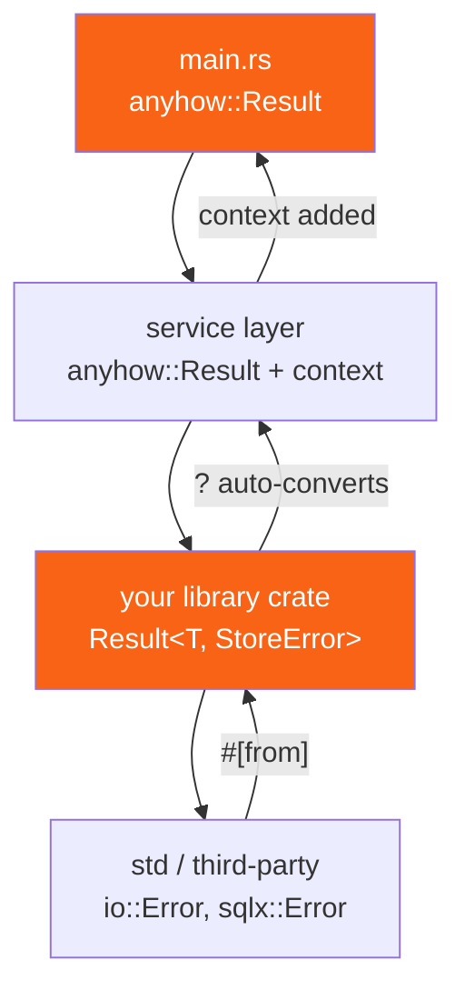

<h1><span class="h1-kicker">Idioms & Design Patterns</span>Error Handling Strategy</h1>

You already know the mechanics — `Result`, `?`, `thiserror`, `anyhow`. What nobody tells you is the *strategy*: which error type belongs where, how much detail to carry, when to add context and when to stop, and how to design errors your callers can actually act on. Get this right once, at the start of a project, and error handling stops being friction.

The single organizing question is: **who is going to read this error, and what will they do about it?**

## The two audiences

Every error has exactly one of two audiences, and that determines everything else about it.

<figure class="diagram">
<svg viewBox="0 0 640 250" role="img" aria-label="Library errors are typed for programs to match on, while application errors are contextual for humans to read">
  <style>
    .es-h { font: 700 13px var(--font-sans); }
    .es-m { font: 600 11px var(--font-mono); fill: var(--text); }
    .es-c { font: 11px var(--font-sans); fill: var(--text-mute); }
    .es-lib { fill: var(--blue-soft); stroke: var(--blue); stroke-width: 1.5; }
    .es-app { fill: var(--rust-100); stroke: var(--rust-400); stroke-width: 1.5; }
  </style>
  <rect x="20" y="30" width="280" height="180" rx="6" class="es-lib"/>
  <text x="36" y="54" class="es-h" fill="var(--blue)">Library errors</text>
  <text x="36" y="76" class="es-c">read by: a PROGRAM</text>
  <text x="36" y="98" class="es-m">enum MyError { NotFound, Timeout }</text>
  <text x="36" y="124" class="es-c">• one enum per crate (or per module)</text>
  <text x="36" y="142" class="es-c">• every variant is matchable</text>
  <text x="36" y="160" class="es-c">• implements std::error::Error</text>
  <text x="36" y="178" class="es-c">• derive with thiserror</text>
  <text x="36" y="200" class="es-c">• NO backtrace, NO logging</text>
  <rect x="340" y="30" width="280" height="180" rx="6" class="es-app"/>
  <text x="356" y="54" class="es-h" fill="var(--rust-600)">Application errors</text>
  <text x="356" y="76" class="es-c">read by: a HUMAN</text>
  <text x="356" y="98" class="es-m">anyhow::Result&lt;T&gt;</text>
  <text x="356" y="124" class="es-c">• one opaque type everywhere</text>
  <text x="356" y="142" class="es-c">• rich context, chained causes</text>
  <text x="356" y="160" class="es-c">• backtrace on demand</text>
  <text x="356" y="178" class="es-c">• logged once, at the top</text>
  <text x="356" y="200" class="es-c">• rarely matched on</text>
  <text x="20" y="238" class="es-c">Same crate can do both: typed errors at the library boundary, anyhow inside the binary that consumes it.</text>
</svg>
<figcaption>The audience decides the design. A caller who will <b>branch</b> on the failure needs a typed enum; a caller who will <b>report</b> it needs context.</figcaption>
</figure>

| | Library | Application |
|---|---|---|
| Consumer | other code | a person reading logs |
| Error type | your own `enum` per crate | one opaque type (`anyhow::Error`) |
| Goal | let callers **branch** | let humans **diagnose** |
| Reach for | `thiserror` | `anyhow` (or `eyre`) |
| Add context? | no — the caller has more of it | yes, at every layer |
| Implements `Error`? | always | yes, via the crate |
| `Box<dyn Error>`? | never in a public signature | fine, but `anyhow` is better |

> [!key] The rule in one line
> **Libraries return enums; applications return `anyhow::Result`.** A library that returns `anyhow::Error` has taken away its callers' ability to handle anything specifically. An application that defines fifty error enums has done a great deal of work to produce a log line. Most crates are both — a `lib.rs` with typed errors and a `main.rs` using `anyhow` — and that's exactly right.

## Designing a library error type

Start from the question "what could a caller reasonably do differently?" Every answer becomes a variant. Everything else collapses into one.

```rust
use std::fmt;

#[derive(Debug)]
pub enum StoreError {
    /// The key isn't there — the caller might insert a default.
    NotFound { key: String },
    /// Transient: the caller might retry.
    Unavailable { after_ms: u64 },
    /// The caller's fault; retrying won't help.
    InvalidKey { key: String, reason: &'static str },
    /// Everything unexpected, with the cause preserved.
    Io(std::io::Error),
}

impl fmt::Display for StoreError {
    fn fmt(&self, f: &mut fmt::Formatter) -> fmt::Result {
        match self {
            StoreError::NotFound { key } => write!(f, "key `{key}` not found"),
            StoreError::Unavailable { after_ms } => write!(f, "store unavailable after {after_ms}ms"),
            StoreError::InvalidKey { key, reason } => write!(f, "invalid key `{key}`: {reason}"),
            StoreError::Io(_) => write!(f, "store I/O failed"),
        }
    }
}

impl std::error::Error for StoreError {
    // source() is what lets callers walk the causal chain.
    fn source(&self) -> Option<&(dyn std::error::Error + 'static)> {
        match self {
            StoreError::Io(e) => Some(e),
            _ => None,
        }
    }
}

// The From impl is what makes `?` work on io::Error inside your functions.
impl From<std::io::Error> for StoreError {
    fn from(e: std::io::Error) -> Self {
        StoreError::Io(e)
    }
}

impl StoreError {
    /// Classification methods are a gift to your callers.
    pub fn is_retryable(&self) -> bool {
        matches!(self, StoreError::Unavailable { .. })
    }
}

fn main() {
    let errors = [
        StoreError::NotFound { key: "user:7".into() },
        StoreError::Unavailable { after_ms: 3000 },
        StoreError::InvalidKey { key: "".into(), reason: "must not be empty" },
    ];

    for e in &errors {
        println!("{e}  (retryable: {})", e.is_retryable());
    }
}
```

That's a lot of boilerplate. `thiserror` generates all of it from attributes:

```rust,ignore
use thiserror::Error;

#[derive(Debug, Error)]
pub enum StoreError {
    #[error("key `{key}` not found")]
    NotFound { key: String },

    #[error("store unavailable after {after_ms}ms")]
    Unavailable { after_ms: u64 },

    #[error("invalid key `{key}`: {reason}")]
    InvalidKey { key: String, reason: &'static str },

    // #[from] generates the From impl AND wires up source().
    #[error("store I/O failed")]
    Io(#[from] std::io::Error),
}
```

> [!best] Add `is_*` classification methods to public error types
> `err.is_retryable()`, `err.is_not_found()`, `err.is_client_error()` — these let callers make decisions without matching on every variant, which means you can add variants later without breaking them. It's the same instinct as `#[non_exhaustive]`: give people the *question* they want answered rather than forcing them to enumerate your internals. `std::io::Error::kind()` is the canonical example.

### How many variants?

| Signal | Verdict |
|---|---|
| a caller would retry on this but not that | separate variants |
| a caller would show a different message to a user | separate variants |
| a caller would map it to a different HTTP status | separate variants |
| the only difference is which line of your code failed | **one** variant |
| you're up to fifteen variants for one function | split the function, or group into sub-enums |

> [!mistake] One variant per failure *site* instead of per failure *kind*
> It's tempting to write `ConfigReadFailed`, `ConfigParseFailed`, `ConfigValidateFailed`, `SecretsReadFailed`, `SecretsParseFailed`… twenty variants that all mean "startup failed, here's why" and that no caller will ever distinguish. That's context, not classification — and context belongs in the message or in `anyhow`, not in the type. Ask "would anyone `match` on this?" If not, merge it.

## Application errors: context is the product

In a binary, nobody matches on your errors. They read them at 3am. So the job changes from *classification* to *narration*.

```rust,ignore
use anyhow::{bail, Context, Result};

fn load_config(path: &str) -> Result<String> {
    let raw = std::fs::read_to_string(path)
        .with_context(|| format!("reading config from {path}"))?;

    if raw.trim().is_empty() {
        bail!("config at {path} is empty");
    }
    Ok(raw)
}

fn start() -> Result<()> {
    let cfg = load_config("/etc/app/config.toml").context("starting up")?;
    println!("loaded {} bytes", cfg.len());
    Ok(())
}

fn main() -> Result<()> {
    start()
}
```

When that fails, the user sees the whole chain rather than a bare `No such file or directory`:

```text
Error: starting up

Caused by:
    0: reading config from /etc/app/config.toml
    1: No such file or directory (os error 2)
```

| Tool | Use |
|---|---|
| `.context("static message")` | cheap, always-evaluated context |
| `.with_context(\|\| format!(…))` | context that costs something to build — **lazy** |
| `bail!("…")` | early return with a new error |
| `ensure!(cond, "…")` | `bail!` unless a condition holds |
| `anyhow!("…")` | construct an error value without returning |
| `err.downcast_ref::<MyError>()` | recover the typed error, for the rare case you must branch |

> [!best] Context should say what you were *trying* to do
> Good: `"reading config from /etc/app/config.toml"`. Bad: `"error in load_config"` — the reader can see the function name in the backtrace; what they can't see is which path, which user, which retry. Name the operation and include the specific inputs. The test is whether the message alone would let you reproduce the failure.

> [!performance] `with_context` is lazy, `context` is not
> `.context(format!("processing {id}"))` builds that string on **every call**, including the millions that succeed. `.with_context(|| format!("processing {id}"))` builds it only when there's an error to attach it to. In a hot loop that's the difference between free and measurable. Default to `with_context` whenever the message interpolates anything.

## Where to convert between the two

The boundary rule: **convert at the edge of your crate, never in the middle.**



`?` handles the upward conversion automatically as long as the `From` impls exist — which is exactly what `#[from]` in `thiserror` generates, and what `anyhow` provides for anything implementing `Error`.

```rust
use std::num::ParseIntError;

#[derive(Debug)]
enum AppError {
    BadNumber(ParseIntError),
    OutOfRange(i64),
}

// This one From impl is what makes `?` work on parse() below.
impl From<ParseIntError> for AppError {
    fn from(e: ParseIntError) -> Self {
        AppError::BadNumber(e)
    }
}

fn parse_percentage(s: &str) -> Result<u8, AppError> {
    let n: i64 = s.trim().parse()?;          // ParseIntError → AppError, automatically
    if !(0..=100).contains(&n) {
        return Err(AppError::OutOfRange(n));
    }
    Ok(n as u8)
}

fn main() {
    for input in [" 42 ", "150", "abc"] {
        match parse_percentage(input) {
            Ok(p) => println!("{input:?} → {p}%"),
            Err(e) => println!("{input:?} → error: {e:?}"),
        }
    }
}
```

## `panic!` versus `Result`: drawing the line

Not every failure deserves a `Result`. The distinction is about *whose* mistake it is.

| Situation | Use | Why |
|---|---|---|
| the file might not exist | `Result` | the environment, not a bug |
| user input might be malformed | `Result` | expected, must be handled |
| the network might be down | `Result` | expected, often retryable |
| a slice index is out of bounds | `panic!` | a bug in your logic |
| an invariant your code guarantees is violated | `panic!` | continuing would corrupt state |
| a `&'static str` regex literal fails to compile | `panic!` via `expect` | can't happen unless you typo'd it |
| arithmetic overflows a business rule | `Result` | it's data-dependent |
| a mutex is poisoned | usually `panic!` | another thread already died holding it |

> [!key] `Result` for the world's problems, `panic!` for your own bugs
> A `Result` says "this can legitimately fail and you must decide what to do." A `panic!` says "the program's assumptions are broken; there is nothing sensible to do." Returning `Result` for genuine bugs pushes impossible cases onto every caller forever. Panicking on expected failures — a missing file, bad input — makes your library unusable in a server that can't crash. Both mistakes are common; the second is worse.

> [!warning] Library code should almost never panic on caller input
> If a public function panics because someone passed an empty string, you've made it impossible to use safely without reading your source. Validate and return `Result`. Reserve panics for violations of contracts you *documented* — and document them under a `# Panics` heading, as the standard library does for `Vec::remove` and friends.

## The checklist

| Question | Answer |
|---|---|
| Am I writing a library or a binary? | library → enum; binary → `anyhow` |
| Would a caller branch on this? | yes → its own variant; no → merge it |
| Have I added context? | binary: at every layer. library: no |
| Does my error implement `Error` + `Display` + `Debug`? | it must, if it's public |
| Does `source()` chain to the underlying cause? | use `#[from]` or implement it |
| Am I about to write `Result<T, String>`? | stop; define an enum |
| Is this a bug or an expected failure? | bug → `panic!`; expected → `Result` |
| Am I logging the same error at three levels? | log once, at the top |
| Is `main` returning `Result`? | it should — you get exit codes and printing for free |

> [!note] Log once, at the boundary
> The most common error-handling noise in production is the same failure appearing four times in the logs because every layer logged it *and* propagated it. Pick one place — usually where you stop propagating, at a request handler or `main` — and log there. Everywhere else, add context and return. Your logs shrink and each entry means one real event.

## Summary

- Ask **who reads this error and what will they do**. That single question decides the design.
- **Libraries return typed enums** (`thiserror`); **applications return `anyhow::Result`**. Most crates do both, at different layers.
- One variant per **failure kind a caller would treat differently** — not per failure site. Add `is_*` classification methods.
- Public error types must implement `Debug` + `Display` + `Error`, and chain `source()` to the real cause. `#[from]` does both.
- In applications, **context is the product**: name the operation and the specific inputs, and use lazy `with_context` when the message interpolates.
- **Convert at crate boundaries**, never mid-stack; `?` plus `From` does the work.
- **`Result` for the world's problems, `panic!` for your own bugs.** Libraries should almost never panic on caller input.
- **Log once**, at the point where you stop propagating.

> [!exercise] Try it yourself
> 1. Design an error enum for a function that reads a JSON file and extracts a field. List the variants, then justify each one by naming a caller who would treat it differently.
> 2. Rewrite that enum using `thiserror` and count the lines you saved.
> 3. Take a function returning `Result<T, String>` and convert it to a real error type. What can callers now do that they couldn't before?
> 4. Write a three-deep call chain in a binary using `anyhow`, adding context at each level, then trigger a failure and read the `Caused by:` chain.
> 5. For each of these, decide `Result` or `panic!` and defend it: a config key is missing; an internal cache is inconsistent; a user submitted a negative age; a hard-coded array index is off by one.

That completes the design-patterns part — conversions, patterns, API guidelines, anti-patterns, and error strategy. With the shape of good Rust code in hand, we're ready for the part where sloppy design really bites: putting multiple threads to work safely, in **fearless concurrency**.
