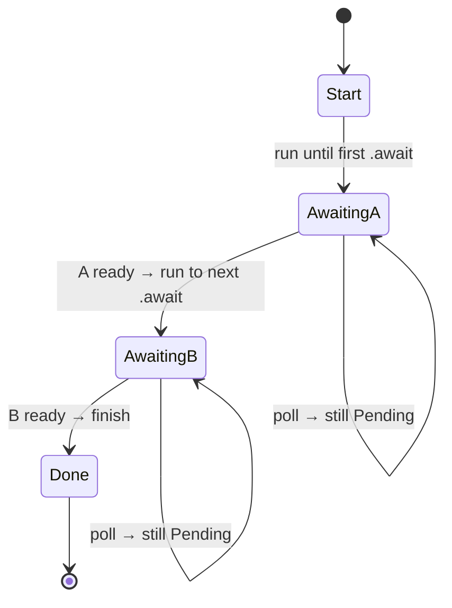

<h1><span class="h1-kicker">Asynchronous Rust</span>Futures & the Poll Model</h1>

You've been using `async`/`await` as convenient syntax. Now let's lift the hood. Underneath, a future is just a **state machine** that a runtime **polls** — repeatedly asking "are you done yet?" Understanding this model demystifies async Rust: why futures are lazy, why they're zero-cost, and what `.await` really compiles to. You rarely write this machinery by hand, but *seeing* it makes everything above it click.

## The `Future` trait

Every future implements one trait, and it's surprisingly small:

```rust,ignore
use std::pin::Pin;
use std::task::{Context, Poll};

trait Future {
    type Output;
    fn poll(self: Pin<&mut Self>, cx: &mut Context<'_>) -> Poll<Self::Output>;
}
```

The whole async world rests on that one method, `poll`, which returns a `Poll`:

```rust,ignore
enum Poll<T> {
    Ready(T),   // done — here's the result
    Pending,    // not done yet — try me again later
}
```

> [!key] A future is "code you can pause and resume"
> `poll` asks the future to make as much progress as it can *right now*. If it can finish, it returns **`Ready(value)`**. If it hits something it must wait for (a socket with no data yet), it returns **`Pending`** — parking itself so the thread can go do other work. The runtime will `poll` it again when there's a reason to. That "make progress, or report not-ready" contract is the entire model.

## Poll it yourself

Because `poll` is just a method, you can implement `Future` by hand. Here's a trivial future that's immediately ready, driven by a tiny executor from the `futures` crate:

```rust
use std::future::Future;
use std::pin::Pin;
use std::task::{Context, Poll};

struct Answer;

impl Future for Answer {
    type Output = i32;
    fn poll(self: Pin<&mut Self>, _cx: &mut Context<'_>) -> Poll<i32> {
        Poll::Ready(42) // no waiting needed — done on the first poll
    }
}

fn main() {
    // block_on drives the future by polling until it's Ready:
    let result = futures::executor::block_on(Answer);
    println!("{result}"); // 42
}
```

A more interesting future returns `Pending` until some condition holds, tracking its progress in fields — a **state machine**:

```rust
use std::future::Future;
use std::pin::Pin;
use std::task::{Context, Poll};

// A future that must be polled 3 times before it's ready.
struct Countdown { polls_left: u32 }

impl Future for Countdown {
    type Output = &'static str;
    fn poll(mut self: Pin<&mut Self>, cx: &mut Context<'_>) -> Poll<&'static str> {
        if self.polls_left == 0 {
            Poll::Ready("liftoff!")
        } else {
            self.polls_left -= 1;
            cx.waker().wake_by_ref(); // ask to be polled again immediately
            Poll::Pending
        }
    }
}

fn main() {
    println!("{}", futures::executor::block_on(Countdown { polls_left: 3 }));
}
```

> [!mistake] `Countdown` is a *busy-wait* — real futures don't wake themselves
> Note what `Countdown` does: returns `Pending`, then immediately calls `wake_by_ref()` so it's polled again right away. That's fine for a demo, and it's an **anti-pattern** in real code — the executor spins at 100% CPU re-polling a future that isn't waiting for anything external. A genuine future stashes the waker and hands it to *something else* (a timer, an OS readiness notification, another thread) that calls `wake()` when the world changes. The next section shows that done properly. If you ever see a task burning CPU while "idle," a self-waking `Pending` is the first thing to look for.

## A future that actually waits

Here's the honest version: a timer that returns `Pending`, parks, and gets woken from another thread. This is, in miniature, exactly how `tokio::time::sleep` works:

```rust
use std::future::Future;
use std::pin::Pin;
use std::sync::{Arc, Mutex};
use std::task::{Context, Poll, Waker};
use std::time::Duration;

/// State shared between the future and the thread that will wake it.
struct Shared {
    completed: bool,
    waker: Option<Waker>,
}

struct TimerFuture {
    shared: Arc<Mutex<Shared>>,
}

impl TimerFuture {
    fn new(duration: Duration) -> Self {
        let shared = Arc::new(Mutex::new(Shared { completed: false, waker: None }));

        let thread_shared = Arc::clone(&shared);
        std::thread::spawn(move || {
            std::thread::sleep(duration);          // the "external event"
            let mut state = thread_shared.lock().unwrap();
            state.completed = true;
            if let Some(waker) = state.waker.take() {
                waker.wake();                       // ← tell the executor to re-poll
            }
        });

        TimerFuture { shared }
    }
}

impl Future for TimerFuture {
    type Output = &'static str;

    fn poll(self: Pin<&mut Self>, cx: &mut Context<'_>) -> Poll<&'static str> {
        let mut state = self.shared.lock().unwrap();
        if state.completed {
            Poll::Ready("timer fired")
        } else {
            // Store the waker so the timer thread can wake us. Clone it every
            // poll: the task may have moved, and old wakers can go stale.
            state.waker = Some(cx.waker().clone());
            Poll::Pending
        }
    }
}

fn main() {
    let start = std::time::Instant::now();
    let result = futures::executor::block_on(TimerFuture::new(Duration::from_millis(50)));
    println!("{result} after {} ms", start.elapsed().as_millis());
}
```

The executor polls once, gets `Pending`, and goes to sleep — burning no CPU. Fifty milliseconds later the thread calls `wake()`, the executor re-polls, and this time it gets `Ready`. **Two polls total** for a 50 ms wait.

## `async`/`await` compiles to exactly this

Here's the beautiful part. When you write an `async fn`, the compiler **automatically generates a state machine** just like `Countdown` — where each `.await` is a point the machine can pause at (a state) and later resume from. Your readable async code *becomes* a hand-written-quality `Future` impl:



Each `.await` splits the function into "before" and "after" states. Polling resumes at the last `.await` that returned `Pending`. Concretely, the mapping looks like this:

<figure class="diagram">
<svg viewBox="0 0 670 290" role="img" aria-label="An async function with two await points on the left, mapped on the right to an enum with four variants: Start, then one waiting variant per await holding the child future and any live locals, then Done. Each await becomes a state boundary.">
  <style>
    .ds-h { font: 700 11.5px var(--font-sans); }
    .ds-m { font: 600 10px var(--font-mono); fill: var(--text); }
    .ds-c { font: 9.5px var(--font-sans); fill: var(--text-mute); }
    .ds-src { fill: var(--surface-2); stroke: var(--border-strong); stroke-width: 1.3; }
    .ds-aw { fill: var(--amber-soft); stroke: var(--amber); stroke-width: 1.5; }
    .ds-st { fill: var(--blue-soft); stroke: var(--blue); stroke-width: 1.4; }
    .ds-done { fill: var(--green-soft); stroke: var(--green); stroke-width: 1.4; }
    .ds-l { stroke: var(--amber); stroke-width: 1.3; stroke-dasharray: 4 3; }
  </style>
  <text x="12" y="16" class="ds-h">you write</text>
  <text x="368" y="16" class="ds-h">the compiler generates</text>
  <rect x="12" y="26" width="300" height="22" rx="4" class="ds-src"/><text x="20" y="41" class="ds-m">async fn run() -&gt; u32 {</text>
  <rect x="12" y="52" width="300" height="22" rx="4" class="ds-src"/><text x="20" y="67" class="ds-m">    let cfg = 7;</text>
  <rect x="12" y="78" width="300" height="22" rx="4" class="ds-aw"/><text x="20" y="93" class="ds-m">    let a = step_one().await;</text>
  <rect x="12" y="104" width="300" height="22" rx="4" class="ds-src"/><text x="20" y="119" class="ds-m">    let b = a + cfg;</text>
  <rect x="12" y="130" width="300" height="22" rx="4" class="ds-aw"/><text x="20" y="145" class="ds-m">    let c = step_two(b).await;</text>
  <rect x="12" y="156" width="300" height="22" rx="4" class="ds-src"/><text x="20" y="171" class="ds-m">    c * 2</text>
  <rect x="12" y="182" width="300" height="22" rx="4" class="ds-src"/><text x="20" y="197" class="ds-m">}</text>
  <rect x="368" y="26" width="290" height="22" rx="4" class="ds-st"/><text x="376" y="41" class="ds-m">enum RunFuture {</text>
  <rect x="368" y="52" width="290" height="22" rx="4" class="ds-st"/><text x="376" y="67" class="ds-m">  Start,</text>
  <rect x="368" y="78" width="290" height="30" rx="4" class="ds-aw"/>
  <text x="376" y="92" class="ds-m">  WaitingOnOne {</text>
  <text x="376" y="104" class="ds-m">    fut: StepOne, cfg: u32 },</text>
  <rect x="368" y="112" width="290" height="30" rx="4" class="ds-aw"/>
  <text x="376" y="126" class="ds-m">  WaitingOnTwo {</text>
  <text x="376" y="138" class="ds-m">    fut: StepTwo },</text>
  <rect x="368" y="146" width="290" height="22" rx="4" class="ds-done"/><text x="376" y="161" class="ds-m">  Done,</text>
  <rect x="368" y="172" width="290" height="22" rx="4" class="ds-st"/><text x="376" y="187" class="ds-m">}</text>
  <path d="M314 89 L366 93" class="ds-l"/>
  <path d="M314 141 L366 127" class="ds-l"/>
  <text x="12" y="224" class="ds-c">Each <tspan font-family="var(--font-mono)">.await</tspan> becomes one state. The variant stores the child future being awaited PLUS every local</text>
  <text x="12" y="240" class="ds-c">still needed after resumption — that is why <tspan font-family="var(--font-mono)">cfg</tspan> lives inside <tspan font-family="var(--font-mono)">WaitingOnOne</tspan> but not <tspan font-family="var(--font-mono)">WaitingOnTwo</tspan>.</text>
  <text x="12" y="260" class="ds-c">A future's SIZE is therefore roughly the largest state — which is why deeply nested async fns can</text>
  <text x="12" y="276" class="ds-c">produce surprisingly large futures, and why <tspan font-family="var(--font-mono)">Box::pin</tspan> is sometimes used to move one to the heap.</text>
</svg>
<figcaption>Every <code>.await</code> is a state boundary. Each state holds the child future plus the locals that must survive the pause.</figcaption>
</figure>

You can write that transformation by hand and watch it behave identically — this is the whole trick, with no magic left in it:

```rust
use std::future::Future;
use std::pin::Pin;
use std::task::{Context, Poll};

// ---- The hand-written equivalent of:
//        async fn run() -> u32 { let a = one().await; let b = a + 7; two(b).await }
// where `one` and `two` are futures that are ready on the second poll.

struct ReadyOnSecondPoll { value: u32, polled: bool }

impl Future for ReadyOnSecondPoll {
    type Output = u32;
    fn poll(mut self: Pin<&mut Self>, cx: &mut Context<'_>) -> Poll<u32> {
        if self.polled {
            Poll::Ready(self.value)
        } else {
            self.polled = true;
            cx.waker().wake_by_ref();
            Poll::Pending
        }
    }
}

enum RunFuture {
    Start,
    WaitingOnOne { fut: ReadyOnSecondPoll, cfg: u32 },
    WaitingOnTwo { fut: ReadyOnSecondPoll },
    Done,
}

impl Future for RunFuture {
    type Output = u32;

    fn poll(mut self: Pin<&mut Self>, cx: &mut Context<'_>) -> Poll<u32> {
        loop {
            match &mut *self {
                RunFuture::Start => {
                    println!("  state: Start → running until the first .await");
                    *self = RunFuture::WaitingOnOne {
                        fut: ReadyOnSecondPoll { value: 10, polled: false },
                        cfg: 7, // a local that must survive the pause
                    };
                }
                RunFuture::WaitingOnOne { fut, cfg } => {
                    match Pin::new(fut).poll(cx) {
                        Poll::Pending => {
                            println!("  state: WaitingOnOne → Pending, yielding");
                            return Poll::Pending;
                        }
                        Poll::Ready(a) => {
                            let b = a + *cfg;
                            println!("  state: WaitingOnOne → got {a}, b = {b}");
                            *self = RunFuture::WaitingOnTwo {
                                fut: ReadyOnSecondPoll { value: b, polled: false },
                            };
                        }
                    }
                }
                RunFuture::WaitingOnTwo { fut } => {
                    match Pin::new(fut).poll(cx) {
                        Poll::Pending => {
                            println!("  state: WaitingOnTwo → Pending, yielding");
                            return Poll::Pending;
                        }
                        Poll::Ready(c) => {
                            println!("  state: WaitingOnTwo → got {c}, finishing");
                            *self = RunFuture::Done;
                            return Poll::Ready(c * 2);
                        }
                    }
                }
                RunFuture::Done => panic!("polled after completion"),
            }
        }
    }
}

fn main() {
    println!("driving the hand-written state machine:");
    let out = futures::executor::block_on(RunFuture::Start);
    println!("result = {out}");
}
```

This is essentially what `rustc` writes for you — including the `loop`/`match` shape, the states, and the captured locals. The compiler's version is just anonymous and better optimized.

> [!key] Why futures are zero-cost and lazy
> The generated state machine is a plain struct on the stack — **no heap allocation, no garbage collector, no per-task thread**. That's why async Rust runs so lean. And since a future is inert until `poll` is called, it does nothing until the runtime drives it — the **laziness** you saw earlier is just "nobody has called `poll` yet."

### A future's size is its biggest state

Because every live local across an `.await` gets stored in the state machine, you can measure a future's footprint — and it's a genuinely useful diagnostic:

```rust
use std::mem::size_of_val;

async fn small() -> u32 {
    0
}

async fn holds_a_big_array() -> usize {
    let buffer = [0u8; 4096];       // lives across the await below
    inner().await;
    buffer.len()
}

async fn inner() {}

fn main() {
    println!("small():             {:>5} bytes", size_of_val(&small()));
    println!("holds_a_big_array(): {:>5} bytes", size_of_val(&holds_a_big_array()));
    println!();
    println!("The 4 KB array lives across an .await, so it must be stored");
    println!("in the future itself — the future is as big as its largest state.");
}
```

> [!performance] Large futures are a real cost in async-heavy code
> Every spawned task holds its future, so a 4 KB future times 10,000 tasks is 40 MB of live memory — and moving a big future (into `spawn`, into a `join!`) means memcpying it. Two habits keep futures small: don't hold large buffers across `.await` points (read into a buffer, use it, drop it *before* awaiting), and `Box::pin` a recursive or unusually fat future to move it to the heap. If an async server's memory grows faster than its task count suggests it should, oversized futures are a good first suspect.

## The `Waker`: how a task gets re-polled

If a future returns `Pending`, the runtime would waste CPU busy-polling it forever. So `poll` receives a **`Context`** containing a **`Waker`** — a callback the future stashes and *invokes* when it's worth polling again (e.g., "the socket now has data"). The runtime parks the task and only re-polls it after the waker fires.

<figure class="diagram">
<svg viewBox="0 0 640 180" role="img" aria-label="The executor polls a future; on Pending it parks the task until the waker signals readiness">
  <style>
    .fum { font: 600 12px var(--font-mono); fill: var(--text); }
    .fuc { font: 11px var(--font-sans); fill: var(--text-mute); }
    .ex { fill: var(--rust-100); stroke: var(--rust-400); stroke-width: 1.5; }
    .ft { fill: var(--blue-soft); stroke: var(--blue); stroke-width: 1.5; }
    .io { fill: var(--green-soft); stroke: var(--green); stroke-width: 1.5; }
  </style>
  <rect x="20" y="70" width="130" height="40" class="ex"/><text x="34" y="94" class="fum">Executor</text>
  <rect x="255" y="70" width="130" height="40" class="ft"/><text x="269" y="94" class="fum">Future</text>
  <rect x="490" y="70" width="130" height="40" class="io"/><text x="504" y="94" class="fum">I/O source</text>
  <path d="M152 82 L253 82" stroke="var(--rust-500)" stroke-width="2" marker-end="url(#afu)"/>
  <text x="160" y="74" class="fuc">poll()</text>
  <path d="M253 100 L154 100" stroke="var(--blue)" stroke-width="2" marker-end="url(#afu2)"/>
  <text x="165" y="118" class="fuc">Pending (registers Waker)</text>
  <path d="M490 96 C 430 130, 200 130, 150 108" stroke="var(--green)" stroke-width="2" fill="none" marker-end="url(#afu3)"/>
  <text x="270" y="150" class="fuc">data ready → waker.wake() → executor polls again → Ready ✅</text>
  <defs>
    <marker id="afu" markerWidth="9" markerHeight="9" refX="7" refY="3" orient="auto"><path d="M0,0 L7,3 L0,6 Z" fill="var(--rust-500)"/></marker>
    <marker id="afu2" markerWidth="9" markerHeight="9" refX="7" refY="3" orient="auto"><path d="M0,0 L7,3 L0,6 Z" fill="var(--blue)"/></marker>
    <marker id="afu3" markerWidth="9" markerHeight="9" refX="7" refY="3" orient="auto"><path d="M0,0 L7,3 L0,6 Z" fill="var(--green)"/></marker>
  </defs>
</svg>
<figcaption>The executor polls; on <code>Pending</code> the future registers a <b>Waker</b>; when the I/O is ready the waker fires and the executor re-polls.</figcaption>
</figure>

> [!warning] Losing the waker means hanging forever
> The contract is strict: if you return `Pending`, you **must** have arranged for `wake()` to be called eventually. Drop the waker without storing it, forget to call `wake()`, or store a stale one from an earlier poll, and the executor parks the task and never hears from it again — the task simply hangs, with no error and no CPU usage. This is the classic bug in hand-written futures, and it's why `TimerFuture` above clones the waker on *every* poll rather than only the first: a task can be moved between threads, and the waker it handed you last time may no longer be the right one to call.

> [!deep] The division of labor
> - **The compiler** turns your `async` code into a `Future` state machine.
> - **The executor** (part of the runtime, e.g. tokio) repeatedly `poll`s top-level futures and manages the task queue.
> - **The reactor** (also in the runtime) talks to the OS (via `epoll`/`kqueue`/IOCP) to know *when* I/O is ready, and fires the wakers.
>
> You write the `async fn`; tokio provides the executor and reactor. This clean separation is why Rust can have *multiple* competing runtimes over the *same* `async`/`await` syntax.

## The rules `poll` plays by

A handful of contract details explain a lot of downstream behavior:

| Rule | Consequence |
|---|---|
| `poll` may be called **many** times | your future must tolerate repeated polling, and resume from its recorded state |
| **Don't poll after `Ready`** | the result was moved out; doing so may panic or misbehave. Use `.fuse()` if you need it to be safe |
| Returning `Pending` **obliges** you to arrange a `wake()` | otherwise the task hangs forever |
| `poll` must **not block** | it should return quickly — `Pending` is how you say "later" |
| The future is behind **`Pin<&mut Self>`** | it may not be moved once polled, because it can hold references into itself |

That last row is the one that leaks into error messages most often. A generated state machine can store a reference to *another of its own fields* (a local borrowing an earlier local across an `.await`), which makes it **self-referential** — moving it in memory would leave that reference dangling. `Pin` is the type-level promise that it won't move. That's the whole subject of [Pin, Unpin & Self-Referential Futures](#/ch/pinning).

## Combinators are just futures that poll other futures

Once `poll` clicks, `join!` and `select!` stop being magic. They're futures whose `poll` polls their children and combines the answers:

- **`join!`** polls every child that isn't finished. If *all* are `Ready`, it returns `Ready` with the tuple; if *any* is `Pending`, it returns `Pending`. That's why the total time equals the *slowest* child rather than the sum.
- **`select!`** polls each child and returns `Ready` as soon as the *first* one is — then drops the rest, which is why cancellation in Rust is just "stop polling and drop."

This also explains the cooperative-scheduling hazard from the [previous chapter](#/ch/async-intro): a future that never returns `Pending` never gives the executor a chance to run anything else. When you genuinely need a long computation in async code, you either move it off with `spawn_blocking` or hand control back periodically:

```rust,ignore
for (i, chunk) in work.chunks(1000).enumerate() {
    process(chunk);
    if i % 10 == 0 {
        tokio::task::yield_now().await;   // return Pending once, letting others run
    }
}
```

`yield_now` is a future that returns `Pending` exactly once (after waking itself) and `Ready` thereafter — the minimal, legitimate use of the pattern `Countdown` demonstrated.

> [!best] You won't hand-write futures — but know the model
> In practice you almost never implement `Future` manually; you write `async fn` and let the compiler build the state machine. The value of understanding `poll`/`Pending`/`Waker` is *diagnostic*: it explains why a future must be `.await`ed to run, why blocking inside async is a sin (it stalls the executor from polling other tasks), why a hung task usually means a lost waker, and what those `Pin<&mut Self>` signatures in error messages are about — which brings us to [pinning](#/ch/pinning) later.

## Summary

- A **future** implements the `Future` trait's one method, **`poll`**, which returns **`Poll::Ready(value)`** or **`Poll::Pending`**.
- `poll` means "make progress now"; **`Pending`** parks the task, **`Ready`** delivers the result — the whole async model in one contract.
- **`async`/`await` compiles to a state-machine `Future`**: each `.await` becomes a **state** storing the child future plus every local that must survive the pause. You can hand-write the same `enum` + `loop`/`match` and it behaves identically.
- A future's **size is its largest state**, so holding big buffers across `.await` makes fat futures — a real memory cost at scale.
- It's a plain struct with **no allocation or GC** (zero-cost, and lazy because nothing polls it until driven).
- A **`Waker`** (from the `Context`) lets a `Pending` future signal when it's worth re-polling. **Returning `Pending` without arranging a `wake()` hangs the task forever**; a self-waking `Pending` busy-spins the CPU.
- `poll` may be called repeatedly, must not block, must not be called after `Ready`, and takes **`Pin<&mut Self>`** because a state machine can be self-referential.
- The runtime splits into an **executor** (polls futures) and a **reactor** (watches the OS for I/O readiness); you just write `async fn`.
- **`join!`/`select!` are ordinary futures** that poll their children — which is why `join!` costs the slowest child and `select!` cancels by dropping.

> [!exercise] Try it yourself
> 1. Implement a `Future` that returns `Poll::Ready(())` immediately and run it with `futures::executor::block_on`.
> 2. Modify the `Countdown` future to require 5 polls; add a `println!` in `poll` to watch it get polled repeatedly.
> 3. Explain in your own words why calling a blocking function (like `std::thread::sleep`) inside an `async fn` is harmful.
> 4. In `TimerFuture`, delete the `waker.wake()` call. Run it and explain precisely why the program now hangs instead of erroring.
> 5. Run the hand-written `RunFuture` and count the printed state transitions. How many times was `poll` called, and why more than twice?
> 6. Measure `size_of_val` on an `async fn` holding a `[u8; 64]` versus a `[u8; 8192]` across an `.await`. Then move the array's use to *before* the await and measure again.
> 7. Write a future that returns `Pending` forever without storing the waker, and confirm `block_on` hangs at 0% CPU. Contrast that with `Countdown`'s CPU usage.
> 8. Explain why `join!` of three 20 ms sleeps takes 20 ms, in terms of what its `poll` does with each child.

Enough theory — let's use the runtime that powers most async Rust in production: **tokio**.
