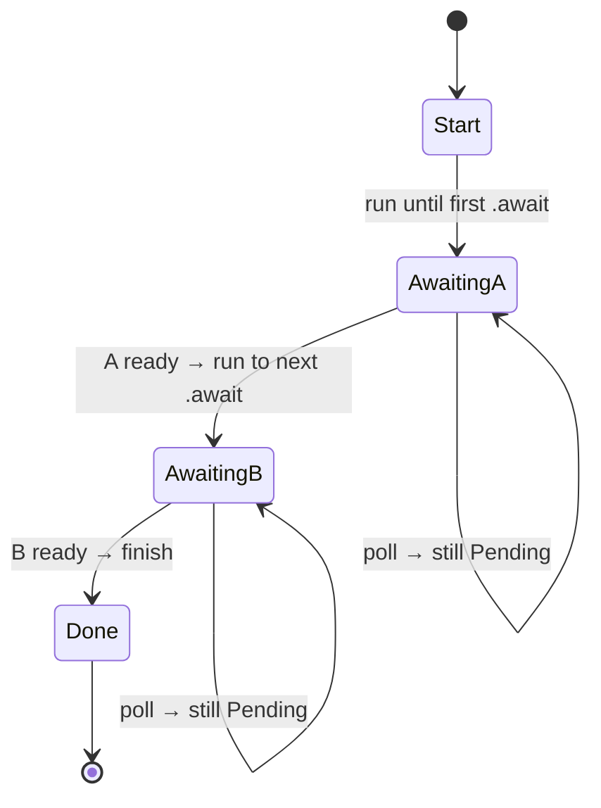

<h1><span class="h1-kicker">Asynchronous Rust</span>Futures & the Poll Model</h1>

You've been using `async`/`await` as convenient syntax. Now let's lift the hood. Underneath, a future is just a **state machine** that a runtime **polls** — repeatedly asking "are you done yet?" Understanding this model demystifies async Rust: why futures are lazy, why they're zero-cost, and what `.await` really compiles to. You rarely write this machinery by hand, but *seeing* it makes everything above it click.

## The `Future` trait

Every future implements one trait, and it's surprisingly small:

```rust,ignore
use std::pin::Pin;
use std::task::{Context, Poll};

trait Future {
    type Output;
    fn poll(self: Pin<&mut Self>, cx: &mut Context<'_>) -> Poll<Self::Output>;
}
```

The whole async world rests on that one method, `poll`, which returns a `Poll`:

```rust,ignore
enum Poll<T> {
    Ready(T),   // done — here's the result
    Pending,    // not done yet — try me again later
}
```

> [!key] A future is "code you can pause and resume"
> `poll` asks the future to make as much progress as it can *right now*. If it can finish, it returns **`Ready(value)`**. If it hits something it must wait for (a socket with no data yet), it returns **`Pending`** — parking itself so the thread can go do other work. The runtime will `poll` it again when there's a reason to. That "make progress, or report not-ready" contract is the entire model.

## Poll it yourself

Because `poll` is just a method, you can implement `Future` by hand. Here's a trivial future that's immediately ready, driven by a tiny executor from the `futures` crate:

```rust
use std::future::Future;
use std::pin::Pin;
use std::task::{Context, Poll};

struct Answer;

impl Future for Answer {
    type Output = i32;
    fn poll(self: Pin<&mut Self>, _cx: &mut Context<'_>) -> Poll<i32> {
        Poll::Ready(42) // no waiting needed — done on the first poll
    }
}

fn main() {
    // block_on drives the future by polling until it's Ready:
    let result = futures::executor::block_on(Answer);
    println!("{result}"); // 42
}
```

A more interesting future returns `Pending` until some condition holds, tracking its progress in fields — a **state machine**:

```rust
use std::future::Future;
use std::pin::Pin;
use std::task::{Context, Poll};

// A future that must be polled 3 times before it's ready.
struct Countdown { polls_left: u32 }

impl Future for Countdown {
    type Output = &'static str;
    fn poll(mut self: Pin<&mut Self>, cx: &mut Context<'_>) -> Poll<&'static str> {
        if self.polls_left == 0 {
            Poll::Ready("liftoff!")
        } else {
            self.polls_left -= 1;
            cx.waker().wake_by_ref(); // ask to be polled again immediately
            Poll::Pending
        }
    }
}

fn main() {
    println!("{}", futures::executor::block_on(Countdown { polls_left: 3 }));
}
```

## `async`/`await` compiles to exactly this

Here's the beautiful part. When you write an `async fn`, the compiler **automatically generates a state machine** just like `Countdown` — where each `.await` is a point the machine can pause at (a state) and later resume from. Your readable async code *becomes* a hand-written-quality `Future` impl:



Each `.await` splits the function into "before" and "after" states. Polling resumes at the last `.await` that returned `Pending`. This is why:

> [!key] Why futures are zero-cost and lazy
> The generated state machine is a plain struct on the stack — **no heap allocation, no garbage collector, no per-task thread**. That's why async Rust runs so lean. And since a future is inert until `poll` is called, it does nothing until the runtime drives it — the **laziness** you saw earlier is just "nobody has called `poll` yet."

## The `Waker`: how a task gets re-polled

If a future returns `Pending`, the runtime would waste CPU busy-polling it forever. So `poll` receives a **`Context`** containing a **`Waker`** — a callback the future stashes and *invokes* when it's worth polling again (e.g., "the socket now has data"). The runtime parks the task and only re-polls it after the waker fires.

<figure class="diagram">
<svg viewBox="0 0 640 180" role="img" aria-label="The executor polls a future; on Pending it parks the task until the waker signals readiness">
  <style>
    .fum { font: 600 12px var(--font-mono); fill: var(--text); }
    .fuc { font: 11px var(--font-sans); fill: var(--text-mute); }
    .ex { fill: var(--rust-100); stroke: var(--rust-400); stroke-width: 1.5; }
    .ft { fill: var(--blue-soft); stroke: var(--blue); stroke-width: 1.5; }
    .io { fill: var(--green-soft); stroke: var(--green); stroke-width: 1.5; }
  </style>
  <rect x="20" y="70" width="130" height="40" class="ex"/><text x="34" y="94" class="fum">Executor</text>
  <rect x="255" y="70" width="130" height="40" class="ft"/><text x="269" y="94" class="fum">Future</text>
  <rect x="490" y="70" width="130" height="40" class="io"/><text x="504" y="94" class="fum">I/O source</text>
  <path d="M152 82 L253 82" stroke="var(--rust-500)" stroke-width="2" marker-end="url(#afu)"/>
  <text x="160" y="74" class="fuc">poll()</text>
  <path d="M253 100 L154 100" stroke="var(--blue)" stroke-width="2" marker-end="url(#afu2)"/>
  <text x="165" y="118" class="fuc">Pending (registers Waker)</text>
  <path d="M490 96 C 430 130, 200 130, 150 108" stroke="var(--green)" stroke-width="2" fill="none" marker-end="url(#afu3)"/>
  <text x="270" y="150" class="fuc">data ready → waker.wake() → executor polls again → Ready ✅</text>
  <defs>
    <marker id="afu" markerWidth="9" markerHeight="9" refX="7" refY="3" orient="auto"><path d="M0,0 L7,3 L0,6 Z" fill="var(--rust-500)"/></marker>
    <marker id="afu2" markerWidth="9" markerHeight="9" refX="7" refY="3" orient="auto"><path d="M0,0 L7,3 L0,6 Z" fill="var(--blue)"/></marker>
    <marker id="afu3" markerWidth="9" markerHeight="9" refX="7" refY="3" orient="auto"><path d="M0,0 L7,3 L0,6 Z" fill="var(--green)"/></marker>
  </defs>
</svg>
<figcaption>The executor polls; on <code>Pending</code> the future registers a <b>Waker</b>; when the I/O is ready the waker fires and the executor re-polls.</figcaption>
</figure>

> [!deep] The division of labor
> - **The compiler** turns your `async` code into a `Future` state machine.
> - **The executor** (part of the runtime, e.g. tokio) repeatedly `poll`s top-level futures and manages the task queue.
> - **The reactor** (also in the runtime) talks to the OS (via `epoll`/`kqueue`/IOCP) to know *when* I/O is ready, and fires the wakers.
>
> You write the `async fn`; tokio provides the executor and reactor. This clean separation is why Rust can have *multiple* competing runtimes over the *same* `async`/`await` syntax.

> [!best] You won't hand-write futures — but know the model
> In practice you almost never implement `Future` manually; you write `async fn` and let the compiler build the state machine. The value of understanding `poll`/`Pending`/`Waker` is *diagnostic*: it explains why a future must be `.await`ed to run, why blocking inside async is a sin (it stalls the executor from polling other tasks), and what those `Pin<&mut Self>` signatures in error messages are about — which brings us to [pinning](#/ch/pinning) later.

## Summary

- A **future** implements the `Future` trait's one method, **`poll`**, which returns **`Poll::Ready(value)`** or **`Poll::Pending`**.
- `poll` means "make progress now"; **`Pending`** parks the task, **`Ready`** delivers the result — the whole async model in one contract.
- **`async`/`await` compiles to a state-machine `Future`**, where each `.await` is a pause/resume point — a plain struct with **no allocation or GC** (zero-cost, and lazy because nothing polls it until driven).
- A **`Waker`** (from the `Context`) lets a `Pending` future signal when it's worth re-polling, so the runtime doesn't busy-loop.
- The runtime splits into an **executor** (polls futures) and a **reactor** (watches the OS for I/O readiness); you just write `async fn`.

> [!exercise] Try it yourself
> 1. Implement a `Future` that returns `Poll::Ready(())` immediately and run it with `futures::executor::block_on`.
> 2. Modify the `Countdown` future to require 5 polls; add a `println!` in `poll` to watch it get polled repeatedly.
> 3. Explain in your own words why calling a blocking function (like `std::thread::sleep`) inside an `async fn` is harmful.

Enough theory — let's use the runtime that powers most async Rust in production: **tokio**.
