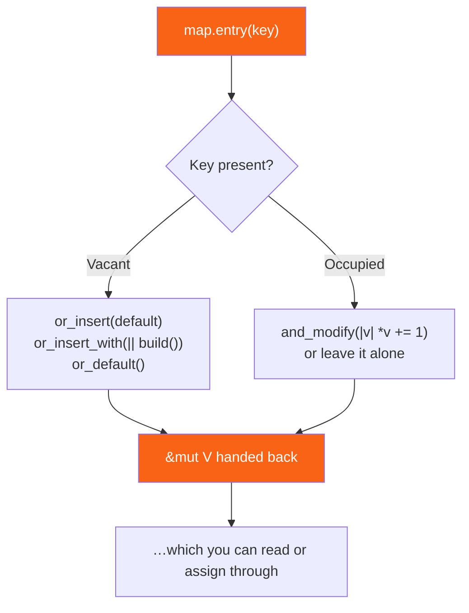

<h1><span class="h1-kicker">Common Collections</span>Hash Maps</h1>

A **hash map** stores data as **key–value pairs**: you look things up by a *key* instead of by a numeric position. "What's the score for team Blue?" "What's the price of this product ID?" "How many times does this word appear?" Whenever you think *"I want to associate X with Y and look it up fast,"* you want a `HashMap<K, V>`.

## Creating and inserting

`HashMap` isn't in the automatic prelude, so you bring it into scope with a `use` line first:

```rust
use std::collections::HashMap;

fn main() {
    let mut scores = HashMap::new();
    scores.insert(String::from("Blue"), 10);
    scores.insert(String::from("Yellow"), 50);

    println!("{scores:?}"); // order is not guaranteed!
}
```

Here `K` (the key type) is `String` and `V` (the value type) is `i32`. Rust infers both from your first `insert`.

> [!jargon] Key and value
> A **key** is what you look up by (a team name, an ID, a word). A **value** is the data stored under that key (a score, a price, a count). Keys are unique — inserting with a key that already exists **replaces** the old value.

When you already know the contents, there are shorter routes:

```rust
use std::collections::HashMap;

fn main() {
    // From an array of pairs — the most readable literal form:
    let prices = HashMap::from([("apple", 3), ("banana", 2)]);

    // From any iterator of pairs, via collect:
    let squares: HashMap<i32, i32> = (1..=4).map(|n| (n, n * n)).collect();

    // Zipping two lists together:
    let names = ["ada", "grace", "alan"];
    let ages = [36, 45, 41];
    let people: HashMap<_, _> = names.into_iter().zip(ages).collect();

    // Pre-sized, when you know roughly how many entries are coming:
    let mut big: HashMap<u32, String> = HashMap::with_capacity(1000);
    big.insert(1, String::from("one"));

    println!("{:?}", prices.get("apple"));
    println!("{:?}", squares.get(&3));
    println!("{:?}", people.get("grace"));
    println!("{}", big.len());
}
```

| Constructor | Use when |
|---|---|
| `HashMap::new()` | you'll fill it later |
| `HashMap::from([(k, v), …])` | the contents are known literals |
| `iter.collect()` | building from a `map`, `filter`, or `zip` |
| `HashMap::with_capacity(n)` | you know roughly the final size |
| `HashMap::default()` | inside generic code, or as a struct field default |

`insert` returns the **old** value if the key was already present — a detail that's easy to miss and often useful:

```rust
use std::collections::HashMap;

fn main() {
    let mut config = HashMap::new();

    let previous = config.insert("mode", "fast");
    println!("previous = {previous:?}"); // None — the key was new

    let previous = config.insert("mode", "safe");
    println!("previous = {previous:?}"); // Some("fast") — it replaced the old one

    println!("{config:?}"); // {"mode": "safe"}
}
```

## Looking things up with `get`

`get` returns an **`Option`**, because the key might not be present. This is the same "no null" safety you saw with `Option` — you can't forget the missing case:

```rust
use std::collections::HashMap;

fn main() {
    let mut scores = HashMap::new();
    scores.insert(String::from("Blue"), 10);

    // get returns Option<&V>
    match scores.get("Blue") {
        Some(score) => println!("Blue's score is {score}"),
        None => println!("Blue hasn't played yet"),
    }

    // A common one-liner: copy the value out, or use a default.
    let yellow = scores.get("Yellow").copied().unwrap_or(0);
    println!("Yellow's score is {yellow}"); // 0 (absent → default)
}
```

Notice something subtle in that example: the keys are `String`, but we looked up with `"Blue"`, a `&str`. That works because of a trait called `Borrow` — the map accepts any type its key can be borrowed *as*. You never have to allocate a `String` just to perform a lookup.

```rust
use std::collections::HashMap;

fn main() {
    let mut m: HashMap<String, i32> = HashMap::new();
    m.insert(String::from("alpha"), 1);

    println!("{:?}", m.get("alpha"));                       // ✅ &str works
    println!("{:?}", m.get(&String::from("alpha")));         // ✅ but allocates — don't
    println!("{}", m.contains_key("alpha"));                 // ✅ cheap test

    // get_mut hands you a mutable reference so you can edit in place:
    if let Some(v) = m.get_mut("alpha") {
        *v += 100;
    }
    println!("{m:?}"); // {"alpha": 101}

    // get_key_value returns both halves — useful when the key was normalized.
    println!("{:?}", m.get_key_value("alpha"));
}
```

| Method | Returns | Notes |
|---|---|---|
| `get(&k)` | `Option<&V>` | the safe default |
| `get_mut(&k)` | `Option<&mut V>` | edit the value in place |
| `get_key_value(&k)` | `Option<(&K, &V)>` | when you need the stored key too |
| `contains_key(&k)` | `bool` | membership only |
| `map[&k]` | `V` | **panics** if absent (via `Index`); rarely worth it |
| `len()` / `is_empty()` | `usize` / `bool` | size checks |
| `keys()` / `values()` | iterators | all keys / all values |

> [!best] `get(...).copied().unwrap_or(default)` is the idiom worth memorizing
> For `Copy` values, `map.get(&k).copied().unwrap_or(0)` reads the value or falls back — no branching, no panic. For non-`Copy` values use `.cloned()`, or `.map(String::as_str)` to keep borrowing. And when you want to *write* a default back into the map, that's the `entry` API below — not `unwrap_or`.

## Iterating

Loop over a hash map with a `for` loop, destructuring each pair into key and value:

```rust
use std::collections::HashMap;

fn main() {
    let mut prices = HashMap::new();
    prices.insert("apple", 3);
    prices.insert("banana", 2);
    prices.insert("cherry", 8);

    for (item, price) in &prices {
        println!("{item}: ${price}");
    }
}
```

There's a whole family of iterators, matching the three `Vec` forms plus key/value-only views:

```rust
use std::collections::HashMap;

fn main() {
    let mut stock = HashMap::from([("bolts", 40), ("nuts", 12), ("nails", 300)]);

    // Keys and values separately:
    let mut names: Vec<&&str> = stock.keys().collect();
    names.sort();
    println!("items: {names:?}");
    println!("total: {}", stock.values().sum::<i32>());

    // Mutate every value in place:
    for v in stock.values_mut() {
        *v *= 2;
    }

    // Sort a hash map for display — collect, then sort:
    let mut sorted: Vec<(&str, i32)> = stock.iter().map(|(k, v)| (*k, *v)).collect();
    sorted.sort_by_key(|&(name, _)| name);
    println!("{sorted:?}");

    // Sort by value instead, descending:
    sorted.sort_by(|a, b| b.1.cmp(&a.1));
    println!("richest first: {sorted:?}");
}
```

| Method | Yields | The map afterwards |
|---|---|---|
| `iter()` (or `&map`) | `(&K, &V)` | unchanged |
| `iter_mut()` (or `&mut map`) | `(&K, &mut V)` | values editable |
| `into_iter()` (or `map`) | `(K, V)` | **consumed** |
| `keys()` / `into_keys()` | `&K` / `K` | unchanged / consumed |
| `values()` / `values_mut()` / `into_values()` | `&V` / `&mut V` / `V` | unchanged / editable / consumed |
| `drain()` | `(K, V)` | emptied, capacity kept |
| `retain(\|k, v\| …)` | — | non-matching entries removed |

> [!warning] Hash map order is intentionally random
> If you run the loop above twice, the items may print in **different orders**. `HashMap` gives no ordering guarantee — and it even randomizes iteration order per run to protect against a class of denial-of-service attacks. **Never rely on the order.** If you need keys sorted, use a `BTreeMap` (covered [next chapter](#/ch/other-collections)) or collect the keys into a `Vec` and sort them.

## How a hash map actually works

The name gives it away. When you insert a key, the map runs it through a **hash function** — a routine that turns the key into a number — and uses that number to decide which "bucket" (storage slot) the pair goes into. Looking up a key repeats the calculation and jumps straight to the right bucket, which is why lookups are, on average, **O(1)** (constant time — it doesn't matter whether the map holds ten items or ten million).

<figure class="diagram">
<svg viewBox="0 0 640 200" role="img" aria-label="A key is hashed to a number that selects a bucket where the value is stored">
  <style>
    .hm { font: 600 12px var(--font-mono); fill: var(--text); }
    .hc { font: 11px var(--font-sans); fill: var(--text-mute); }
    .keyb { fill: var(--blue-soft); stroke: var(--blue); stroke-width: 1.5; }
    .hashb { fill: var(--purple-soft); stroke: var(--purple); stroke-width: 1.5; }
    .bkt { fill: var(--surface-2); stroke: var(--border-strong); stroke-width: 1.5; }
    .bktf { fill: var(--rust-100); stroke: var(--rust-400); stroke-width: 1.5; }
  </style>
  <rect x="20" y="80" width="100" height="34" class="keyb"/><text x="34" y="102" class="hm">"Blue"</text>
  <rect x="170" y="80" width="120" height="34" class="hashb"/><text x="184" y="102" class="hm">hash → 8213…</text>
  <path d="M122 97 L168 97" stroke="var(--purple)" stroke-width="2" marker-end="url(#ah)"/>
  <text x="180" y="132" class="hc">mod (number of buckets)</text>
  <g class="hm">
    <rect x="360" y="20" width="180" height="30" class="bkt"/><text x="372" y="40">bucket 0</text>
    <rect x="360" y="52" width="180" height="30" class="bkt"/><text x="372" y="72">bucket 1</text>
    <rect x="360" y="84" width="180" height="30" class="bktf"/><text x="372" y="104">bucket 2 → ("Blue", 10)</text>
    <rect x="360" y="116" width="180" height="30" class="bkt"/><text x="372" y="136">bucket 3</text>
  </g>
  <path d="M292 97 L358 99" stroke="var(--rust-500)" stroke-width="2" marker-end="url(#ah)"/>
  <text x="20" y="175" class="hc">Same key → same hash → same bucket, every time. That's why lookups are ~O(1).</text>
  <defs><marker id="ah" markerWidth="9" markerHeight="9" refX="7" refY="3" orient="auto"><path d="M0,0 L7,3 L0,6 Z" fill="var(--rust-500)"/></marker></defs>
</svg>
<figcaption>Keys are hashed to select a bucket, giving fast average-case insertion and lookup.</figcaption>
</figure>

### When two keys want the same bucket

There are far more possible keys than buckets, so sooner or later two keys land on the same slot — a **collision**. Rust's `HashMap` resolves it by *probing*: it walks forward to the next free slot, and a lookup follows the same walk, comparing keys until it finds a match or an empty slot.

<figure class="diagram">
<svg viewBox="0 0 640 220" role="img" aria-label="Two keys hash to bucket two, so the second key probes forward into bucket three">
  <style>
    .hp-m { font: 600 12px var(--font-mono); fill: var(--text); }
    .hp-c { font: 11px var(--font-sans); fill: var(--text-mute); }
    .hp-l { font: 700 12px var(--font-sans); }
    .hp-bkt { fill: var(--surface-2); stroke: var(--border-strong); stroke-width: 1.5; }
    .hp-a { fill: var(--rust-100); stroke: var(--rust-400); stroke-width: 1.5; }
    .hp-b { fill: var(--teal-soft); stroke: var(--teal); stroke-width: 1.5; }
  </style>
  <text x="20" y="20" class="hp-l" fill="var(--text-mute)">Both "cat" and "dog" hash to bucket 2:</text>
  <rect x="20" y="40" width="90" height="28" class="hp-a"/><text x="34" y="59" class="hp-m">"cat"</text>
  <rect x="20" y="86" width="90" height="28" class="hp-b"/><text x="34" y="105" class="hp-m">"dog"</text>
  <text x="120" y="59" class="hp-c">hash → 2</text>
  <text x="120" y="105" class="hp-c">hash → 2  ⚠ taken</text>
  <g class="hp-m">
    <rect x="330" y="20" width="210" height="28" class="hp-bkt"/><text x="342" y="39">0  (empty)</text>
    <rect x="330" y="48" width="210" height="28" class="hp-bkt"/><text x="342" y="67">1  (empty)</text>
    <rect x="330" y="76" width="210" height="28" class="hp-a"/><text x="342" y="95">2  ("cat", 1)</text>
    <rect x="330" y="104" width="210" height="28" class="hp-b"/><text x="342" y="123">3  ("dog", 2)  ← probed here</text>
    <rect x="330" y="132" width="210" height="28" class="hp-bkt"/><text x="342" y="151">4  (empty)</text>
  </g>
  <path d="M114 54 C 240 54, 250 90, 328 90" stroke="var(--rust-500)" stroke-width="2.5" fill="none" marker-end="url(#arr-hp)"/>
  <path d="M114 100 C 240 100, 250 90, 328 92" stroke="var(--teal)" stroke-width="2" fill="none" stroke-dasharray="5 3"/>
  <path d="M436 106 L436 100" stroke="var(--teal)" stroke-width="0"/>
  <path d="M545 90 C 570 90, 570 118, 545 118" stroke="var(--teal)" stroke-width="2.5" fill="none" marker-end="url(#arr-hp2)"/>
  <text x="20" y="190" class="hp-c">A lookup for "dog" hashes to 2, sees "cat" there, and keeps walking until it matches or hits an empty slot.</text>
  <text x="20" y="208" class="hp-c">Rust keeps the table under ~87% full so those walks stay short — that's why average lookup stays O(1).</text>
  <defs>
    <marker id="arr-hp" markerWidth="9" markerHeight="9" refX="7" refY="3" orient="auto"><path d="M0,0 L7,3 L0,6 Z" fill="var(--rust-500)"/></marker>
    <marker id="arr-hp2" markerWidth="9" markerHeight="9" refX="7" refY="3" orient="auto"><path d="M0,0 L7,3 L0,6 Z" fill="var(--teal)"/></marker>
  </defs>
</svg>
<figcaption>On a <b>collision</b>, the map probes forward to the next free slot. Keeping the table below a load factor threshold keeps probe chains short.</figcaption>
</figure>

> [!deep] Rust's `HashMap` is a SwissTable
> Since 2019 the standard library's `HashMap` has been the `hashbrown` implementation — a Rust port of Google's **SwissTable**. It stores a compact array of one-byte hash fragments alongside the buckets, so a single SIMD comparison can test many slots at once. That's why it's fast despite using a deliberately slow, DoS-resistant hash function (SipHash-1-3) by default. You get both properties: hard to attack, and quick in practice.

> [!note] What can be a key?
> Any type that implements the `Hash` and `Eq` traits — which includes all the basics: integers, `String`, `&str`, `bool`, `char`, and tuples of those. Your own structs can be keys too; just add `#[derive(Hash, Eq, PartialEq)]`. `f64` is *not* a valid key (floating-point equality is unreliable — `NaN != NaN`).

## Your own types as keys

Deriving three traits is all it takes:

```rust
use std::collections::HashMap;

#[derive(Debug, Hash, Eq, PartialEq, Clone)]
struct Coord {
    x: i32,
    y: i32,
}

fn main() {
    let mut grid: HashMap<Coord, char> = HashMap::new();
    grid.insert(Coord { x: 0, y: 0 }, '@');
    grid.insert(Coord { x: 3, y: 1 }, '#');

    println!("{:?}", grid.get(&Coord { x: 3, y: 1 })); // Some('#')
    println!("{:?}", grid.get(&Coord { x: 9, y: 9 })); // None

    // Tuples work out of the box, and are often simpler than a struct:
    let mut sparse: HashMap<(i32, i32), char> = HashMap::new();
    sparse.insert((0, 0), '@');
    println!("{:?}", sparse.get(&(0, 0)));
}
```

> [!warning] `Hash` and `Eq` must agree
> The contract is: **if two values are equal, they must hash identically.** Deriving both keeps that automatic. But if you hand-write `PartialEq` to ignore a field (say, a cache timestamp) while `Hash` still includes it, equal keys will hash differently and your map will silently "lose" entries. Either derive both or implement both consistently — never mix a manual one with a derived one.

## Updating values — the `entry` API

Updating is where hash maps really shine. The **`entry`** method is the idiomatic tool: it looks up a key and lets you insert a default *only if it's missing*. This gives you the famous, elegant word-counter in three lines:

```rust
use std::collections::HashMap;

fn main() {
    let text = "the quick brown fox the lazy dog the end";
    let mut counts: HashMap<&str, i32> = HashMap::new();

    for word in text.split_whitespace() {
        // entry().or_insert(0) returns a &mut to the value (inserting 0 first
        // if the word is new). We then increment it with *.
        *counts.entry(word).or_insert(0) += 1;
    }

    println!("{counts:?}"); // {"the": 3, "fox": 1, ...} (order varies)
}
```

Read `*counts.entry(word).or_insert(0) += 1;` as: *"find `word`; if it's not there, start it at 0; either way, give me a mutable handle to its count, and add one."*

An `Entry` is best pictured as a decision that has already been made — the map has found the slot, and now you say what should happen in each case:



Each variant covers a different everyday need:

```rust
use std::collections::HashMap;

fn main() {
    let mut m: HashMap<&str, i32> = HashMap::new();

    // or_insert: use this default if absent
    *m.entry("a").or_insert(0) += 1;

    // or_default: use the type's Default (0 for numbers, "" for String, vec![] for Vec)
    *m.entry("b").or_default() += 5;

    // or_insert_with: the default is EXPENSIVE, so only build it when needed
    let v = m.entry("c").or_insert_with(|| (1..=100).sum());
    println!("c = {v}");

    // and_modify(...).or_insert(...): different behaviour for each case
    m.entry("a").and_modify(|v| *v *= 10).or_insert(1); // present → 10
    m.entry("z").and_modify(|v| *v *= 10).or_insert(1); // absent  → 1

    let mut sorted: Vec<_> = m.into_iter().collect();
    sorted.sort();
    println!("{sorted:?}"); // [("a", 10), ("b", 5), ("c", 5050), ("z", 1)]
}
```

For anything more involved, match on the `Entry` enum directly:

```rust
use std::collections::hash_map::Entry;
use std::collections::HashMap;

fn main() {
    let mut inventory: HashMap<&str, u32> = HashMap::from([("bolts", 3)]);

    for item in ["bolts", "nuts"] {
        match inventory.entry(item) {
            Entry::Occupied(mut e) => {
                println!("{item}: had {}, restocking", e.get());
                *e.get_mut() += 10;
            }
            Entry::Vacant(e) => {
                println!("{item}: new item, starting at 10");
                e.insert(10);
            }
        }
    }

    let mut out: Vec<_> = inventory.into_iter().collect();
    out.sort();
    println!("{out:?}"); // [("bolts", 13), ("nuts", 10)]
}
```

| Entry method | If the key is absent | If it's present |
|---|---|---|
| `or_insert(v)` | insert `v` | leave it |
| `or_insert_with(f)` | insert `f()` — **lazy** | leave it, `f` never runs |
| `or_insert_with_key(f)` | insert `f(&key)` | leave it |
| `or_default()` | insert `V::default()` | leave it |
| `and_modify(f)` | nothing (chain `or_insert`) | run `f(&mut v)` |
| `key()` | read the key you passed in | same |
| `Entry::Occupied(e)` | — | `e.get()`, `e.get_mut()`, `e.insert(v)`, `e.remove()` |
| `Entry::Vacant(e)` | `e.insert(v)` → `&mut V` | — |

All of them return `&mut V`, so they chain: `map.entry(k).or_default().push(x)` builds a **multimap** — many values grouped under one key — in a single lookup:

```rust
use std::collections::HashMap;

fn main() {
    let words = ["apple", "avocado", "banana", "blueberry", "cherry"];
    let mut by_letter: HashMap<char, Vec<&str>> = HashMap::new();

    for w in words {
        let first = w.chars().next().unwrap();
        by_letter.entry(first).or_default().push(w);
    }

    let mut groups: Vec<_> = by_letter.into_iter().collect();
    groups.sort();
    for (letter, list) in groups {
        println!("{letter}: {list:?}");
    }
}
```

> [!best] Reach for `entry` instead of `contains_key` + `insert`
> The clumsy way is `if map.contains_key(k) { ... } else { map.insert(...) }` — two lookups and more code. `entry` does it in one lookup and reads beautifully. Its variants — `or_insert(default)`, `or_insert_with(|| expensive())`, `or_default()` — cover every "insert-or-update" case.

> [!mistake] `or_insert_with` vs `or_insert` matters when the default costs something
> `map.entry(k).or_insert(expensive_default())` evaluates `expensive_default()` **every single time**, even when the key is already there and the value is thrown away. `or_insert_with(|| expensive_default())` only calls it when actually inserting. For `0` or `""` it makes no difference; for a database query or a `Vec` with capacity, it's the whole ballgame.

## Removing entries

```rust
use std::collections::HashMap;

fn main() {
    let mut m = HashMap::from([("a", 1), ("b", 2), ("c", 3), ("d", 4)]);

    println!("removed: {:?}", m.remove("a"));        // Some(1)
    println!("removed: {:?}", m.remove("zz"));       // None — not an error

    // remove_entry gives you the key back as well:
    println!("{:?}", m.remove_entry("b"));           // Some(("b", 2))

    // retain: bulk-delete in one pass
    m.retain(|_k, v| *v % 2 == 0);
    println!("even values only: {m:?}");             // {"d": 4}

    m.clear();
    println!("cleared: {m:?}, capacity kept: {}", m.capacity() > 0);
}
```

| Method | Effect |
|---|---|
| `remove(&k)` | remove and return `Option<V>` |
| `remove_entry(&k)` | remove and return `Option<(K, V)>` |
| `retain(\|k, v\| …)` | keep only entries passing the test — one pass |
| `drain()` | remove everything, yielding the pairs |
| `clear()` | remove everything, keeping capacity |
| `reserve(n)` / `shrink_to_fit()` | tune capacity by hand |

## A note on ownership

For types that aren't `Copy` (like `String`), `insert` **moves** the key and value into the map — the map now owns them:

```rust
use std::collections::HashMap;

fn main() {
    let name = String::from("favorite");
    let value = String::from("Rust");

    let mut map = HashMap::new();
    map.insert(name, value); // both are moved into the map
    // println!("{name}");   // ❌ name was moved

    println!("{map:?}");
}
```

If you want the map to hold borrowed data instead of owning it, use references as the value type (`HashMap<String, &str>`) — but then you're back in lifetime territory, so owning is usually simpler.

> [!performance] Swapping the hasher for trusted keys
> The default hasher (SipHash) is chosen to resist attackers who could otherwise flood your server with colliding keys. If your keys come from your own code rather than the network — say, small integer IDs in a hot loop — a faster hasher can measurably help: `ahash`, `rustc-hash`, or `fxhash`. You plug one in via the third type parameter, `HashMap<K, V, S>`, and everything else stays the same. Measure before you switch; for most maps the default is not the bottleneck.

## Summary

- **`HashMap<K, V>`** stores **key–value pairs** for fast, average **O(1)** lookup by key. Import it with `use std::collections::HashMap;`.
- Build with `new()`, **`from([(k, v), …])`**, `collect()`, or `with_capacity(n)`. `insert` returns the **old** value if there was one.
- **`get`** returns an **`Option`**, and accepts a borrowed form of the key (look up a `String` key with a `&str`).
- Iterate with `iter`, `iter_mut`, `keys`, `values`, `values_mut`, `into_iter`; iteration order is **unspecified and randomized** — never depend on it.
- Keys need **`Hash` + `Eq`**; derive both together on your own types, and never let them disagree. `f64` can't be a key.
- The **`entry`** API is the power tool: `or_insert`, `or_insert_with` (lazy), `or_default`, `and_modify`, or a full `match` on `Occupied`/`Vacant`. `entry(k).or_default().push(v)` builds a multimap in one lookup.
- Remove with `remove`, `remove_entry`, or **`retain`** for bulk deletion.
- `insert` **moves** non-`Copy` keys and values into the map, which then owns them.

> [!exercise] Try it yourself
> 1. Build a `HashMap<&str, i32>` of three products and their prices, then look up one with `get` and handle both `Some` and `None`.
> 2. Write a word-frequency counter for a sentence of your choice using the `entry` API, then print the results sorted by count, highest first.
> 3. Group a list of names into a `HashMap<char, Vec<&str>>` by first letter using `entry().or_default().push()`.
> 4. Make a struct `Point { x: i32, y: i32 }` usable as a key, and build a sparse grid with it. Then try removing `Hash` from the derive list and read the error.
> 5. Use `and_modify(...).or_insert(...)` to write a "seen counter" that starts new keys at 1 and increments existing ones — in a single expression.

Vectors, strings, and hash maps cover the vast majority of collection needs. Next, we round out the toolkit with the rest of **`std::collections`** — deques, ordered maps, sets, and heaps.
