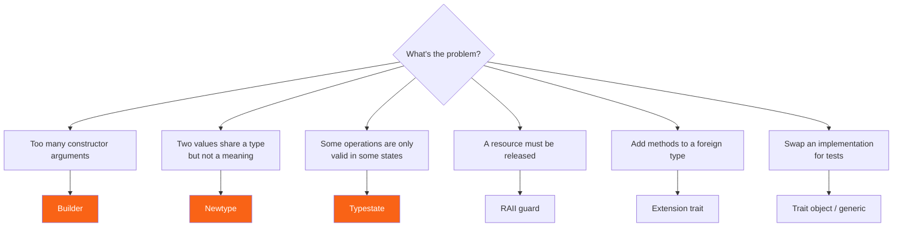

<h1><span class="h1-kicker">Idioms & Design Patterns</span>Rust Design Patterns</h1>

Most design-pattern catalogues were written for languages built on inheritance. Rust doesn't have inheritance, so half of them don't apply — and Rust's ownership system makes some *new* patterns possible that other languages can only approximate. This chapter covers the patterns that experienced Rust programmers actually reach for, and the problem each one solves.

You'll recognize a few by name. What matters is *why* they look the way they do in Rust.

## The pattern map



## Newtype: a distinct type for a distinct meaning

The simplest and most valuable pattern in Rust. Wrap a type in a one-field tuple struct to give it its own identity:

```rust
#[derive(Debug, Clone, Copy, PartialEq)]
struct UserId(u64);

#[derive(Debug, Clone, Copy, PartialEq)]
struct OrderId(u64);

fn fetch_user(id: UserId) -> String {
    format!("user #{}", id.0)
}

fn main() {
    let user = UserId(7);
    let order = OrderId(7);

    println!("{}", fetch_user(user));
    // println!("{}", fetch_user(order)); // ❌ mismatched types — caught at compile time!

    // They're both u64 underneath, but they are NOT interchangeable:
    println!("same number, different types: {}", user.0 == order.0);
}
```

Two `u64`s that mean different things are a bug waiting to happen — `transfer(from_account, to_account)` with the arguments swapped compiles fine and ruins someone's day. Newtypes make that mistake impossible, and they cost **nothing** at runtime: the wrapper vanishes during compilation.

<figure class="diagram">
<svg viewBox="0 0 640 190" role="img" aria-label="A newtype wrapper exists only at compile time and disappears in the generated machine code">
  <style>
    .nt-h { font: 700 12px var(--font-sans); fill: var(--text); }
    .nt-m { font: 600 12px var(--font-mono); fill: var(--text); }
    .nt-c { font: 11px var(--font-sans); fill: var(--text-mute); }
    .nt-t { fill: var(--rust-100); stroke: var(--rust-400); stroke-width: 1.5; }
    .nt-r { fill: var(--surface-2); stroke: var(--border-strong); stroke-width: 1.5; }
  </style>
  <text x="20" y="20" class="nt-h" fill="var(--rust-600)">At compile time — three distinct types:</text>
  <rect x="20" y="32" width="150" height="34" rx="4" class="nt-t"/><text x="34" y="54" class="nt-m">UserId(u64)</text>
  <rect x="190" y="32" width="150" height="34" rx="4" class="nt-t"/><text x="204" y="54" class="nt-m">OrderId(u64)</text>
  <rect x="360" y="32" width="150" height="34" rx="4" class="nt-t"/><text x="374" y="54" class="nt-m">u64</text>
  <text x="20" y="86" class="nt-c">Mixing them up is a type error. The compiler checks every call site.</text>
  <text x="20" y="126" class="nt-h" fill="var(--green)">In the generated machine code — one type:</text>
  <rect x="20" y="138" width="150" height="34" rx="4" class="nt-r"/><text x="34" y="160" class="nt-m">64-bit integer</text>
  <path d="M180 100 C 240 100, 100 118, 95 136" stroke="var(--green)" stroke-width="0" fill="none"/>
  <text x="190" y="152" class="nt-c">No wrapper struct, no indirection, no runtime cost.</text>
  <text x="190" y="168" class="nt-c">Safety here is genuinely free.</text>
</svg>
<figcaption>A <b>newtype</b> is a compile-time-only distinction. You pay in keystrokes, never in cycles.</figcaption>
</figure>

Newtypes also solve two other problems:

```rust
use std::fmt;

// (1) Implement a foreign trait on a foreign type — impossible without a wrapper,
//     because of the orphan rule.
struct CommaList(Vec<String>);

impl fmt::Display for CommaList {
    fn fmt(&self, f: &mut fmt::Formatter) -> fmt::Result {
        write!(f, "{}", self.0.join(", "))
    }
}

// (2) Enforce an invariant at the boundary: once you hold an Email, it IS valid.
#[derive(Debug)]
struct Email(String);

impl Email {
    fn parse(raw: &str) -> Result<Email, &'static str> {
        if raw.contains('@') && raw.len() >= 3 {
            Ok(Email(raw.to_lowercase()))
        } else {
            Err("not a valid email")
        }
    }

    fn as_str(&self) -> &str {
        &self.0
    }
}

fn main() {
    let list = CommaList(vec!["a".into(), "b".into(), "c".into()]);
    println!("{list}");

    println!("{:?}", Email::parse("Ada@Example.com"));
    println!("{:?}", Email::parse("nope"));

    // Downstream code never has to re-validate — the type is the proof.
    if let Ok(email) = Email::parse("grace@navy.mil") {
        println!("sending to {}", email.as_str());
    }
}
```

> [!key] Parse, don't validate
> The `Email` type above encodes a promise: *if you have one of these, it has already been checked.* Every function taking an `Email` is relieved of validating, and — more importantly — **cannot forget to**. Compare that with passing `String` around and hoping someone checked. Push validation to the edge of your program, return a rich type, and let the type system carry the guarantee inward. This single idea eliminates whole categories of bug.

> [!jargon] The orphan rule
> Rust only lets you implement a trait for a type if **you own the trait or you own the type**. Otherwise two different crates could both write `impl Display for Vec<T>` and the compiler couldn't choose. That restriction is the *orphan rule*, and the newtype wrapper is the standard way around it: you own `CommaList`, so you may implement anything for it.

## Builder: construction with many options

When a type has a dozen fields, most of them optional, a constructor with twelve parameters is unreadable. The builder pattern gives each option a name:

```rust
#[derive(Debug)]
struct Server {
    host: String,
    port: u16,
    threads: usize,
    tls: bool,
    timeout_secs: u64,
}

struct ServerBuilder {
    host: String,
    port: u16,
    threads: usize,
    tls: bool,
    timeout_secs: u64,
}

impl ServerBuilder {
    fn new(host: impl Into<String>) -> Self {
        // Required arguments go in new(); everything else gets a sane default.
        ServerBuilder { host: host.into(), port: 8080, threads: 4, tls: false, timeout_secs: 30 }
    }

    // Each setter takes `self` and returns `Self`, so calls chain.
    fn port(mut self, port: u16) -> Self {
        self.port = port;
        self
    }

    fn threads(mut self, n: usize) -> Self {
        self.threads = n;
        self
    }

    fn tls(mut self, on: bool) -> Self {
        self.tls = on;
        self
    }

    fn build(self) -> Server {
        Server {
            host: self.host,
            port: self.port,
            threads: self.threads,
            tls: self.tls,
            timeout_secs: self.timeout_secs,
        }
    }
}

fn main() {
    // Read it aloud — every value is labelled.
    let server = ServerBuilder::new("0.0.0.0").port(443).tls(true).threads(16).build();
    println!("{server:#?}");

    // Defaults make the simple case simple:
    let dev = ServerBuilder::new("localhost").build();
    println!("dev port = {}, tls = {}", dev.port, dev.tls);
}
```

| Builder style | Setter signature | Good for |
|---|---|---|
| **Consuming** (shown above) | `fn port(mut self, …) -> Self` | one-shot chains; the common choice |
| **Mutable-reference** | `fn port(&mut self, …) -> &mut Self` | conditional configuration in a loop |
| **Owned-with-clone** | `fn port(&self, …) -> Self` | reusing a partially-built template |
| **Typestate** (below) | changes the type each step | making `build()` impossible until valid |

> [!best] Reach for `derive` before hand-writing a builder
> Hand-writing a builder for a twelve-field struct is a hundred lines of mechanical code. The [`derive_builder`](#/ch/essential-crates) and `typed-builder` crates generate it from an attribute. Write one by hand when you need unusual behaviour — validation in `build()`, computed defaults, or a typestate — and derive it otherwise. Knowing how it works matters; typing it out every time does not.

> [!mistake] Don't forget what `build()` should return
> If construction can fail — a required field left unset, two options that contradict each other — `build()` must return `Result<Server, BuildError>`, not panic. A builder that panics at runtime has thrown away the very safety that made you write it. Better still, use a typestate so the invalid call doesn't compile.

## Typestate: let the compiler track what's legal

The typestate pattern encodes an object's *state in its type*, so operations that are illegal in a given state simply don't exist. Here's a request that can't be sent before it has a URL:

```rust
use std::marker::PhantomData;

// Marker types — they hold no data and vanish at compile time.
struct Draft;
struct Ready;

struct Request<State> {
    url: Option<String>,
    body: String,
    _state: PhantomData<State>,
}

impl Request<Draft> {
    fn new() -> Self {
        Request { url: None, body: String::new(), _state: PhantomData }
    }

    fn body(mut self, b: impl Into<String>) -> Self {
        self.body = b.into();
        self
    }

    // Setting the URL is the transition Draft → Ready.
    fn url(self, u: impl Into<String>) -> Request<Ready> {
        Request { url: Some(u.into()), body: self.body, _state: PhantomData }
    }
}

// `send` exists ONLY on Request<Ready>. There is no way to call it too early.
impl Request<Ready> {
    fn send(self) -> String {
        format!("POST {} ({} bytes)", self.url.unwrap(), self.body.len())
    }
}

fn main() {
    let response = Request::new().body("hello=world").url("https://example.com").send();
    println!("{response}");

    // let bad = Request::new().body("x").send();
    // ❌ error: no method named `send` found for struct `Request<Draft>`
}
```

> [!key] Typestate turns runtime checks into compile errors
> Without it, `send()` would need `if self.url.is_none() { return Err(...) }` — a check that runs on every call, forever, for a mistake that could have been caught once at compile time. With typestate, the invalid program **doesn't exist**. This is the same instinct as the newtype `Email`: move the guarantee into the type, and stop paying for it at runtime.

> [!deep] Why `PhantomData`?
> `Request<State>` has a type parameter it never actually stores. Rust rejects unused type parameters, because it can't work out variance or drop behaviour for them. `PhantomData<State>` is a zero-sized marker that says "pretend this struct holds a `State`" — it occupies no memory and generates no code, but satisfies the compiler. It's the standard tool for any type-level bookkeeping. See [Advanced Types](#/ch/advanced-types) for more.

> [!warning] Typestate has a real cost: API surface
> Each state needs its own `impl` block, and every transition allocates a new value (usually optimized away, but the source gets longer). It's a superb fit for a handful of states with genuinely different capabilities — connection lifecycles, builders with required fields, protocol handshakes. It's overkill for a struct with one optional field. Use it where an illegal call would be *expensive*, not merely possible.

## RAII guards: cleanup that can't be forgotten

Rust's `Drop` trait runs code when a value goes out of scope. That turns "remember to release this" into "the compiler releases it for you" — the pattern behind `MutexGuard`, `File`, and every other resource in the standard library.

```rust
struct Transaction {
    name: String,
    committed: bool,
}

impl Transaction {
    fn begin(name: &str) -> Self {
        println!("BEGIN {name}");
        Transaction { name: name.to_string(), committed: false }
    }

    fn commit(mut self) {
        println!("COMMIT {}", self.name);
        self.committed = true;
        // `self` is dropped here, and Drop sees committed == true.
    }
}

impl Drop for Transaction {
    fn drop(&mut self) {
        if !self.committed {
            // Runs on every early return, every `?`, even on a panic.
            println!("ROLLBACK {} (never committed)", self.name);
        }
    }
}

fn happy_path() {
    let tx = Transaction::begin("happy");
    println!("  …doing work…");
    tx.commit();
}

fn early_exit() {
    let _tx = Transaction::begin("aborted");
    println!("  …something went wrong, returning early…");
    return; // no explicit cleanup, yet the rollback still happens
}

fn main() {
    happy_path();
    early_exit();
}
```

> [!best] Return a guard instead of asking callers to clean up
> An API shaped `lock()` / `unlock()` invites the bug where `unlock()` is skipped on an early return. An API where `lock()` returns a guard makes that bug unrepresentable — which is exactly why `Mutex::lock` returns a `MutexGuard` rather than `()`. Whenever you're tempted to document "remember to call `close()`", return a guard type instead and let `Drop` do it.

> [!warning] `Drop` can't fail and can't be async
> `drop` returns `()`, so there's nowhere to report an error, and panicking inside it during another panic aborts the process. It also can't `.await`. So for flushing a file or closing a database connection — where failure matters — provide an explicit `close(self) -> Result<()>` **as well**, and treat `Drop` as the safety net for the paths that skipped it. This is a genuine sharp edge, not a detail.

## Extension traits: adding methods to types you don't own

You can't add an inherent method to `Vec<T>` or `str` — but you can define a trait and implement it for them:

```rust
trait Summarize {
    fn summarize(&self, max_chars: usize) -> String;
}

impl Summarize for str {
    fn summarize(&self, max_chars: usize) -> String {
        if self.chars().count() <= max_chars {
            self.to_string()
        } else {
            let kept: String = self.chars().take(max_chars.saturating_sub(1)).collect();
            format!("{kept}…")
        }
    }
}

trait Stats {
    fn mean(&self) -> Option<f64>;
}

impl Stats for [f64] {
    fn mean(&self) -> Option<f64> {
        if self.is_empty() {
            None
        } else {
            Some(self.iter().sum::<f64>() / self.len() as f64)
        }
    }
}

fn main() {
    // Now these read like built-in methods:
    println!("{}", "a short one".summarize(30));
    println!("{}", "quite a long sentence that needs cutting".summarize(20));

    let readings = [1.0, 2.0, 4.0, 8.0];
    println!("mean = {:?}", readings.mean());
    println!("empty mean = {:?}", ([] as [f64; 0]).mean());
}
```

> [!tip] Name extension traits `…Ext`
> The convention is `IteratorExt`, `SliceExt`, `ResponseExt` — a strong signal to readers that the trait exists to add methods rather than to abstract over implementations. Callers must `use` the trait for the methods to appear, which is why crates like `itertools` and `futures` ask you to import `Itertools` or `StreamExt`. If a method suddenly "doesn't exist", a missing `use` of an extension trait is the first thing to check.

## Strategy: swapping behaviour

Where other languages reach for an abstract base class, Rust has two options — and the choice is about *when* you need to decide.

```rust
trait Formatter {
    fn format(&self, msg: &str) -> String;
}

struct Plain;
struct Json;

impl Formatter for Plain {
    fn format(&self, msg: &str) -> String {
        msg.to_string()
    }
}

impl Formatter for Json {
    fn format(&self, msg: &str) -> String {
        format!("{{\"message\":\"{msg}\"}}")
    }
}

// Static dispatch: the type is known at compile time. Fastest, monomorphized.
fn log_static<F: Formatter>(f: &F, msg: &str) {
    println!("{}", f.format(msg));
}

// Dynamic dispatch: the type is decided at runtime. One copy of the code.
fn log_dynamic(f: &dyn Formatter, msg: &str) {
    println!("{}", f.format(msg));
}

fn main() {
    log_static(&Plain, "hello");
    log_static(&Json, "hello");

    // Only dynamic dispatch lets you choose based on runtime data:
    let use_json = true;
    let chosen: Box<dyn Formatter> = if use_json { Box::new(Json) } else { Box::new(Plain) };
    log_dynamic(chosen.as_ref(), "runtime choice");

    // …or store a heterogeneous collection of them:
    let all: Vec<Box<dyn Formatter>> = vec![Box::new(Plain), Box::new(Json)];
    for f in &all {
        println!("{}", f.format("each"));
    }
}
```

| Choose | When | Cost |
|---|---|---|
| `impl Trait` / `<T: Trait>` | the type is known at compile time | zero — inlined, monomorphized |
| `&dyn Trait` / `Box<dyn Trait>` | the choice depends on runtime data, or you need a mixed collection | one pointer indirection, no inlining |

> [!performance] Start with generics, switch to `dyn` when you need it
> Generic (static) dispatch is faster and inlines well, but it duplicates the function for every concrete type — which grows your binary and your compile time. `dyn` compiles to one copy behind a vtable lookup, which is cheap but not free and blocks inlining. In practice: use generics in hot inner loops and small libraries; use `dyn` for plugin-style boundaries, configuration-driven choices, and anywhere binary size matters more than a nanosecond. See [Trait Objects](#/ch/trait-objects) for the mechanics.

## Summary

- **Newtype** — wrap a value to give it a distinct type. Free at runtime; prevents mixed-up arguments, bypasses the orphan rule, and encodes invariants ("parse, don't validate").
- **Builder** — name your constructor arguments and supply defaults. Consuming setters chain best; derive it rather than typing it; return `Result` from `build()` if it can fail.
- **Typestate** — put the state in the type so illegal operations don't compile. `PhantomData` carries the marker at zero cost. Worth it when an illegal call would be expensive.
- **RAII guard** — implement `Drop` so cleanup happens on every path, including early returns and panics. But `Drop` can't fail or `await`, so pair it with an explicit `close()` when errors matter.
- **Extension trait** — add methods to types you don't own; name it `…Ext`, and remember callers must `use` it.
- **Strategy** — generics for compile-time choice (fast, duplicated), `dyn Trait` for runtime choice (flexible, one copy).

> [!exercise] Try it yourself
> 1. Make a `Newtype` pair `Meters(f64)` and `Seconds(f64)`, then write `fn speed(d: Meters, t: Seconds) -> f64`. Try calling it with the arguments swapped and read the error.
> 2. Write a `Password` newtype whose `parse` rejects anything under 12 characters, and whose `Debug` impl prints `Password(***)` instead of the contents.
> 3. Build a `QueryBuilder` for SQL with `.table()`, `.filter()`, and `.limit()`, where `build()` returns `Result<String, &'static str>` and errors if no table was set.
> 4. Convert that builder to a typestate so the missing-table case is a *compile* error instead.
> 5. Write a `Timer` RAII guard that prints the elapsed time when dropped, using `std::time::Instant`. Verify it fires on an early `return`.
> 6. Add an `Ext` trait to `Option<i32>` with a method `or_zero(self) -> i32`. Why can't you just write an inherent `impl` block for `Option`?

Next: the rules that turn a working library into one people enjoy using — Rust's **API design guidelines**.
