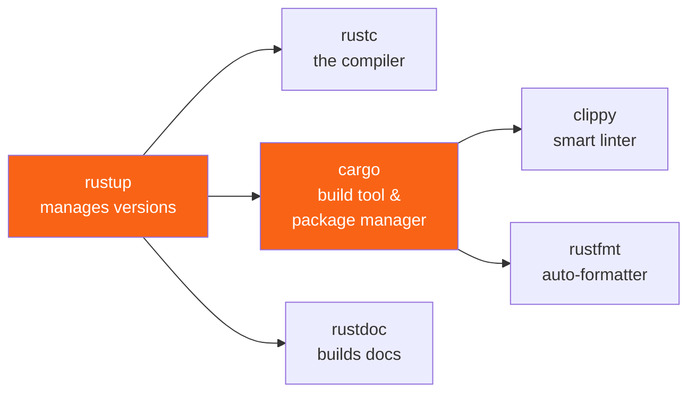

<h1><span class="h1-kicker">Getting Started</span>Installing Rust & Your Toolbox</h1>

You can read this whole book and run every example without installing anything — the **Run** buttons compile your code in the cloud. But the moment you want to build real programs on your own machine, you'll want Rust installed locally. It takes about two minutes, and this chapter walks you through it.

> [!key] One tool to rule them all: `rustup`
> Rust is installed and managed by a single program called **`rustup`** (the *Rust toolchain installer*). It installs the compiler, the package manager, and the documentation, and it keeps them all up to date. You almost never think about it again after the first day.

## What you're actually installing

When you install Rust, you get a small family of command-line tools that work together:



| Tool | What it does | You'll type it… |
|------|--------------|-----------------|
| **`rustup`** | Installs and updates Rust itself | Rarely |
| **`rustc`** | The compiler that turns `.rs` files into programs | Rarely (Cargo calls it for you) |
| **`cargo`** | Builds projects, runs them, downloads libraries | Constantly |
| **`clippy`** | A *linter* (a tool that flags questionable code) | Often |
| **`rustfmt`** | Formats your code to the standard style | Often |
| **`rustdoc`** | Turns doc comments into a browsable website | Occasionally |

> [!jargon] Jargon buster
> A **toolchain** is just the bundle of a specific compiler version plus its companion tools. A **linter** is a program that reads your code and points out likely mistakes or unidiomatic patterns without running it.

## Installing on macOS, Linux, or WSL

Open a terminal and run the official one-liner. It downloads `rustup` and walks you through a short prompt — just press Enter to accept the defaults:

```bash
curl --proto '=https' --tlsv1.2 -sSf https://sh.rustup.rs | sh
```

When it finishes, either restart your terminal or load Rust into your current session:

```bash
source "$HOME/.cargo/env"
```

## Installing on Windows

On Windows you have two easy options:

1. **The installer (recommended):** download and run **`rustup-init.exe`** from [rustup.rs](https://rustup.rs). It will offer to install the Microsoft **C++ Build Tools** if they're missing — say yes, because Rust uses the system *linker* (the tool that stitches compiled pieces into a final `.exe`).
2. **WSL (Windows Subsystem for Linux):** if you prefer a Linux environment, install WSL and then use the macOS/Linux command above.

> [!note] Why does Rust need a C++ linker?
> Rust compiles to fast native machine code and reuses your platform's existing linker to produce the final executable. That's why Windows wants the Build Tools and macOS wants the Xcode command-line tools (`xcode-select --install`).

| Platform | Extra prerequisite | How to get it |
|---|---|---|
| macOS | Xcode command-line tools | `xcode-select --install` |
| Windows (MSVC) | Visual Studio C++ Build Tools | the `rustup-init.exe` prompt offers it |
| Windows (GNU) | MinGW-w64 | `rustup toolchain install stable-gnu` |
| Debian / Ubuntu | a C compiler and linker | `sudo apt install build-essential` |
| Fedora / RHEL | the same | `sudo dnf install gcc` |
| Alpine | musl build tools | `apk add musl-dev gcc` |

> [!warning] Don't install Rust from your system package manager
> `apt install rustc` or `brew install rust` will work, but they give you a single fixed version with no easy way to update, switch toolchains, add compilation targets, or install `clippy` and `rustfmt` alongside. Distribution packages are also frequently months behind. Almost every confusing "my Rust is too old for this crate" problem traces back to this. Use `rustup` — and if you already installed a distro package, remove it first to avoid two `cargo` binaries fighting over your `PATH`.

## Where everything lands

`rustup` keeps your toolchains in one place and puts small *shim* programs on your `PATH`. Knowing this layout makes the whole system much less mysterious:

<figure class="diagram">
<svg viewBox="0 0 640 250" role="img" aria-label="Diagram showing that cargo on the PATH is a shim in the cargo bin directory which dispatches to the currently active toolchain in the rustup directory">
  <style>
    .in-h { font: 700 12px var(--font-sans); fill: var(--text); }
    .in-m { font: 600 11px var(--font-mono); fill: var(--text); }
    .in-c { font: 10.5px var(--font-sans); fill: var(--text-mute); }
    .in-shim { fill: var(--blue-soft); stroke: var(--blue); stroke-width: 1.5; }
    .in-tc { fill: var(--surface-2); stroke: var(--border-strong); stroke-width: 1.5; }
    .in-act { fill: var(--rust-100); stroke: var(--rust-500); stroke-width: 2.5; }
    .in-reg { fill: var(--green-soft); stroke: var(--green); stroke-width: 1.5; }
  </style>
  <text x="20" y="18" class="in-h">You type <tspan font-family="var(--font-mono)">cargo build</tspan>…</text>
  <rect x="20" y="30" width="180" height="46" rx="4" class="in-shim"/>
  <text x="30" y="49" class="in-m">~/.cargo/bin/cargo</text>
  <text x="30" y="65" class="in-c">a shim, not the real cargo</text>
  <text x="240" y="18" class="in-h">…which dispatches to the active toolchain</text>
  <rect x="240" y="30" width="240" height="34" rx="4" class="in-act"/>
  <text x="250" y="52" class="in-m">~/.rustup/toolchains/stable-…</text>
  <rect x="240" y="70" width="240" height="26" rx="4" class="in-tc"/>
  <text x="250" y="88" class="in-m">…/nightly-…</text>
  <rect x="240" y="102" width="240" height="26" rx="4" class="in-tc"/>
  <text x="250" y="120" class="in-m">…/1.83.0-…</text>
  <text x="492" y="52" class="in-c">← active</text>
  <path d="M202 53 L236 47" stroke="var(--blue)" stroke-width="2.2" marker-end="url(#arr-inst)"/>
  <rect x="20" y="150" width="200" height="46" rx="4" class="in-reg"/>
  <text x="30" y="169" class="in-m">~/.cargo/registry/</text>
  <text x="30" y="185" class="in-c">downloaded crate sources</text>
  <rect x="240" y="150" width="200" height="46" rx="4" class="in-reg"/>
  <text x="250" y="169" class="in-m">./target/</text>
  <text x="250" y="185" class="in-c">per-project build output</text>
  <text x="20" y="222" class="in-c">Because <tspan font-family="var(--font-mono)">cargo</tspan> is a shim, a <tspan font-family="var(--font-mono)">rust-toolchain.toml</tspan> file in your project can silently switch which compiler runs —</text>
  <text x="20" y="238" class="in-c">which is why the same command can produce a different version in two different directories.</text>
  <defs><marker id="arr-inst" markerWidth="9" markerHeight="9" refX="7" refY="3" orient="auto"><path d="M0,0 L7,3 L0,6 Z" fill="var(--blue)"/></marker></defs>
</svg>
<figcaption><code>~/.cargo/bin/cargo</code> is a <b>shim</b> that forwards to whichever toolchain is active. That indirection is what makes per-project compiler versions possible.</figcaption>
</figure>

> [!deep] The shim explains a confusing behaviour
> Run `rustc --version` in two different project directories and you may get two different answers, even though `which rustc` prints the same path. That's the shim doing its job: it checks for a `rust-toolchain.toml` file, an active override, or your default, and then runs the matching real compiler. It's also why `cargo +nightly build` works — the `+toolchain` argument is understood by the shim, not by Cargo itself. See [The Cargo Toolbox](#/ch/cargo-deep).

## Check that it worked

Whichever path you took, confirm your install by asking each tool for its version:

```bash
rustc --version
cargo --version
rustup --version
```

You should see something like `rustc 1.9x.y (...)`. 🎉 Congratulations — you have a complete Rust development environment.

For a slightly more satisfying check, here's a program that reports what your compiler is actually targeting. Save it as `check.rs` and run `rustc check.rs && ./check` — or just press **Run** to see it execute in the cloud:

```rust
fn main() {
    // These constants are baked in by the compiler at build time.
    println!("operating system : {}", std::env::consts::OS);
    println!("architecture     : {}", std::env::consts::ARCH);
    println!("family           : {}", std::env::consts::FAMILY);
    println!("executable suffix: {:?}", std::env::consts::EXE_SUFFIX);
    println!("pointer width    : {} bits", usize::BITS);

    // debug_assertions is on unless you compiled with --release.
    let profile = if cfg!(debug_assertions) { "debug" } else { "release" };
    println!("build profile    : {profile}");

    // option_env! reads a compile-time variable that may not exist,
    // so this works whether Cargo built it or you called rustc directly.
    match option_env!("CARGO_PKG_NAME") {
        Some(name) => println!("built by cargo   : yes ({name})"),
        None => println!("built by cargo   : no (plain rustc)"),
    }

    println!("\n✅ your toolchain works.");
}
```

## Toolchains, components, and targets

You installed one toolchain, but `rustup` manages as many as you like. You won't need this on day one — but knowing it exists saves confusion later.

```bash
rustup show                          # what's installed and what's active
rustup update                        # update everything
rustup toolchain list                # installed toolchains
rustup toolchain install nightly     # add the nightly compiler
rustup default stable                # set the global default
rustup override set nightly          # use nightly in THIS directory only
cargo +nightly build                 # one-off: use nightly for this command
rustup component add clippy rustfmt  # add tools to the active toolchain
rustup target add wasm32-unknown-unknown  # add a compilation target
rustup self update                   # update rustup itself
rustup self uninstall                # remove Rust entirely
```

| Channel | What it is | Use it for |
|---|---|---|
| **`stable`** | released every 6 weeks; the default | everything |
| `beta` | next stable, in testing | checking your code before a release lands |
| `nightly` | built daily; allows experimental features | Miri, some benchmarking, unstable features |
| `1.83.0` | a specific pinned version | reproducible builds, MSRV testing |

> [!tip] Keeping Rust up to date
> Rust ships a new stable version every **six weeks**, like clockwork. Updating everything is a single command:
> ```bash
> rustup update
> ```
> Upgrades are famously uneventful — Rust's stability guarantee means code that compiled on an older stable release keeps compiling. Breaking changes are confined to **editions**, which you opt into explicitly (see [Editions](#/ch/editions)).

> [!note] You almost certainly don't need nightly
> Blog posts and Stack Overflow answers reach for `nightly` freely, and beginners conclude it's normal. It isn't: nightly allows unstable features that can change or vanish without warning, and building your project on it means an update can break you on a Tuesday for no reason you caused. Stay on stable. The genuine exceptions are narrow — running [Miri](#/ch/debugging) to check `unsafe` code, and a couple of profiling tools.

## Set up a great editor

Rust's tooling shines brightest inside an editor with **`rust-analyzer`**, the official *language server* (a background program that gives your editor autocomplete, instant error highlighting, type hints, and one-click refactors).

> [!best] The recommended setup for beginners
> Install **Visual Studio Code**, then add the **`rust-analyzer`** extension from the marketplace. That's it — you now get red squiggles under mistakes *as you type*, inline type annotations, and hover documentation. It turns the compiler into a helpful pair-programmer.

Other excellent choices: the **JetBrains RustRover** IDE, or the `rust-analyzer` plugin for Neovim, Emacs, Zed, and Sublime Text. They all speak the same language-server protocol, so the experience is consistent.

| Editor | Setup | Notes |
|---|---|---|
| **VS Code** | the `rust-analyzer` extension | the most common choice; add `CodeLLDB` to debug |
| **RustRover** (JetBrains) | built in | full IDE; free for non-commercial use |
| **Neovim** | `rust-analyzer` via your LSP config | `rustaceanvim` bundles the setup |
| **Zed** | built in | fast, `rust-analyzer` included |
| **Emacs** | `rustic` + `lsp-mode` or `eglot` | |
| **Sublime Text** | `LSP-rust-analyzer` | |

> [!mistake] Don't skip rust-analyzer
> Beginners often try to learn Rust in a plain text editor and then feel the compiler is "strict" and "slow to argue with." With `rust-analyzer`, most mistakes are underlined *before* you even hit save, with the same friendly explanations. It flattens the learning curve enormously.

> [!warning] Don't install both `rust-analyzer` and the old `rust` extension in VS Code
> The deprecated `rust-lang.rust` extension conflicts with `rust-analyzer` — you get duplicated diagnostics, doubled inlay hints, and features that intermittently stop working. If autocomplete behaves strangely, check your extensions list and remove the old one. This is the single most common "my editor is broken" report.

## When something goes wrong

| Symptom | Cause and fix |
|---|---|
| `cargo: command not found` | `PATH` not reloaded — run `source "$HOME/.cargo/env"` or restart the terminal |
| `linker 'cc' not found` | no C toolchain — install `build-essential` / Xcode tools / MSVC Build Tools |
| `error: linker 'link.exe' not found` (Windows) | install the Visual Studio C++ Build Tools |
| two different `cargo` versions | a distro package *and* `rustup` are both installed; remove the distro one |
| `rustc --version` differs by directory | a `rust-toolchain.toml` override — that's the shim working correctly |
| network or TLS failure during install | a corporate proxy; set `HTTPS_PROXY`, or use the offline installers on `forge.rust-lang.org` |
| very slow first build | dependencies compiling for the first time; they're cached in `target/` afterwards |
| `target/` is enormous | normal — it's build cache. `cargo clean` reclaims it |

> [!tip] `cargo clean` is safe, and `target/` should never be committed
> Build output lives in `target/` and routinely reaches several gigabytes across a few projects. Deleting it costs you nothing but a slower next build. Every `cargo new` project gets a `.gitignore` containing `/target` for exactly this reason — if you ever see `target/` in a pull request, that's the missing ignore rule.

## Reading the docs offline

Every Rust installation comes with the entire standard-library documentation *on your own disk*. This one command opens it in your browser, no internet required:

```bash
rustup doc
```

```bash
rustup doc --std          # the standard library
rustup doc --book         # the official Rust book
rustup doc --reference    # the language reference
rustup doc --cargo        # the Cargo book
```

This is the exact same reference professional Rustaceans (Rust programmers) use every day. Bookmark it.

## Summary

- Rust is installed and managed by **`rustup`** — one installer for the whole toolchain. **Don't** use your system package manager instead.
- The tools you'll actually use daily are **`cargo`** (build & package manager), plus **`clippy`** and **`rustfmt`** for quality.
- On Windows you'll also install the **C++ Build Tools** for the linker; on macOS, the Xcode command-line tools; on Linux, `build-essential` or `gcc`.
- `~/.cargo/bin/cargo` is a **shim** that dispatches to the active toolchain — which is why the version can differ per directory.
- Stay on **`stable`**. Rust releases every six weeks and upgrades are uneventful; you almost never need `nightly`.
- Install the **`rust-analyzer`** extension in your editor — the single biggest quality-of-life upgrade for learning Rust — and remove the deprecated `rust` extension if you have it.
- `rustup update` upgrades everything; `rustup doc` opens the full docs offline; `cargo clean` reclaims disk space.

> [!exercise] Try it yourself
> 1. Install Rust and run `rustc --version` to confirm it works.
> 2. Compile and run the toolchain-check program above locally with `rustc check.rs && ./check`. Then compile it with `rustc -O check.rs` and see whether the build profile line changes — and explain why it doesn't.
> 3. Run `rustup show` and identify your host triple (something like `x86_64-unknown-linux-gnu`). You'll meet triples again in [Cross-Compilation](#/ch/cross-compilation).
> 4. Run `rustup doc` and find the page for the `Vec` type — you'll meet it soon.
> 5. Install `rust-analyzer` in your editor, create a file called `test.rs`, and type `fn main() {}`. Watch the editor come to life.

With the toolbox ready, it's time for the traditional first step of learning any language: getting the computer to say **Hello, World!** 👋
