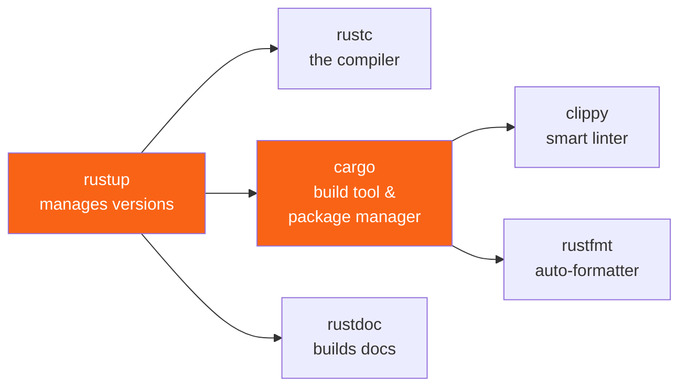

<h1><span class="h1-kicker">Getting Started</span>Installing Rust & Your Toolbox</h1>

You can read this whole book and run every example without installing anything — the **Run** buttons compile your code in the cloud. But the moment you want to build real programs on your own machine, you'll want Rust installed locally. It takes about two minutes, and this chapter walks you through it.

> [!key] One tool to rule them all: `rustup`
> Rust is installed and managed by a single program called **`rustup`** (the *Rust toolchain installer*). It installs the compiler, the package manager, and the documentation, and it keeps them all up to date. You almost never think about it again after the first day.

## What you're actually installing

When you install Rust, you get a small family of command-line tools that work together:



| Tool | What it does | You'll type it… |
|------|--------------|-----------------|
| **`rustup`** | Installs and updates Rust itself | Rarely |
| **`rustc`** | The compiler that turns `.rs` files into programs | Rarely (Cargo calls it for you) |
| **`cargo`** | Builds projects, runs them, downloads libraries | Constantly |
| **`clippy`** | A *linter* (a tool that flags questionable code) | Often |
| **`rustfmt`** | Formats your code to the standard style | Often |

> [!jargon] Jargon buster
> A **toolchain** is just the bundle of a specific compiler version plus its companion tools. A **linter** is a program that reads your code and points out likely mistakes or unidiomatic patterns without running it.

## Installing on macOS, Linux, or WSL

Open a terminal and run the official one-liner. It downloads `rustup` and walks you through a short prompt — just press Enter to accept the defaults:

```bash
curl --proto '=https' --tlsv1.2 -sSf https://sh.rustup.rs | sh
```

When it finishes, either restart your terminal or load Rust into your current session:

```bash
source "$HOME/.cargo/env"
```

## Installing on Windows

On Windows you have two easy options:

1. **The installer (recommended):** download and run **`rustup-init.exe`** from [rustup.rs](https://rustup.rs). It will offer to install the Microsoft **C++ Build Tools** if they're missing — say yes, because Rust uses the system *linker* (the tool that stitches compiled pieces into a final `.exe`).
2. **WSL (Windows Subsystem for Linux):** if you prefer a Linux environment, install WSL and then use the macOS/Linux command above.

> [!note] Why does Rust need a C++ linker?
> Rust compiles to fast native machine code and reuses your platform's existing linker to produce the final executable. That's why Windows wants the Build Tools and macOS wants the Xcode command-line tools (`xcode-select --install`).

## Check that it worked

Whichever path you took, confirm your install by asking each tool for its version:

```bash
rustc --version
cargo --version
```

You should see something like `rustc 1.90.0 (...)`. 🎉 Congratulations — you have a complete Rust development environment.

> [!tip] Keeping Rust up to date
> Rust ships a new stable version every **six weeks**, like clockwork. Updating everything is a single command:
> ```bash
> rustup update
> ```

## Set up a great editor

Rust's tooling shines brightest inside an editor with **`rust-analyzer`**, the official *language server* (a background program that gives your editor autocomplete, instant error highlighting, type hints, and one-click refactors).

> [!best] The recommended setup for beginners
> Install **Visual Studio Code**, then add the **`rust-analyzer`** extension from the marketplace. That's it — you now get red squiggles under mistakes *as you type*, inline type annotations, and hover documentation. It turns the compiler into a helpful pair-programmer.

Other excellent choices: the **JetBrains RustRover** IDE, or the `rust-analyzer` plugin for Neovim, Emacs, Zed, and Sublime Text. They all speak the same language-server protocol, so the experience is consistent.

> [!mistake] Don't skip rust-analyzer
> Beginners often try to learn Rust in a plain text editor and then feel the compiler is "strict" and "slow to argue with." With `rust-analyzer`, most mistakes are underlined *before* you even hit save, with the same friendly explanations. It flattens the learning curve enormously.

## Reading the docs offline

Every Rust installation comes with the entire standard-library documentation *on your own disk*. This one command opens it in your browser, no internet required:

```bash
rustup doc
```

This is the exact same reference professional Rustaceans (Rust programmers) use every day. Bookmark it.

## Summary

- Rust is installed and managed by **`rustup`** — one installer for the whole toolchain.
- The tools you'll actually use daily are **`cargo`** (build & package manager), plus **`clippy`** and **`rustfmt`** for quality.
- On Windows you'll also install the **C++ Build Tools** for the linker; on macOS, the Xcode command-line tools.
- Install the **`rust-analyzer`** extension in your editor — it is the single biggest quality-of-life upgrade for learning Rust.
- `rustup update` upgrades everything; `rustup doc` opens the full docs offline.

> [!exercise] Try it yourself
> 1. Install Rust and run `rustc --version` to confirm it works.
> 2. Run `rustup doc` and find the page for the `Vec` type — you'll meet it soon.
> 3. Install `rust-analyzer` in your editor, create a file called `test.rs`, and type `fn main() {}`. Watch the editor come to life.

With the toolbox ready, it's time for the traditional first step of learning any language: getting the computer to say **Hello, World!** 👋
