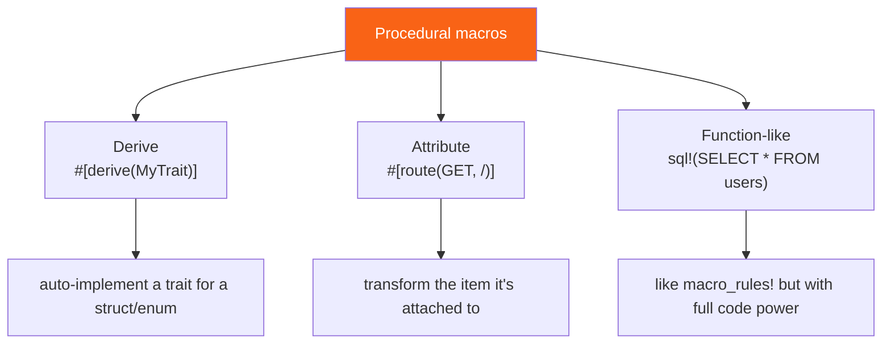

<h1><span class="h1-kicker">Advanced Rust</span>Procedural Macros & Derive</h1>

Declarative macros match syntax patterns. **Procedural macros** go further: they're mini-compilers you write that take Rust code *as data* and produce new code. They power `#[derive(Debug)]`, `#[derive(Serialize)]`, tokio's `#[tokio::main]`, and the routing attributes in web frameworks. Writing one is more involved (they live in a special crate and use helper libraries), so this chapter focuses on *understanding* them and reading a realistic example.

## The three kinds

Procedural macros come in three flavors, distinguished by how you invoke them:



| Kind | Looks like | Used for |
|------|-----------|----------|
| **Derive** | `#[derive(Debug)]` | auto-implementing traits for a type |
| **Attribute** | `#[tokio::main]`, `#[route(...)]` | transforming/annotating an item |
| **Function-like** | `sql!(...)`, `html!(...)` | custom syntax, like `macro_rules!` but far more powerful |

> [!jargon] "Procedural" vs. "declarative"
> A **declarative** macro (`macro_rules!`) *declares* patterns and templates — you describe *what* maps to *what*. A **procedural** macro runs an actual Rust *procedure* (a function you write) that receives the input code as a stream of tokens and programmatically builds the output. It's the difference between a find-and-replace template and a small program that rewrites code.

## They operate on `TokenStream`

Every procedural macro is a function that takes a **`TokenStream`** (the input code, parsed into tokens) and returns a `TokenStream` (the generated code). Two crates make this practical, and you'll see them in every proc-macro project:

- **`syn`** — *parses* a `TokenStream` into a structured syntax tree you can inspect (fields, names, types).
- **`quote`** — the reverse: a template macro that *builds* a `TokenStream` from Rust-looking code, interpolating values with `#`.

## A real custom derive

Say we want `#[derive(Hello)]` to auto-implement a `Hello` trait that prints the type's name. Procedural macros must live in their own crate with `proc-macro = true` in `Cargo.toml`:

```toml
# Cargo.toml of the macro crate
[lib]
proc-macro = true

[dependencies]
syn = "2"
quote = "1"
```

```rust,ignore
use proc_macro::TokenStream;
use quote::quote;
use syn::{parse_macro_input, DeriveInput};

#[proc_macro_derive(Hello)]
pub fn derive_hello(input: TokenStream) -> TokenStream {
    // 1. Parse the input (the struct/enum it's applied to) into a syntax tree:
    let ast = parse_macro_input!(input as DeriveInput);
    let name = &ast.ident; // the type's name, e.g. `Pancakes`

    // 2. Build the output code with quote!, splicing #name in:
    let expanded = quote! {
        impl Hello for #name {
            fn hello(&self) {
                println!("Hello, I am a {}!", stringify!(#name));
            }
        }
    };

    // 3. Hand the generated code back to the compiler:
    expanded.into()
}
```

A user of the macro then writes just this, and gets the `impl` for free:

```rust,ignore
use my_macro::Hello;

#[derive(Hello)]
struct Pancakes;

fn main() {
    Pancakes.hello(); // prints: Hello, I am a Pancakes!
}
```

<figure class="diagram">
<svg viewBox="0 0 640 150" role="img" aria-label="A derive macro parses the type with syn, transforms it, and emits an impl with quote">
  <style>
    .ppm { font: 600 11px var(--font-mono); fill: var(--text); }
    .ppc { font: 11px var(--font-sans); fill: var(--text-mute); }
    .inp { fill: var(--blue-soft); stroke: var(--blue); stroke-width: 1.5; }
    .proc { fill: var(--purple-soft); stroke: var(--purple); stroke-width: 1.5; }
    .out { fill: var(--rust-100); stroke: var(--rust-400); stroke-width: 1.5; }
  </style>
  <rect x="14" y="50" width="150" height="46" class="inp"/><text x="26" y="72" class="ppm">#[derive(Hello)]</text><text x="26" y="90" class="ppm">struct Pancakes;</text>
  <rect x="245" y="50" width="150" height="46" class="proc"/><text x="259" y="72" class="ppm">your macro fn</text><text x="259" y="90" class="ppc">syn parse → quote</text>
  <rect x="480" y="50" width="150" height="46" class="out"/><text x="492" y="72" class="ppm">impl Hello for</text><text x="492" y="90" class="ppm">Pancakes { … }</text>
  <path d="M166 73 L243 73" stroke="var(--text-mute)" stroke-width="2" marker-end="url(#app)"/>
  <path d="M397 73 L478 73" stroke="var(--text-mute)" stroke-width="2" marker-end="url(#app)"/>
  <text x="20" y="130" class="ppc">Compile time: your function reads the type as tokens and writes the trait impl the compiler then uses.</text>
  <defs><marker id="app" markerWidth="9" markerHeight="9" refX="7" refY="3" orient="auto"><path d="M0,0 L7,3 L0,6 Z" fill="var(--text-mute)"/></marker></defs>
</svg>
<figcaption>A derive macro: parse the annotated type with <code>syn</code>, then generate an <code>impl</code> with <code>quote</code>.</figcaption>
</figure>

## Attribute and function-like macros

**Attribute macros** transform the item they're attached to. `#[tokio::main]` is one — it takes your `async fn main` and rewrites it into a normal `main` that starts a runtime:

```rust,ignore
#[proc_macro_attribute]
pub fn my_attr(args: TokenStream, item: TokenStream) -> TokenStream {
    // `args` = tokens inside #[my_attr(...)]; `item` = the function/struct below it.
    // Parse, transform, and re-emit `item`.
    item
}
```

**Function-like macros** look like `macro_rules!` calls but run your full code generator — used for embedded DSLs like compile-time-checked SQL (`sqlx::query!`) or HTML templating:

```rust,ignore
#[proc_macro]
pub fn my_dsl(input: TokenStream) -> TokenStream {
    // Interpret `input` as a custom mini-language and generate Rust from it.
    input
}
```

## When you'll write them (and when you won't)

> [!best] Consume proc macros constantly; write them rarely
> You'll *use* procedural macros every day — `#[derive(Serialize, Deserialize)]` from serde, `#[derive(Error)]` from thiserror, `#[tokio::main]`, `#[test]`. You'll *write* one much less often: when you have a trait that many types should implement in a mechanical, structure-derived way (a serialization format, an ORM mapping, a builder generator). For anything simpler, a `macro_rules!` macro or a plain function is the right tool.

> [!note] Why they need a separate crate
> A procedural macro runs *inside the compiler* while it compiles the crate that uses it. That's a chicken-and-egg situation, so proc macros must be compiled first, in their own crate marked `proc-macro = true`. This separation is why you can't define a derive macro in the same file that uses it — a frequent surprise for first-timers.

> [!tip] Learn by reading, and use the right helpers
> The best way to learn proc macros is to read a small, well-known one — thiserror's or a simple `derive_builder`-style crate. Beyond `syn` and `quote`, the `proc-macro2` crate lets you write macro logic that's testable outside the compiler, and `darling` eases parsing attribute options. The community book *"The Little Book of Rust Macros"* covers both macro kinds in depth.

## Summary

- **Procedural macros** are compile-time functions that take code as a **`TokenStream`** and return generated code; three kinds: **derive**, **attribute**, **function-like**.
- They're built with **`syn`** (parse input into a syntax tree) and **`quote`** (build output code, splicing values with `#`).
- A **derive macro** auto-implements a trait for the annotated type — the mechanism behind `#[derive(Debug)]`, serde, thiserror, and more.
- They must live in a **dedicated crate** with `proc-macro = true` because they run inside the compiler.
- You'll **use** proc macros constantly but **write** them rarely — reserve them for mechanical, type-structure-driven code generation.

> [!exercise] Try it yourself
> 1. List five procedural macros you've already used in this book (hint: several are `#[derive(...)]`s and one starts your async programs).
> 2. Explain the roles of `syn` and `quote` in one sentence each.
> 3. (Ambitious) In a new `proc-macro` crate, write a `#[derive(Hello)]` following the example above and use it from a second crate.

Macros generate code. Next we round out advanced Rust's *type* toolbox — newtypes, aliases, the never type, and dynamically sized types.
