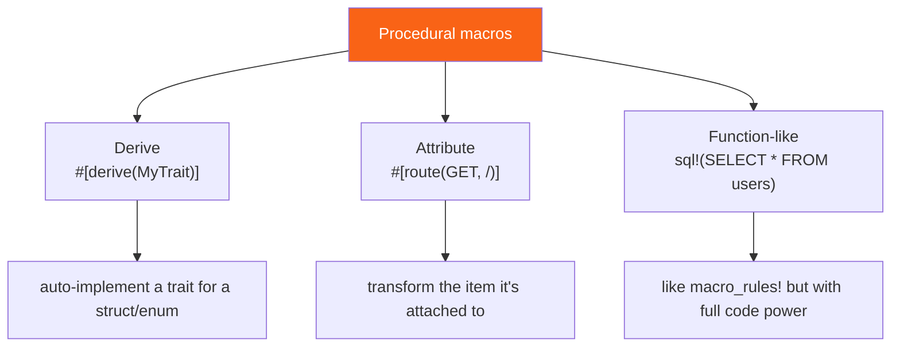

<h1><span class="h1-kicker">Advanced Rust</span>Procedural Macros & Derive</h1>

Declarative macros match syntax patterns. **Procedural macros** go further: they're mini-compilers you write that take Rust code *as data* and produce new code. They power `#[derive(Debug)]`, `#[derive(Serialize)]`, tokio's `#[tokio::main]`, and the routing attributes in web frameworks. Writing one is more involved (they live in a special crate and use helper libraries), so this chapter focuses on *understanding* them and reading a realistic example.

## The three kinds

Procedural macros come in three flavors, distinguished by how you invoke them:



| Kind | Looks like | Used for |
|------|-----------|----------|
| **Derive** | `#[derive(Debug)]` | auto-implementing traits for a type |
| **Attribute** | `#[tokio::main]`, `#[route(...)]` | transforming/annotating an item |
| **Function-like** | `sql!(...)`, `html!(...)` | custom syntax, like `macro_rules!` but far more powerful |

> [!jargon] "Procedural" vs. "declarative"
> A **declarative** macro (`macro_rules!`) *declares* patterns and templates — you describe *what* maps to *what*. A **procedural** macro runs an actual Rust *procedure* (a function you write) that receives the input code as a stream of tokens and programmatically builds the output. It's the difference between a find-and-replace template and a small program that rewrites code.

## First: what is an attribute?

Both attribute macros and derives are written as **attributes**, so it's worth being precise about what an attribute actually is — the book has used dozens without ever defining them.

An **attribute** is metadata attached to an item (a function, struct, module, or whole crate). It changes how the compiler treats that item. There are two spellings and two origins:

```rust,ignore
#[derive(Debug)]        // OUTER attribute — applies to the item that FOLLOWS it
struct Config;

#![allow(dead_code)]    // INNER attribute (note the !) — applies to the ENCLOSING
                        // item, usually the whole file/crate. Must come first.
```

| Origin | Who implements it | Examples |
|---|---|---|
| **Built-in** | the compiler itself | `#[derive]`, `#[cfg]`, `#[allow]`, `#[test]`, `#[inline]`, `#[repr]`, `#[deprecated]`, `#[non_exhaustive]`, `#[doc]` |
| **Attribute macro** | a proc-macro crate you depend on | `#[tokio::main]`, `#[actix_web::get]`, `#[async_trait]`, `#[wasm_bindgen]` |

The ones you'll meet constantly, grouped by what they do:

| Attribute | Effect |
|---|---|
| `#[derive(Trait, …)]` | auto-implement traits — see [Appendix C](#/ch/appendix-derivable) |
| `#[cfg(test)]` / `#[cfg(unix)]` | compile this item only under that condition — [Conditional Compilation](#/ch/conditional-compilation) |
| `#[allow(…)]` / `#[warn(…)]` / `#[deny(…)]` | tune a lint for this item — [Clippy & Lints](#/ch/clippy-fmt) |
| `#[test]` / `#[ignore]` / `#[should_panic]` | test-harness control — [Writing Tests](#/ch/writing-tests) |
| `#[inline]` / `#[cold]` | optimisation hints |
| `#[repr(C)]` / `#[repr(transparent)]` | control memory layout — [Memory Layout](#/ch/memory-layout), [FFI](#/ch/ffi) |
| `#[non_exhaustive]` | callers must add a `_` arm, so you can add variants later — [API Design](#/ch/api-design) |
| `#[must_use]` | warn if the return value is discarded |
| `#[deprecated = "use x instead"]` | warn on use |
| `///` and `//!` | doc comments — sugar for `#[doc = "…"]` |

> [!key] `#[derive(X)]` is not special syntax — it's a call into a macro
> This is the connection that makes the rest of the chapter click. When you write `#[derive(Serialize)]`, the compiler finds the proc macro named `Serialize`, hands it the tokens of your struct, and splices whatever it returns into your crate. `#[derive(Debug)]` works the same way, except the implementation ships inside the compiler rather than a crate.
>
> So there's no magic tier of "compiler features" you can't reach. **Anything `#[derive(Debug)]` does, a macro you write can do too** — which is exactly how serde, thiserror, and clap deliver so much from one line.

> [!note] Helper attributes: the `#[serde(rename = "…")]` pattern
> A derive macro can register **helper attributes** that decorate the fields inside it:
> ```rust,ignore
> #[derive(Serialize)]
> struct User {
>     #[serde(rename = "userName")]     // ← a helper attribute of the Serialize derive
>     name: String,
>     #[serde(skip_serializing_if = "Option::is_none")]
>     nickname: Option<String>,
> }
> ```
> These aren't understood by the compiler at all — `serde`'s derive declares them with `#[proc_macro_derive(Serialize, attributes(serde))]`, reads them while generating code, and strips them out. That's why `#[serde(...)]` is an error without the corresponding `#[derive(Serialize)]` above it, and why each crate's helper attributes are documented with its derive rather than in the language reference.

## They operate on `TokenStream`

Every procedural macro is a function that takes a **`TokenStream`** (the input code, parsed into tokens) and returns a `TokenStream` (the generated code). Two crates make this practical, and you'll see them in every proc-macro project:

- **`syn`** — *parses* a `TokenStream` into a structured syntax tree you can inspect (fields, names, types).
- **`quote`** — the reverse: a template macro that *builds* a `TokenStream` from Rust-looking code, interpolating values with `#`.

## A real custom derive

Say we want `#[derive(Hello)]` to auto-implement a `Hello` trait that prints the type's name. Procedural macros must live in their own crate with `proc-macro = true` in `Cargo.toml`:

```toml
# Cargo.toml of the macro crate
[lib]
proc-macro = true

[dependencies]
syn = "2"
quote = "1"
```

```rust,ignore
use proc_macro::TokenStream;
use quote::quote;
use syn::{parse_macro_input, DeriveInput};

#[proc_macro_derive(Hello)]
pub fn derive_hello(input: TokenStream) -> TokenStream {
    // 1. Parse the input (the struct/enum it's applied to) into a syntax tree:
    let ast = parse_macro_input!(input as DeriveInput);
    let name = &ast.ident; // the type's name, e.g. `Pancakes`

    // 2. Build the output code with quote!, splicing #name in:
    let expanded = quote! {
        impl Hello for #name {
            fn hello(&self) {
                println!("Hello, I am a {}!", stringify!(#name));
            }
        }
    };

    // 3. Hand the generated code back to the compiler:
    expanded.into()
}
```

A user of the macro then writes just this, and gets the `impl` for free:

```rust,ignore
use my_macro::Hello;

#[derive(Hello)]
struct Pancakes;

fn main() {
    Pancakes.hello(); // prints: Hello, I am a Pancakes!
}
```

<figure class="diagram">
<svg viewBox="0 0 640 150" role="img" aria-label="A derive macro parses the type with syn, transforms it, and emits an impl with quote">
  <style>
    .ppm { font: 600 11px var(--font-mono); fill: var(--text); }
    .ppc { font: 11px var(--font-sans); fill: var(--text-mute); }
    .inp { fill: var(--blue-soft); stroke: var(--blue); stroke-width: 1.5; }
    .proc { fill: var(--purple-soft); stroke: var(--purple); stroke-width: 1.5; }
    .out { fill: var(--rust-100); stroke: var(--rust-400); stroke-width: 1.5; }
  </style>
  <rect x="14" y="50" width="150" height="46" class="inp"/><text x="26" y="72" class="ppm">#[derive(Hello)]</text><text x="26" y="90" class="ppm">struct Pancakes;</text>
  <rect x="245" y="50" width="150" height="46" class="proc"/><text x="259" y="72" class="ppm">your macro fn</text><text x="259" y="90" class="ppc">syn parse → quote</text>
  <rect x="480" y="50" width="150" height="46" class="out"/><text x="492" y="72" class="ppm">impl Hello for</text><text x="492" y="90" class="ppm">Pancakes { … }</text>
  <path d="M166 73 L243 73" stroke="var(--text-mute)" stroke-width="2" marker-end="url(#app)"/>
  <path d="M397 73 L478 73" stroke="var(--text-mute)" stroke-width="2" marker-end="url(#app)"/>
  <text x="20" y="130" class="ppc">Compile time: your function reads the type as tokens and writes the trait impl the compiler then uses.</text>
  <defs><marker id="app" markerWidth="9" markerHeight="9" refX="7" refY="3" orient="auto"><path d="M0,0 L7,3 L0,6 Z" fill="var(--text-mute)"/></marker></defs>
</svg>
<figcaption>A derive macro: parse the annotated type with <code>syn</code>, then generate an <code>impl</code> with <code>quote</code>.</figcaption>
</figure>

## Seeing the expansion — a derive that reads fields

`Hello` only used the type's *name*. Real derives read its **fields**, which is where proc macros earn their keep. Here's a `Describe` derive that reports each field's name and type — the macro side first:

```rust,ignore
#[proc_macro_derive(Describe)]
pub fn derive_describe(input: TokenStream) -> TokenStream {
    let ast = parse_macro_input!(input as DeriveInput);
    let name = &ast.ident;

    // Pull out the named fields of a struct.
    let fields = match &ast.data {
        syn::Data::Struct(syn::DataStruct { fields: syn::Fields::Named(f), .. }) => &f.named,
        _ => panic!("Describe only supports structs with named fields"),
    };

    // One println! per field. `quote` repeats over iterators with #(...)*
    let lines = fields.iter().map(|f| {
        let ident = f.ident.as_ref().unwrap();
        let ty = &f.ty;
        quote! {
            println!("  {}: {} = {:?}", stringify!(#ident), stringify!(#ty), self.#ident);
        }
    });

    quote! {
        impl #name {
            fn describe(&self) {
                println!("{} {{", stringify!(#name));
                #(#lines)*        // splice every generated line
                println!("}}");
            }
        }
    }
    .into()
}
```

You can't define that in this page — proc macros need their own crate — but you *can* run **exactly what it generates**. This is the expansion, hand-written:

```rust
#[derive(Debug)]
struct User {
    id: u32,
    name: String,
    active: bool,
}

// ─── everything below is what #[derive(Describe)] would emit ───
impl User {
    fn describe(&self) {
        println!("{} {{", stringify!(User));
        println!("  {}: {} = {:?}", stringify!(id), stringify!(u32), self.id);
        println!("  {}: {} = {:?}", stringify!(name), stringify!(String), self.name);
        println!("  {}: {} = {:?}", stringify!(active), stringify!(bool), self.active);
        println!("}}");
    }
}

fn main() {
    let u = User { id: 7, name: "Ada".to_string(), active: true };
    u.describe();
}
```

Compare the two: the macro is a **program that writes the second block**, with `#name` and `#ident` substituted and `#(#lines)*` repeated once per field. That's the entire idea — everything else is `syn` API surface.

### Reporting errors properly

Notice the `panic!` in that macro. It works, but it's poor citizenship: a panic inside a proc macro surfaces as a compiler crash message with no reference to *the user's* code. The right way is to return a **`compile_error!`** carrying a span, which the compiler renders as a normal error with a squiggle under the offending item:

```rust,ignore
#[proc_macro_derive(Describe)]
pub fn derive_describe(input: TokenStream) -> TokenStream {
    let ast = parse_macro_input!(input as DeriveInput);

    let fields = match &ast.data {
        syn::Data::Struct(syn::DataStruct { fields: syn::Fields::Named(f), .. }) => &f.named,

        // ❌ panic!("Describe only supports structs")
        //    → "proc macro panicked", pointing at nothing useful.
        //
        // ✅ A real diagnostic, attached to the user's own type:
        _ => {
            return syn::Error::new(
                ast.ident.span(),
                "Describe can only be derived for structs with named fields",
            )
            .to_compile_error()
            .into();
        }
    };

    // …generate the impl from `fields` as before…
}
```

The user then sees this, pointing at *their* code:

```text
error: Describe can only be derived for structs with named fields
 --> src/main.rs:4:8
  |
4 | struct Wrapper(u32);
  |        ^^^^^^^
```

> [!best] Never `panic!` in a proc macro; use `syn::Error` + spans
> Three rules make a macro pleasant to use when things go wrong:
> 1. **Return `Error::to_compile_error()`** rather than panicking — the user gets a normal, greppable compiler error.
> 2. **Attach the most specific span you can.** `syn::Error::new_spanned(&field, "…")` underlines that exact field; a span from the whole item underlines everything. An `Ident` has `.span()` directly; for other parsed nodes, import `syn::spanned::Spanned` to get one.
> 3. **Emit code anyway where you can.** If you return *only* an error, every downstream use of the type produces a second "cannot find" error, burying yours. Mature derives emit a stub impl alongside the diagnostic.
>
> Also useful: `syn::Error` can accumulate — call `.combine()` to report several problems in one build instead of making the user fix them one at a time.

### Handling generic types

The `Describe` macro above breaks the moment someone writes `struct Wrapper<T> { value: T }`, because the generated `impl Wrapper` doesn't mention `T`. `syn` provides exactly the tool for this — **`split_for_impl()`**, which hands back the three pieces an impl needs:

```rust,ignore
let (impl_generics, ty_generics, where_clause) = ast.generics.split_for_impl();

quote! {
    impl #impl_generics Describe for #name #ty_generics #where_clause {
        fn describe(&self) { /* … */ }
    }
}
```

For `struct Pair<T: Clone, U> { … }` those expand to `<T: Clone, U>`, `<T, U>`, and any `where` clause — producing `impl<T: Clone, U> Describe for Pair<T, U>`. Getting this wrong is the most common bug in a first proc macro, and it only shows up when someone applies your derive to a generic type.

> [!note] You often need to *add* a bound, not just copy them
> A derive whose generated code calls `self.value.describe()` needs `T: Describe`, which the user's struct definition doesn't declare. The convention — and what `#[derive(Debug)]` does — is to walk `ast.generics` and push the bound onto every type parameter before calling `split_for_impl()`:
> ```rust,ignore
> for param in ast.generics.type_params_mut() {
>     param.bounds.push(syn::parse_quote!(Describe));
> }
> ```
> This is the "perfect derive" problem, and it's genuinely subtle: adding the bound to *every* parameter is sometimes too strict (a `PhantomData<T>` field doesn't need it). Crates that care use the [`synstructure`](https://docs.rs/synstructure) helper, or let users override with a helper attribute.

> [!tip] `cargo expand` shows you the real thing
> Install it once (`cargo install cargo-expand`) and run `cargo expand` in any project to print your source with every macro — declarative, derive, and attribute — fully expanded. It is by far the fastest way to understand an unfamiliar macro, debug one you're writing, or satisfy your curiosity about what `#[tokio::main]` or `#[derive(Serialize)]` actually produces. Try it on a file with `#[derive(Debug)]` and you'll see the `impl Debug` written out in full.

## Attribute and function-like macros

**Attribute macros** transform the item they're attached to. `#[tokio::main]` is one — it takes your `async fn main` and rewrites it into a normal `main` that starts a runtime:

```rust,ignore
#[proc_macro_attribute]
pub fn my_attr(args: TokenStream, item: TokenStream) -> TokenStream {
    // `args` = tokens inside #[my_attr(...)]; `item` = the function/struct below it.
    // Parse, transform, and re-emit `item`.
    item
}
```

**Function-like macros** look like `macro_rules!` calls but run your full code generator — used for embedded DSLs like compile-time-checked SQL (`sqlx::query!`) or HTML templating:

```rust,ignore
#[proc_macro]
pub fn my_dsl(input: TokenStream) -> TokenStream {
    // Interpret `input` as a custom mini-language and generate Rust from it.
    input
}
```

## The proc macros you already depend on

You've used most of these already in this book. Seeing them as one category — *programs that write code for you at compile time* — is the point:

| Macro | Kind | What it generates |
|---|---|---|
| `#[derive(Serialize, Deserialize)]` | derive | full JSON/TOML/etc. conversion for a type — [serde](#/ch/serde) |
| `#[derive(Error)]` | derive | `Display` + `Error` + `From` impls — [thiserror](#/ch/anyhow-thiserror) |
| `#[derive(Parser)]` | derive | an entire CLI: parsing, `--help`, validation — [clap](#/ch/clap) |
| `#[derive(Debug, Clone, PartialEq, …)]` | derive | the standard traits — built into the compiler |
| `#[tokio::main]` | attribute | wraps `async fn main` in a runtime — [tokio](#/ch/tokio) |
| `#[test]`, `#[bench]` | attribute | registers the function with the test harness |
| `#[get("/path")]` | attribute | route registration — [Actix](#/ch/actix), [Rocket](#/ch/rocket) |
| `#[async_trait]` | attribute | boxes async trait methods — [Appendix G](#/ch/appendix-details) |
| `#[wasm_bindgen]` | attribute | JS↔Rust bindings — [WASM](#/ch/project-wasm) |
| `json!({ "k": 1 })` | function-like | builds a `serde_json::Value` from literal JSON |
| `sqlx::query!("SELECT …")` | function-like | checks your SQL **against a live database at compile time** — [sqlx](#/ch/sqlx) |

> [!key] Why proc macros matter: they move work to compile time
> Every entry above replaces something you'd otherwise write by hand, generate with a script, or discover as a bug at runtime. Three benefits, in increasing order of impressiveness:
> 1. **Less boilerplate.** `#[derive(Serialize)]` on a 20-field struct saves 100 lines that would drift out of sync with the struct.
> 2. **It can't get out of date.** The generated code is derived from the type *every time you compile*, so adding a field updates the serializer automatically. A hand-written impl silently wouldn't.
> 3. **Errors move from runtime to compile time.** `sqlx::query!` connects to your database *while compiling* and fails the build if a column name is wrong. `clap`'s derive rejects an invalid CLI definition before the program runs. This is the deepest reason the ecosystem leans on them so heavily — it's the same "make invalid states unrepresentable" instinct as the type system, extended to code generation.

## When you'll write them (and when you won't)

> [!best] Consume proc macros constantly; write them rarely
> You'll *use* procedural macros every day — `#[derive(Serialize, Deserialize)]` from serde, `#[derive(Error)]` from thiserror, `#[tokio::main]`, `#[test]`. You'll *write* one much less often: when you have a trait that many types should implement in a mechanical, structure-derived way (a serialization format, an ORM mapping, a builder generator). For anything simpler, a `macro_rules!` macro or a plain function is the right tool.

> [!note] Why they need a separate crate
> A procedural macro runs *inside the compiler* while it compiles the crate that uses it. That's a chicken-and-egg situation, so proc macros must be compiled first, in their own crate marked `proc-macro = true`. This separation is why you can't define a derive macro in the same file that uses it — a frequent surprise for first-timers.

> [!tip] Learn by reading, and use the right helpers
> The best way to learn proc macros is to read a small, well-known one — thiserror's or a simple `derive_builder`-style crate. Beyond `syn` and `quote`, the `proc-macro2` crate lets you write macro logic that's testable outside the compiler, and `darling` eases parsing attribute options. The community book *"The Little Book of Rust Macros"* covers both macro kinds in depth.

## Summary

- **Procedural macros** are compile-time functions that take code as a **`TokenStream`** and return generated code; three kinds: **derive**, **attribute**, **function-like**.
- They're built with **`syn`** (parse input into a syntax tree) and **`quote`** (build output code, splicing values with `#`).
- A **derive macro** auto-implements a trait for the annotated type — the mechanism behind `#[derive(Debug)]`, serde, thiserror, and more.
- They must live in a **dedicated crate** with `proc-macro = true` because they run inside the compiler.
- An **attribute** is metadata on an item; most are **built-in** (`#[cfg]`, `#[test]`, `#[inline]`, `#[repr]`, `#[allow]`), and the rest are **attribute macros** from crates. `#[derive(X)]` is simply a call into a macro named `X`.
- Derives can declare **helper attributes** (`#[serde(rename = "…")]`) that they read and strip during expansion.
- They matter because they cut boilerplate, **stay in sync with the type automatically**, and move whole classes of error to **compile time** (`sqlx::query!` validates SQL against a real database while building).
- Use **`cargo expand`** to see exactly what any macro generates.
- You'll **use** proc macros constantly but **write** them rarely — reserve them for mechanical, type-structure-driven code generation.

> [!exercise] Try it yourself
> 1. List five procedural macros you've already used in this book (hint: several are `#[derive(...)]`s and one starts your async programs).
> 2. Explain the roles of `syn` and `quote` in one sentence each.
> 3. (Ambitious) In a new `proc-macro` crate, write a `#[derive(Hello)]` following the example above and use it from a second crate.
> 4. Run the hand-written `Describe` expansion, then add a field to `User` and update it by hand. How many places did you touch — and what would the derive have done?
> 5. Install `cargo expand` and run it on a file containing `#[derive(Debug)]`. Find the generated `impl Debug` and identify where the field names came from.
> 6. Classify each of these as built-in attribute or attribute macro: `#[test]`, `#[tokio::test]`, `#[repr(C)]`, `#[async_trait]`, `#[non_exhaustive]`.
> 7. Write an inner attribute (`#![allow(unused)]`) at the top of a file and explain why it must come before any items.
> 8. Look up serde's `#[serde(default)]` and `#[serde(flatten)]` helper attributes. Why can't the compiler validate them without the derive present?

Macros generate code. Next we round out advanced Rust's *type* toolbox — newtypes, aliases, the never type, and dynamically sized types.
