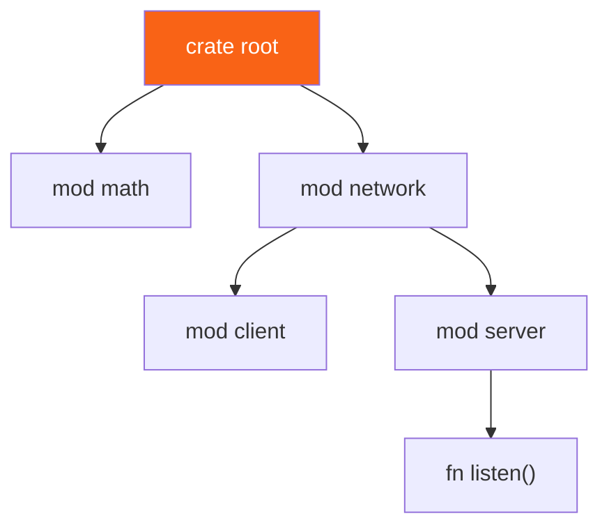

<h1><span class="h1-kicker">Organizing Code</span>Modules, Paths & Visibility</h1>

As a program grows past a single file, you need a way to organize it — to group related code, control what's public, and avoid naming collisions. Rust's **module system** does all three. It can feel fiddly at first, so this chapter builds your mental model piece by piece: modules to group code, **paths** to refer to items, and **`pub`** to control what's visible.

## Modules group related code

A **module** is a named container for items (functions, structs, other modules). You declare one with `mod`:

```rust
mod math {
    pub fn add(a: i32, b: i32) -> i32 {
        a + b
    }
    pub fn square(n: i32) -> i32 {
        n * n
    }
}

fn main() {
    // Reach into the module with a path (:: separates the parts):
    println!("{}", math::add(2, 3));
    println!("{}", math::square(4));
}
```

Modules can nest, forming a tree that mirrors how you think about your program:



## Everything is private by default

Here's the rule that surprises newcomers:

> [!key] Items are private to their module unless marked `pub`
> By default, everything inside a module is **private** — usable only within that module and its descendants. To expose an item to the outside, mark it **`pub`**. This "private by default" stance means a module's internals are yours to change freely; only the `pub` surface is a promise to the outside world.

```rust,ignore
mod bank {
    pub fn deposit() {}   // public — callable from outside
    fn audit_log() {}     // private — only bank's own code can call it
}

fn main() {
    bank::deposit();      // ✅ fine
    bank::audit_log();     // ❌ error: function `audit_log` is private
}
```

There's also **`pub(crate)`** for "public within my crate, but not exported to others" — perfect for internal helpers shared across modules but hidden from your library's users.

## Paths: absolute and relative

A **path** names an item, like a file path names a file. There are two kinds:

- **Absolute** — starts from the crate root with the `crate` keyword: `crate::math::add`.
- **Relative** — starts from the current module, optionally using `self` (this module) or `super` (the parent module).

`super` is especially handy for reaching "up" to a sibling:

```rust
fn deliver_order() {
    println!("order delivered");
}

mod kitchen {
    pub fn fix_incorrect_order() {
        cook_order();
        super::deliver_order(); // `super` = the parent (crate root) here
    }
    fn cook_order() {
        println!("cooking");
    }
}

fn main() {
    kitchen::fix_incorrect_order();
}
```

> [!jargon] `crate`, `self`, `super`
> In a path, **`crate`** means "start at the root of this crate" (absolute). **`self`** means "start here, in the current module." **`super`** means "go up one module" (like `..` in file paths). They let you write paths that survive refactoring.

## `use`: bring paths into scope

Typing `math::add` everywhere gets tedious. The **`use`** keyword creates a shortcut, bringing an item into the current scope so you can refer to it by its short name:

```rust
mod math {
    pub fn add(a: i32, b: i32) -> i32 { a + b }
    pub fn square(n: i32) -> i32 { n * n }
}

use math::add; // now `add` is in scope directly

fn main() {
    println!("{}", add(10, 20)); // no `math::` prefix needed
    println!("{}", math::square(5)); // still works the long way too
}
```

`use` has several convenient forms:

```rust,ignore
use std::collections::HashMap;                 // a single item
use std::collections::{HashMap, HashSet};       // several at once (nested)
use std::io::{self, Write};                      // the module AND an item from it
use std::collections::HashMap as Map;            // rename to avoid a clash
use std::fmt::*;                                 // glob: everything (use sparingly)
```

> [!best] `use` types by their name, functions by their parent
> The community convention: bring **types, traits, and enums** into scope directly (`use std::collections::HashMap;` then write `HashMap`), but bring **functions** in via their parent module (`use std::cmp;` then write `cmp::max(...)`). Seeing `cmp::max` rather than a bare `max` tells the reader where the function comes from. Enum variants and very common items (like `HashMap`) are the usual exceptions.

## Re-exporting with `pub use`

`use` normally creates a *private* shortcut. **`pub use`** re-exports it — bringing an item into scope *and* making it publicly available from the new location. This lets you present a clean public API regardless of your internal folder structure:

```rust
mod internal {
    pub mod deeply {
        pub mod nested {
            pub fn important() -> &'static str { "hello" }
        }
    }
}

// Re-export it at the top level so users write `crate::important()`:
pub use internal::deeply::nested::important;

fn main() {
    println!("{}", important()); // clean, flat path
}
```

## Splitting modules across files

Modules don't have to live in one file. When you write `mod garden;` (with a semicolon, not a block), Rust looks for the module's code in a **file of the same name**:

```text
src/
├── main.rs         // contains: mod garden;
├── garden.rs       // the `garden` module's code
└── garden/         // submodules of `garden` go here
    └── vegetables.rs  // reached via: mod vegetables; inside garden.rs
```

So `mod garden;` in `main.rs` pulls in `src/garden.rs`, and `mod vegetables;` inside that pulls in `src/garden/vegetables.rs`. The module *tree* and the *file* tree mirror each other.

> [!tip] The declaration and the file are separate steps
> A common beginner confusion: creating `src/garden.rs` does **not** automatically add it to your program. You must also *declare* the module with `mod garden;` in its parent (usually `main.rs` or `lib.rs`). Think of `mod garden;` as "please include the garden file here." No declaration, no compilation.

## Summary

- **Modules** (`mod`) group related items into a tree, mirroring how you think about your program.
- Items are **private by default**; expose them with **`pub`** (or `pub(crate)` for crate-internal).
- Refer to items with **paths**: absolute (`crate::…`) or relative (`self`, `super`).
- **`use`** creates short-name shortcuts; forms include nesting `{…}`, `as` renaming, and `self`.
- **`pub use`** re-exports, letting you design a clean public API independent of internal layout.
- `mod name;` (with a semicolon) loads the module from `name.rs` (or `name/mod.rs`); you must *declare* a module for its file to be compiled.

> [!exercise] Try it yourself
> 1. Make a `mod geometry` with a public `area_of_circle(r: f64) -> f64` and a private helper, then call the public one from `main` (and try calling the private one to see the error).
> 2. Add a nested `mod geometry::shapes` and reach a parent function from it with `super::`.
> 3. Use `pub use` to re-export a deeply nested function at the crate root.

Modules organize code *within* a crate. Zooming out one level: how are crates and packages themselves structured? That's next.
