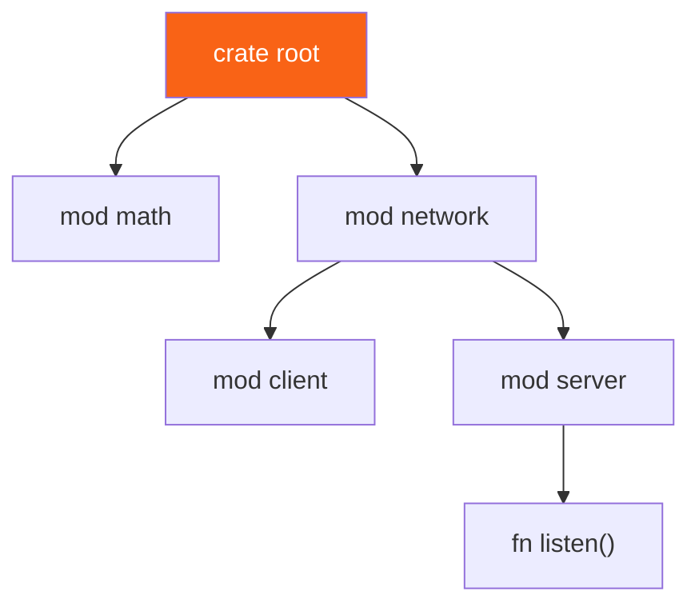

<h1><span class="h1-kicker">Organizing Code</span>Modules, Paths & Visibility</h1>

As a program grows past a single file, you need a way to organize it — to group related code, control what's public, and avoid naming collisions. Rust's **module system** does all three. It can feel fiddly at first, so this chapter builds your mental model piece by piece: modules to group code, **paths** to refer to items, and **`pub`** to control what's visible.

## Modules group related code

A **module** is a named container for items (functions, structs, other modules). You declare one with `mod`:

```rust
mod math {
    pub fn add(a: i32, b: i32) -> i32 {
        a + b
    }
    pub fn square(n: i32) -> i32 {
        n * n
    }
}

fn main() {
    // Reach into the module with a path (:: separates the parts):
    println!("{}", math::add(2, 3));
    println!("{}", math::square(4));
}
```

Modules can nest, forming a tree that mirrors how you think about your program:



## Everything is private by default

Here's the rule that surprises newcomers:

> [!key] Items are private to their module unless marked `pub`
> By default, everything inside a module is **private** — usable only within that module and its descendants. To expose an item to the outside, mark it **`pub`**. This "private by default" stance means a module's internals are yours to change freely; only the `pub` surface is a promise to the outside world.

```rust,ignore
mod bank {
    pub fn deposit() {}   // public — callable from outside
    fn audit_log() {}     // private — only bank's own code can call it
}

fn main() {
    bank::deposit();      // ✅ fine
    bank::audit_log();     // ❌ error: function `audit_log` is private
}
```

There's also **`pub(crate)`** for "public within my crate, but not exported to others" — perfect for internal helpers shared across modules but hidden from your library's users.

### Privacy runs downward, not upward

The half of the rule that almost nobody is taught: privacy is asymmetric. A **child module can see its ancestors' private items**, but a parent cannot see into its child's privates. Visibility flows *down* the tree, never up:

```rust
mod outer {
    fn secret() -> &'static str { "outer's private data" }

    pub mod inner {
        pub fn peek() -> &'static str {
            // ✅ A child CAN reach a parent's private item.
            super::secret()
        }
        #[allow(dead_code)] // exists only to be unreachable from the parent
        fn inner_only() -> i32 { 42 }
    }

    pub fn try_peek_down() -> &'static str {
        // ❌ This would NOT compile — the parent cannot see the child's private fn:
        // inner::inner_only();
        "parent cannot reach inner_only"
    }
}

fn main() {
    println!("{}", outer::inner::peek());
    println!("{}", outer::try_peek_down());
}
```

<figure class="diagram">
<svg viewBox="0 0 670 285" role="img" aria-label="A module tree where a child module can access its parent's private items but a parent cannot access a child's private items, and outside code can only reach items that are public at every level of the path.">
  <style>
    .mt-h { font: 700 11.5px var(--font-sans); }
    .mt-m { font: 600 10.5px var(--font-mono); fill: var(--text); }
    .mt-c { font: 10px var(--font-sans); fill: var(--text-mute); }
    .mt-mod { fill: var(--surface-2); stroke: var(--border-strong); stroke-width: 1.4; }
    .mt-pub { fill: var(--green-soft); stroke: var(--green); stroke-width: 1.3; }
    .mt-priv { fill: var(--red-soft); stroke: var(--red); stroke-width: 1.3; }
    .mt-edge { stroke: var(--text-mute); stroke-width: 1.2; }
  </style>
  <rect x="230" y="14" width="200" height="26" rx="6" class="mt-mod"/>
  <text x="242" y="32" class="mt-m">crate root</text>
  <line x1="330" y1="40" x2="330" y2="56" class="mt-edge"/>
  <rect x="200" y="56" width="260" height="112" rx="8" class="mt-mod"/>
  <text x="212" y="74" class="mt-m">pub mod outer</text>
  <rect x="212" y="82" width="150" height="22" rx="4" class="mt-priv"/>
  <text x="222" y="98" class="mt-m">fn secret()  private</text>
  <rect x="212" y="110" width="236" height="50" rx="6" class="mt-mod"/>
  <text x="222" y="126" class="mt-m">pub mod inner</text>
  <rect x="222" y="132" width="100" height="22" rx="4" class="mt-pub"/>
  <text x="232" y="148" class="mt-m">pub peek()</text>
  <rect x="330" y="132" width="110" height="22" rx="4" class="mt-priv"/>
  <text x="340" y="148" class="mt-m">inner_only()</text>
  <path d="M206 143 C 170 143 170 93 208 93" stroke="var(--green)" stroke-width="1.8" fill="none" marker-end="url(#mta)"/>
  <text x="20" y="120" class="mt-h" fill="var(--green)">✓ child → parent</text>
  <text x="20" y="136" class="mt-c">inner::peek() may call</text>
  <text x="20" y="150" class="mt-c">super::secret(), even</text>
  <text x="20" y="164" class="mt-c">though it is private.</text>
  <path d="M462 130 C 500 130 500 150 452 150" stroke="var(--red)" stroke-width="1.8" fill="none" stroke-dasharray="4 3" marker-end="url(#mtb)"/>
  <text x="486" y="96" class="mt-h" fill="var(--red)">✗ parent → child</text>
  <text x="486" y="112" class="mt-c">outer cannot call</text>
  <text x="486" y="126" class="mt-c">inner_only().</text>
  <rect x="200" y="188" width="260" height="26" rx="6" class="mt-mod"/>
  <text x="212" y="205" class="mt-m">fn main()  — outside `outer`</text>
  <path d="M290 188 L290 170" stroke="var(--green)" stroke-width="1.6" marker-end="url(#mta)"/>
  <text x="300" y="184" class="mt-c">outer::inner::peek() ✓ — pub at every step</text>
  <text x="20" y="240" class="mt-c">To reach an item from outside, EVERY module on the path must be pub, and so must the item.</text>
  <text x="20" y="256" class="mt-c">One private link anywhere in the chain breaks it — which is why <tspan font-family="var(--font-mono)">pub</tspan> on a deeply nested item alone often isn't enough.</text>
  <text x="20" y="274" class="mt-c">Privacy is about the module tree, not about files.</text>
  <defs>
    <marker id="mta" markerWidth="8" markerHeight="8" refX="6" refY="3" orient="auto"><path d="M0,0 L6,3 L0,6 Z" fill="var(--green)"/></marker>
    <marker id="mtb" markerWidth="8" markerHeight="8" refX="6" refY="3" orient="auto"><path d="M0,0 L6,3 L0,6 Z" fill="var(--red)"/></marker>
  </defs>
</svg>
<figcaption>Privacy flows <b>downward</b>: children see their ancestors' private items, never the reverse. And a path from outside works only if <i>every</i> module along it is <code>pub</code>.</figcaption>
</figure>

> [!mistake] Marking one item `pub` isn't enough if its module is private
> The most common visibility puzzle: you add `pub` to a function, and it's *still* unreachable. That's because a path is only usable if **every segment** is visible from where you're standing. `mod a { pub mod b { pub fn c() {} } }` works; `mod a { mod b { pub fn c() {} } }` does not — `b` is private, so `a::b::c` can't be named from outside `a`, no matter how `pub` `c` is. When the compiler says "module `b` is private," add `pub` to the *module*, or re-export the item higher up with `pub use` (below).

## The visibility ladder

`pub` isn't binary — there's a whole range between "private" and "the world":

| Form | Visible to | Use it for |
|---|---|---|
| *(nothing)* | this module and its descendants | the default; implementation details |
| `pub(self)` | same as private (explicit form) | rarely; documenting intent |
| `pub(super)` | the parent module and below | a helper a sibling needs |
| `pub(crate)` | anywhere in this crate, not outside | internal shared utilities |
| `pub(in crate::a::b)` | one specific module subtree | surgical exposure; rare |
| `pub` | everywhere, including other crates | your deliberate public API |

```rust
mod engine {
    pub(crate) fn internal_tick() -> u32 { 1 }   // any module in this crate
    pub(super) fn parent_only() -> u32 { 2 }      // only the parent and below
    pub fn public_api() -> u32 { 3 }              // truly public

    pub mod sub {
        pub fn use_them() -> u32 {
            // A child can use all of these, private or not:
            super::internal_tick() + super::parent_only() + super::public_api()
        }
    }
}

fn main() {
    println!("{}", engine::public_api());
    println!("{}", engine::internal_tick());  // same crate → allowed
    println!("{}", engine::sub::use_them());
    // engine::parent_only() is fine here too, since main IS the parent.
}
```

> [!best] `pub(crate)` should be your default for anything shared
> When a helper needs to be used by another module but isn't part of your library's promise to users, `pub(crate)` is exactly right. Reaching for plain `pub` instead is how libraries accidentally acquire public API they never meant to support — and once it's `pub`, removing it is a breaking change. In a binary crate the distinction matters less, but the habit pays off the moment you split code into a library.

## `pub` on a struct does not make its fields public

A gotcha worth its own section, because it catches everyone once:

```rust
mod shapes {
    pub struct Rect {
        pub width: f64,   // public field
        height: f64,      // PRIVATE field — even though Rect is pub
    }

    impl Rect {
        pub fn new(width: f64, height: f64) -> Self {
            Rect { width, height }
        }
        pub fn height(&self) -> f64 { self.height }  // accessor
    }

    // Enums are different: variants are public if the ENUM is pub.
    #[allow(dead_code)]
    pub enum Status { Active, Inactive }
}

fn main() {
    let r = shapes::Rect::new(3.0, 4.0);
    println!("width  {}", r.width);      // ✅ pub field
    println!("height {}", r.height());   // ✅ via accessor
    // println!("{}", r.height);         // ❌ field `height` is private

    // A struct with any private field can't be built with literal syntax
    // from outside — which is why `new` exists:
    // let bad = shapes::Rect { width: 1.0, height: 2.0 };  // ❌

    let s = shapes::Status::Active;      // ✅ variants need no extra pub
    println!("{}", matches!(s, shapes::Status::Active));
}
```

> [!key] Struct fields opt in individually; enum variants don't
> `pub struct` means "you may *refer to* this type," not "you may touch its insides" — each field needs its own `pub`. `pub enum`, by contrast, makes **all** variants public, because an enum whose variants you can't name would be useless. This asymmetry is deliberate: it lets a struct protect its invariants (a `Rect` can guarantee `height > 0` if nobody can set it directly) while enums stay open for matching. It's also why constructor functions like `new` are so common — a struct with even one private field cannot be built with literal syntax from outside its module.

## Paths: absolute and relative

A **path** names an item, like a file path names a file. There are two kinds:

- **Absolute** — starts from the crate root with the `crate` keyword: `crate::math::add`.
- **Relative** — starts from the current module, optionally using `self` (this module) or `super` (the parent module).

`super` is especially handy for reaching "up" to a sibling:

```rust
fn deliver_order() {
    println!("order delivered");
}

mod kitchen {
    pub fn fix_incorrect_order() {
        cook_order();
        super::deliver_order(); // `super` = the parent (crate root) here
    }
    fn cook_order() {
        println!("cooking");
    }
}

fn main() {
    kitchen::fix_incorrect_order();
}
```

> [!jargon] `crate`, `self`, `super`
> In a path, **`crate`** means "start at the root of this crate" (absolute). **`self`** means "start here, in the current module." **`super`** means "go up one module" (like `..` in file paths). They let you write paths that survive refactoring.

## `use`: bring paths into scope

Typing `math::add` everywhere gets tedious. The **`use`** keyword creates a shortcut, bringing an item into the current scope so you can refer to it by its short name:

```rust
mod math {
    pub fn add(a: i32, b: i32) -> i32 { a + b }
    pub fn square(n: i32) -> i32 { n * n }
}

use math::add; // now `add` is in scope directly

fn main() {
    println!("{}", add(10, 20)); // no `math::` prefix needed
    println!("{}", math::square(5)); // still works the long way too
}
```

`use` has several convenient forms:

```rust,ignore
use std::collections::HashMap;                 // a single item
use std::collections::{HashMap, HashSet};       // several at once (nested)
use std::io::{self, Write};                      // the module AND an item from it
use std::collections::HashMap as Map;            // rename to avoid a clash
use std::fmt::*;                                 // glob: everything (use sparingly)
```

> [!best] `use` types by their name, functions by their parent
> The community convention: bring **types, traits, and enums** into scope directly (`use std::collections::HashMap;` then write `HashMap`), but bring **functions** in via their parent module (`use std::cmp;` then write `cmp::max(...)`). Seeing `cmp::max` rather than a bare `max` tells the reader where the function comes from. Enum variants and very common items (like `HashMap`) are the usual exceptions.

## `mod` vs `use` — the distinction that unlocks everything

If one thing about Rust's module system causes more confusion than the rest combined, it's this. `mod` and `use` sound similar and do completely different jobs:

<figure class="diagram">
<svg viewBox="0 0 670 215" role="img" aria-label="mod declares a module and adds its code to the crate tree, done exactly once. use creates a local shorthand for an existing path and can be repeated in any module without adding code.">
  <style>
    .mu-h { font: 700 11.5px var(--font-sans); }
    .mu-m { font: 600 10.5px var(--font-mono); fill: var(--text); }
    .mu-c { font: 10px var(--font-sans); fill: var(--text-mute); }
    .mu-mod { fill: var(--rust-100); stroke: var(--rust-400); stroke-width: 1.5; }
    .mu-use { fill: var(--blue-soft); stroke: var(--blue); stroke-width: 1.5; }
    .mu-box { fill: var(--surface-2); stroke: var(--border-strong); stroke-width: 1.3; }
  </style>
  <rect x="12" y="14" width="316" height="180" rx="8" class="mu-mod" fill-opacity="0.25"/>
  <text x="24" y="34" class="mu-h" fill="var(--rust-600)">mod — "include this code in my crate"</text>
  <rect x="24" y="44" width="292" height="24" rx="5" class="mu-mod"/>
  <text x="34" y="61" class="mu-m">mod garden;   // loads src/garden.rs</text>
  <text x="24" y="86" class="mu-c">• Adds a NEW node to the module tree.</text>
  <text x="24" y="102" class="mu-c">• Written exactly ONCE per module, in its parent.</text>
  <text x="24" y="118" class="mu-c">• Without it, the file is never compiled at all.</text>
  <rect x="24" y="132" width="140" height="22" rx="4" class="mu-box"/>
  <text x="34" y="148" class="mu-m">src/garden.rs</text>
  <path d="M170 143 L206 143" stroke="var(--rust-500)" stroke-width="1.8" marker-end="url(#mua)"/>
  <rect x="212" y="132" width="104" height="22" rx="4" class="mu-mod"/>
  <text x="222" y="148" class="mu-m">crate::garden</text>
  <text x="24" y="176" class="mu-c">Think: a build instruction.</text>
  <rect x="344" y="14" width="316" height="180" rx="8" class="mu-use" fill-opacity="0.25"/>
  <text x="356" y="34" class="mu-h" fill="var(--blue)">use — "let me type a shorter name"</text>
  <rect x="356" y="44" width="292" height="24" rx="5" class="mu-use"/>
  <text x="366" y="61" class="mu-m">use crate::garden::plant;</text>
  <text x="356" y="86" class="mu-c">• Adds NO code — the item already exists.</text>
  <text x="356" y="102" class="mu-c">• Written in EVERY module that wants the shortcut.</text>
  <text x="356" y="118" class="mu-c">• Purely a local naming convenience.</text>
  <rect x="356" y="132" width="130" height="22" rx="4" class="mu-mod"/>
  <text x="366" y="148" class="mu-m">crate::garden::plant</text>
  <path d="M492 143 L528 143" stroke="var(--blue)" stroke-width="1.8" marker-end="url(#mub)"/>
  <rect x="534" y="132" width="114" height="22" rx="4" class="mu-use"/>
  <text x="544" y="148" class="mu-m">plant</text>
  <text x="356" y="176" class="mu-c">Think: an alias in this scope.</text>
  <defs>
    <marker id="mua" markerWidth="8" markerHeight="8" refX="6" refY="3" orient="auto"><path d="M0,0 L6,3 L0,6 Z" fill="var(--rust-500)"/></marker>
    <marker id="mub" markerWidth="8" markerHeight="8" refX="6" refY="3" orient="auto"><path d="M0,0 L6,3 L0,6 Z" fill="var(--blue)"/></marker>
  </defs>
</svg>
<figcaption><code>mod</code> adds code to the crate <i>once</i>. <code>use</code> only shortens a name, and belongs in every module that wants it.</figcaption>
</figure>

Two practical consequences follow:

**A `use` applies only to the module it's written in.** It doesn't propagate to child modules — each needs its own (or can reach up with `super::`):

```rust
use std::collections::HashMap;

mod inner {
    // The parent's `use` does NOT reach here. Either write your own use…
    use std::collections::HashMap;

    pub fn make() -> HashMap<String, u32> {
        let mut m = HashMap::new();
        m.insert("a".to_string(), 1);
        m
    }
}

fn main() {
    let outer: HashMap<&str, u32> = HashMap::new();
    println!("{} {}", outer.len(), inner::make().len());
}
```

**Never write `mod` twice for the same file.** Declaring `mod helpers;` in both `main.rs` and another module creates *two separate modules* from one file — duplicate types that don't interoperate, producing baffling "expected `a::Config`, found `b::Config`" errors. Declare it once, then `use` it everywhere else.

## Re-exporting with `pub use`

`use` normally creates a *private* shortcut. **`pub use`** re-exports it — bringing an item into scope *and* making it publicly available from the new location. This lets you present a clean public API regardless of your internal folder structure:

```rust
mod internal {
    pub mod deeply {
        pub mod nested {
            pub fn important() -> &'static str { "hello" }
        }
    }
}

// Re-export it at the top level so users write `crate::important()`:
pub use internal::deeply::nested::important;

fn main() {
    println!("{}", important()); // clean, flat path
}
```

> [!best] The facade pattern: organize deeply, export flatly
> This is how good Rust libraries are built. Internally, split code as finely as you like — `parser/lexer.rs`, `parser/ast.rs`, `engine/exec.rs` — then in `lib.rs` re-export the handful of things users actually need:
> ```rust,ignore
> mod parser;
> mod engine;
>
> pub use parser::{parse, Ast};      // users write `mycrate::parse`
> pub use engine::Engine;            // not `mycrate::engine::exec::Engine`
> ```
> Your users get a flat, memorable API; you keep the freedom to reorganize internals without breaking them. It also solves the private-module problem from earlier: the module can stay private while specific items are re-exported.

## Splitting modules across files

Modules don't have to live in one file. When you write `mod garden;` (with a semicolon, not a block), Rust looks for the module's code in a **file of the same name**:

```text
src/
├── main.rs         // contains: mod garden;
├── garden.rs       // the `garden` module's code
└── garden/         // submodules of `garden` go here
    └── vegetables.rs  // reached via: mod vegetables; inside garden.rs
```

So `mod garden;` in `main.rs` pulls in `src/garden.rs`, and `mod vegetables;` inside that pulls in `src/garden/vegetables.rs`. The module *tree* and the *file* tree mirror each other.

> [!tip] The declaration and the file are separate steps
> A common beginner confusion: creating `src/garden.rs` does **not** automatically add it to your program. You must also *declare* the module with `mod garden;` in its parent (usually `main.rs` or `lib.rs`). Think of `mod garden;` as "please include the garden file here." No declaration, no compilation.

There are two accepted layouts for a module with children, and you'll see both in the wild:

| Layout | Files | Notes |
|---|---|---|
| **Modern** (preferred) | `garden.rs` + `garden/vegetables.rs` | the module's own code sits beside its folder |
| **Legacy** | `garden/mod.rs` + `garden/vegetables.rs` | works fine, but a project full of `mod.rs` tabs is hard to navigate |

Both are supported indefinitely — just don't mix them for the same module (having both `garden.rs` and `garden/mod.rs` is an error). For the full mapping of files to paths, including why `main.rs` and `tests/` are *separate crates*, see [Packages, Crates & the Module Tree](#/ch/packages-crates).

## Decoding module errors

| Error | Means | Fix |
|---|---|---|
| `file not found for module 'x'` | you wrote `mod x;` but no `x.rs`/`x/mod.rs` exists | create the file, or fix the name |
| `module 'x' is private` | a module on the path isn't `pub` | `pub mod x`, or `pub use` the item higher up |
| `function 'y' is private` | the item itself isn't `pub` | add `pub` to it |
| `field 'z' of struct 'S' is private` | the struct is `pub` but the field isn't | add `pub` to the field, or add an accessor |
| `unresolved import 'crate::a::b'` | the path is wrong, or `mod a;` is missing | check spelling, and that every level is declared |
| `expected struct 'a::T', found struct 'b::T'` | the same file was declared with `mod` twice | declare once, `use` elsewhere |

## A realistic layout

Putting it together — how a small library actually looks:

```text
src/
├── lib.rs              // mod declarations + pub use facade
├── config.rs           // pub(crate) helpers + pub Config
├── parser.rs           // mod lexer; mod ast;
├── parser/
│   ├── lexer.rs
│   └── ast.rs
└── engine.rs
```

```rust,ignore
// lib.rs — the whole public API in one readable block
mod config;
mod engine;
mod parser;

pub use config::Config;
pub use engine::Engine;
pub use parser::{parse, Ast};

// Internal glue nobody outside needs to see:
pub(crate) const DEFAULT_DEPTH: usize = 32;
```

Reading `lib.rs` tells you exactly what the crate offers, and nothing about how it's arranged inside. That's the goal.

## Summary

- **Modules** (`mod`) group related items into a tree, mirroring how you think about your program.
- Items are **private by default**; expose them with **`pub`** (or `pub(crate)` for crate-internal).
- **Privacy flows downward**: children can use their ancestors' private items, but never the reverse.
- A path from outside works only if **every module along it** is visible — one private link breaks the chain.
- The visibility ladder is `private` → `pub(super)` → `pub(crate)` → `pub(in path)` → `pub`; prefer **`pub(crate)`** for anything shared internally.
- **`pub struct` does not make fields public** (each opts in individually), but **`pub enum` makes all variants public**.
- Refer to items with **paths**: absolute (`crate::…`) or relative (`self`, `super`).
- **`use`** creates short-name shortcuts; forms include nesting `{…}`, `as` renaming, and `self`.
- **`mod` adds code to the crate exactly once; `use` only shortens a name** and must be repeated per module. Never `mod` the same file twice.
- **`pub use`** re-exports — the *facade pattern*: organize deeply inside, export flatly outside.
- `mod name;` loads `name.rs` (modern) or `name/mod.rs` (legacy); you must *declare* a module for its file to compile.

> [!exercise] Try it yourself
> 1. Make a `mod geometry` with a public `area_of_circle(r: f64) -> f64` and a private helper, then call the public one from `main` (and try calling the private one to see the error).
> 2. Add a nested `mod geometry::shapes` and reach a parent function from it with `super::`.
> 3. Use `pub use` to re-export a deeply nested function at the crate root.
> 4. Write `mod a { mod b { pub fn c() {} } }` and try to call `a::b::c()`. Read the error, then fix it two ways: with `pub mod b`, and with a `pub use`.
> 5. From a child module, call a **private** function defined in its parent. Then try the reverse and explain why only one direction works.
> 6. Make a `pub struct` with one `pub` and one private field. Try building it with literal syntax from `main`, then add a `new` constructor.
> 7. Change a `pub fn` to `pub(crate) fn` in a library, and confirm it's still callable from another module but would not be from a dependent crate.
> 8. In a real `cargo new` project, split a module into `garden.rs` + `garden/vegetables.rs`. Then deliberately omit the `mod vegetables;` line and read the error.

Modules organize code *within* a crate. Zooming out one level: how are crates and packages themselves structured? That's next.
