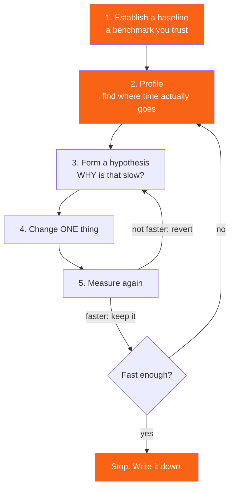

<h1><span class="h1-kicker">Performance & Production</span>Optimization: Finding What's Slow</h1>

Rust gives you the *potential* for C-level performance, not the guarantee. Idiomatic Rust is usually fast, but it's entirely possible to write code that's ten times slower than it needs to be — and the reasons are rarely where people look first. This chapter is about the discipline: measure, find the real bottleneck, fix that one thing, measure again.

The most valuable skill here isn't knowing tricks. It's refusing to guess.

## The optimization loop



> [!key] Never optimize without a benchmark and a profile
> Programmers are famously bad at guessing what's slow — including experienced ones, including on their own code. Modern CPUs, allocators, and optimizers make intuition unreliable. Without a benchmark you can't tell whether a change helped; without a profile you'll optimize the 2% and leave the 80% untouched. If you take one thing from this chapter, take this.

> [!mistake] Benchmarking a debug build
> `cargo run` produces an unoptimized binary that can be **10–100× slower** than release — bounds checks unelided, no inlining, `Vec` indexing not optimized, iterators not fused. Every performance measurement must use `--release` (or a profile that inherits it). People regularly conclude "Rust is slow" or "iterators are slow" from a debug timing. Always `cargo run --release`, always `cargo bench`.

## Measure first: benchmarking properly

The standard tool is **criterion**, which handles statistics, warm-up, and outlier detection.

```toml
[dev-dependencies]
criterion = { version = "0.5", features = ["html_reports"] }

[[bench]]
name = "parsing"
harness = false
```

```rust,ignore
// benches/parsing.rs
use criterion::{black_box, criterion_group, criterion_main, BenchmarkId, Criterion};

fn sum_loop(v: &[u64]) -> u64 {
    let mut total = 0;
    for i in 0..v.len() {
        total += v[i];
    }
    total
}

fn sum_iter(v: &[u64]) -> u64 {
    v.iter().sum()
}

fn bench_sums(c: &mut Criterion) {
    let mut group = c.benchmark_group("sum");
    for size in [64usize, 4096, 262_144] {
        let data: Vec<u64> = (0..size as u64).collect();
        group.bench_with_input(BenchmarkId::new("loop", size), &data, |b, d| {
            b.iter(|| sum_loop(black_box(d)))
        });
        group.bench_with_input(BenchmarkId::new("iter", size), &data, |b, d| {
            b.iter(|| sum_iter(black_box(d)))
        });
    }
    group.finish();
}

criterion_group!(benches, bench_sums);
criterion_main!(benches);
```

```bash
cargo bench                          # run and compare against the last run
cargo bench -- --save-baseline main  # name a baseline
cargo bench -- --baseline main       # compare against it
open target/criterion/report/index.html
```

> [!warning] `black_box` is not optional
> Without it, LLVM sees that your benchmark's result is unused and **deletes the entire computation**, and you measure an empty loop. `black_box(x)` is an opaque barrier: the optimizer must assume the value is used and can't be constant-folded. Wrap the inputs *and* return the result from the closure. A benchmark showing 0.3 nanoseconds for real work is always this bug.

For quick, in-program timing there's `Instant` — good enough for order-of-magnitude answers:

```rust
use std::time::Instant;

fn contains_linear(haystack: &[u32], needle: u32) -> bool {
    haystack.contains(&needle)
}

fn contains_binary(sorted: &[u32], needle: u32) -> bool {
    sorted.binary_search(&needle).is_ok()
}

fn main() {
    let data: Vec<u32> = (0..50_000).collect();
    let lookups: Vec<u32> = (0..2_000).map(|i| i * 25).collect();

    let start = Instant::now();
    let mut found = 0;
    for &n in &lookups {
        if contains_linear(&data, n) {
            found += 1;
        }
    }
    let linear = start.elapsed();

    let start = Instant::now();
    let mut found2 = 0;
    for &n in &lookups {
        if contains_binary(&data, n) {
            found2 += 1;
        }
    }
    let binary = start.elapsed();

    println!("linear: {linear:?} ({found} found)");
    println!("binary: {binary:?} ({found2} found)");
    println!("binary search was ~{:.0}x faster", linear.as_nanos() as f64 / binary.as_nanos().max(1) as f64);
}
```

> [!note] `Instant` timing is fine for 10× differences, useless for 10%
> A single `Instant` measurement includes whatever else your machine was doing, cache state, and CPU frequency scaling. It will reliably tell you that binary search beats a linear scan on 50,000 elements. It will *not* reliably tell you that one function is 8% faster than another — for that you need criterion's repeated sampling and statistics.

## Profiling: where does the time actually go?

```bash
# Flame graph — the single most useful profiling output. Read it bottom-up:
# width = time spent, and the top of each stack is where time was actually burnt.
cargo install flamegraph
cargo flamegraph --release --bin myapp

# perf on Linux — the underlying tool
perf record --call-graph dwarf ./target/release/myapp
perf report

# samply — a modern sampling profiler with a browser UI, cross-platform
cargo install samply
samply record ./target/release/myapp

# Instruction-level: which line inside a hot function?
cargo install cargo-show-asm
cargo asm --rust my_crate::hot_function
```

To profile a release build you need symbols, which release strips by default:

```toml
[profile.release]
debug = true            # keep symbols
strip = "none"          # don't remove them
# Optional: makes flame graphs far more readable by preserving frames.
# codegen-units = 1
```

| Tool | Shows | Platform |
|---|---|---|
| `cargo flamegraph` | where wall-clock time goes, by call stack | Linux, macOS |
| `samply` | the same, with a good interactive UI | cross-platform |
| `perf stat` | cache misses, branch mispredictions, IPC | Linux |
| `valgrind --tool=callgrind` | exact instruction counts (deterministic) | Linux |
| `dhat` / `dhat-rs` | heap allocation counts and sizes | cross-platform |
| `cargo-instruments` | Xcode Instruments integration | macOS |
| `tracing` + `tracing-flame` | time inside *your* spans, in production | cross-platform |
| `cargo asm` | the generated assembly for one function | cross-platform |

<figure class="diagram">
<svg viewBox="0 0 640 230" role="img" aria-label="A flame graph where each bar's width is time spent, showing that a wide allocation frame near the top is the real bottleneck">
  <style>
    .fg-m { font: 600 10px var(--font-mono); fill: var(--text); }
    .fg-c { font: 11px var(--font-sans); fill: var(--text-mute); }
    .fg-h { font: 700 12px var(--font-sans); fill: var(--text); }
    .fg-1 { fill: var(--surface-2); stroke: var(--border-strong); stroke-width: 1; }
    .fg-2 { fill: var(--blue-soft); stroke: var(--blue); stroke-width: 1; }
    .fg-3 { fill: var(--teal-soft); stroke: var(--teal); stroke-width: 1; }
    .fg-hot { fill: var(--rust-100); stroke: var(--rust-500); stroke-width: 2; }
  </style>
  <text x="20" y="18" class="fg-h">A flame graph: width = samples = time. Read upward.</text>
  <rect x="20" y="164" width="560" height="26" class="fg-1"/><text x="30" y="182" class="fg-m">main</text>
  <rect x="20" y="136" width="560" height="26" class="fg-1"/><text x="30" y="154" class="fg-m">process_records</text>
  <rect x="20" y="108" width="90" height="26" class="fg-2"/><text x="28" y="126" class="fg-m">read_line</text>
  <rect x="112" y="108" width="380" height="26" class="fg-3"/><text x="120" y="126" class="fg-m">format_row</text>
  <rect x="494" y="108" width="86" height="26" class="fg-2"/><text x="502" y="126" class="fg-m">write_out</text>
  <rect x="112" y="80" width="60" height="26" class="fg-3"/><text x="120" y="98" class="fg-m">upper</text>
  <rect x="174" y="80" width="318" height="26" class="fg-hot"/><text x="182" y="98" class="fg-m">__rust_alloc  ← 50% of total time</text>
  <text x="20" y="60" class="fg-c">↑ the widest frame at the TOP of a stack is where cycles were actually burnt</text>
  <text x="20" y="42" class="fg-c">Here: <tspan font-family="var(--font-mono)">format_row</tspan> looks slow, but the real cost is allocation inside it — so reuse a buffer, don't micro-tune the formatting.</text>
  <text x="20" y="212" class="fg-c">The x-axis is NOT time order — it's alphabetical grouping. Only width and stack depth carry meaning.</text>
</svg>
<figcaption>The bottom frames merely <b>contain</b> the time; the wide frame at the <b>top</b> is where it was spent. A fat <code>__rust_alloc</code> is the most common — and easiest to fix — finding.</figcaption>
</figure>

> [!best] Read a flame graph bottom-up, and look for width
> The x-axis is **not** time order — it's alphabetical grouping. Width is what matters: a wide frame means lots of samples landed there. Find the widest box near the *top* of a stack (that's where cycles were actually spent, not just passed through) and start there. A common revelation is a wide `memcpy` or `__rust_alloc` frame, which means the answer isn't your algorithm at all — it's allocation.

## The four usual culprits

In practice, most Rust performance problems are one of these.

### 1. Allocation in a hot loop

```rust
fn main() {
    let words = ["alpha", "beta", "gamma", "delta"];

    // ❌ Allocates a fresh String on every iteration.
    let mut out = Vec::new();
    for w in words {
        let formatted = format!("[{}]", w.to_uppercase()); // 2 allocations each
        out.push(formatted);
    }
    println!("{out:?}");

    // ✅ One reusable buffer, cleared each time. Zero allocations after the first.
    let mut buf = String::with_capacity(32);
    let mut out2 = Vec::with_capacity(words.len());
    for w in words {
        buf.clear();
        buf.push('[');
        buf.extend(w.chars().flat_map(|c| c.to_uppercase()));
        buf.push(']');
        out2.push(buf.clone()); // one allocation, only because we're storing it
    }
    println!("{out2:?}");

    // ✅✅ Best: if you're only reading the results, don't allocate at all.
    let total_len: usize = words.iter().map(|w| w.len() + 2).sum();
    println!("total formatted length would be {total_len} — computed with no allocation");
}
```

| Symptom | Fix |
|---|---|
| `format!` inside a loop | `write!` into one reused `String` |
| `.collect()` then immediately iterate | drop the `collect()` — iterators are lazy |
| `Vec::new()` then push n times | `Vec::with_capacity(n)` |
| `.to_string()` / `.clone()` to satisfy a signature | change the signature to take `&str` / `&[T]` |
| building a `Vec` to return, when caller just iterates | return `impl Iterator` |
| `String` concatenation with `+` in a loop | `push_str` into one buffer |

> [!performance] Removing allocations is usually the biggest single win
> Heap allocation is a synchronized call into the allocator, a potential cache miss, and eventually a `free`. Eliminating an allocation per iteration in a loop that runs a million times is worth far more than micro-tuning the arithmetic inside it. This is why `with_capacity`, buffer reuse, and borrowing instead of cloning show up on every Rust optimization list — and it's why a flame graph full of `__rust_alloc` is good news: it's an easy fix.

### 2. The wrong data structure

```rust
use std::collections::HashSet;
use std::time::Instant;

fn main() {
    let known: Vec<u32> = (0..20_000).collect();
    let known_set: HashSet<u32> = known.iter().copied().collect();
    let queries: Vec<u32> = (0..5_000).map(|i| i * 4).collect();

    // ❌ O(n) per lookup → O(n·m) overall.
    let start = Instant::now();
    let hits = queries.iter().filter(|q| known.contains(q)).count();
    let vec_time = start.elapsed();

    // ✅ O(1) per lookup → O(m) overall.
    let start = Instant::now();
    let hits2 = queries.iter().filter(|q| known_set.contains(q)).count();
    let set_time = start.elapsed();

    println!("Vec::contains  {vec_time:?} ({hits} hits)");
    println!("HashSet        {set_time:?} ({hits2} hits)");
}
```

The [std::collections Reference](#/ch/std-collections-ref) has the full cost table. The recurring mistake is `Vec::contains` inside a loop — an accidental O(n²).

### 3. Dynamic dispatch and indirection in tight loops

```rust
trait Op {
    fn apply(&self, x: i64) -> i64;
}

struct Double;
impl Op for Double {
    fn apply(&self, x: i64) -> i64 {
        x * 2
    }
}

// Generic: monomorphized, inlined, the call disappears entirely.
fn run_static<O: Op>(op: &O, data: &[i64]) -> i64 {
    data.iter().map(|&x| op.apply(x)).sum()
}

// Dynamic: a vtable lookup per element, and no inlining across it.
fn run_dynamic(op: &dyn Op, data: &[i64]) -> i64 {
    data.iter().map(|&x| op.apply(x)).sum()
}

fn main() {
    let data: Vec<i64> = (0..1_000).collect();
    println!("static  = {}", run_static(&Double, &data));
    println!("dynamic = {}", run_dynamic(&Double, &data));
    // Same answer. In a hot loop over millions of elements, the static
    // version can be several times faster — because the optimizer can see
    // through the call and vectorize the whole thing.
}
```

| Indirection | Cost in a hot loop |
|---|---|
| `impl Trait` / generic | none — inlined and often vectorized |
| `&dyn Trait` | a vtable load per call, blocks inlining |
| `Box<dyn Fn>` | the same, plus a heap indirection |
| `Rc`/`Arc` deref | a pointer chase; `Arc` clone is an atomic increment |
| `Vec<Vec<T>>` | a pointer chase per row — flatten to one `Vec` |
| `LinkedList` | a cache miss per element |

> [!performance] `Arc::clone` is an atomic operation, not a free copy
> Cloning an `Arc` increments an atomic counter, which requires cache-line coordination between cores. Doing it once per request is nothing. Doing it inside a loop across eight threads, on the same `Arc`, creates genuine contention — the cache line ping-pongs between cores. Clone the `Arc` **once** outside the loop, or restructure so each thread owns its data.

### 4. Bounds checks that couldn't be elided

Rust checks every index. The optimizer removes most of those checks when it can prove safety — and the way you write the loop determines whether it can.

```rust
fn main() {
    let a: Vec<f64> = (0..1000).map(|i| i as f64).collect();
    let b: Vec<f64> = (0..1000).map(|i| (i * 2) as f64).collect();

    // ❌ The compiler must check a[i] and b[i] on every iteration —
    // it can't prove both are long enough.
    let mut dot1 = 0.0;
    for i in 0..a.len() {
        dot1 += a[i] * b[i];
    }

    // ✅ zip proves the lengths agree, so there are no bounds checks at all,
    // and the loop can be vectorized.
    let dot2: f64 = a.iter().zip(&b).map(|(x, y)| x * y).sum();

    // ✅ Or slice first, which gives the optimizer the proof it needs.
    let n = a.len().min(b.len());
    let (sa, sb) = (&a[..n], &b[..n]);
    let mut dot3 = 0.0;
    for i in 0..n {
        dot3 += sa[i] * sb[i];
    }

    println!("{dot1} {dot2} {dot3}");
}
```

> [!key] Iterators are usually *faster* than index loops, not slower
> This surprises people from C. `for x in slice` and `.iter().zip()` carry proof that every access is in bounds, so the compiler emits **no** bounds checks and can vectorize freely. A manual `for i in 0..n { v[i] }` loop often can't be proven safe and keeps the checks. Idiomatic Rust is the fast path here — reach for `unsafe { get_unchecked }` only after a profile shows bounds checks are genuinely the bottleneck, which is rarer than folklore suggests.

## Compiler-level wins, for free

Before rewriting anything, get the free performance.

```toml
[profile.release]
lto = "fat"              # whole-program optimization: often 5-20%
codegen-units = 1        # better optimization, slower build
panic = "abort"          # removes unwinding paths
```

```bash
# Target your actual CPU — enables AVX2/NEON etc. Binary won't run on older CPUs.
RUSTFLAGS="-C target-cpu=native" cargo build --release

# Profile-guided optimization: build, run a representative workload, rebuild.
RUSTFLAGS="-Cprofile-generate=/tmp/pgo" cargo build --release
./target/release/myapp <representative workload>
llvm-profdata merge -o /tmp/pgo/merged.profdata /tmp/pgo
RUSTFLAGS="-Cprofile-use=/tmp/pgo/merged.profdata" cargo build --release
```

| Change | Typical gain | Cost |
|---|---|---|
| `--release` at all | 10–100× | none — just remember it |
| `lto = "thin"` | 5–10% | moderate link time |
| `lto = "fat"` + `codegen-units = 1` | 10–20% | much slower builds |
| `target-cpu=native` | 0–30% (vectorizable code) | binary is not portable |
| a faster allocator (`mimalloc`) | 5–30% (allocation-heavy) | one dependency |
| PGO | 5–15% | build complexity |
| `panic = "abort"` | small, mostly size | loses `catch_unwind` |

```rust,ignore
// Swapping the global allocator is a two-line change.
// Cargo.toml: mimalloc = "0.1"
use mimalloc::MiMalloc;

#[global_allocator]
static GLOBAL: MiMalloc = MiMalloc;

fn main() {
    // Every allocation in the program now goes through mimalloc.
}
```

> [!warning] `target-cpu=native` produces a binary that may crash elsewhere
> It compiles for the *exact* CPU doing the build, including instruction sets the deployment machine might not have — the result is an illegal-instruction crash on startup. It's perfect for a binary you run on the machine that built it (scientific computing, a local tool), and wrong for anything you distribute. For distribution, pick a conservative baseline like `-C target-cpu=x86-64-v2`, or use runtime feature detection with `is_x86_feature_detected!`.

## Parallelism: the biggest lever, when it applies

If the work is genuinely independent, `rayon` turns a serial iterator into a parallel one by changing one word.

```rust,ignore
// Cargo.toml: rayon = "1"
use rayon::prelude::*;

fn expensive(n: u64) -> u64 {
    (1..=n).map(|i| i * i % 7).sum()
}

fn main() {
    let inputs: Vec<u64> = (1..=2_000).collect();

    // Serial
    let serial: u64 = inputs.iter().map(|&n| expensive(n)).sum();

    // Parallel — literally `iter` → `par_iter`.
    let parallel: u64 = inputs.par_iter().map(|&n| expensive(n)).sum();

    assert_eq!(serial, parallel);
}
```

> [!performance] Parallelism has a floor, and small work falls below it
> Spawning and coordinating threads costs microseconds. `par_iter()` over a thousand items doing trivial work is often **slower** than serial, because coordination dominates. Rayon amortizes well for substantial work per item, but the rule stands: parallelize when each item's work is meaningful, or when the collection is large. And parallelizing an allocation-heavy loop can make things worse by putting the allocator under contention — fix the allocations first. See [Data Parallelism with Rayon](#/ch/rayon).

## Knowing when to stop

| Question | If yes… |
|---|---|
| Does it meet the requirement now? | **stop** |
| Is the remaining hot spot under 5% of runtime? | stop — Amdahl's law caps your win |
| Would the fix require `unsafe`? | only with a profile proving it's worth it |
| Would the fix make the code much harder to read? | write down the measurement in a comment |
| Have you measured, or are you guessing? | go measure |
| Is the bottleneck actually I/O or the network? | no amount of CPU tuning will help |

> [!best] Record the measurement next to the ugly code
> When you write something non-obvious for speed — a manual loop, a reused buffer, an `unsafe` block — put the number in a comment: `// 3.2x faster than the iterator version on 1M rows (benched 2026-08)`. It tells the next reader the ugliness is justified, gives them a target to beat, and — most valuably — lets them delete it confidently when a future compiler makes it pointless. Undocumented "optimizations" outlive their usefulness by years.

## Summary

- **Measure, profile, change one thing, measure again.** Never optimize on intuition; programmers are reliably wrong about what's slow.
- Always benchmark in **`--release`**. A debug build can be 100× slower and has misled many people about Rust and about iterators.
- Use **criterion** for reliable numbers and **`black_box`** so the optimizer doesn't delete your benchmark. `Instant` is fine for 10× differences only.
- Profile with **`cargo flamegraph`** or **samply**; keep `debug = true` in release so you get symbols. Read flame graphs bottom-up, looking for **width**.
- The four usual culprits: **allocation in hot loops**, the **wrong data structure**, **dynamic dispatch/indirection**, and **bounds checks the optimizer couldn't elide**.
- **Iterators are usually faster than index loops** because they carry the proof that eliminates bounds checks.
- Get free wins first: `lto`, `codegen-units = 1`, a faster allocator, and `target-cpu=native` (only for binaries you don't distribute).
- **Parallelism** is the biggest lever when work per item is substantial — and can be a regression when it isn't.
- **Stop** when the requirement is met, and leave the measurement in a comment next to any code you made ugly.

> [!exercise] Try it yourself
> 1. Time the same loop with `cargo run` and `cargo run --release`. Record the ratio — it's the single most important number in this chapter.
> 2. Take the `Vec::contains` example and find the crossover size where `HashSet` starts winning. Is it where you expected?
> 3. Write a benchmark *without* `black_box` that computes and discards a sum. What time does it report, and why is that impossible?
> 4. Rewrite a `for i in 0..v.len()` loop as `.iter().zip()` and compare release-mode timings on a million elements.
> 5. Add `lto = "fat"` and `codegen-units = 1` to a real project. Measure both the runtime improvement and the build-time cost, then decide whether you'd keep it.
> 6. Profile any program you've written with `cargo flamegraph`. Was the widest frame what you expected?

Next: the layer beneath all of this — how your data is actually arranged in memory, in **memory layout & representation**.
