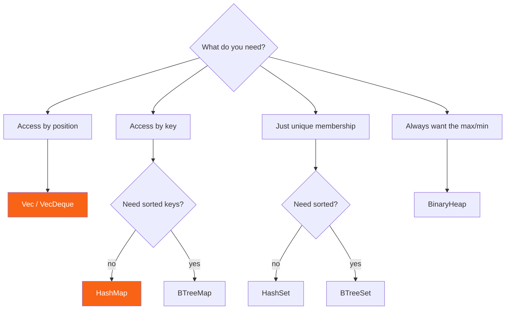

<h1><span class="h1-kicker">Common Collections</span>VecDeque, BTreeMap, HashSet & Friends</h1>

`Vec`, `String`, and `HashMap` handle most of what you'll ever need. But `std::collections` has a few more specialized tools, and knowing they exist — and *when* each one shines — separates a beginner from someone who writes efficient, expressive Rust. This chapter is a guided tour with full method tables and a decision guide at the end.

## `VecDeque` — a double-ended queue

A `Vec` is fast to push and pop at the *end*, but slow at the *front* (everything has to shift). When you need efficient adds and removes at **both** ends — a queue, a sliding window, a work list — reach for `VecDeque` (a *double-ended queue*, pronounced "deck"):

```rust
use std::collections::VecDeque;

fn main() {
    let mut queue = VecDeque::new();
    queue.push_back("first");   // add to the back
    queue.push_back("second");
    queue.push_front("zeroth"); // add to the front — also fast!

    println!("{queue:?}"); // ["zeroth", "first", "second"]

    // FIFO queue behavior: take from the front
    while let Some(item) = queue.pop_front() {
        println!("processing {item}");
    }
}
```

### Why both ends are cheap: the ring buffer

A `VecDeque` is one contiguous buffer with two markers — where the data starts and where it ends. Pushing to the front doesn't shift anything; it just moves the *start* marker backwards, wrapping around to the end of the buffer when it runs off the edge. That wrap-around is why it's called a **ring buffer**.

<figure class="diagram">
<svg viewBox="0 0 640 230" role="img" aria-label="A VecDeque stores elements in a fixed buffer with head and tail markers that wrap around the end">
  <style>
    .vd-l { font: 700 12px var(--font-sans); }
    .vd-m { font: 600 12px var(--font-mono); fill: var(--text); }
    .vd-c { font: 11px var(--font-sans); fill: var(--text-mute); }
    .vd-e { fill: var(--surface-2); stroke: var(--border-strong); stroke-width: 1.5; stroke-dasharray: 4 3; }
    .vd-f { fill: var(--rust-100); stroke: var(--rust-400); stroke-width: 1.5; }
    .vd-n { fill: var(--teal-soft); stroke: var(--teal); stroke-width: 1.5; }
  </style>
  <text x="20" y="20" class="vd-l" fill="var(--text-mute)">Buffer of 8 slots holding ["b", "c", "d"] — head at slot 2:</text>
  <g class="vd-m">
    <rect x="20" y="34" width="60" height="32" class="vd-e"/><text x="44" y="55" class="vd-c">0</text>
    <rect x="80" y="34" width="60" height="32" class="vd-e"/><text x="104" y="55" class="vd-c">1</text>
    <rect x="140" y="34" width="60" height="32" class="vd-f"/><text x="164" y="55">b</text>
    <rect x="200" y="34" width="60" height="32" class="vd-f"/><text x="224" y="55">c</text>
    <rect x="260" y="34" width="60" height="32" class="vd-f"/><text x="284" y="55">d</text>
    <rect x="320" y="34" width="60" height="32" class="vd-e"/><text x="344" y="55" class="vd-c">5</text>
    <rect x="380" y="34" width="60" height="32" class="vd-e"/><text x="404" y="55" class="vd-c">6</text>
    <rect x="440" y="34" width="60" height="32" class="vd-e"/><text x="464" y="55" class="vd-c">7</text>
  </g>
  <text x="150" y="86" class="vd-c" fill="var(--rust-600)">▲ head</text>
  <text x="272" y="86" class="vd-c" fill="var(--rust-600)">▲ tail</text>
  <text x="20" y="126" class="vd-l" fill="var(--teal)">push_front("a") — head moves LEFT, nothing shifts:</text>
  <g class="vd-m">
    <rect x="20" y="140" width="60" height="32" class="vd-e"/><text x="44" y="161" class="vd-c">0</text>
    <rect x="80" y="140" width="60" height="32" class="vd-n"/><text x="104" y="161">a</text>
    <rect x="140" y="140" width="60" height="32" class="vd-f"/><text x="164" y="161">b</text>
    <rect x="200" y="140" width="60" height="32" class="vd-f"/><text x="224" y="161">c</text>
    <rect x="260" y="140" width="60" height="32" class="vd-f"/><text x="284" y="161">d</text>
    <rect x="320" y="140" width="60" height="32" class="vd-e"/><text x="344" y="161" class="vd-c">5</text>
    <rect x="380" y="140" width="60" height="32" class="vd-e"/><text x="404" y="161" class="vd-c">6</text>
    <rect x="440" y="140" width="60" height="32" class="vd-e"/><text x="464" y="161" class="vd-c">7</text>
  </g>
  <text x="90" y="192" class="vd-c" fill="var(--teal)">▲ head</text>
  <path d="M150 186 L110 186" stroke="var(--teal)" stroke-width="2" marker-end="url(#arr-vd)"/>
  <text x="20" y="218" class="vd-c">If the head runs off slot 0 it wraps to slot 7 — the buffer is a circle. That's why both ends are O(1).</text>
  <defs><marker id="arr-vd" markerWidth="9" markerHeight="9" refX="7" refY="3" orient="auto"><path d="M0,0 L7,3 L0,6 Z" fill="var(--teal)"/></marker></defs>
</svg>
<figcaption>A <b>VecDeque</b> moves markers instead of moving data, so <code>push_front</code> costs the same as <code>push_back</code>.</figcaption>
</figure>

```rust
use std::collections::VecDeque;

fn main() {
    let mut d: VecDeque<i32> = VecDeque::from([1, 2, 3, 4, 5]);

    // Peek at either end without removing:
    println!("front={:?} back={:?}", d.front(), d.back());

    // Indexing works, just like a Vec:
    println!("d[2] = {:?}", d.get(2));

    // A fixed-size sliding window: push new, drop oldest.
    for new in [6, 7] {
        d.push_back(new);
        d.pop_front();
    }
    println!("{d:?}"); // [3, 4, 5, 6, 7]

    // Rotate the whole thing:
    d.rotate_left(2);
    println!("rotated: {d:?}"); // [5, 6, 7, 3, 4]

    // Need a plain slice? make_contiguous unwraps the ring first.
    let slice = d.make_contiguous();
    slice.sort();
    println!("sorted: {d:?}");
}
```

| Method | Cost | Effect |
|---|---|---|
| `push_back(x)` / `push_front(x)` | O(1) amortized | add at either end |
| `pop_back()` / `pop_front()` | O(1) | remove & return, as `Option<T>` |
| `front()` / `back()` | O(1) | peek, as `Option<&T>` |
| `front_mut()` / `back_mut()` | O(1) | peek mutably |
| `get(i)` / `get_mut(i)` | O(1) | index into it, as `Option` |
| `insert(i, x)` / `remove(i)` | O(n) | insert/remove in the middle |
| `swap_remove_back(i)` / `swap_remove_front(i)` | O(1) | remove by swapping in an end element |
| `rotate_left(n)` / `rotate_right(n)` | O(n) | shift everything around, wrapping |
| `make_contiguous()` | O(n) | rearrange into one slice, returns `&mut [T]` |
| `as_slices()` | O(1) | the two pieces of the ring, as-is |
| `iter()` / `drain(..)` / `retain(…)` | O(n) | same vocabulary as `Vec` |

> [!tip] `VecDeque` is your ready-made queue and stack
> For a **queue** (first-in-first-out), `push_back` + `pop_front`. For a **stack** (last-in-first-out), a plain `Vec` with `push` + `pop` is perfect. You rarely need to build these yourself — the standard library has them, tuned and ready.

> [!mistake] `VecDeque` is not a `Vec`, and `&d[..]` won't work
> Because the data can wrap around the end of the buffer, a `VecDeque` is **not** guaranteed to be one contiguous run of memory — so you can't take a `&[T]` slice of it directly. Call `make_contiguous()` first (which may move elements), or `as_slices()` to get the two pieces. This is the single most common surprise when switching a `Vec` to a `VecDeque`.

## `BTreeMap` & `BTreeSet` — always sorted

`HashMap` is fast but unordered. When you need your keys kept in **sorted order** — for ordered iteration, range queries, or finding the smallest/largest key — use `BTreeMap` (and its cousin `BTreeSet`):

```rust
use std::collections::BTreeMap;

fn main() {
    let mut scores = BTreeMap::new();
    scores.insert(3, "bronze");
    scores.insert(1, "gold");
    scores.insert(2, "silver");

    // Iterates in SORTED key order, guaranteed:
    for (rank, medal) in &scores {
        println!("{rank}: {medal}"); // 1, 2, 3 — always
    }

    // Range queries are easy and efficient:
    println!("first place: {:?}", scores.iter().next()); // Some((1, "gold"))
}
```

A **B-tree** keeps many keys per node rather than one, so the tree stays short and each node fills a cache line — which is why it beats a classic binary search tree in practice:

<figure class="diagram">
<svg viewBox="0 0 640 200" role="img" aria-label="A B-tree node holds several keys and points to child nodes covering the ranges between them">
  <style>
    .bt-m { font: 600 12px var(--font-mono); fill: var(--text); }
    .bt-c { font: 11px var(--font-sans); fill: var(--text-mute); }
    .bt-n { fill: var(--rust-100); stroke: var(--rust-400); stroke-width: 1.5; }
    .bt-k { fill: var(--surface-2); stroke: var(--border-strong); stroke-width: 1.5; }
  </style>
  <rect x="240" y="24" width="160" height="34" rx="4" class="bt-n"/>
  <line x1="293" y1="24" x2="293" y2="58" stroke="var(--rust-400)"/>
  <line x1="346" y1="24" x2="346" y2="58" stroke="var(--rust-400)"/>
  <text x="258" y="46" class="bt-m">20</text><text x="311" y="46" class="bt-m">40</text><text x="364" y="46" class="bt-m">60</text>
  <text x="240" y="16" class="bt-c">root: 3 keys in one cache-friendly node</text>
  <rect x="40" y="110" width="130" height="32" rx="4" class="bt-k"/>
  <text x="52" y="131" class="bt-m">3 · 8 · 12 · 17</text>
  <rect x="200" y="110" width="130" height="32" rx="4" class="bt-k"/>
  <text x="212" y="131" class="bt-m">22 · 28 · 35</text>
  <rect x="360" y="110" width="120" height="32" rx="4" class="bt-k"/>
  <text x="372" y="131" class="bt-m">44 · 51 · 58</text>
  <rect x="500" y="110" width="110" height="32" rx="4" class="bt-k"/>
  <text x="512" y="131" class="bt-m">66 · 79</text>
  <path d="M255 60 L105 108" stroke="var(--rust-500)" stroke-width="1.8"/>
  <path d="M300 60 L265 108" stroke="var(--rust-500)" stroke-width="1.8"/>
  <path d="M350 60 L415 108" stroke="var(--rust-500)" stroke-width="1.8"/>
  <path d="M392 60 L550 108" stroke="var(--rust-500)" stroke-width="1.8"/>
  <text x="40" y="98" class="bt-c">&lt; 20</text>
  <text x="215" y="98" class="bt-c">20–40</text>
  <text x="375" y="98" class="bt-c">40–60</text>
  <text x="515" y="98" class="bt-c">&gt; 60</text>
  <text x="20" y="176" class="bt-c">A range query like <tspan font-family="var(--font-mono)">range(22..45)</tspan> descends once, then walks the leaves in order — no re-searching.</text>
  <text x="20" y="192" class="bt-c">Because keys stay sorted, "first", "last", and "everything between x and y" are all cheap.</text>
</svg>
<figcaption>A <b>B-tree</b> packs many keys per node, keeping the tree shallow and making ordered scans and range queries natural.</figcaption>
</figure>

Range queries are the feature you can't get from a `HashMap` at any price:

```rust
use std::collections::BTreeMap;

fn main() {
    let mut log: BTreeMap<u32, &str> = BTreeMap::new();
    for (t, msg) in [(100, "boot"), (250, "ready"), (400, "request"), (900, "shutdown")] {
        log.insert(t, msg);
    }

    // Everything in a time window — impossible with a HashMap:
    for (t, msg) in log.range(200..500) {
        println!("{t}: {msg}"); // 250, 400
    }

    // The extremes, in O(log n):
    println!("earliest: {:?}", log.first_key_value());
    println!("latest:   {:?}", log.last_key_value());

    // Iterate backwards:
    let recent: Vec<_> = log.iter().rev().take(2).collect();
    println!("two most recent: {recent:?}");

    // Pop from either end — a ready-made ordered work queue:
    println!("popped earliest: {:?}", log.pop_first());
    println!("remaining: {}", log.len());
}
```

| Method | Cost | Notes |
|---|---|---|
| `insert(k, v)` / `get(&k)` / `remove(&k)` | O(log n) | same shape as `HashMap` |
| `entry(k)` | O(log n) | the full `entry` API works here too |
| `range(a..b)` | O(log n + k) | **the reason to use `BTreeMap`** |
| `range_mut(a..b)` | O(log n + k) | edit a whole range |
| `first_key_value()` / `last_key_value()` | O(log n) | min / max entry |
| `pop_first()` / `pop_last()` | O(log n) | remove min / max — an ordered queue |
| `iter()` / `keys()` / `values()` | O(n) | always in **sorted key order** |
| `iter().rev()` | O(n) | descending order |
| `split_off(&k)` | O(n) | split into two maps at a key |
| `append(&mut other)` | O(n) | merge another map in |
| `retain(\|k, v\| …)` | O(n) | bulk delete |

> [!note] The trade-off: `HashMap` vs `BTreeMap`
> `HashMap` has faster average lookups (**O(1)**) but no order. `BTreeMap` keeps keys sorted with slightly slower (**O(log n)**) operations. Choose `HashMap` by default; switch to `BTreeMap` the moment you need ordering or range queries. (A `BTreeMap` needs keys that are `Ord` — orderable — whereas `HashMap` needs `Hash` + `Eq`.)

> [!tip] `BTreeMap` makes tests and output deterministic
> Because iteration order is guaranteed, a `BTreeMap` prints the same way every run — which makes `assert_eq!` on a whole map possible and debug output readable. Plenty of code uses `HashMap` in production paths and `BTreeMap` wherever a stable order makes life easier. It's also the easy fix when a snapshot test keeps failing for no reason.

## `HashSet` & `BTreeSet` — collections of unique items

A **set** stores unique values with no duplicates, and answers "is this in the set?" instantly. It's a `HashMap` where you only care about the keys. Sets also do the classic mathematical operations — union, intersection, difference:

```rust
use std::collections::HashSet;

fn main() {
    let a: HashSet<i32> = [1, 2, 3, 4].into_iter().collect();
    let b: HashSet<i32> = [3, 4, 5, 6].into_iter().collect();

    println!("contains 3? {}", a.contains(&3)); // true

    // Set operations return iterators; collect to inspect them.
    let mut both: Vec<i32> = a.intersection(&b).copied().collect();
    both.sort();
    println!("in both: {both:?}"); // [3, 4]

    let mut either: Vec<i32> = a.union(&b).copied().collect();
    either.sort();
    println!("in either: {either:?}"); // [1, 2, 3, 4, 5, 6]
}
```

<figure class="diagram">
<svg viewBox="0 0 640 220" role="img" aria-label="Venn diagram showing union intersection difference and symmetric difference of two sets">
  <style>
    .sv-l { font: 700 12px var(--font-sans); fill: var(--text); }
    .sv-m { font: 600 11px var(--font-mono); fill: var(--text); }
    .sv-c { font: 10px var(--font-sans); fill: var(--text-mute); }
    .sv-o { fill: none; stroke: var(--border-strong); stroke-width: 1.5; }
    .sv-hi { fill: var(--rust-100); stroke: var(--rust-400); stroke-width: 1.5; }
  </style>
  <g>
    <text x="20" y="18" class="sv-l">a.union(&amp;b)</text>
    <circle cx="55" cy="70" r="36" class="sv-hi"/><circle cx="95" cy="70" r="36" class="sv-hi"/>
    <text x="30" y="126" class="sv-m">1,2,3,4,5,6</text>
    <text x="30" y="142" class="sv-c">everything</text>
  </g>
  <g>
    <text x="185" y="18" class="sv-l">a.intersection(&amp;b)</text>
    <circle cx="235" cy="70" r="36" class="sv-o"/><circle cx="275" cy="70" r="36" class="sv-o"/>
    <path d="M255 39 A 36 36 0 0 1 255 101 A 36 36 0 0 1 255 39 Z" class="sv-hi"/>
    <text x="235" y="126" class="sv-m">3,4</text>
    <text x="215" y="142" class="sv-c">in both</text>
  </g>
  <g>
    <text x="360" y="18" class="sv-l">a.difference(&amp;b)</text>
    <circle cx="415" cy="70" r="36" class="sv-hi"/><circle cx="455" cy="70" r="36" class="sv-o"/>
    <path d="M435 39 A 36 36 0 0 1 435 101 A 36 36 0 0 1 435 39 Z" fill="var(--surface-2)" stroke="var(--border-strong)"/>
    <text x="405" y="126" class="sv-m">1,2</text>
    <text x="385" y="142" class="sv-c">in a only</text>
  </g>
  <g>
    <text x="520" y="18" class="sv-l">symmetric_</text>
    <text x="520" y="32" class="sv-l">difference</text>
    <circle cx="560" cy="78" r="34" class="sv-hi"/><circle cx="598" cy="78" r="34" class="sv-hi"/>
    <path d="M579 49 A 34 34 0 0 1 579 107 A 34 34 0 0 1 579 49 Z" fill="var(--surface-2)" stroke="var(--border-strong)"/>
    <text x="540" y="130" class="sv-m">1,2,5,6</text>
    <text x="530" y="146" class="sv-c">in exactly one</text>
  </g>
  <text x="20" y="180" class="sv-c">a = {1, 2, 3, 4}   b = {3, 4, 5, 6}</text>
  <text x="20" y="200" class="sv-c">All four return iterators — call .collect() to materialize, or .count() to just measure.</text>
</svg>
<figcaption>The four set operations, each returning a lazy iterator. <b>is_subset</b>, <b>is_superset</b>, and <b>is_disjoint</b> answer the same questions as a <code>bool</code>.</figcaption>
</figure>

```rust
use std::collections::HashSet;

fn main() {
    let a: HashSet<i32> = [1, 2, 3, 4].into_iter().collect();
    let b: HashSet<i32> = [3, 4, 5, 6].into_iter().collect();
    let small: HashSet<i32> = [3, 4].into_iter().collect();

    // insert returns whether the value was NEW — handy for "have I seen this?"
    let mut seen = HashSet::new();
    for x in [1, 2, 2, 3, 1] {
        if !seen.insert(x) {
            println!("{x} is a duplicate");
        }
    }

    // Relationship tests, no allocation needed:
    println!("small ⊆ a?      {}", small.is_subset(&a));      // true
    println!("a ⊇ small?      {}", a.is_superset(&small));    // true
    println!("a ∩ b empty?    {}", a.is_disjoint(&b));        // false

    let mut only_a: Vec<i32> = a.difference(&b).copied().collect();
    only_a.sort();
    println!("in a but not b: {only_a:?}");                   // [1, 2]

    let mut either_not_both: Vec<i32> = a.symmetric_difference(&b).copied().collect();
    either_not_both.sort();
    println!("in exactly one: {either_not_both:?}");           // [1, 2, 5, 6]
}
```

| Method | Returns | Notes |
|---|---|---|
| `insert(x)` | `bool` | `true` if it was **new** — the "have I seen this?" idiom |
| `contains(&x)` | `bool` | O(1) for `HashSet`, O(log n) for `BTreeSet` |
| `remove(&x)` | `bool` | `true` if it was present |
| `take(&x)` | `Option<T>` | remove **and return** the stored value |
| `get(&x)` | `Option<&T>` | the stored value (may differ from your lookup key) |
| `union(&other)` | iterator | everything in either |
| `intersection(&other)` | iterator | only what's in both |
| `difference(&other)` | iterator | in `self`, not in `other` |
| `symmetric_difference(&other)` | iterator | in exactly one |
| `is_subset` / `is_superset` / `is_disjoint` | `bool` | relationship tests, no allocation |
| `retain(\|x\| …)` / `drain()` / `clear()` | — | bulk operations |
| `BTreeSet::range(a..b)` | iterator | sorted sets get range queries too |
| `BTreeSet::first()` / `last()` | `Option<&T>` | min / max |

> [!best] Use a set to deduplicate
> Need the unique items from a list? `let unique: HashSet<_> = items.into_iter().collect();` does it in one line. Adding a value that's already present is simply a no-op. It's the cleanest dedup in the language — and if you need the *original order* preserved, keep a `HashSet` for "have I seen it" and push to a `Vec` when `insert` returns `true`.

## `BinaryHeap` — a priority queue

A `BinaryHeap` always keeps the **largest** element ready to pop in O(log n) time. It's the go-to *priority queue*: task schedulers, Dijkstra's shortest-path algorithm, "top-K" problems.

```rust
use std::collections::BinaryHeap;
use std::cmp::Reverse;

fn main() {
    let mut heap = BinaryHeap::new();
    heap.push(3);
    heap.push(1);
    heap.push(4);
    heap.push(1);

    println!("largest: {:?}", heap.peek()); // Some(4) — max is always on top
    println!("popped:  {:?}", heap.pop());  // Some(4)

    // It's a MAX-heap. For a MIN-heap, wrap values in Reverse:
    let mut min_heap = BinaryHeap::new();
    min_heap.push(Reverse(3));
    min_heap.push(Reverse(1));
    min_heap.push(Reverse(4));
    if let Some(Reverse(smallest)) = min_heap.peek() {
        println!("smallest: {smallest}"); // 1
    }
}
```

Two patterns cover most real uses — "top K" and "pull the highest-priority job":

```rust
use std::cmp::Reverse;
use std::collections::BinaryHeap;

fn main() {
    let scores = [17, 3, 92, 45, 8, 61, 30];

    // Top 3 largest: keep a MIN-heap of size 3 and evict the smallest.
    let mut top = BinaryHeap::new();
    for s in scores {
        top.push(Reverse(s));
        if top.len() > 3 {
            top.pop(); // drops the smallest of the three
        }
    }
    let mut best: Vec<i32> = top.into_iter().map(|Reverse(s)| s).collect();
    best.sort_by(|a, b| b.cmp(a));
    println!("top 3: {best:?}"); // [92, 61, 45]

    // Priority queue of (priority, task) — tuples compare field by field.
    let mut jobs = BinaryHeap::from([(2, "email"), (9, "page oncall"), (5, "deploy")]);
    while let Some((priority, name)) = jobs.pop() {
        println!("p{priority}: {name}"); // 9, 5, 2
    }

    // Draining the whole heap in order is one call:
    let heap = BinaryHeap::from([5, 1, 9, 3]);
    println!("{:?}", heap.into_sorted_vec()); // [1, 3, 5, 9] — ascending
}
```

| Method | Cost | Effect |
|---|---|---|
| `push(x)` | O(log n) | add, keeping the max on top |
| `pop()` | O(log n) | remove & return the max |
| `peek()` | O(1) | look at the max without removing |
| `peek_mut()` | O(1) + O(log n) on drop | edit the max in place; re-sorts when the guard drops |
| `BinaryHeap::from(vec)` | O(n) | build in linear time — cheaper than n pushes |
| `into_sorted_vec()` | O(n log n) | consume into an **ascending** `Vec` |
| `into_vec()` | O(1) | the raw backing storage, unspecified order |
| `len()` / `is_empty()` / `clear()` | O(1) / O(1) / O(n) | size operations |
| `Reverse(x)` wrapper | — | turns the max-heap into a **min-heap** |

> [!jargon] What's a "heap" here?
> Confusingly, this **heap** is *not* the memory heap from the [stack & heap chapter](#/ch/stack-heap)! Here, a *binary heap* is a tree-shaped data structure that keeps its maximum (or minimum) instantly accessible. Same word, totally different meaning — context tells you which. We build one from scratch in the [Heaps & Priority Queues](#/ch/dsa-heaps) chapter.

> [!performance] Build from a `Vec` instead of pushing in a loop
> `BinaryHeap::from(vec)` "heapifies" in **O(n)**, while pushing n elements one at a time costs **O(n log n)**. If you already have all the data, hand it over at once. And when you need every element in order anyway, `into_sorted_vec()` beats popping in a loop.

## `LinkedList` — the one you (almost) never want

Rust includes a `LinkedList`, but here's a piece of honest advice:

> [!warning] Prefer `Vec` or `VecDeque` over `LinkedList`
> Textbooks love linked lists, but on modern hardware they're usually *slower* than a `Vec` for almost everything — because their nodes are scattered across the heap, defeating the CPU's cache (which craves contiguous memory). Unless you have a very specific need (like O(1) splicing of large sublists), reach for `Vec` or `VecDeque` instead. We explore *why* linked lists are also awkward to build in Rust in a [dedicated DSA chapter](#/ch/dsa-linked-list).

## Which collection should I use?

Keep this decision guide handy — it answers "which one?" for almost every situation:

| I need to… | Use | Why |
|------------|-----|-----|
| Store an ordered list, add/remove at the end | **`Vec<T>`** | The default; contiguous and fast |
| Add/remove at both ends (queue) | **`VecDeque<T>`** | O(1) at front *and* back |
| Look up values by key, fast | **`HashMap<K,V>`** | Average O(1); no ordering |
| Look up by key, keys kept sorted | **`BTreeMap<K,V>`** | O(log n); ordered iteration & ranges |
| Track a set of unique values | **`HashSet<T>`** | Fast membership; set operations |
| Unique values, kept sorted | **`BTreeSet<T>`** | Ordered set |
| Always grab the largest/smallest | **`BinaryHeap<T>`** | Priority queue, O(log n) push/pop |
| Own growable text | **`String`** | UTF-8, like `Vec<u8>` for text |
| Splice large sublists in O(1) | **`LinkedList<T>`** | The only thing it's actually good at |



> [!key] Start simple, specialize on evidence
> A `Vec` with a linear scan beats a `HashMap` for small collections — often up to a few dozen elements — because it's contiguous and needs no hashing. Don't reach for an exotic structure because it sounds efficient; reach for it when you've identified the access pattern that demands it. The [std::collections Reference](#/ch/std-collections-ref) chapter has the full Big-O table for when you do.

## Summary

- **`VecDeque<T>`** — a **ring buffer** with head/tail markers, so pushes and pops are O(1) at *both* ends. Not contiguous: call `make_contiguous()` before slicing.
- **`BTreeMap` / `BTreeSet`** — keep keys **sorted** (O(log n)), unlocking **`range(a..b)`**, `first_key_value`, `pop_first`, and deterministic iteration for tests.
- **`HashSet` / `BTreeSet`** — **unique** values with `union`, `intersection`, `difference`, `symmetric_difference`, and subset tests. `insert` returns `true` when the value was new.
- **`BinaryHeap<T>`** — a **priority queue** with the max on top; wrap in **`Reverse`** for a min-heap, build with `from(vec)` in O(n), drain with `into_sorted_vec()`.
- **`LinkedList`** exists but is almost always the wrong choice — prefer `Vec`/`VecDeque`.
- Use the **decision table** to pick, and default to `Vec`/`HashMap` until a real requirement pushes you elsewhere.

> [!exercise] Try it yourself
> 1. Use a `VecDeque` to simulate a printer queue: enqueue five jobs at the back, process them from the front. Then convert it to a fixed-size sliding window that keeps only the three most recent.
> 2. Given `vec![3, 1, 4, 1, 5, 9, 2, 6, 5]`, use a `HashSet` to print the unique values (sorted) — then do it again preserving the *original* order.
> 3. Use a `BinaryHeap` with `Reverse` to find the three *smallest* numbers in a list, without sorting the whole thing.
> 4. Store `(timestamp, event)` pairs in a `BTreeMap` and use `range` to print everything that happened in a given window.
> 5. Take two `HashSet`s of usernames and report who's in both, who's only in the first, and whether one is a subset of the other.

You've now met every container Rust ships with. Next we put them to work: a cookbook of the **collection recipes** you'll reach for constantly — counting, grouping, deduplicating, and building indexes.
