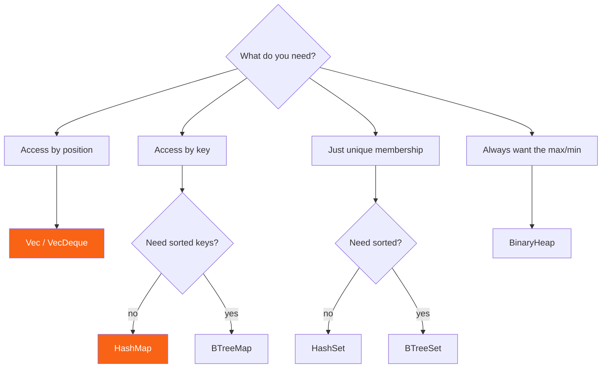

<h1><span class="h1-kicker">Common Collections</span>VecDeque, BTreeMap, HashSet & Friends</h1>

`Vec`, `String`, and `HashMap` handle most of what you'll ever need. But `std::collections` has a few more specialized tools, and knowing they exist — and *when* each one shines — separates a beginner from someone who writes efficient, expressive Rust. This chapter is a guided tour with a decision guide at the end.

## `VecDeque` — a double-ended queue

A `Vec` is fast to push and pop at the *end*, but slow at the *front* (everything has to shift). When you need efficient adds and removes at **both** ends — a queue, a sliding window, a work list — reach for `VecDeque` (a *double-ended queue*, pronounced "deck"):

```rust
use std::collections::VecDeque;

fn main() {
    let mut queue = VecDeque::new();
    queue.push_back("first");   // add to the back
    queue.push_back("second");
    queue.push_front("zeroth"); // add to the front — also fast!

    println!("{queue:?}"); // ["zeroth", "first", "second"]

    // FIFO queue behavior: take from the front
    while let Some(item) = queue.pop_front() {
        println!("processing {item}");
    }
}
```

> [!tip] `VecDeque` is your ready-made queue and stack
> For a **queue** (first-in-first-out), `push_back` + `pop_front`. For a **stack** (last-in-first-out), a plain `Vec` with `push` + `pop` is perfect. You rarely need to build these yourself — the standard library has them, tuned and ready.

## `BTreeMap` & `BTreeSet` — always sorted

`HashMap` is fast but unordered. When you need your keys kept in **sorted order** — for ordered iteration, range queries, or finding the smallest/largest key — use `BTreeMap` (and its cousin `BTreeSet`):

```rust
use std::collections::BTreeMap;

fn main() {
    let mut scores = BTreeMap::new();
    scores.insert(3, "bronze");
    scores.insert(1, "gold");
    scores.insert(2, "silver");

    // Iterates in SORTED key order, guaranteed:
    for (rank, medal) in &scores {
        println!("{rank}: {medal}"); // 1, 2, 3 — always
    }

    // Range queries are easy and efficient:
    println!("first place: {:?}", scores.iter().next()); // Some((1, "gold"))
}
```

> [!note] The trade-off: `HashMap` vs `BTreeMap`
> `HashMap` has faster average lookups (**O(1)**) but no order. `BTreeMap` keeps keys sorted with slightly slower (**O(log n)**) operations. Choose `HashMap` by default; switch to `BTreeMap` the moment you need ordering or range queries. (A `BTreeMap` needs keys that are `Ord` — orderable — whereas `HashMap` needs `Hash` + `Eq`.)

## `HashSet` & `BTreeSet` — collections of unique items

A **set** stores unique values with no duplicates, and answers "is this in the set?" instantly. It's a `HashMap` where you only care about the keys. Sets also do the classic mathematical operations — union, intersection, difference:

```rust
use std::collections::HashSet;

fn main() {
    let a: HashSet<i32> = [1, 2, 3, 4].into_iter().collect();
    let b: HashSet<i32> = [3, 4, 5, 6].into_iter().collect();

    println!("contains 3? {}", a.contains(&3)); // true

    // Set operations return iterators; collect to inspect them.
    let mut both: Vec<i32> = a.intersection(&b).copied().collect();
    both.sort();
    println!("in both: {both:?}"); // [3, 4]

    let mut either: Vec<i32> = a.union(&b).copied().collect();
    either.sort();
    println!("in either: {either:?}"); // [1, 2, 3, 4, 5, 6]
}
```

> [!best] Use a set to deduplicate
> Need the unique items from a list? `let unique: HashSet<_> = items.into_iter().collect();` does it in one line. Adding a value that's already present is simply a no-op. It's the cleanest dedup in the language.

## `BinaryHeap` — a priority queue

A `BinaryHeap` always keeps the **largest** element ready to pop in O(log n) time. It's the go-to *priority queue*: task schedulers, Dijkstra's shortest-path algorithm, "top-K" problems.

```rust
use std::collections::BinaryHeap;
use std::cmp::Reverse;

fn main() {
    let mut heap = BinaryHeap::new();
    heap.push(3);
    heap.push(1);
    heap.push(4);
    heap.push(1);

    println!("largest: {:?}", heap.peek()); // Some(4) — max is always on top
    println!("popped:  {:?}", heap.pop());  // Some(4)

    // It's a MAX-heap. For a MIN-heap, wrap values in Reverse:
    let mut min_heap = BinaryHeap::new();
    min_heap.push(Reverse(3));
    min_heap.push(Reverse(1));
    min_heap.push(Reverse(4));
    if let Some(Reverse(smallest)) = min_heap.peek() {
        println!("smallest: {smallest}"); // 1
    }
}
```

> [!jargon] What's a "heap" here?
> Confusingly, this **heap** is *not* the memory heap from the [stack & heap chapter](#/ch/stack-heap)! Here, a *binary heap* is a tree-shaped data structure that keeps its maximum (or minimum) instantly accessible. Same word, totally different meaning — context tells you which. We build one from scratch in the [Heaps & Priority Queues](#/ch/dsa-heaps) chapter.

## `LinkedList` — the one you (almost) never want

Rust includes a `LinkedList`, but here's a piece of honest advice:

> [!warning] Prefer `Vec` or `VecDeque` over `LinkedList`
> Textbooks love linked lists, but on modern hardware they're usually *slower* than a `Vec` for almost everything — because their nodes are scattered across the heap, defeating the CPU's cache (which craves contiguous memory). Unless you have a very specific need (like O(1) splicing of large sublists), reach for `Vec` or `VecDeque` instead. We explore *why* linked lists are also awkward to build in Rust in a [dedicated DSA chapter](#/ch/dsa-linked-list).

## Which collection should I use?

Keep this decision guide handy — it answers "which one?" for almost every situation:

| I need to… | Use | Why |
|------------|-----|-----|
| Store an ordered list, add/remove at the end | **`Vec<T>`** | The default; contiguous and fast |
| Add/remove at both ends (queue) | **`VecDeque<T>`** | O(1) at front *and* back |
| Look up values by key, fast | **`HashMap<K,V>`** | Average O(1); no ordering |
| Look up by key, keys kept sorted | **`BTreeMap<K,V>`** | O(log n); ordered iteration & ranges |
| Track a set of unique values | **`HashSet<T>`** | Fast membership; set operations |
| Unique values, kept sorted | **`BTreeSet<T>`** | Ordered set |
| Always grab the largest/smallest | **`BinaryHeap<T>`** | Priority queue, O(log n) push/pop |
| Own growable text | **`String`** | UTF-8, like `Vec<u8>` for text |



## Summary

- **`VecDeque<T>`** — a double-ended queue; fast pushes/pops at both ends (queues, sliding windows).
- **`BTreeMap` / `BTreeSet`** — keep keys/values **sorted**; use for ordered iteration and range queries (O(log n)).
- **`HashSet` / `BTreeSet`** — collections of **unique** values, with union/intersection/difference; great for dedup.
- **`BinaryHeap<T>`** — a **priority queue** that always yields the max (use `Reverse` for a min-heap).
- **`LinkedList`** exists but is almost always the wrong choice — prefer `Vec`/`VecDeque`.
- Use the **decision table** to pick the right collection for the job.

> [!exercise] Try it yourself
> 1. Use a `VecDeque` to simulate a printer queue: enqueue five jobs at the back, process them from the front.
> 2. Given `vec![3, 1, 4, 1, 5, 9, 2, 6, 5]`, use a `HashSet` to print the unique values (sorted).
> 3. Use a `BinaryHeap` with `Reverse` to find the three *smallest* numbers in a list.

You've mastered Rust's data-storage toolkit. But real programs also have to cope when things go *wrong* — files that don't exist, input that won't parse. Next up: Rust's exceptionally good approach to **error handling**.
