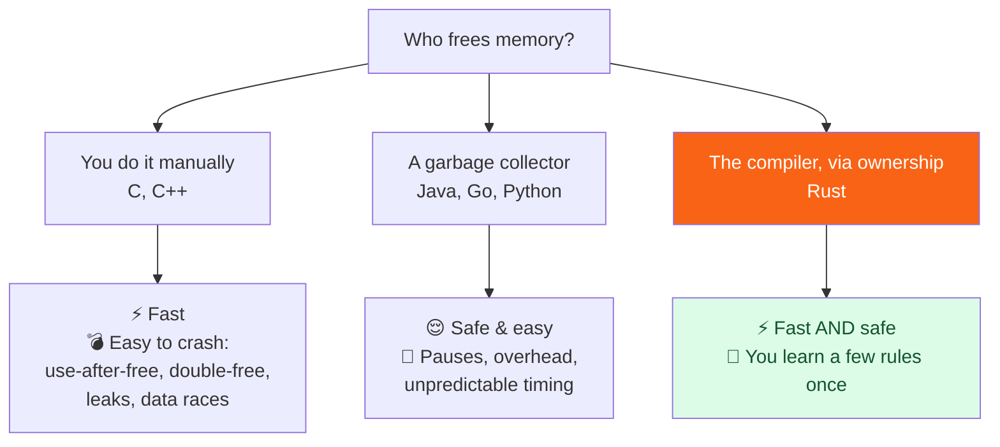

<h1><span class="h1-kicker">Ownership — The Heart of Rust</span>Ownership</h1>

Ownership is the one idea that makes Rust special. Once it *clicks*, the rest of the language falls into place. Master this chapter and you have mastered the soul of Rust.

Here is the promise of Rust in a single sentence: **your program is guaranteed to be free of a whole category of memory bugs — and it runs as fast as C, with no garbage collector** (a background process in languages like Java or Go that automatically frees unused memory). Ownership is *how* Rust keeps that promise.

> [!key] The big picture
> Most languages pick **one** of two strategies for managing memory. Rust invented a **third**. Ownership lets the compiler prove your program is memory-safe *before it ever runs* — at zero runtime cost.

## The problem: who cleans up the memory?

Every program needs memory to store its data. The hard question is always: **when a piece of data is no longer needed, who frees (releases) that memory, and when?**

There are three classic answers, and each has a painful trade-off:



- **Manual management** (C, C++): *you* call `free()` when done. Total control and top speed — but forget to free and you leak memory; free too early and you get a **use-after-free** (reading memory that's already been handed back, a top source of security holes); free twice and you corrupt the program.
- **Garbage collection** (Java, Go, Python): a helper runs in the background and frees things for you. Comfortable and safe — but it costs CPU time and causes unpredictable pauses, which is unacceptable for games, operating systems, or trading systems.
- **Ownership** (Rust): the *compiler* figures out exactly where each value is no longer needed and inserts the cleanup for you, at compile time. You get C's speed **and** safety. The price? You learn a few rules — the rest of this chapter.

> [!jargon] Jargon buster
> **Memory** here means RAM — the working space where your running program keeps its data. **Allocate** = ask the system for some memory. **Free** (or *deallocate*, *release*) = give it back. **Leak** = forget to give it back, so it's wasted until the program exits.

## The three rules of ownership

That's the whole foundation. Everything else is a consequence of these three rules:

> [!key] The rules of ownership
> 1. Each value in Rust has an **owner** (a variable that is responsible for it).
> 2. There can only be **one owner at a time**.
> 3. When the owner goes out of scope (its `{ }` block ends), the value is automatically **dropped** (freed).

Let's see rule 3 in action. A **scope** is the region of code where a variable is valid — usually between a pair of curly braces `{ }`.

```rust
fn main() {
    // `s` is not valid here — it isn't declared yet.
    {
        let s = String::from("hello"); // `s` is valid from this point on
        println!("Inside the block: {s}");
    } // <- the block ends here; `s` is dropped and its memory is freed automatically
    // Trying to use `s` here would be a compile error, because it no longer exists.

    println!("The block is over, and Rust already cleaned up `s`.");
}
```

When `s` goes out of scope at the closing `}`, Rust automatically calls a special cleanup function named `drop` for us. There is no `free()` to remember, and no garbage collector scanning in the background. The cleanup is decided at compile time and happens at a *precise, predictable* moment.

> [!tip] This pattern has a famous name
> Cleaning up a resource exactly when its owner goes out of scope is called **RAII** (*Resource Acquisition Is Initialization*), an idea Rust borrows from C++. It works not just for memory but for files, network sockets, and locks — anything that must be released.

## Move: why only one owner?

To understand rule 2 ("one owner at a time"), we need to peek at where data lives. Some values are small and fixed-size, like an `i32`; they live entirely on the **stack** (a fast, orderly region of memory). Others can grow, like a `String`; their contents live on the **heap** (a flexible region for data whose size isn't known up front).

A `String` is actually two parts working together:

<figure class="diagram">
<svg viewBox="0 0 640 240" role="img" aria-label="A String is a small handle on the stack pointing to text bytes on the heap">
  <style>
    .lbl { font: 600 13px var(--font-sans); fill: var(--text); }
    .sub { font: 12px var(--font-sans); fill: var(--text-mute); }
    .cell { fill: var(--surface-2); stroke: var(--border-strong); stroke-width: 1.5; }
    .cellh { fill: var(--rust-100); stroke: var(--rust-400); stroke-width: 1.5; }
    .mono { font: 600 13px var(--font-mono); fill: var(--text); }
    .region { font: 700 12px var(--font-sans); letter-spacing: .05em; }
  </style>
  <text x="20" y="24" class="region" fill="var(--blue)">STACK (the handle `s`)</text>
  <rect x="20" y="36" width="120" height="34" class="cell"/>
  <rect x="20" y="70" width="120" height="34" class="cell"/>
  <rect x="20" y="104" width="120" height="34" class="cell"/>
  <text x="150" y="58" class="mono">ptr ●———▶</text>
  <text x="150" y="92" class="mono">len = 5</text>
  <text x="150" y="126" class="mono">capacity = 5</text>
  <text x="20" y="160" class="sub">A fixed-size, 3-word handle.</text>
  <text x="400" y="24" class="region" fill="var(--rust-600)">HEAP (the actual text)</text>
  <g>
    <rect x="400" y="36" width="34" height="34" class="cellh"/><text x="410" y="58" class="mono">h</text>
    <rect x="434" y="36" width="34" height="34" class="cellh"/><text x="444" y="58" class="mono">e</text>
    <rect x="468" y="36" width="34" height="34" class="cellh"/><text x="478" y="58" class="mono">l</text>
    <rect x="502" y="36" width="34" height="34" class="cellh"/><text x="512" y="58" class="mono">l</text>
    <rect x="536" y="36" width="34" height="34" class="cellh"/><text x="546" y="58" class="mono">o</text>
  </g>
  <text x="400" y="94" class="sub">Grows and shrinks at runtime.</text>
  <path d="M250 53 L398 53" stroke="var(--rust-500)" stroke-width="2.5" fill="none" marker-end="url(#arr)"/>
  <defs>
    <marker id="arr" markerWidth="10" markerHeight="10" refX="8" refY="3" orient="auto">
      <path d="M0,0 L8,3 L0,6 Z" fill="var(--rust-500)"/>
    </marker>
  </defs>
</svg>
<figcaption>A <b>String</b> is a tiny handle on the stack (a pointer, a length, and a capacity) that points to the real characters on the heap.</figcaption>
</figure>

Now watch what happens when we assign one `String` to another variable:

```rust
fn main() {
    let s1 = String::from("hello");
    let s2 = s1; // the handle is *moved* from s1 into s2

    println!("{s2}"); // ✅ works
    // println!("{s1}"); // ❌ compile error: value borrowed here after move
}
```

You might expect `s2 = s1` to make a copy. But copying the *heap* data would be slow and wasteful. Copying only the *handle* (the pointer/len/capacity) would be cheap — but then **two** handles would point to the **same** heap text, and when both went out of scope, Rust would try to free the same memory twice (the dreaded **double-free**).

Rust's solution is elegant: assigning `s1` to `s2` **moves** ownership. `s1` is now considered *invalid*, and only `s2` may use the data. Rule 2 is preserved — one owner at a time — and there is no double-free.

<figure class="diagram">
<svg viewBox="0 0 640 180" role="img" aria-label="After the move, s1 is invalidated and only s2 owns the heap data">
  <style>
    .lbl2 { font: 600 13px var(--font-sans); fill: var(--text); }
    .mono2 { font: 600 12px var(--font-mono); fill: var(--text); }
    .box { fill: var(--surface-2); stroke: var(--border-strong); stroke-width: 1.5; }
    .dead { fill: var(--red-soft); stroke: var(--red); stroke-width: 1.5; stroke-dasharray: 5 3; }
    .heap { fill: var(--rust-100); stroke: var(--rust-400); stroke-width: 1.5; }
  </style>
  <text x="20" y="24" class="lbl2" fill="var(--red)">s1  (moved-from — invalid) 🚫</text>
  <rect x="20" y="34" width="150" height="30" class="dead"/>
  <text x="30" y="54" class="mono2" fill="var(--red)">ptr / len / cap</text>
  <text x="20" y="108" class="lbl2" fill="var(--green)">s2  (the one true owner) ✅</text>
  <rect x="20" y="118" width="150" height="30" class="box"/>
  <text x="30" y="138" class="mono2">ptr ●  len=5  cap=5</text>
  <rect x="440" y="70" width="150" height="40" class="heap"/>
  <text x="470" y="95" class="mono2">"hello"  (heap)</text>
  <path d="M172 133 C 320 133, 340 90, 438 90" stroke="var(--rust-500)" stroke-width="2.5" fill="none" marker-end="url(#arr2)"/>
  <path d="M172 49 C 300 49, 330 90, 438 90" stroke="var(--red)" stroke-width="2" fill="none" stroke-dasharray="5 4" opacity=".5"/>
  <line x1="172" y1="49" x2="200" y2="49" stroke="var(--red)" stroke-width="3"/>
  <defs>
    <marker id="arr2" markerWidth="10" markerHeight="10" refX="8" refY="3" orient="auto">
      <path d="M0,0 L8,3 L0,6 Z" fill="var(--rust-500)"/>
    </marker>
  </defs>
</svg>
<figcaption>A <b>move</b> transfers the handle to <code>s2</code> and marks <code>s1</code> invalid. No data was copied on the heap, and there is exactly one owner.</figcaption>
</figure>

> [!note] "Move" is not a copy and not a hidden cost
> A move copies only the tiny stack handle (a few bytes) — never the heap data. It is essentially free. And because Rust *statically* (at compile time) forbids using the moved-from variable, there is no runtime check involved.

> [!mistake] The classic beginner error
> ```rust,norun
> let s1 = String::from("hi");
> let s2 = s1;
> println!("{s1}"); // error[E0382]: borrow of moved value: `s1`
> ```
> The compiler will stop you every time. This *feels* annoying at first, but it is catching a real double-free bug that would be a silent, dangerous crash in C. Once you internalize moves, you'll stop writing this by reflex.

## Copy: the small types that don't move

So why does this simple integer code work fine, with no move errors?

```rust
fn main() {
    let x = 5;
    let y = x;   // x is COPIED, not moved
    println!("x = {x}, y = {y}"); // ✅ both are valid!
}
```

Integers are small, fixed-size, and live entirely on the stack — there's no heap data to worry about and no double-free danger. Copying them is trivially cheap. Types like this implement a special marker called the **`Copy` trait**, and for them, assignment makes a genuine copy and leaves the original perfectly usable.

> [!tip] Which types are `Copy`?
> As a rule of thumb, a type is `Copy` if it is a **simple value that lives entirely on the stack**:
> - All integers (`i32`, `u64`, …), floats (`f64`), `bool`, and `char`.
> - Tuples and arrays **only if** every element is also `Copy`, e.g. `(i32, bool)`.
>
> Anything that owns heap data or other resources — `String`, `Vec<T>`, `Box<T>`, `File` — is **not** `Copy`, and therefore moves.

## Ownership and functions

Passing a value to a function moves (or copies) it, exactly like assignment. This trips up newcomers, so let's make it crystal clear:

```rust
fn main() {
    let s = String::from("hello");
    takes_ownership(s);          // `s` is MOVED into the function...
    // println!("{s}");          // ❌ ...so we can't use it here anymore.

    let n = 5;
    makes_a_copy(n);             // `n` is an i32 (Copy), so it's copied...
    println!("n is still usable: {n}"); // ✅ ...and remains valid here.
}

fn takes_ownership(some_string: String) {
    println!("I now own: {some_string}");
} // <- `some_string` goes out of scope and is dropped here.

fn makes_a_copy(some_int: i32) {
    println!("I got a copy: {some_int}");
} // <- `some_int` goes out of scope; nothing special happens (no heap data).
```

Returning a value moves ownership *out* of a function and back to the caller:

```rust
fn main() {
    let s1 = gives_ownership();          // moves the return value into s1
    let s2 = String::from("hello");
    let s3 = takes_and_gives_back(s2);   // s2 moves in, the result moves out into s3
    println!("s1 = {s1}, s3 = {s3}");
}

fn gives_ownership() -> String {
    String::from("yours")                // moved out to the caller
}

fn takes_and_gives_back(a_string: String) -> String {
    a_string                             // returned, so ownership moves back out
}
```

This works, but constantly passing ownership back and forth just to *use* a value and then return it would be tedious. That's exactly the problem the **next chapter on References & Borrowing** solves — letting a function *borrow* a value without taking ownership of it.

> [!best] Idiomatic Rust
> Don't take ownership in a function unless you truly need to *keep* or *consume* the value. If you only need to read it, **borrow** it with `&`. If you need to modify it in place, borrow it mutably with `&mut`. You'll learn both next — this is the single most common way to make the borrow checker happy.

## Clone: when you really do want a copy

Sometimes you genuinely want two independent copies of heap data. Ask for it explicitly with `.clone()`:

```rust
fn main() {
    let s1 = String::from("hello");
    let s2 = s1.clone(); // deep copy: the heap text is duplicated too

    // Both are independent owners of their own separate data.
    println!("s1 = {s1}, s2 = {s2}"); // ✅ both valid
}
```

<figure class="diagram">
<svg viewBox="0 0 640 170" role="img" aria-label="Clone duplicates the heap data so each variable owns its own copy">
  <style>
    .m3 { font: 600 12px var(--font-mono); fill: var(--text); }
    .l3 { font: 600 13px var(--font-sans); fill: var(--text); }
    .b3 { fill: var(--surface-2); stroke: var(--border-strong); stroke-width: 1.5; }
    .h3 { fill: var(--rust-100); stroke: var(--rust-400); stroke-width: 1.5; }
  </style>
  <text x="20" y="22" class="l3" fill="var(--blue)">s1</text>
  <rect x="20" y="30" width="140" height="28" class="b3"/><text x="30" y="49" class="m3">ptr ●</text>
  <rect x="230" y="24" width="120" height="34" class="h3"/><text x="255" y="46" class="m3">"hello" #1</text>
  <path d="M162 44 L228 42" stroke="var(--rust-500)" stroke-width="2.5" marker-end="url(#a3)"/>
  <text x="20" y="108" class="l3" fill="var(--green)">s2 = s1.clone()</text>
  <rect x="20" y="116" width="140" height="28" class="b3"/><text x="30" y="135" class="m3">ptr ●</text>
  <rect x="230" y="110" width="120" height="34" class="h3"/><text x="255" y="132" class="m3">"hello" #2</text>
  <path d="M162 130 L228 128" stroke="var(--rust-500)" stroke-width="2.5" marker-end="url(#a3)"/>
  <text x="380" y="90" class="l3" fill="var(--text-mute)">Two separate heap allocations —<br/></text>
  <text x="380" y="110" class="m3" fill="var(--text-mute)">each variable owns its own.</text>
  <defs><marker id="a3" markerWidth="10" markerHeight="10" refX="8" refY="3" orient="auto"><path d="M0,0 L8,3 L0,6 Z" fill="var(--rust-500)"/></marker></defs>
</svg>
<figcaption><code>clone()</code> makes a full, independent copy — safe, but it does real work, so it's opt-in.</figcaption>
</figure>

> [!performance] Clone is visible on purpose
> In some languages, expensive deep copies happen invisibly. Rust makes you *type* `.clone()`, so costly copies never hide from you. When you're optimizing, searching your code for `.clone()` is a great way to find easy wins. That said — **don't fear `clone()` while learning.** A clone is far better than fighting the borrow checker for an hour. Make it work first, make it fast later.

## Putting it together

Let's tie the rules together with a runnable example. Notice how each value is dropped at exactly the right moment — and try editing it and pressing **Run**.

```rust
fn main() {
    let owner = String::from("a valuable resource");
    println!("1. `owner` is created and owns the data.");

    let new_owner = owner; // MOVE — `owner` is now invalid
    println!("2. Ownership moved to `new_owner`: {new_owner}");

    let independent = new_owner.clone(); // CLONE — a full, separate copy
    println!("3. Cloned into `independent`: {independent}");

    consume(new_owner); // MOVE into the function, which drops it at the end
    println!("4. `new_owner` was consumed by the function.");

    println!("5. `independent` still lives here: {independent}");
} // <- `independent` is dropped here, at the end of main.

fn consume(s: String) {
    println!("   -> consume() received and now owns: {s}");
} // <- `s` is dropped here.
```

> [!deep] Under the hood: there is no runtime cost
> Ownership is a purely *compile-time* system. After the compiler checks your code, it inserts the `drop` calls in exactly the right places and then throws all the ownership information away. The machine code that runs has **no** bookkeeping, no reference counts, and no garbage collector — it's the same tight code a C compiler would produce. This is what people mean when they call Rust's safety **zero-cost**.

## Summary

You just learned the idea the entire language is built on:

- Every value has exactly **one owner**; when the owner leaves scope, the value is **dropped** automatically.
- Assigning or passing a heap-owning value (like `String`) **moves** it, invalidating the original and preventing double-frees.
- Small stack-only types are **`Copy`**, so they're duplicated cheaply instead of moved.
- Use **`.clone()`** for an explicit, independent deep copy.
- All of this is enforced at **compile time**, giving you safety with zero runtime cost.

> [!exercise] Try it yourself
> 1. In the last example, try to `println!("{new_owner}")` on line 5 (after it was consumed). Read the compiler error — it's one of the friendliest in all of programming. What does it suggest?
> 2. Change `consume(new_owner)` to `consume(new_owner.clone())`. Does the program compile now? Why can you use `new_owner` afterward?
> 3. Replace the `String` with a plain `i32`. Do the move errors disappear? Explain why in one sentence.

Right now, giving a function a value means giving up ownership of it. That's clearly impractical for everyday code. In the next chapter, we fix that with **references and borrowing** — the other half of Rust's memory story.
