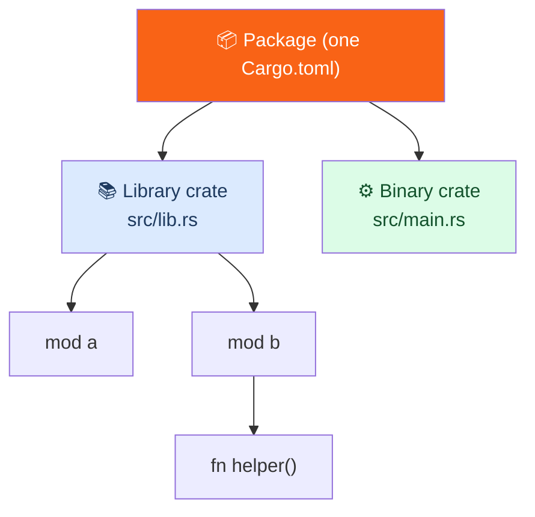

<h1><span class="h1-kicker">Organizing Code</span>Packages, Crates & the Module Tree</h1>

You've organized code *within* a file using modules. Now let's zoom out to the bigger containers: **crates** and **packages**. These are the units Rust uses to compile and distribute code, and understanding them clears up a lot of "where does this file go?" confusion. It's a short but foundational chapter.

## The vocabulary, precisely

Three terms often get muddled. Here they are, cleanly:

> [!key] Module → Crate → Package
> - A **module** organizes code *inside* a crate (what the last chapter covered).
> - A **crate** is the smallest unit the Rust compiler considers at once — it compiles a whole crate as one. There are two kinds: **binary** (produces an executable) and **library** (produces reusable code).
> - A **package** is a bundle of one or more crates, described by a single **`Cargo.toml`**. It's what you create with `cargo new` and what you publish to crates.io.



## Binary vs. library crates

The distinction is simple and important:

- A **binary crate** has a `main` function and compiles to a program you can run. Its **crate root** (the file the compiler starts from) is `src/main.rs`.
- A **library crate** has no `main`; it provides functionality for *other* crates to use. Its crate root is `src/lib.rs`. Everything you `pub` in `lib.rs` becomes part of your library's public API.

```text
my_package/
├── Cargo.toml       # defines the package
└── src/
    ├── main.rs       # crate root of a BINARY crate (has fn main)
    └── lib.rs        # crate root of a LIBRARY crate (the reusable API)
```

> [!jargon] Crate root
> The **crate root** is the source file the compiler starts compiling from — `src/main.rs` for a binary, `src/lib.rs` for a library. It's the trunk of the module tree: the root implicitly *is* a module (named `crate`), and every `mod` you declare hangs off it.

## A package's crate rules

A single package follows a few conventions that Cargo recognizes automatically:

| File / folder | Becomes |
|---------------|---------|
| `src/main.rs` | the package's default **binary** crate |
| `src/lib.rs` | the package's **library** crate (at most one) |
| `src/bin/*.rs` | **additional** binary crates (one per file) |

So a package can contain **at most one library crate**, but **any number of binary crates**. A common professional layout puts the real logic in the library and keeps the binary thin:

```rust,ignore
// src/lib.rs — the reusable logic (a library crate)
pub fn run() {
    println!("doing the real work");
}

// src/main.rs — a tiny binary that just calls the library
fn main() {
    my_package::run(); // refer to the library by the package name
}
```

> [!best] Put logic in `lib.rs`, keep `main.rs` thin
> The most useful structuring habit in Rust: place your program's real functionality in a **library crate** (`src/lib.rs`) and make `src/main.rs` a minimal wrapper that parses arguments and calls into it. Why? The library can be **tested** with integration tests, **reused** by other programs, and **documented** with `cargo doc` — none of which is possible for code buried in `main.rs`. You'll see this in the [CLI project](#/ch/project-cli).

## Multiple binaries in one package

Need a family of related tools (a server *and* a CLI admin tool, say)? Drop extra `.rs` files into `src/bin/`. Each becomes its own runnable binary:

```text
src/
├── lib.rs           # shared logic
├── main.rs          # the default binary (cargo run)
└── bin/
    ├── admin.rs     # cargo run --bin admin
    └── importer.rs  # cargo run --bin importer
```

Run a specific one with `cargo run --bin admin`. They all share the package's dependencies and the library crate.

## How it connects to modules

Putting it together: a **package** is described by `Cargo.toml`; inside it, each **crate** has a **crate root** file; and starting from that root, the **module tree** (from the last chapter) grows via `mod` declarations. Paths like `crate::network::client::connect` walk that tree from the root down.

> [!note] "crate" means two subtly different things
> Watch for the word **crate** doing double duty. In everyday speech, "a crate" often means a *package* you add from crates.io (`cargo add serde`). Formally, a *crate* is a single compilation unit (binary or library) — and a package can hold several. Context makes it clear, but now you know the precise meaning when it matters.

## Summary

- A **package** (one `Cargo.toml`, made by `cargo new`) bundles one or more **crates**; a **crate** is the compiler's unit of compilation.
- Crates are **binary** (`src/main.rs`, has `main`, becomes a program) or **library** (`src/lib.rs`, reusable API); a package has **at most one library** but **many binaries** (extra ones in `src/bin/`).
- The **crate root** is where the compiler starts and is the trunk of the **module tree**.
- Best practice: put logic in **`lib.rs`** and keep **`main.rs`** thin, so the code is testable, reusable, and documentable.

> [!exercise] Try it yourself
> 1. Run `cargo new mypkg`, then add a `src/lib.rs` with a `pub fn hello()` and call it from `main.rs` via `mypkg::hello()`.
> 2. Add `src/bin/tool.rs` with its own `main`, and run it with `cargo run --bin tool`.
> 3. Explain, in one sentence each, the difference between a module, a crate, and a package.

A single package is fine for one project. But large systems are many related crates developed together — and Cargo has a feature just for that: **workspaces**.
