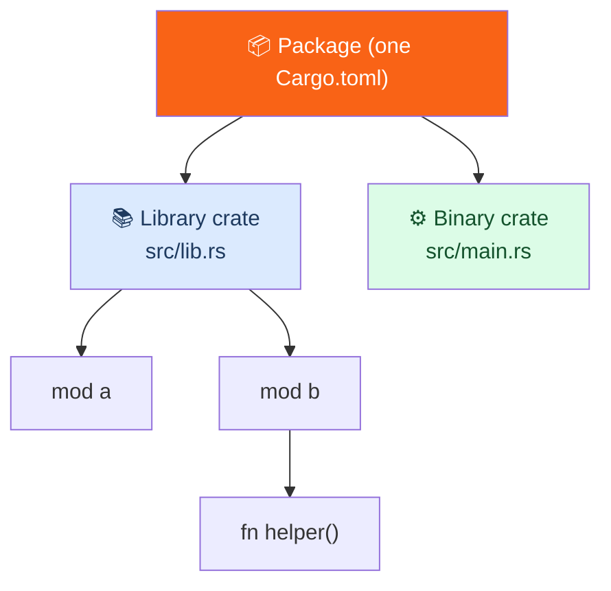

<h1><span class="h1-kicker">Organizing Code</span>Packages, Crates & the Module Tree</h1>

You've organized code *within* a file using modules. Now let's zoom out to the bigger containers: **crates** and **packages**. These are the units Rust uses to compile and distribute code, and understanding them clears up a lot of "where does this file go?" confusion. It's a short but foundational chapter.

## The vocabulary, precisely

Three terms often get muddled. Here they are, cleanly:

> [!key] Module → Crate → Package
> - A **module** organizes code *inside* a crate (what the last chapter covered).
> - A **crate** is the smallest unit the Rust compiler considers at once — it compiles a whole crate as one. There are two kinds: **binary** (produces an executable) and **library** (produces reusable code).
> - A **package** is a bundle of one or more crates, described by a single **`Cargo.toml`**. It's what you create with `cargo new` and what you publish to crates.io.



## Binary vs. library crates

The distinction is simple and important:

- A **binary crate** has a `main` function and compiles to a program you can run. Its **crate root** (the file the compiler starts from) is `src/main.rs`.
- A **library crate** has no `main`; it provides functionality for *other* crates to use. Its crate root is `src/lib.rs`. Everything you `pub` in `lib.rs` becomes part of your library's public API.

```text
my_package/
├── Cargo.toml       # defines the package
└── src/
    ├── main.rs       # crate root of a BINARY crate (has fn main)
    └── lib.rs        # crate root of a LIBRARY crate (the reusable API)
```

> [!jargon] Crate root
> The **crate root** is the source file the compiler starts compiling from — `src/main.rs` for a binary, `src/lib.rs` for a library. It's the trunk of the module tree: the root implicitly *is* a module (named `crate`), and every `mod` you declare hangs off it.

## A package's crate rules

A single package follows a few conventions that Cargo recognizes automatically:

| File / folder | Becomes | Run it with |
|---------------|---------|---|
| `src/main.rs` | the package's default **binary** crate | `cargo run` |
| `src/lib.rs` | the package's **library** crate (at most one) | — it's used, not run |
| `src/bin/*.rs` | **additional** binary crates (one per file) | `cargo run --bin <name>` |
| `tests/*.rs` | **integration tests** (each file is its own crate) | `cargo test` |
| `examples/*.rs` | runnable examples for your users | `cargo run --example <name>` |
| `benches/*.rs` | benchmarks | `cargo bench` |
| `build.rs` | a **build script**, run before compiling | automatic |

Cargo finds all of these by convention — you never list them in `Cargo.toml`. Just create the file in the right place and it works.

> [!note] `examples/` is documentation that compiles
> Files in `examples/` are built by `cargo test` and can be run individually, so they can't rot the way a README snippet can. They're also the first place experienced users look when evaluating a crate — often before the docs. If you publish a library, two or three small, real examples in `examples/` are worth more than several paragraphs of prose.

So a package can contain **at most one library crate**, but **any number of binary crates**. A common professional layout puts the real logic in the library and keeps the binary thin:

```rust,ignore
// src/lib.rs — the reusable logic (a library crate)
pub fn run() {
    println!("doing the real work");
}

// src/main.rs — a tiny binary that just calls the library
fn main() {
    my_package::run(); // refer to the library by the package name
}
```

> [!best] Put logic in `lib.rs`, keep `main.rs` thin
> The most useful structuring habit in Rust: place your program's real functionality in a **library crate** (`src/lib.rs`) and make `src/main.rs` a minimal wrapper that parses arguments and calls into it. Why? The library can be **tested** with integration tests, **reused** by other programs, and **documented** with `cargo doc` — none of which is possible for code buried in `main.rs`. You'll see this in the [CLI project](#/ch/project-cli).

> [!mistake] Hyphens in the package name become underscores in code
> `cargo new my-cool-tool` creates a package named `my-cool-tool`, but Rust identifiers can't contain hyphens — so in code you write `use my_cool_tool::run;`. Cargo does the conversion silently. This catches almost everyone once: you copy the name from `Cargo.toml`, get `expected identifier, found '-'`, and it isn't obvious why. The rule is simple: **hyphens on crates.io and in `Cargo.toml`, underscores in `use` statements.**

## Where a file goes, and what path it gets

The whole point of these rules is to answer one question: *if I create a file here, what do I call the things inside it?* Here's the mapping.

<figure class="diagram">
<svg viewBox="0 0 640 260" role="img" aria-label="A directory tree on the left mapped to the Rust module paths it produces on the right">
  <style>
    .pk-h { font: 700 12px var(--font-sans); fill: var(--text); }
    .pk-m { font: 600 11px var(--font-mono); fill: var(--text); }
    .pk-c { font: 10.5px var(--font-sans); fill: var(--text-mute); }
    .pk-root { fill: var(--rust-100); stroke: var(--rust-500); stroke-width: 2; }
    .pk-file { fill: var(--surface-2); stroke: var(--border-strong); stroke-width: 1.3; }
    .pk-path { fill: var(--green-soft); stroke: var(--green); stroke-width: 1.3; }
    .pk-line { stroke: var(--rust-400); stroke-width: 1.2; fill: none; }
  </style>
  <text x="20" y="18" class="pk-h">on disk</text>
  <text x="360" y="18" class="pk-h">how you refer to it</text>
  <rect x="20" y="28" width="200" height="24" rx="3" class="pk-root"/>
  <text x="28" y="45" class="pk-m">src/lib.rs</text>
  <rect x="360" y="28" width="260" height="24" rx="3" class="pk-path"/>
  <text x="368" y="45" class="pk-m">crate</text>
  <path d="M222 40 L356 40" class="pk-line"/>
  <rect x="40" y="58" width="180" height="24" rx="3" class="pk-file"/>
  <text x="48" y="75" class="pk-m">src/network.rs</text>
  <rect x="360" y="58" width="260" height="24" rx="3" class="pk-path"/>
  <text x="368" y="75" class="pk-m">crate::network</text>
  <path d="M222 70 L356 70" class="pk-line"/>
  <rect x="60" y="88" width="160" height="24" rx="3" class="pk-file"/>
  <text x="68" y="105" class="pk-m">src/network/tcp.rs</text>
  <rect x="360" y="88" width="260" height="24" rx="3" class="pk-path"/>
  <text x="368" y="105" class="pk-m">crate::network::tcp</text>
  <path d="M222 100 L356 100" class="pk-line"/>
  <rect x="40" y="126" width="180" height="24" rx="3" class="pk-file"/>
  <text x="48" y="143" class="pk-m">src/main.rs</text>
  <rect x="360" y="126" width="260" height="24" rx="3" class="pk-path"/>
  <text x="368" y="143" class="pk-m">my_package::network</text>
  <path d="M222 138 L356 138" class="pk-line"/>
  <text x="368" y="162" class="pk-c">a SEPARATE crate — uses the library by name</text>
  <rect x="40" y="178" width="180" height="24" rx="3" class="pk-file"/>
  <text x="48" y="195" class="pk-m">tests/api.rs</text>
  <rect x="360" y="178" width="260" height="24" rx="3" class="pk-path"/>
  <text x="368" y="195" class="pk-m">my_package::network</text>
  <path d="M222 190 L356 190" class="pk-line"/>
  <text x="368" y="214" class="pk-c">also separate — sees only `pub` items</text>
  <text x="20" y="240" class="pk-c">Inside the library, paths start with <tspan font-family="var(--font-mono)">crate::</tspan>. From <tspan font-family="var(--font-mono)">main.rs</tspan> or <tspan font-family="var(--font-mono)">tests/</tspan>, they start with the</text>
  <text x="20" y="254" class="pk-c">package name — because those are different crates that merely <tspan font-style="italic">depend on</tspan> your library.</text>
</svg>
<figcaption>Files in <code>src/</code> become modules of the library. <code>main.rs</code> and <code>tests/*.rs</code> are <b>separate crates</b> — which is why they use the package name and can only see <code>pub</code> items.</figcaption>
</figure>

> [!key] `main.rs` is not part of your library — it's a consumer of it
> This is the idea that makes everything else click. `src/main.rs` and each file in `tests/` compile as their own crates that *depend on* your library, exactly like an outside user would. That's why they write `my_package::thing` rather than `crate::thing`, and why they can only reach items marked `pub`. It's also why testing through them is so valuable: if your own binary can't get at something, neither can your users.

Here's the module tree in a single runnable file, so you can see the paths working:

```rust
// This file acts as the crate root. Modules nest inside it.
mod network {
    pub mod tcp {
        pub fn connect(host: &str) -> String {
            format!("tcp connected to {host}")
        }
    }

    pub fn describe() -> String {
        // `self::` means "in this module"; we could also write `tcp::connect`.
        format!("network module — {}", self::tcp::connect("localhost"))
    }
}

mod storage {
    // `crate::` always starts at the root, wherever you are.
    pub fn save(item: &str) -> String {
        format!("saved {item} via {}", crate::network::tcp::connect("db.local"))
    }
}

fn main() {
    // From the root, the full path down the tree:
    println!("{}", network::tcp::connect("example.com"));
    println!("{}", network::describe());
    println!("{}", storage::save("record-1"));

    // `use` shortens a path you'll repeat.
    use network::tcp::connect;
    println!("{}", connect("shortened.io"));
}
```

Splitting that into files changes nothing about the paths: move the `network` module into `src/network.rs` and `tcp` into `src/network/tcp.rs`, and `crate::network::tcp::connect` still means exactly the same thing.

## Multiple binaries in one package

Need a family of related tools (a server *and* a CLI admin tool, say)? Drop extra `.rs` files into `src/bin/`. Each becomes its own runnable binary:

```text
src/
├── lib.rs           # shared logic
├── main.rs          # the default binary (cargo run)
└── bin/
    ├── admin.rs     # cargo run --bin admin
    └── importer.rs  # cargo run --bin importer
```

Run a specific one with `cargo run --bin admin`. They all share the package's dependencies and the library crate.

## How it connects to modules

Putting it together: a **package** is described by `Cargo.toml`; inside it, each **crate** has a **crate root** file; and starting from that root, the **module tree** (from the last chapter) grows via `mod` declarations. Paths like `crate::network::client::connect` walk that tree from the root down.

> [!note] "crate" means two subtly different things
> Watch for the word **crate** doing double duty. In everyday speech, "a crate" often means a *package* you add from crates.io (`cargo add serde`). Formally, a *crate* is a single compilation unit (binary or library) — and a package can hold several. Context makes it clear, but now you know the precise meaning when it matters.

## Summary

- A **package** (one `Cargo.toml`, made by `cargo new`) bundles one or more **crates**; a **crate** is the compiler's unit of compilation.
- Crates are **binary** (`src/main.rs`, has `main`, becomes a program) or **library** (`src/lib.rs`, reusable API); a package has **at most one library** but **many binaries** (extra ones in `src/bin/`).
- Cargo also finds **`tests/`**, **`examples/`**, **`benches/`**, and **`build.rs`** by convention — you never declare them.
- The **crate root** is where the compiler starts and is the trunk of the **module tree**.
- Inside the library, paths start with **`crate::`**. From `main.rs` or `tests/`, they start with the **package name**, because those are separate crates that depend on your library and see only `pub` items.
- **Hyphens become underscores**: package `my-cool-tool` is `use my_cool_tool::…` in code.
- Best practice: put logic in **`lib.rs`** and keep **`main.rs`** thin, so the code is testable, reusable, and documentable.

> [!exercise] Try it yourself
> 1. Run `cargo new mypkg`, then add a `src/lib.rs` with a `pub fn hello()` and call it from `main.rs` via `mypkg::hello()`.
> 2. Add `src/bin/tool.rs` with its own `main`, and run it with `cargo run --bin tool`.
> 3. Run the nested-module example above, then split each module into its own file (`src/network.rs`, `src/network/tcp.rs`) and confirm every path still works unchanged.
> 4. Create `cargo new my-hyphen-test`, add a `lib.rs`, and try `use my-hyphen-test::…`. Read the error, then fix it.
> 5. In your `lib.rs`, write a function *without* `pub`, then try to call it from `main.rs`. Explain the error in terms of "separate crates".
> 6. Explain, in one sentence each, the difference between a module, a crate, and a package.

A single package is fine for one project. But large systems are many related crates developed together — and Cargo has a feature just for that: **workspaces**.
