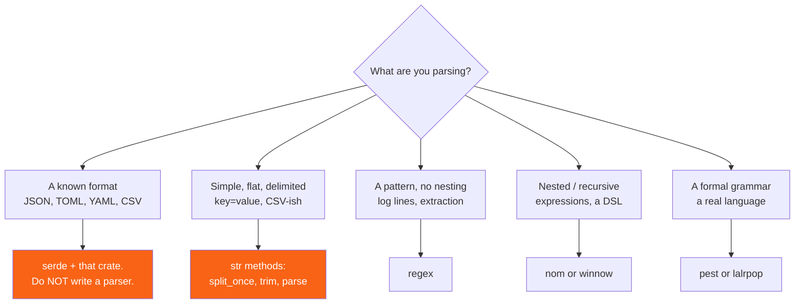

<h1><span class="h1-kicker">The Crate Ecosystem</span>Parsing: nom, winnow & pest</h1>

Sooner or later you have text that isn't JSON: a config format, a log line, a query language, a binary protocol, a mathematical expression. You can hack it with `split` and `regex` up to a point, and then the point arrives — nesting, precedence, good error messages — and you need a real parser.

Rust has excellent parsing crates, and the important thing is knowing which tool the job actually calls for. Quite often it's none of them.

## Choosing a tool



| Tool | Style | Best for | Cost |
|---|---|---|---|
| `str` methods | hand-written | flat, delimited text | none — already in `std` |
| `regex` | patterns | extraction, validation, no nesting | one dependency; can't nest |
| **`nom`** | parser combinators | binary and text protocols, recursive grammars | steep-ish learning curve |
| **`winnow`** | parser combinators | the same, with a friendlier API | newer, `nom`'s successor-in-spirit |
| **`pest`** | a PEG grammar file | languages, config formats, readable grammars | grammar in a separate file |
| `lalrpop` | an LR(1) grammar | programming languages with precedence | build-script based, heavier |
| `chumsky` | combinators | excellent error recovery | newer |
| `logos` | a derive-based lexer | fast tokenizing, pairs with any parser | lexing only |

> [!key] First ask whether you need to parse at all
> If the format is JSON, TOML, YAML, CSV, or anything with a crate — use `serde` and that crate. If it's flat `key=value` lines, `split_once` and `parse` will do it in ten lines with no dependency. Writing a parser is genuinely enjoyable, which is exactly why people do it when they shouldn't. Reach for a parsing library when you have **nesting or recursion**, because that's the thing `split` and `regex` fundamentally cannot express.

## How far plain `std` gets you

Further than most people expect. This is a complete, robust INI-style config parser:

```rust
use std::collections::HashMap;

#[derive(Debug, PartialEq)]
enum ParseError {
    MissingSeparator { line: usize, text: String },
    EmptyKey { line: usize },
}

fn parse_config(input: &str) -> Result<HashMap<String, String>, ParseError> {
    let mut out = HashMap::new();

    for (i, raw) in input.lines().enumerate() {
        let line_no = i + 1;

        // Strip comments, then whitespace. Skip blanks.
        let line = raw.split('#').next().unwrap_or("").trim();
        if line.is_empty() {
            continue;
        }

        // split_once is the workhorse here — one separator, two halves.
        let Some((key, value)) = line.split_once('=') else {
            return Err(ParseError::MissingSeparator { line: line_no, text: line.to_string() });
        };

        let key = key.trim();
        if key.is_empty() {
            return Err(ParseError::EmptyKey { line: line_no });
        }

        // Strip optional surrounding quotes from the value.
        let value = value.trim().trim_matches('"');
        out.insert(key.to_string(), value.to_string());
    }

    Ok(out)
}

fn main() {
    let config = r#"
        # the listening port
        port = 8080
        host = "0.0.0.0"      # quoted values work
        debug = true

    "#;

    let parsed = parse_config(config).unwrap();
    let mut keys: Vec<_> = parsed.keys().collect();
    keys.sort();
    for k in keys {
        println!("{k} = {:?}", parsed[k]);
    }

    // Typed access, with the error handling that makes it usable.
    let port: u16 = parsed.get("port").and_then(|s| s.parse().ok()).unwrap_or(80);
    println!("port as u16 = {port}");

    // And the failure cases produce useful, structured errors.
    println!("\n{:?}", parse_config("no separator here"));
    println!("{:?}", parse_config("  = orphan value"));
}
```

> [!best] `split_once` and `let`-else make hand-written parsers pleasant
> `split_once` gives you exactly the "one separator, two parts" operation that flat formats need, and returns `Option` so malformed input can't slip through. Pair it with `let`-else (from [Modern Syntax](#/ch/modern-syntax)) and each validation is one flat line with its error adjacent. For flat formats this is genuinely the right answer — clearer than a combinator chain, no dependency, and full control over error messages.

## Where hand-rolling breaks down

Recursion. Consider `2 * (3 + 4)`: you cannot express "a parenthesised expression contains an expression" with `split` or with a regular expression, because regular languages can't count nesting depth. You need a grammar.

<figure class="diagram">
<svg viewBox="0 0 640 240" role="img" aria-label="A parser combinator chain transforming input text through small parsers into a structured syntax tree">
  <style>
    .pa-h { font: 700 12px var(--font-sans); }
    .pa-m { font: 600 11px var(--font-mono); fill: var(--text); }
    .pa-c { font: 11px var(--font-sans); fill: var(--text-mute); }
    .pa-in { fill: var(--blue-soft); stroke: var(--blue); stroke-width: 1.5; }
    .pa-p { fill: var(--surface-2); stroke: var(--border-strong); stroke-width: 1.2; }
    .pa-out { fill: var(--rust-100); stroke: var(--rust-400); stroke-width: 1.5; }
  </style>
  <rect x="20" y="30" width="150" height="30" rx="4" class="pa-in"/>
  <text x="30" y="50" class="pa-m">"2 * (3 + 4)"</text>
  <text x="20" y="22" class="pa-c">input: a flat &amp;str</text>
  <text x="20" y="92" class="pa-h" fill="var(--text-mute)">small parsers, composed:</text>
  <rect x="20" y="102" width="110" height="26" rx="3" class="pa-p"/><text x="28" y="119" class="pa-m">digit1</text>
  <rect x="140" y="102" width="110" height="26" rx="3" class="pa-p"/><text x="148" y="119" class="pa-m">char('*')</text>
  <rect x="260" y="102" width="150" height="26" rx="3" class="pa-p"/><text x="268" y="119" class="pa-m">delimited(…)</text>
  <rect x="20" y="134" width="230" height="26" rx="3" class="pa-p"/><text x="28" y="151" class="pa-m">alt((number, parens))</text>
  <rect x="260" y="134" width="150" height="26" rx="3" class="pa-p"/><text x="268" y="151" class="pa-m">recursion ↺</text>
  <rect x="440" y="86" width="180" height="90" rx="5" class="pa-out"/>
  <text x="452" y="106" class="pa-m">Expr::Mul(</text>
  <text x="452" y="122" class="pa-m">  Num(2),</text>
  <text x="452" y="138" class="pa-m">  Add(Num(3),</text>
  <text x="452" y="154" class="pa-m">      Num(4)))</text>
  <text x="452" y="172" class="pa-c">a typed tree</text>
  <path d="M172 45 C 300 45, 330 70, 300 100" stroke="var(--blue)" stroke-width="2" fill="none" marker-end="url(#arr-pa)"/>
  <path d="M414 130 L436 130" stroke="var(--rust-500)" stroke-width="2.5" marker-end="url(#arr-pa2)"/>
  <text x="20" y="204" class="pa-c">Each parser consumes a prefix of the input and returns (remaining_input, value) — that's the whole model.</text>
  <text x="20" y="222" class="pa-c">Because a parser can call itself, nesting to any depth works. This is what <tspan font-weight="700">regex cannot do</tspan>.</text>
  <defs>
    <marker id="arr-pa" markerWidth="9" markerHeight="9" refX="7" refY="3" orient="auto"><path d="M0,0 L7,3 L0,6 Z" fill="var(--blue)"/></marker>
    <marker id="arr-pa2" markerWidth="9" markerHeight="9" refX="7" refY="3" orient="auto"><path d="M0,0 L7,3 L0,6 Z" fill="var(--rust-500)"/></marker>
  </defs>
</svg>
<figcaption>A <b>parser combinator</b> is a function from input to <code>(rest, value)</code>. Small ones compose into big ones, and they can recurse — which is the whole point.</figcaption>
</figure>

## A recursive parser in plain Rust

Before reaching for a crate, it's worth seeing that the model isn't magic. Here's a complete recursive-descent expression parser with correct precedence, in pure `std`:

```rust
#[derive(Debug, PartialEq)]
enum Expr {
    Num(f64),
    Add(Box<Expr>, Box<Expr>),
    Sub(Box<Expr>, Box<Expr>),
    Mul(Box<Expr>, Box<Expr>),
    Div(Box<Expr>, Box<Expr>),
}

impl Expr {
    fn eval(&self) -> f64 {
        match self {
            Expr::Num(n) => *n,
            Expr::Add(a, b) => a.eval() + b.eval(),
            Expr::Sub(a, b) => a.eval() - b.eval(),
            Expr::Mul(a, b) => a.eval() * b.eval(),
            Expr::Div(a, b) => a.eval() / b.eval(),
        }
    }
}

struct Parser<'a> {
    input: &'a str,
    pos: usize,
}

impl<'a> Parser<'a> {
    fn new(input: &'a str) -> Self {
        Parser { input, pos: 0 }
    }

    fn skip_space(&mut self) {
        while self.peek().is_some_and(|c| c.is_whitespace()) {
            self.pos += c_len(self.peek().unwrap());
        }
    }

    fn peek(&self) -> Option<char> {
        self.input[self.pos..].chars().next()
    }

    fn eat(&mut self, want: char) -> bool {
        self.skip_space();
        if self.peek() == Some(want) {
            self.pos += c_len(want);
            true
        } else {
            false
        }
    }

    // expr := term (('+' | '-') term)*     ← lowest precedence, so outermost
    fn expr(&mut self) -> Result<Expr, String> {
        let mut left = self.term()?;
        loop {
            if self.eat('+') {
                left = Expr::Add(Box::new(left), Box::new(self.term()?));
            } else if self.eat('-') {
                left = Expr::Sub(Box::new(left), Box::new(self.term()?));
            } else {
                return Ok(left);
            }
        }
    }

    // term := atom (('*' | '/') atom)*    ← binds tighter than + and -
    fn term(&mut self) -> Result<Expr, String> {
        let mut left = self.atom()?;
        loop {
            if self.eat('*') {
                left = Expr::Mul(Box::new(left), Box::new(self.atom()?));
            } else if self.eat('/') {
                left = Expr::Div(Box::new(left), Box::new(self.atom()?));
            } else {
                return Ok(left);
            }
        }
    }

    // atom := number | '(' expr ')'       ← the recursion happens here
    fn atom(&mut self) -> Result<Expr, String> {
        self.skip_space();
        if self.eat('(') {
            let inner = self.expr()?; // ← calls back into the top level
            if !self.eat(')') {
                return Err(format!("expected ')' at byte {}", self.pos));
            }
            return Ok(inner);
        }
        self.number()
    }

    fn number(&mut self) -> Result<Expr, String> {
        self.skip_space();
        let start = self.pos;
        while self.peek().is_some_and(|c| c.is_ascii_digit() || c == '.') {
            self.pos += 1;
        }
        if start == self.pos {
            return Err(format!("expected a number at byte {}", self.pos));
        }
        self.input[start..self.pos]
            .parse()
            .map(Expr::Num)
            .map_err(|e| format!("bad number: {e}"))
    }
}

fn c_len(c: char) -> usize {
    c.len_utf8()
}

fn parse(input: &str) -> Result<Expr, String> {
    let mut p = Parser::new(input);
    let e = p.expr()?;
    p.skip_space();
    if p.pos != p.input.len() {
        return Err(format!("unexpected trailing input at byte {}", p.pos));
    }
    Ok(e)
}

fn main() {
    for input in ["2 + 3 * 4", "(2 + 3) * 4", "10 / 4 - 1", "2 * (3 + (4 - 1))"] {
        match parse(input) {
            Ok(ast) => println!("{input:>20} = {}", ast.eval()),
            Err(e) => println!("{input:>20} ! {e}"),
        }
    }

    // Precedence is structural, not accidental:
    println!("\n{:?}", parse("2 + 3 * 4").unwrap());

    // And the errors are precise:
    for bad in ["2 +", "(2 + 3", "2 3"] {
        println!("{bad:>20} ! {}", parse(bad).unwrap_err());
    }
}
```

> [!key] Precedence comes from the shape of the grammar
> Notice that `expr` handles `+`/`-` and calls `term`, which handles `*`/`/` and calls `atom`. Because the *lower*-precedence operator is parsed at the *outer* level, `2 + 3 * 4` naturally becomes `Add(2, Mul(3, 4))`. This layering is the standard recipe for recursive-descent parsing — one function per precedence level, each calling the next tighter one. Every parser library encodes the same idea; they just save you the plumbing.

## `nom`: parser combinators

`nom` builds parsers by composing small functions. Each takes the remaining input and returns `(rest, value)` or an error.

```toml
[dependencies]
nom = "7"
```

```rust,ignore
use nom::branch::alt;
use nom::bytes::complete::{tag, take_while1};
use nom::character::complete::{char, digit1, multispace0};
use nom::combinator::{map, map_res, opt, recognize};
use nom::multi::separated_list0;
use nom::sequence::{delimited, pair, separated_pair};
use nom::IResult;

// Every nom parser has this shape: &str in, (rest, value) out.
fn number(input: &str) -> IResult<&str, f64> {
    map_res(recognize(pair(opt(char('-')), digit1)), str::parse)(input)
}

fn identifier(input: &str) -> IResult<&str, &str> {
    take_while1(|c: char| c.is_alphanumeric() || c == '_')(input)
}

// A quoted string: delimited() handles the open/close for you.
fn quoted(input: &str) -> IResult<&str, &str> {
    delimited(char('"'), take_while1(|c| c != '"'), char('"'))(input)
}

#[derive(Debug)]
enum Value<'a> {
    Num(f64),
    Text(&'a str),
}

// alt() tries each alternative in order until one succeeds.
fn value(input: &str) -> IResult<&str, Value<'_>> {
    alt((map(number, Value::Num), map(quoted, Value::Text)))(input)
}

// key = value, with optional whitespace around the '='.
fn pair_kv(input: &str) -> IResult<&str, (&str, Value<'_>)> {
    separated_pair(identifier, delimited(multispace0, char('='), multispace0), value)(input)
}

// A comma-separated list of them.
fn pairs(input: &str) -> IResult<&str, Vec<(&str, Value<'_>)>> {
    separated_list0(delimited(multispace0, char(','), multispace0), pair_kv)(input)
}

fn main() {
    println!("{:?}", pairs(r#"port = 8080, host = "0.0.0.0", retries = -1"#));
    // Ok(("", [("port", Num(8080.0)), ("host", Text("0.0.0.0")), ("retries", Num(-1.0))]))

    // On failure you get the remaining input and which combinator failed.
    println!("{:?}", pair_kv("port = "));
}
```

| `nom` combinator | Does |
|---|---|
| `tag("literal")` | match an exact string |
| `char('c')` | match one character |
| `digit1` / `alpha1` / `alphanumeric1` | one or more of a character class |
| `take_while1(pred)` | consume while a predicate holds |
| `alt((a, b, c))` | try alternatives in order (**ordered choice**) |
| `tuple((a, b, c))` | match all in sequence |
| `pair(a, b)` / `separated_pair(a, sep, b)` | two items, optionally separated |
| `delimited(open, inner, close)` | brackets, quotes, parentheses |
| `preceded(pre, x)` / `terminated(x, post)` | drop a prefix or suffix |
| `opt(a)` | optional — `Option<T>` |
| `many0(a)` / `many1(a)` | zero-or-more / one-or-more |
| `separated_list0(sep, a)` | a delimited list |
| `map(a, f)` / `map_res(a, f)` | transform the result, fallibly or not |
| `recognize(a)` | return the matched **input slice** instead of the value |
| `peek(a)` | test without consuming |
| `cut(a)` | commit — turn a soft failure into a hard error |

> [!mistake] `alt` is ordered choice, and order matters
> `alt((tag("if"), identifier))` parses `ifx` as the keyword `if` followed by `x`, because `alt` returns the **first** success, not the longest match. This is the classic keyword-versus-identifier bug. Put longer and more specific alternatives first, or require a word boundary. Regular expressions and PEG grammars share this behaviour — it is not what people expect from BNF.

> [!warning] `nom` 8 changed the calling convention
> `nom` 7 combinators are called as `map(inner, f)(input)`. `nom` 8 (2025) moved to trait methods: `inner.map(f).parse(input)`. Both are current in the wild, and mixing them produces confusing type errors. Check which major version you're on before copying examples — and if you're starting fresh, consider `winnow` instead, which took this design further and has better documentation and error messages.

> [!best] `winnow` if you're choosing today
> `winnow` is a fork of `nom` by one of its maintainers, with a mutable-slice-based API, meaningfully better error reporting, and clearer docs. `toml_edit` and `cargo` itself use it. `nom` remains the more widely known name with more examples online, so both are defensible — but for a new project where you're learning the model from scratch, `winnow` is the gentler path.

## `pest`: a grammar file

`pest` inverts the approach: you write a PEG grammar in its own file and it generates the parser.

```toml
[dependencies]
pest = "2"
pest_derive = "2"
```

```text
// src/config.pest
WHITESPACE = _{ " " | "\t" | NEWLINE }
COMMENT    = _{ "#" ~ (!NEWLINE ~ ANY)* }

identifier =  { (ASCII_ALPHANUMERIC | "_")+ }
number     =  { "-"? ~ ASCII_DIGIT+ ~ ("." ~ ASCII_DIGIT+)? }
string     =  { "\"" ~ inner ~ "\"" }
inner      =  { (!"\"" ~ ANY)* }
value      =  { number | string | boolean }
boolean    =  { "true" | "false" }

pair       =  { identifier ~ "=" ~ value }
file       =  { SOI ~ pair* ~ EOI }
```

```rust,ignore
use pest::Parser;
use pest_derive::Parser;

#[derive(Parser)]
#[grammar = "config.pest"]
struct ConfigParser;

fn main() -> Result<(), Box<dyn std::error::Error>> {
    let input = r#"
        # a comment
        port = 8080
        host = "0.0.0.0"
        debug = true
    "#;

    let file = ConfigParser::parse(Rule::file, input)?.next().unwrap();

    for pair in file.into_inner() {
        if pair.as_rule() == Rule::pair {
            let mut parts = pair.into_inner();
            let key = parts.next().unwrap().as_str();
            let value = parts.next().unwrap();
            println!("{key} = {:?} ({:?})", value.as_str(), value.as_rule());
        }
    }
    Ok(())
}
```

| | `nom` / `winnow` | `pest` |
|---|---|---|
| grammar lives in | Rust code | a separate `.pest` file |
| readability of the grammar | moderate — it's code | **excellent** — it's a grammar |
| binary input | **yes** | no (text only) |
| zero-copy / streaming | **yes** | limited |
| error messages | you build them | good, with line/column, out of the box |
| performance | **fastest** | very good |
| learning curve | steeper | gentler |
| best for | protocols, hot paths, binary | languages, config, readable specs |

> [!best] `pest` when the grammar is the documentation
> If you're implementing a format that other people need to understand — a query language, a template syntax, a config schema — a `.pest` file *is* the specification, readable by anyone who knows EBNF, and it can't drift out of sync with the implementation. That's a genuine advantage over a grammar spread across twenty Rust functions. Choose `nom`/`winnow` when you need binary input, zero-copy slices, or maximum speed.

## Error messages are the real work

> [!key] A parser that only says "syntax error" is half-finished
> Anyone can get a parser to accept valid input; the value is in what it says about invalid input. Aim for three things: the **byte or line/column position**, what you **expected**, and what you **found**. Compare `Err(ParseError)` with `expected ')' at line 4, column 12, found end of input`. The second turns a ten-minute hunt into a one-second fix, and it's what makes `rustc` itself pleasant. Budget real time for it — `chumsky` and `ariadne` exist specifically to help, and `pest` gives you position information for free.

```rust
// Carrying position information costs very little and pays for itself.
#[derive(Debug)]
struct SyntaxError {
    line: usize,
    column: usize,
    expected: &'static str,
    found: String,
}

impl std::fmt::Display for SyntaxError {
    fn fmt(&self, f: &mut std::fmt::Formatter) -> std::fmt::Result {
        write!(
            f,
            "line {}, column {}: expected {}, found {:?}",
            self.line, self.column, self.expected, self.found
        )
    }
}

/// Turn a byte offset into a human line and column.
fn locate(input: &str, offset: usize) -> (usize, usize) {
    let upto = &input[..offset.min(input.len())];
    let line = upto.matches('\n').count() + 1;
    let column = upto.rsplit('\n').next().map_or(1, |l| l.chars().count() + 1);
    (line, column)
}

fn main() {
    let input = "port = 8080\nhost =\ndebug = true";
    let offset = input.find("host =").unwrap() + 6; // just after "host ="
    let (line, column) = locate(input, offset);

    let err = SyntaxError {
        line,
        column,
        expected: "a value",
        found: "end of line".to_string(),
    };
    println!("{err}");
}
```

## Summary

- **Ask whether you need a parser.** A known format → `serde` plus that crate. Flat delimited text → `split_once`, `trim`, `parse`. A flat pattern → `regex`.
- Reach for a parsing library when you have **nesting or recursion** — the thing `split` and regex fundamentally cannot express.
- Hand-written **recursive descent** is very approachable: one function per precedence level, each calling the next tighter one. Precedence comes from the grammar's *shape*.
- **`nom`** and **`winnow`** are parser combinators — small functions returning `(rest, value)` that compose and recurse. Best for binary formats, zero-copy, and hot paths.
- `alt` is **ordered choice**, not longest-match — the classic keyword-versus-identifier bug.
- `nom` **8** changed the calling convention from `f(a)(input)` to `a.map(f).parse(input)`; check your version. For new projects **`winnow`** is the gentler choice.
- **`pest`** takes a PEG grammar file, which doubles as readable documentation and gives line/column errors for free — best when the grammar *is* the spec.
- **Error messages are the real work**: report position, what was expected, and what was found.

> [!exercise] Try it yourself
> 1. Extend the hand-written config parser to support `[section]` headers, returning a `HashMap<String, HashMap<String, String>>`.
> 2. Add unary minus and a `^` power operator (right-associative) to the recursive-descent expression parser. Which function does each belong in?
> 3. Feed the expression parser `2 * (3 + 4` and read the error. Now improve it to report a line and column using the `locate` helper.
> 4. Write a regex that matches balanced parentheses. Convince yourself it's impossible, and explain why in one sentence.
> 5. Parse a log line like `2026-08-10T09:14:22Z ERROR [auth] login failed for user=ada` into a struct, first with `split_once` and then with `regex`. Which is clearer?
> 6. Sketch a `.pest` grammar for the config format in this chapter. Is it easier to read than the Rust version?

Next: protecting the data those parsers produce — **authentication, hashing, and secret handling**.
