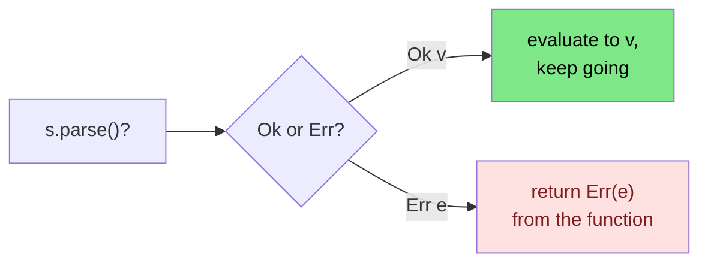

<h1><span class="h1-kicker">Error Handling</span>The ? Operator & Error Propagation</h1>

Real functions rarely handle every error themselves. Usually they do a little work, and if something fails, they pass the error *up* to their caller, who has more context to decide what to do. This is called **propagating** an error. Doing it with `match` gets noisy fast — so Rust gives you one tiny, powerful character that does it for you: **`?`**.

## The problem: propagation by hand

Say we parse a string and double it, passing any parse error back to the caller. Without `?`, we write this dance:

```rust
use std::num::ParseIntError;

fn double(s: &str) -> Result<i32, ParseIntError> {
    let n = match s.parse::<i32>() {
        Ok(value) => value,        // success: keep going with the value
        Err(e) => return Err(e),   // failure: hand the error to our caller
    };
    Ok(n * 2)
}
# fn main() { println!("{:?}", double("21")); }
```

That `match` — "unwrap on success, `return Err` on failure" — is so common that Rust built it into an operator.

## Enter `?`

The **`?`** operator does exactly that match, in one character. Place it after any `Result`:

```rust
use std::num::ParseIntError;

fn double(s: &str) -> Result<i32, ParseIntError> {
    let n = s.parse::<i32>()?; // if Ok, unwrap the value; if Err, return it now
    Ok(n * 2)
}

fn main() {
    println!("{:?}", double("21"));   // Ok(42)
    println!("{:?}", double("nope")); // Err(ParseIntError { .. })
}
```

> [!key] What `?` does, precisely
> When you write `expr?`:
> - If `expr` is **`Ok(v)`** (or **`Some(v)`**), the whole `?` expression evaluates to **`v`**, and execution continues.
> - If `expr` is **`Err(e)`** (or **`None`**), the function **returns immediately** with that `Err(e)` (or `None`).
>
> It's "give me the value, or bail out with the error." One operator replaces the entire match.



## Chaining makes it shine

The real payoff is stringing several fallible steps together. Each `?` quietly handles its own failure, and your code reads like the happy path:

```rust
use std::num::ParseIntError;

fn sum_three(a: &str, b: &str, c: &str) -> Result<i32, ParseIntError> {
    // Any of these failing returns its error immediately.
    let total = a.parse::<i32>()? + b.parse::<i32>()? + c.parse::<i32>()?;
    Ok(total)
}

fn main() {
    println!("{:?}", sum_three("1", "2", "3")); // Ok(6)
    println!("{:?}", sum_three("1", "x", "3")); // Err(...) — stops at "x"
}
```

## `?` also works on `Option`

The same operator propagates `None` out of a function that returns `Option`:

```rust
fn first_initial(name: &str) -> Option<char> {
    let first = name.chars().next()?; // None if the string is empty → return None
    Some(first.to_ascii_uppercase())
}

fn main() {
    println!("{:?}", first_initial("ferris")); // Some('F')
    println!("{:?}", first_initial(""));        // None
}
```

> [!warning] The return type must match
> `?` can only propagate into a function whose return type fits: use `?` on a `Result` inside a function returning `Result`, and on an `Option` inside one returning `Option`. Using `?` on a `Result` in a function that returns `()` won't compile — there's nowhere for the error to go. The fix is to make the function return a `Result`.

### Bridging between `Option` and `Result`

That restriction bites constantly in real code, because a single function often has to deal with both. The bridge methods are the answer, and they're worth memorizing:

```rust
use std::num::ParseIntError;

#[derive(Debug)]
enum ConfigError {
    Missing(&'static str),
    BadNumber(ParseIntError),
}

// `?` needs this to convert ParseIntError into our type automatically.
impl From<ParseIntError> for ConfigError {
    fn from(e: ParseIntError) -> Self {
        ConfigError::BadNumber(e)
    }
}

fn find(pairs: &[(&str, &str)], key: &str) -> Option<&'static str> {
    pairs.iter().find(|(k, _)| *k == key).map(|_| "found")
}

fn port_of(pairs: &[(&str, &str)]) -> Result<u16, ConfigError> {
    // Option → Result: ok_or supplies the error for the None case,
    // and then `?` can propagate it.
    let raw = pairs
        .iter()
        .find(|(k, _)| *k == "port")
        .map(|(_, v)| *v)
        .ok_or(ConfigError::Missing("port"))?;

    // Result → Result, with automatic From conversion.
    let port: u16 = raw.parse()?;
    Ok(port)
}

fn maybe_port(pairs: &[(&str, &str)]) -> Option<u16> {
    let raw = pairs.iter().find(|(k, _)| *k == "port").map(|(_, v)| *v)?;
    // Result → Option: `.ok()` throws the error away and gives Some/None.
    raw.parse().ok()
}

fn main() {
    let good = [("host", "localhost"), ("port", "8080")];
    let missing = [("host", "localhost")];
    let bad = [("port", "eighty")];

    println!("{:?}", port_of(&good));    // Ok(8080)
    println!("{:?}", port_of(&missing)); // Err(Missing("port"))
    println!("{:?}", port_of(&bad));     // Err(BadNumber(..))

    println!("{:?}", maybe_port(&good)); // Some(8080)
    println!("{:?}", maybe_port(&bad));  // None — the reason is discarded
    println!("{:?}", find(&good, "host"));
}
```

| You have | You want | Use |
|---|---|---|
| `Option<T>` | `Result<T, E>` | `.ok_or(err)` |
| `Option<T>` | `Result<T, E>`, error costly to build | `.ok_or_else(\|\| err())` |
| `Result<T, E>` | `Option<T>` | `.ok()` — **discards the error** |
| `Result<T, E>` | `Option<E>` | `.err()` |
| `Option<Result<T, E>>` | `Result<Option<T>, E>` | `.transpose()` |
| `Result<T, E1>` | `Result<T, E2>` | `.map_err(\|e\| …)`, or a `From` impl + `?` |
| an iterator of `Result` | `Result<Vec<_>, E>` | `.collect()` — stops at the first `Err` |

> [!best] `ok_or_else` when the error costs anything to construct
> `.ok_or(ConfigError::Missing(format!("key {key}")))` builds that `String` **every single time**, including the overwhelming majority of calls that succeed and immediately throw it away. `.ok_or_else(|| ConfigError::Missing(format!("key {key}")))` builds it only when the value is actually `None`. For a cheap unit-like variant it makes no difference; for anything involving `format!`, allocation, or a lookup, it's free performance. The same reasoning applies to `unwrap_or` vs `unwrap_or_else`.

> [!mistake] `.ok()` silently throws away *why* it failed
> Converting a `Result` to an `Option` with `.ok()` is convenient and lossy — the error is gone, and with it any chance of telling the user what went wrong. That's fine when absence and failure genuinely mean the same thing to you ("no valid port configured, use the default"). It's a bug when the caller needed to distinguish "not set" from "set to nonsense". Notice in the example above that `maybe_port` can't tell those apart, while `port_of` can.

## `?` converts error types for you (the `From` trait)

Here's the feature that makes `?` truly powerful. When the error type you're propagating differs from your function's declared error type, `?` **automatically converts** it — as long as a `From` conversion exists. This lets one function juggle several error sources cleanly.

The easiest way to accept "any error" is the trait object `Box<dyn Error>`, which every standard error converts into:

```rust
use std::error::Error;

fn read_config(a: &str, b: &str) -> Result<i32, Box<dyn Error>> {
    let x: i32 = a.parse()?; // ParseIntError auto-converts to Box<dyn Error>
    let y: i32 = b.parse()?; // so does this one
    Ok(x + y)
}

fn main() {
    println!("{:?}", read_config("10", "20")); // Ok(30)
    println!("failed? {}", read_config("10", "?").is_err()); // true
}
```

> [!jargon] `Box<dyn Error>`
> Read this as "a box holding *some* type that implements the `Error` trait." It's a catch-all error type: any standard error can be converted into it via `?`. It's the go-to return type for `main` and for application code that just wants to bubble errors up without caring about their exact type. We'll meet more precise approaches (and the `thiserror`/`anyhow` crates) in the [next chapter](#/ch/custom-errors).

Here is what "propagating" actually looks like across a call stack, and where the type conversion happens:

<figure class="diagram">
<svg viewBox="0 0 640 265" role="img" aria-label="An error originating deep in a call stack travelling up through each caller via the question mark operator, being converted to a different error type at one boundary">
  <style>
    .qm-h { font: 700 12px var(--font-sans); }
    .qm-m { font: 600 10.5px var(--font-mono); fill: var(--text); }
    .qm-c { font: 10.5px var(--font-sans); fill: var(--text-mute); }
    .qm-frame { fill: var(--surface-2); stroke: var(--border-strong); stroke-width: 1.3; }
    .qm-src { fill: var(--red-soft); stroke: var(--red); stroke-width: 2; }
    .qm-conv { fill: var(--rust-100); stroke: var(--rust-500); stroke-width: 2; }
    .qm-top { fill: var(--green-soft); stroke: var(--green); stroke-width: 1.8; }
  </style>
  <text x="20" y="18" class="qm-h">the call stack</text>
  <text x="330" y="18" class="qm-h">what travels up</text>
  <rect x="20" y="28" width="270" height="30" rx="3" class="qm-top"/>
  <text x="30" y="48" class="qm-m">main() -&gt; Result&lt;(), Box&lt;dyn Error&gt;&gt;</text>
  <rect x="330" y="28" width="290" height="30" rx="3" class="qm-top"/>
  <text x="340" y="48" class="qm-c">prints the error, exit code 1 — handled at last</text>
  <rect x="40" y="66" width="250" height="30" rx="3" class="qm-conv"/>
  <text x="50" y="86" class="qm-m">load_config()? -&gt; Result&lt;_, ConfigError&gt;</text>
  <rect x="330" y="66" width="290" height="30" rx="3" class="qm-conv"/>
  <text x="340" y="86" class="qm-c">Box&lt;dyn Error&gt;  ← From converts it HERE</text>
  <rect x="60" y="104" width="230" height="30" rx="3" class="qm-frame"/>
  <text x="70" y="124" class="qm-m">parse_port()? -&gt; Result&lt;_, ConfigError&gt;</text>
  <rect x="330" y="104" width="290" height="30" rx="3" class="qm-frame"/>
  <text x="340" y="124" class="qm-c">ConfigError::BadNumber(..)</text>
  <rect x="80" y="142" width="210" height="30" rx="3" class="qm-src"/>
  <text x="90" y="162" class="qm-m">"eighty".parse::&lt;u16&gt;()</text>
  <rect x="330" y="142" width="290" height="30" rx="3" class="qm-src"/>
  <text x="340" y="162" class="qm-c">💥 Err(ParseIntError) — born here</text>
  <path d="M300 157 L300 50" stroke="var(--rust-500)" stroke-width="2.5" stroke-dasharray="5 3" marker-end="url(#arr-qm)"/>
  <text x="20" y="196" class="qm-c">Each <tspan font-family="var(--font-mono)">?</tspan> is a <tspan font-weight="700">return</tspan>: the moment one fires, the rest of that function is skipped and the error moves up one frame.</text>
  <text x="20" y="214" class="qm-c">The error type changes exactly once, at the boundary where a <tspan font-family="var(--font-mono)">From</tspan> impl exists — no manual conversion anywhere.</text>
  <text x="20" y="238" class="qm-h" fill="var(--rust-600)">This is why `?` is not just shorter</text>
  <text x="20" y="256" class="qm-c">The alternative is four nested matches, and the happy path becomes impossible to read.</text>
  <defs><marker id="arr-qm" markerWidth="9" markerHeight="9" refX="7" refY="3" orient="auto"><path d="M0,0 L7,3 L0,6 Z" fill="var(--rust-500)"/></marker></defs>
</svg>
<figcaption>Each <code>?</code> returns early, moving the error up one frame. A <code>From</code> impl converts the type at the boundary where it's needed — automatically.</figcaption>
</figure>

## `main` can return a `Result`

Because propagation is so useful, even `main` is allowed to return a `Result`. Then you can use `?` right in `main`, and Rust prints the error and sets a non-zero exit code automatically if it fails:

```rust
use std::error::Error;

fn main() -> Result<(), Box<dyn Error>> {
    let number: i32 = "42".parse()?; // ? works here because main returns Result
    println!("Parsed {number}");
    Ok(()) // success: the unit value inside Ok
}
```

> [!mistake] `main` prints the error with `Debug`, not `Display`
> This surprises everyone the first time. When `main` returns `Err`, Rust prints it using `Debug` formatting — so a `ParseIntError` appears as `Error: ParseIntError { kind: InvalidDigit }` rather than the readable `invalid digit found in string` you'd get from `Display`. Your carefully written error message doesn't show up. That's one of the main reasons applications reach for `anyhow`, whose `Debug` output is deliberately built to look good here (and includes the `Caused by:` chain). See [Error Handling Strategy](#/ch/error-strategy).

> [!warning] `?` inside a closure returns from the *closure*
> A `?` returns from the function it's written in — and a closure is its own function. So this doesn't propagate out of `process`:
> ```rust,ignore
> fn process(items: &[&str]) -> Result<Vec<i32>, std::num::ParseIntError> {
>     items.iter().for_each(|s| {
>         let n: i32 = s.parse()?;   // ❌ tries to return from the CLOSURE
>         println!("{n}");
>     });
>     Ok(vec![])
> }
> ```
> The idiomatic fix is usually to stop using a `for_each` closure at all: `items.iter().map(|s| s.parse()).collect::<Result<Vec<_>, _>>()?` collects into a `Result` and short-circuits on the first error. Failing that, a plain `for` loop lets `?` do what you meant.

> [!best] Let errors flow up to where they can be handled
> The idiomatic shape of a Rust program: small functions each do one fallible thing and use `?` to propagate errors upward; a *few* high-level places (like `main`, or a request handler) actually decide what to do — log it, retry, show the user a message. Don't handle every error at the point it occurs; propagate it to where you have enough context to respond well.

> [!performance] `?` costs nothing
> It's tempting to assume an operator that can change control flow must have overhead. It doesn't: `?` compiles to exactly the `match` you'd have written by hand — a branch and a return. There's no unwinding, no allocation, no exception machinery, and nothing to set up on the success path. Rust's error handling is genuinely free when errors don't occur, which is why `Result` is used pervasively rather than reserved for exceptional cases.

## Summary

- **Propagating** an error means passing it up to your caller; the **`?`** operator does this in one character.
- `expr?` evaluates to the inner value on `Ok`/`Some`, or **returns early** with the `Err`/`None`.
- It works on both **`Result`** and **`Option`**, and lets you **chain** fallible steps as if writing the happy path.
- You can't mix the two directly — **bridge** them: `.ok_or(err)` for `Option` → `Result`, `.ok()` for `Result` → `Option` (which **discards the error**), `.transpose()` to swap the nesting.
- Prefer **`ok_or_else`** whenever building the error costs anything.
- `?` **auto-converts** error types via the `From` trait, at whichever boundary the impl exists; **`Box<dyn Error>`** is a handy catch-all target.
- **`main` may return `Result`** — but it prints the error with **`Debug`**, not `Display`, which is why applications reach for `anyhow`.
- `?` inside a **closure** returns from the closure, not the enclosing function. Use `.collect::<Result<_, _>>()` or a plain `for` loop.
- `?` is **zero-cost** — it compiles to the same branch-and-return you'd write by hand.

> [!exercise] Try it yourself
> 1. Write `fn parse_point(x: &str, y: &str) -> Result<(i32, i32), std::num::ParseIntError>` using `?` for both parses.
> 2. Write `fn third_word(s: &str) -> Option<&str>` that returns the third whitespace-separated word using `?` on `.nth(2)`.
> 3. Change `main` to return `Result<(), Box<dyn std::error::Error>>` and use `?` to parse a couple of strings. Deliberately fail it and look closely at how the error is printed — is that the message you'd want a user to see?
> 4. Write a function returning `Result` that must look up a key in a `Vec<(&str, &str)>` (giving an `Option`) and then parse the value (giving a `Result`). Use `ok_or` to join the two.
> 5. Take a list of numeric strings and turn it into `Result<Vec<i32>, _>` with a single `.collect()`. Add one invalid entry and confirm it stops there.
> 6. Try using `?` inside a `for_each` closure and read the error. Then rewrite it with `map` + `collect`.

`Box<dyn Error>` is convenient, but sometimes you want your *own* precise error type — one callers can `match` on. That's the art of designing custom errors, and the crates that make it painless.
