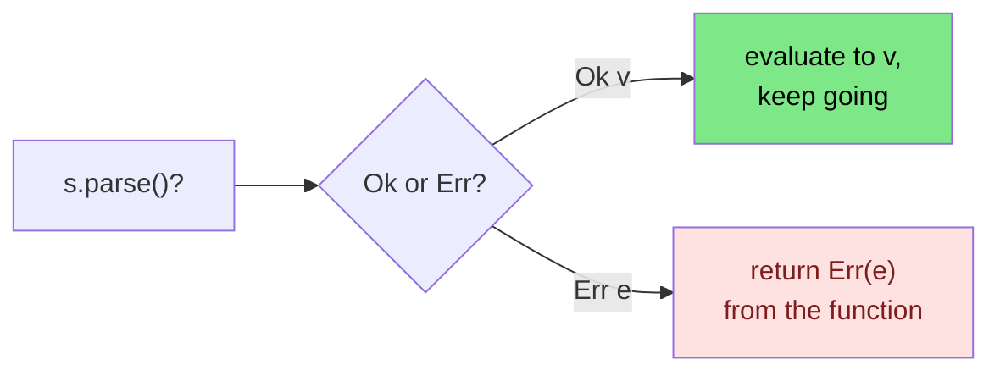

<h1><span class="h1-kicker">Error Handling</span>The ? Operator & Error Propagation</h1>

Real functions rarely handle every error themselves. Usually they do a little work, and if something fails, they pass the error *up* to their caller, who has more context to decide what to do. This is called **propagating** an error. Doing it with `match` gets noisy fast — so Rust gives you one tiny, powerful character that does it for you: **`?`**.

## The problem: propagation by hand

Say we parse a string and double it, passing any parse error back to the caller. Without `?`, we write this dance:

```rust
use std::num::ParseIntError;

fn double(s: &str) -> Result<i32, ParseIntError> {
    let n = match s.parse::<i32>() {
        Ok(value) => value,        // success: keep going with the value
        Err(e) => return Err(e),   // failure: hand the error to our caller
    };
    Ok(n * 2)
}
# fn main() { println!("{:?}", double("21")); }
```

That `match` — "unwrap on success, `return Err` on failure" — is so common that Rust built it into an operator.

## Enter `?`

The **`?`** operator does exactly that match, in one character. Place it after any `Result`:

```rust
use std::num::ParseIntError;

fn double(s: &str) -> Result<i32, ParseIntError> {
    let n = s.parse::<i32>()?; // if Ok, unwrap the value; if Err, return it now
    Ok(n * 2)
}

fn main() {
    println!("{:?}", double("21"));   // Ok(42)
    println!("{:?}", double("nope")); // Err(ParseIntError { .. })
}
```

> [!key] What `?` does, precisely
> When you write `expr?`:
> - If `expr` is **`Ok(v)`** (or **`Some(v)`**), the whole `?` expression evaluates to **`v`**, and execution continues.
> - If `expr` is **`Err(e)`** (or **`None`**), the function **returns immediately** with that `Err(e)` (or `None`).
>
> It's "give me the value, or bail out with the error." One operator replaces the entire match.



## Chaining makes it shine

The real payoff is stringing several fallible steps together. Each `?` quietly handles its own failure, and your code reads like the happy path:

```rust
use std::num::ParseIntError;

fn sum_three(a: &str, b: &str, c: &str) -> Result<i32, ParseIntError> {
    // Any of these failing returns its error immediately.
    let total = a.parse::<i32>()? + b.parse::<i32>()? + c.parse::<i32>()?;
    Ok(total)
}

fn main() {
    println!("{:?}", sum_three("1", "2", "3")); // Ok(6)
    println!("{:?}", sum_three("1", "x", "3")); // Err(...) — stops at "x"
}
```

## `?` also works on `Option`

The same operator propagates `None` out of a function that returns `Option`:

```rust
fn first_initial(name: &str) -> Option<char> {
    let first = name.chars().next()?; // None if the string is empty → return None
    Some(first.to_ascii_uppercase())
}

fn main() {
    println!("{:?}", first_initial("ferris")); // Some('F')
    println!("{:?}", first_initial(""));        // None
}
```

> [!warning] The return type must match
> `?` can only propagate into a function whose return type fits: use `?` on a `Result` inside a function returning `Result`, and on an `Option` inside one returning `Option`. Using `?` on a `Result` in a function that returns `()` won't compile — there's nowhere for the error to go. The fix is to make the function return a `Result`.

## `?` converts error types for you (the `From` trait)

Here's the feature that makes `?` truly powerful. When the error type you're propagating differs from your function's declared error type, `?` **automatically converts** it — as long as a `From` conversion exists. This lets one function juggle several error sources cleanly.

The easiest way to accept "any error" is the trait object `Box<dyn Error>`, which every standard error converts into:

```rust
use std::error::Error;

fn read_config(a: &str, b: &str) -> Result<i32, Box<dyn Error>> {
    let x: i32 = a.parse()?; // ParseIntError auto-converts to Box<dyn Error>
    let y: i32 = b.parse()?; // so does this one
    Ok(x + y)
}

fn main() {
    println!("{:?}", read_config("10", "20")); // Ok(30)
    println!("failed? {}", read_config("10", "?").is_err()); // true
}
```

> [!jargon] `Box<dyn Error>`
> Read this as "a box holding *some* type that implements the `Error` trait." It's a catch-all error type: any standard error can be converted into it via `?`. It's the go-to return type for `main` and for application code that just wants to bubble errors up without caring about their exact type. We'll meet more precise approaches (and the `thiserror`/`anyhow` crates) in the [next chapter](#/ch/custom-errors).

## `main` can return a `Result`

Because propagation is so useful, even `main` is allowed to return a `Result`. Then you can use `?` right in `main`, and Rust prints the error and sets a non-zero exit code automatically if it fails:

```rust
use std::error::Error;

fn main() -> Result<(), Box<dyn Error>> {
    let number: i32 = "42".parse()?; // ? works here because main returns Result
    println!("Parsed {number}");
    Ok(()) // success: the unit value inside Ok
}
```

> [!best] Let errors flow up to where they can be handled
> The idiomatic shape of a Rust program: small functions each do one fallible thing and use `?` to propagate errors upward; a *few* high-level places (like `main`, or a request handler) actually decide what to do — log it, retry, show the user a message. Don't handle every error at the point it occurs; propagate it to where you have enough context to respond well.

## Summary

- **Propagating** an error means passing it up to your caller; the **`?`** operator does this in one character.
- `expr?` evaluates to the inner value on `Ok`/`Some`, or **returns early** with the `Err`/`None`.
- It works on both **`Result`** and **`Option`**, and lets you **chain** fallible steps as if writing the happy path.
- `?` **auto-converts** error types via the `From` trait; **`Box<dyn Error>`** is a handy catch-all target.
- **`main` may return `Result`**, so you can use `?` there too.

> [!exercise] Try it yourself
> 1. Write `fn parse_point(x: &str, y: &str) -> Result<(i32, i32), std::num::ParseIntError>` using `?` for both parses.
> 2. Write `fn third_word(s: &str) -> Option<&str>` that returns the third whitespace-separated word using `?` on `.nth(2)`.
> 3. Change `main` to return `Result<(), Box<dyn std::error::Error>>` and use `?` to parse a couple of strings.

`Box<dyn Error>` is convenient, but sometimes you want your *own* precise error type — one callers can `match` on. That's the art of designing custom errors, and the crates that make it painless.
