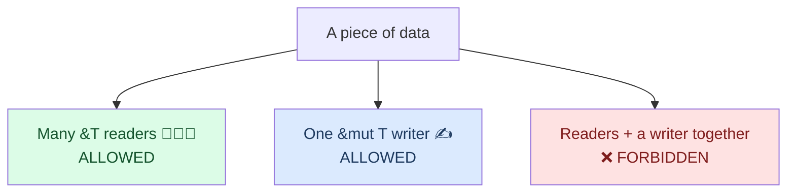

<h1><span class="h1-kicker">Ownership — The Heart of Rust</span>References & Borrowing</h1>

In the [ownership chapter](#/ch/ownership) we hit an awkward problem: passing a value to a function *moves* it, so you lose access to it afterward. Constantly handing ownership back and forth would make Rust exhausting to write. **References** are the elegant solution: they let a function *borrow* a value — use it without owning it — and hand it right back. This chapter teaches the rules of borrowing, the compiler's most famous feature: the **borrow checker**.

## The problem references solve

Here's the pain point. Without references, a function that just wants to *read* a `String` has to take ownership and give it back:

```rust
fn main() {
    let s1 = String::from("hello");
    let (s1, len) = calculate_length(s1); // must return s1 too, just to keep it!
    println!("The length of '{s1}' is {len}.");
}

fn calculate_length(s: String) -> (String, usize) {
    let length = s.len();
    (s, length) // hand ownership back
}
```

Clunky. What we really want is to *lend* the string. Enter references.

## Borrowing with `&`

A **reference** is like a signpost that points to a value without owning it. You create one with `&`, and using a reference to access data is called **borrowing** (just like borrowing a book — you can read it, but you must give it back and you don't own it).

```rust
fn main() {
    let s1 = String::from("hello");
    let len = calculate_length(&s1); // lend a reference, don't move
    println!("The length of '{s1}' is {len}."); // s1 is still ours! ✅
}

fn calculate_length(s: &String) -> usize { // s is a *reference* to a String
    s.len()
} // s goes out of scope, but because it doesn't OWN the String, nothing is dropped
```

The `&s1` creates a reference *to* `s1` without taking ownership. When the reference goes out of scope, the value it points to is untouched.

<figure class="diagram">
<svg viewBox="0 0 640 170" role="img" aria-label="A reference s points to s1, which owns the heap data">
  <style>
    .lb { font: 600 13px var(--font-sans); fill: var(--text); }
    .mn { font: 600 12px var(--font-mono); fill: var(--text); }
    .cp { font: 12px var(--font-sans); fill: var(--text-mute); }
    .bx { fill: var(--surface-2); stroke: var(--border-strong); stroke-width: 1.5; }
    .rf { fill: var(--blue-soft); stroke: var(--blue); stroke-width: 1.5; }
    .hp { fill: var(--rust-100); stroke: var(--rust-400); stroke-width: 1.5; }
  </style>
  <text x="20" y="22" class="lb" fill="var(--blue)">s: &amp;String (a reference)</text>
  <rect x="20" y="30" width="110" height="28" class="rf"/><text x="30" y="49" class="mn">ptr ●</text>
  <text x="200" y="22" class="lb">s1: String (the owner)</text>
  <rect x="200" y="30" width="150" height="28" class="bx"/><text x="210" y="49" class="mn">ptr ● len cap</text>
  <rect x="470" y="30" width="140" height="28" class="hp"/><text x="500" y="49" class="mn">"hello"</text>
  <path d="M132 44 L198 44" stroke="var(--blue)" stroke-width="2.5" marker-end="url(#arb)"/>
  <path d="M352 44 L468 44" stroke="var(--rust-500)" stroke-width="2.5" marker-end="url(#arb)"/>
  <text x="20" y="95" class="cp">The reference points to the owner; the owner points to the heap data.</text>
  <text x="20" y="115" class="cp">When `s` ends, only the signpost disappears — `s1` and its data live on.</text>
  <defs><marker id="arb" markerWidth="10" markerHeight="10" refX="8" refY="3" orient="auto"><path d="M0,0 L8,3 L0,6 Z" fill="var(--blue)"/></marker></defs>
</svg>
<figcaption>A <b>reference</b> borrows access to a value without taking ownership of it.</figcaption>
</figure>

> [!jargon] Reference / borrow / dereference
> A **reference** (`&T`) is an address that points to a value. **Borrowing** is the act of creating and using a reference. To follow a reference back to its value, you **dereference** it with `*` — though Rust usually does this automatically for method calls and field access, so you rarely type `*`.

## Mutable references with `&mut`

By default, a reference is read-only — you can look but not touch. To modify the borrowed value, you need a **mutable reference**, written `&mut`:

```rust
fn main() {
    let mut s = String::from("hello");
    change(&mut s); // lend a *mutable* reference
    println!("{s}"); // "hello, world"
}

fn change(some_string: &mut String) {
    some_string.push_str(", world");
}
```

Note three things had to line up: `s` is declared `mut`, we passed `&mut s`, and the parameter type is `&mut String`. All three are required to modify through a reference.

## The rules of borrowing

Now the heart of it. The borrow checker enforces two rules that, together, make data races *impossible* at compile time:

> [!key] The two borrowing rules
> At any given time, you may have **either**:
> - **one mutable reference** (`&mut T`), **or**
> - **any number of immutable references** (`&T`),
>
> …but **never both at once**. And every reference must always point to valid data (no dangling).

This is often summarized as **"shared XOR mutable"**: data can be *shared* (many readers) or *mutable* (one writer), but not both simultaneously.



Why? If one part of your code is reading data while another is changing it, you get inconsistent, corrupted results — the classic **data race**. Rust forbids the *setup* that allows it:

```rust,ignore
fn main() {
    let mut s = String::from("hello");
    let r1 = &s;      // immutable borrow — fine
    let r2 = &s;      // another immutable borrow — also fine
    let r3 = &mut s;  // ❌ ERROR: can't borrow mutably while shared borrows exist
    println!("{r1}, {r2}, {r3}");
}
// error[E0502]: cannot borrow `s` as mutable because it is also borrowed as immutable
```

> [!mistake] "But I stopped using r1 and r2!"
> Good news: the borrow checker is smarter than it looks. A borrow only lasts until its **last use**, not until the end of the block (this is called *non-lexical lifetimes*). So this compiles fine, because `r1`/`r2` are done before `r3` begins:
> ```rust
> fn main() {
>     let mut s = String::from("hello");
>     let r1 = &s;
>     let r2 = &s;
>     println!("{r1} and {r2}"); // last use of r1, r2 — their borrow ends here
>     let r3 = &mut s;            // now allowed!
>     r3.push_str("!");
>     println!("{r3}");
> }
> ```

## No dangling references

In C, it's easy to return a pointer to something that's already been freed — a **dangling pointer** — and the resulting crash or security hole can be brutal to debug. Rust makes this a compile error:

```rust,ignore
fn dangle() -> &String {   // ❌ returns a reference...
    let s = String::from("hi");
    &s                      // ...to `s`, which is dropped when the function ends!
}
// error[E0106]: missing lifetime specifier / returns a reference to dropped data
```

The compiler notices that `s` is destroyed at the end of `dangle`, so any reference to it would immediately dangle. The fix is to return the `String` itself (move ownership out), not a reference to it. This safety is guaranteed by **lifetimes**, which get their own [chapter](#/ch/lifetimes) later.

> [!best] Default to `&T`, upgrade to `&mut T` only when needed
> When writing a function, ask: do I need to *own* this (rare), *read* it (`&T`, common), or *modify* it (`&mut T`)? Borrowing immutably is the default that keeps your code flexible and lets many callers share data freely. This single habit resolves the vast majority of borrow-checker complaints.

## Summary

- A **reference** (`&T`) lets you **borrow** a value — use it without taking ownership — so the original stays usable.
- **`&mut T`** is a mutable reference; to use one, the variable, the `&mut`, and the parameter type must all agree.
- The borrow checker enforces **"shared XOR mutable"**: many `&T` readers *or* one `&mut T` writer, never both — which makes data races impossible.
- Borrows end at their **last use** (non-lexical lifetimes), so the rules are less strict than they first appear.
- Rust rejects **dangling references** at compile time — you can never point to freed data.

> [!exercise] Try it yourself
> 1. Write a function `fn longest_len(a: &str, b: &str) -> usize` that borrows two strings and returns the greater length. Confirm the callers keep their strings.
> 2. Reproduce the `E0502` error by taking `&s` and `&mut s` at the same time, then fix it by moving the `println!` earlier.
> 3. Write `fn append_exclamation(s: &mut String)` that pushes `'!'`, and call it on a `mut` string.

References that borrow *part* of a collection — like just the first word of a string — are so useful they get their own type. Next: **slices**.
