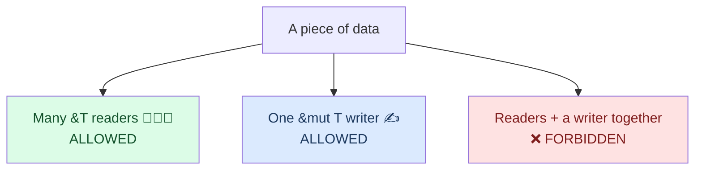

<h1><span class="h1-kicker">Ownership — The Heart of Rust</span>References & Borrowing</h1>

In the [ownership chapter](#/ch/ownership) we hit an awkward problem: passing a value to a function *moves* it, so you lose access to it afterward. Constantly handing ownership back and forth would make Rust exhausting to write. **References** are the elegant solution: they let a function *borrow* a value — use it without owning it — and hand it right back. This chapter teaches the rules of borrowing, the compiler's most famous feature: the **borrow checker**.

## The problem references solve

Here's the pain point. Without references, a function that just wants to *read* a `String` has to take ownership and give it back:

```rust
fn main() {
    let s1 = String::from("hello");
    let (s1, len) = calculate_length(s1); // must return s1 too, just to keep it!
    println!("The length of '{s1}' is {len}.");
}

fn calculate_length(s: String) -> (String, usize) {
    let length = s.len();
    (s, length) // hand ownership back
}
```

Clunky. What we really want is to *lend* the string. Enter references.

## Borrowing with `&`

A **reference** is like a signpost that points to a value without owning it. You create one with `&`, and using a reference to access data is called **borrowing** (just like borrowing a book — you can read it, but you must give it back and you don't own it).

```rust
fn main() {
    let s1 = String::from("hello");
    let len = calculate_length(&s1); // lend a reference, don't move
    println!("The length of '{s1}' is {len}."); // s1 is still ours! ✅
}

fn calculate_length(s: &String) -> usize { // s is a *reference* to a String
    s.len()
} // s goes out of scope, but because it doesn't OWN the String, nothing is dropped
```

The `&s1` creates a reference *to* `s1` without taking ownership. When the reference goes out of scope, the value it points to is untouched.

<figure class="diagram">
<svg viewBox="0 0 640 170" role="img" aria-label="A reference s points to s1, which owns the heap data">
  <style>
    .lb { font: 600 13px var(--font-sans); fill: var(--text); }
    .mn { font: 600 12px var(--font-mono); fill: var(--text); }
    .cp { font: 12px var(--font-sans); fill: var(--text-mute); }
    .bx { fill: var(--surface-2); stroke: var(--border-strong); stroke-width: 1.5; }
    .rf { fill: var(--blue-soft); stroke: var(--blue); stroke-width: 1.5; }
    .hp { fill: var(--rust-100); stroke: var(--rust-400); stroke-width: 1.5; }
  </style>
  <text x="20" y="22" class="lb" fill="var(--blue)">s: &amp;String (a reference)</text>
  <rect x="20" y="30" width="110" height="28" class="rf"/><text x="30" y="49" class="mn">ptr ●</text>
  <text x="200" y="22" class="lb">s1: String (the owner)</text>
  <rect x="200" y="30" width="150" height="28" class="bx"/><text x="210" y="49" class="mn">ptr ● len cap</text>
  <rect x="470" y="30" width="140" height="28" class="hp"/><text x="500" y="49" class="mn">"hello"</text>
  <path d="M132 44 L198 44" stroke="var(--blue)" stroke-width="2.5" marker-end="url(#arb)"/>
  <path d="M352 44 L468 44" stroke="var(--rust-500)" stroke-width="2.5" marker-end="url(#arb)"/>
  <text x="20" y="95" class="cp">The reference points to the owner; the owner points to the heap data.</text>
  <text x="20" y="115" class="cp">When `s` ends, only the signpost disappears — `s1` and its data live on.</text>
  <defs><marker id="arb" markerWidth="10" markerHeight="10" refX="8" refY="3" orient="auto"><path d="M0,0 L8,3 L0,6 Z" fill="var(--blue)"/></marker></defs>
</svg>
<figcaption>A <b>reference</b> borrows access to a value without taking ownership of it.</figcaption>
</figure>

> [!jargon] Reference / borrow / dereference
> A **reference** (`&T`) is an address that points to a value. **Borrowing** is the act of creating and using a reference. To follow a reference back to its value, you **dereference** it with `*` — though Rust usually does this automatically for method calls and field access, so you rarely type `*`.

### Why you rarely write `*`

That last sentence deserves a demonstration, because coming from C the missing `*` everywhere is disorienting. Rust **auto-references** the receiver of a method call and **auto-dereferences** as many times as needed to find the method:

```rust
fn main() {
    let s = String::from("hello");
    let r: &String = &s;
    let rr: &&String = &r;

    // All three find `len()`, because Rust dereferences automatically:
    println!("{} {} {}", s.len(), r.len(), rr.len());

    // `s.len()` is sugar for `String::len(&s)` — the & is inserted for you.
    println!("{}", String::len(&s));

    // You DO need * when working with the value itself, not calling a method:
    let n = 5;
    let rn = &n;
    println!("{}", *rn + 1);        // explicit deref to do arithmetic
    println!("{}", rn == &5);       // …or compare reference to reference
}
```

> [!key] `&mut` means *exclusive*, not merely *mutable*
> The single most useful reframing in this chapter. It's tempting to read `&T` as "read-only pointer" and `&mut T` as "writable pointer," but the real distinction is **how many can exist**:
> - `&T` is a **shared** reference — many may coexist.
> - `&mut T` is an **exclusive** reference — while it exists, it is the *only* way to reach that value, full stop. Not even the owner can read through it.
>
> Some Rust programmers argue they should have been named `&shared` and `&unique`. Once you read `&mut` as "nobody else may touch this right now," most borrow-checker errors stop being mysterious: the compiler isn't objecting to *mutation*, it's objecting to *simultaneous access*.

## Mutable references with `&mut`

By default, a reference is read-only — you can look but not touch. To modify the borrowed value, you need a **mutable reference**, written `&mut`:

```rust
fn main() {
    let mut s = String::from("hello");
    change(&mut s); // lend a *mutable* reference
    println!("{s}"); // "hello, world"
}

fn change(some_string: &mut String) {
    some_string.push_str(", world");
}
```

Note three things had to line up: `s` is declared `mut`, we passed `&mut s`, and the parameter type is `&mut String`. All three are required to modify through a reference.

## The rules of borrowing

Now the heart of it. The borrow checker enforces two rules that, together, make data races *impossible* at compile time:

> [!key] The two borrowing rules
> At any given time, you may have **either**:
> - **one mutable reference** (`&mut T`), **or**
> - **any number of immutable references** (`&T`),
>
> …but **never both at once**. And every reference must always point to valid data (no dangling).

This is often summarized as **"shared XOR mutable"**: data can be *shared* (many readers) or *mutable* (one writer), but not both simultaneously.



Why? If one part of your code is reading data while another is changing it, you get inconsistent, corrupted results — the classic **data race**. Rust forbids the *setup* that allows it:

```rust,ignore
fn main() {
    let mut s = String::from("hello");
    let r1 = &s;      // immutable borrow — fine
    let r2 = &s;      // another immutable borrow — also fine
    let r3 = &mut s;  // ❌ ERROR: can't borrow mutably while shared borrows exist
    println!("{r1}, {r2}, {r3}");
}
// error[E0502]: cannot borrow `s` as mutable because it is also borrowed as immutable
```

> [!mistake] "But I stopped using r1 and r2!"
> Good news: the borrow checker is smarter than it looks. A borrow only lasts until its **last use**, not until the end of the block (this is called *non-lexical lifetimes*). So this compiles fine, because `r1`/`r2` are done before `r3` begins:
> ```rust
> fn main() {
>     let mut s = String::from("hello");
>     let r1 = &s;
>     let r2 = &s;
>     println!("{r1} and {r2}"); // last use of r1, r2 — their borrow ends here
>     let r3 = &mut s;            // now allowed!
>     r3.push_str("!");
>     println!("{r3}");
> }
> ```

### Seeing borrows as spans of time

That "last use" rule is much easier to hold onto visually. A borrow isn't tied to a block — it's a **span** that starts where the reference is created and ends at its final use:

<figure class="diagram">
<svg viewBox="0 0 670 265" role="img" aria-label="Two timelines of the same code. In the failing version the shared borrows r1 and r2 are still in use after the mutable borrow r3 begins, so the spans overlap. In the working version the println comes first, ending the shared borrows before r3 starts, so no spans overlap.">
  <style>
    .tl-h { font: 700 11.5px var(--font-sans); }
    .tl-m { font: 600 10px var(--font-mono); fill: var(--text); }
    .tl-c { font: 10px var(--font-sans); fill: var(--text-mute); }
    .tl-sh { fill: var(--blue-soft); stroke: var(--blue); stroke-width: 1.3; }
    .tl-mu { fill: var(--rust-100); stroke: var(--rust-400); stroke-width: 1.3; }
    .tl-clash { fill: var(--red-soft); stroke: var(--red); stroke-width: 1.8; }
    .tl-ok { fill: var(--green-soft); stroke: var(--green); stroke-width: 1.5; }
    .tl-ax { stroke: var(--border-strong); stroke-width: 1; stroke-dasharray: 2 3; }
  </style>
  <text x="12" y="16" class="tl-h" fill="var(--red)">✗ Overlapping spans — E0502</text>
  <text x="12" y="34" class="tl-m">let r1 = &amp;s;</text>
  <text x="12" y="50" class="tl-m">let r2 = &amp;s;</text>
  <text x="12" y="66" class="tl-m">let r3 = &amp;mut s;</text>
  <text x="12" y="82" class="tl-m">println!("{r1}{r2}{r3}");</text>
  <line x1="196" y1="26" x2="196" y2="96" class="tl-ax"/>
  <line x1="316" y1="26" x2="316" y2="96" class="tl-ax"/>
  <rect x="196" y="28" width="124" height="14" rx="3" class="tl-sh"/><text x="326" y="39" class="tl-c">r1 shared</text>
  <rect x="196" y="45" width="124" height="14" rx="3" class="tl-sh"/><text x="326" y="56" class="tl-c">r2 shared</text>
  <rect x="248" y="62" width="72" height="14" rx="3" class="tl-clash"/><text x="326" y="73" class="tl-c">r3 exclusive — overlaps!</text>
  <rect x="248" y="26" width="72" height="50" rx="3" fill="none" stroke="var(--red)" stroke-width="1.6" stroke-dasharray="3 2"/>
  <text x="196" y="94" class="tl-c">shared and exclusive coexist here → rejected</text>
  <text x="12" y="130" class="tl-h" fill="var(--green)">✓ Disjoint spans — compiles</text>
  <text x="12" y="148" class="tl-m">let r1 = &amp;s;</text>
  <text x="12" y="164" class="tl-m">let r2 = &amp;s;</text>
  <text x="12" y="180" class="tl-m">println!("{r1}{r2}");</text>
  <text x="12" y="196" class="tl-m">let r3 = &amp;mut s;</text>
  <text x="12" y="212" class="tl-m">r3.push_str("!");</text>
  <line x1="196" y1="140" x2="196" y2="222" class="tl-ax"/>
  <line x1="300" y1="140" x2="300" y2="222" class="tl-ax"/>
  <rect x="196" y="142" width="100" height="14" rx="3" class="tl-sh"/><text x="404" y="153" class="tl-c">r1 ends at its last use</text>
  <rect x="196" y="159" width="100" height="14" rx="3" class="tl-sh"/><text x="404" y="170" class="tl-c">r2 ends at its last use</text>
  <rect x="304" y="193" width="96" height="14" rx="3" class="tl-ok"/><text x="404" y="204" class="tl-c">r3 starts after — no overlap</text>
  <text x="196" y="222" class="tl-c">same statements, different order → accepted</text>
  <text x="12" y="250" class="tl-c">The borrow checker asks one question: do a shared span and an exclusive span overlap in time?</text>
  <text x="12" y="262" class="tl-c">Moving the last use earlier is why "just print it sooner" fixes so many borrow errors.</text>
</svg>
<figcaption>Borrows are <b>spans</b>, not blocks. The check is simply whether an exclusive span overlaps any other span.</figcaption>
</figure>

## Reading borrow-checker errors

Four error codes cover almost everything the borrow checker will say to you. Learning to recognize them turns a wall of text into a one-line diagnosis:

| Code | Means | Usual fix |
|---|---|---|
| **E0502** | mutable borrow while a shared borrow is alive | move the last use of the shared borrow earlier |
| **E0499** | two mutable borrows at once | scope one with `{}`, or split the data |
| **E0382** | use of a value after it was **moved** | borrow (`&`) instead of moving, or `clone` |
| **E0106** | missing lifetime — returning a reference to nothing | return the owned value instead |

`E0499` is the one not shown above — two exclusive borrows of the same thing:

```rust,ignore
fn main() {
    let mut v = vec![1, 2, 3];
    let a = &mut v;
    let b = &mut v;   // ❌ E0499: cannot borrow `v` as mutable more than once
    a.push(4);
    b.push(5);
}
```

Every one of these errors is the compiler pointing at three places: where the first borrow starts, where the conflicting one happens, and where the first is *later used*. That third location is the key — it's what keeps the first borrow alive, and shortening its span is usually the fix.

## The error you'll actually hit: mutating while iterating

The textbook examples above are contrived. Here's the borrow error that shows up in real code, on day one:

```rust,ignore
fn main() {
    let mut names = vec![String::from("alice"), String::from("bob")];

    for name in &names {              // shared borrow of `names` for the whole loop
        if name.starts_with('a') {
            names.push(name.clone()); // ❌ E0502: needs a mutable borrow — while iterating
        }
    }
}
```

This isn't the compiler being pedantic; it's preventing a genuine memory bug. `push` may reallocate the vector's buffer to make room, which frees the old buffer — and the iterator is still holding a pointer into it. In C++ this compiles and quietly reads freed memory; it's such a well-known hazard it has a name, **iterator invalidation**. Rust makes it a compile error.

Three standard ways out:

```rust
fn main() {
    let mut names = vec![String::from("alice"), String::from("bob"), String::from("amy")];

    // 1. Collect what you need first, then mutate — the borrow ends at `collect`.
    let to_add: Vec<String> = names.iter().filter(|n| n.starts_with('a')).cloned().collect();
    names.extend(to_add);
    println!("1: {names:?}");

    // 2. Iterate by index — each `names[i]` borrow is over by the end of the line.
    let mut counts = vec![1, 2, 3];
    for i in 0..counts.len() {
        counts[i] *= 2;
    }
    println!("2: {counts:?}");

    // 3. Mutate in place with iter_mut — one exclusive borrow, no conflict.
    let mut scores = vec![1, 2, 3];
    for s in scores.iter_mut() {
        *s += 10;
    }
    println!("3: {scores:?}");

    // 4. Or let the standard library do it: retain, drain, dedup…
    let mut nums = vec![1, 2, 3, 4, 5, 6];
    nums.retain(|n| n % 2 == 0);
    println!("4: {nums:?}");
}
```

> [!best] Reach for `iter_mut`, `retain`, and `drain` before restructuring
> A surprising share of "the borrow checker won't let me" moments dissolve when you use the collection method built for the job. `iter_mut()` mutates elements in place, `retain(|x| …)` removes by predicate, `drain(..)` moves elements out, `split_at_mut` hands you two disjoint mutable halves. These exist precisely because they express the intent in a way the borrow checker can verify.

## Borrowing different fields at the same time

A rule that surprises people: the borrow checker tracks **individual fields**, not just whole structs. Two different fields can be borrowed mutably at once:

```rust
struct Player {
    name: String,
    score: u32,
}

fn main() {
    let mut p = Player { name: String::from("ferris"), score: 0 };

    // Two mutable borrows — of DIFFERENT fields. Perfectly legal:
    let name = &mut p.name;
    let score = &mut p.score;
    name.push_str("-the-crab");
    *score += 10;

    println!("{} scored {}", p.name, p.score);
}
```

Field-level precision has a limit, though: a **method** taking `&mut self` borrows the *entire* struct, because the compiler only sees the signature, not which fields the body touches. Surprisingly, this still works:

```rust
struct Player { score: u32 }

impl Player {
    fn bonus(&self) -> u32 { self.score / 2 }
    fn add(&mut self, n: u32) { self.score += n; }
}

fn main() {
    let mut p = Player { score: 10 };
    p.add(p.bonus());   // ✅ compiles — see two-phase borrows below
    println!("{}", p.score); // 15
}
```

> [!deep] Two-phase borrows: why `p.add(p.bonus())` and `v.push(v.len())` compile
> Naively, `p.add(p.bonus())` should be `E0502` — `add` needs `&mut p`, and evaluating the argument needs `&p`. Early Rust did reject it, and the workaround was a temporary variable. Modern Rust accepts it via **two-phase borrows**: when a `&mut` is created *implicitly* by method-call autoref, it starts life merely **reserved** (behaving like a shared borrow), and only *activates* into a full exclusive borrow when the call itself begins. Arguments are evaluated during the reserved phase, so reading `p` there is fine.
>
> The concession is narrow — it applies only to autoref'd method receivers. Write the same call in explicit function form and the borrow is exclusive from the start, so it fails:
> ```rust,ignore
> Player::add(&mut p, p.bonus());
> // error[E0502]: cannot borrow `p` as immutable because it is also borrowed as mutable
> ```
> Practical upshot: prefer method-call syntax (`p.add(…)`, `v.push(…)`) and this class of error mostly disappears. If you do hit it — commonly with an explicit `&mut`, or a closure capturing the struct — the reliable fix is still a temporary: `let b = p.bonus(); p.add(b);`. For methods on *different* fields that genuinely conflict, take narrower parameters (`fn add(score: &mut u32, n: u32)`) or split the struct.

## Reborrowing: why passing `&mut` twice works

If `&mut` is exclusive and *moves* like any other value, how does this compile?

```rust
fn bump(counter: &mut i32) {
    *counter += 1;
}

fn main() {
    let mut n = 0;
    let r = &mut n;
    bump(r);          // surely this moves `r`…
    bump(r);          // …yet we can use it again?
    println!("{r}");  // and again!
}
```

The answer is **reborrowing**: when you pass a `&mut` where another `&mut` is expected, the compiler silently inserts `&mut *r` — a *new*, shorter-lived exclusive borrow derived from the first. The original `r` is frozen for the duration of the call and usable again afterward. You'll almost never write `&mut *r` yourself, but knowing it exists explains why `&mut` feels less painful in practice than "exclusive and moved" suggests.

## No dangling references

In C, it's easy to return a pointer to something that's already been freed — a **dangling pointer** — and the resulting crash or security hole can be brutal to debug. Rust makes this a compile error:

```rust,ignore
fn dangle() -> &String {   // ❌ returns a reference...
    let s = String::from("hi");
    &s                      // ...to `s`, which is dropped when the function ends!
}
// error[E0106]: missing lifetime specifier / returns a reference to dropped data
```

The compiler notices that `s` is destroyed at the end of `dangle`, so any reference to it would immediately dangle. The fix is to return the `String` itself (move ownership out), not a reference to it. This safety is guaranteed by **lifetimes**, which get their own [chapter](#/ch/lifetimes) later.

> [!tip] Take `&str`, not `&String`
> One habit worth forming now: a function that only reads text should take **`&str`**, not `&String`. Thanks to *deref coercion*, a caller can pass `&String` to a `&str` parameter automatically — so `&str` accepts strictly more callers (string literals, slices, `String`s) at no cost. The same applies to `&[T]` over `&Vec<T>`. More on why in [The Slice Type](#/ch/slices).

## When you're stuck: the fix catalog

Borrow errors nearly always yield to one of these, roughly in order of how often they're the right answer:

| Fix | When |
|---|---|
| **Shorten the borrow** — move the last use earlier, or wrap in `{}` | the spans merely overlap; nothing is truly shared |
| **Use a temporary** — `let x = a.read(); a.write(x);` | a method call borrows the whole struct |
| **Switch to the right method** — `iter_mut`, `retain`, `drain`, `split_at_mut` | you're mutating a collection |
| **Index instead of iterate** — `for i in 0..v.len()` | you need to touch other elements while looping |
| **Borrow fields, not the struct** | two operations touch disjoint fields |
| **Clone** — deliberately, with a reason | the data is small, or you genuinely need two owners |
| **Restructure ownership** — who *should* own this? | the same fight keeps recurring in one area |
| **[`Rc`/`RefCell`](#/ch/refcell)** — move the check to runtime | genuinely shared mutable state, e.g. a graph |

> [!best] Default to `&T`, upgrade to `&mut T` only when needed
> When writing a function, ask: do I need to *own* this (rare), *read* it (`&T`, common), or *modify* it (`&mut T`)? Borrowing immutably is the default that keeps your code flexible and lets many callers share data freely. This single habit resolves the vast majority of borrow-checker complaints.

> [!note] Fighting the borrow checker is a design signal
> If one function keeps losing this fight, the usual cause isn't the rules — it's unclear ownership. Ask who *should* own the data, and whether one function is trying to do two things at once (read a thing and modify it). Cloning to make an error go away is fine occasionally and a smell when it's habitual; each `clone()` you add to silence the compiler is a small admission that the ownership story isn't settled yet. The good news is this fight gets dramatically rarer within a few weeks — the rules become how you naturally structure code.

## Summary

- A **reference** (`&T`) lets you **borrow** a value — use it without taking ownership — so the original stays usable.
- **`&mut T`** is a mutable reference; to use one, the variable, the `&mut`, and the parameter type must all agree.
- Read `&mut` as **exclusive**, not just "mutable" — while it exists, nothing else may access the value at all.
- Rust **auto-references and auto-dereferences** for method calls, which is why you rarely type `*`.
- The borrow checker enforces **"shared XOR mutable"**: many `&T` readers *or* one `&mut T` writer, never both — which makes data races impossible.
- Borrows end at their **last use** (non-lexical lifetimes) — they're **spans**, not blocks, so reordering statements often fixes an error.
- Four error codes cover nearly everything: **E0502** (mut + shared), **E0499** (two muts), **E0382** (use after move), **E0106** (missing lifetime).
- **Mutating a collection while iterating it** is the error you'll hit most; it prevents real *iterator invalidation* bugs. Use `iter_mut`, `retain`, `drain`, or collect-then-mutate.
- The checker tracks **individual fields**, so disjoint fields can be borrowed mutably at once — but a **method call borrows the whole struct**.
- **Reborrowing** is why you can pass the same `&mut` to several functions in a row.
- Rust rejects **dangling references** at compile time — you can never point to freed data.
- Prefer **`&str` over `&String`** (and `&[T]` over `&Vec<T>`) in parameters.

> [!exercise] Try it yourself
> 1. Write a function `fn longest_len(a: &str, b: &str) -> usize` that borrows two strings and returns the greater length. Confirm the callers keep their strings.
> 2. Reproduce the `E0502` error by taking `&s` and `&mut s` at the same time, then fix it by moving the `println!` earlier.
> 3. Write `fn append_exclamation(s: &mut String)` that pushes `'!'`, and call it on a `mut` string.
> 4. Trigger `E0499` with two `&mut` to the same `Vec`, then fix it by wrapping the first in a `{}` block.
> 5. Write a loop that pushes to a `Vec` while iterating it. Read the error, then fix it three ways: collect-first, index-based, and `retain`.
> 6. Borrow two different fields of one struct mutably at the same time. Then confirm `p.add(p.bonus())` compiles, but `Player::add(&mut p, p.bonus())` does not — and explain the difference in one sentence.
> 7. Change `fn f(s: &String)` to `fn f(s: &str)` and call it with a `String`, a `&String`, and a `"literal"`. Which calls only work after the change?
> 8. Write `fn bump(n: &mut i32)` and call it twice with the same `&mut`. Explain, in one sentence, why the second call compiles.

References that borrow *part* of a collection — like just the first word of a string — are so useful they get their own type. Next: **slices**.
