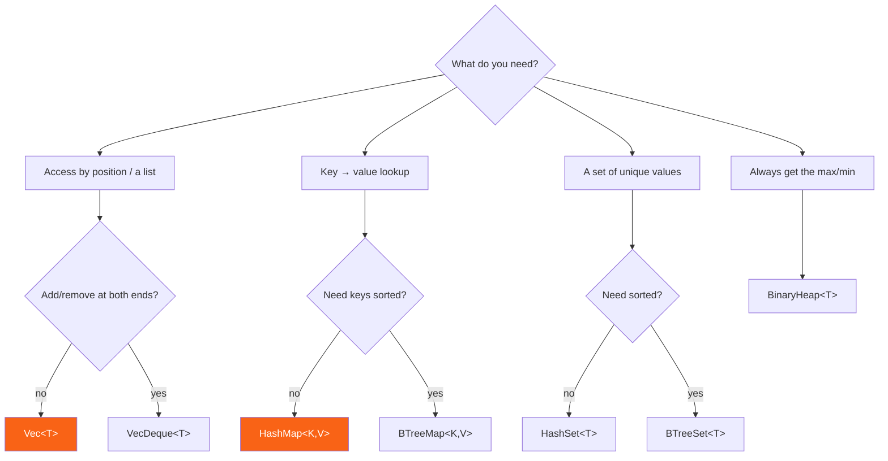

<h1><span class="h1-kicker">The Standard Library, Deep</span>std::collections Reference</h1>

The [Collections](#/ch/other-collections) chapter introduced each container. This reference is the **decision guide** — which collection to reach for, its performance characteristics, and the shared APIs that work across all of them. When you're unsure "which one?", start here.

## The decision flowchart



## Performance at a glance (Big-O)

Knowing the cost of each operation guides your choice. `n` is the number of elements:

| Collection | Access | Insert | Remove | Search | Ordered? |
|------------|--------|--------|--------|--------|----------|
| `Vec<T>` | O(1) by index | O(1) amortized (end) | O(n) (middle), O(1) (end) | O(n) | insertion order |
| `VecDeque<T>` | O(1) by index | O(1) amortized (both ends) | O(1) (ends) | O(n) | insertion order |
| `HashMap<K,V>` | — | O(1) avg | O(1) avg | O(1) avg by key | none |
| `BTreeMap<K,V>` | — | O(log n) | O(log n) | O(log n) by key | sorted by key |
| `HashSet<T>` | — | O(1) avg | O(1) avg | O(1) avg | none |
| `BTreeSet<T>` | — | O(log n) | O(log n) | O(log n) | sorted |
| `BinaryHeap<T>` | O(1) peek max | O(log n) | O(log n) pop max | O(n) | max on top |

> [!key] The default is almost always `Vec` or `HashMap`
> Reach for **`Vec`** for any ordered list, and **`HashMap`** for any key→value lookup — they're the fastest and most cache-friendly for the common case. Only move to a specialized collection when you have a specific need: **`VecDeque`** for a queue, **`BTreeMap`/`BTreeSet`** for sorted iteration or range queries, a **set** for uniqueness/membership, **`BinaryHeap`** for a priority queue. Don't over-think it: start with `Vec`/`HashMap` and switch only when a real requirement appears.

## Constructing collections

Several ergonomic ways to build them:

```rust
use std::collections::{HashMap, HashSet, BTreeMap};

fn main() {
    // From arrays (stable, ergonomic):
    let map = HashMap::from([("a", 1), ("b", 2)]);
    let set = HashSet::from([1, 2, 3, 3]); // duplicates collapse → 3 elements
    let sorted = BTreeMap::from([(3, "c"), (1, "a"), (2, "b")]);

    // From an iterator via collect:
    let squares: HashMap<i32, i32> = (1..=3).map(|n| (n, n * n)).collect();

    // With pre-allocated capacity (avoids reallocation):
    let mut big: Vec<i32> = Vec::with_capacity(1000);
    big.push(1);

    println!("{} {} {:?} {:?} {}", map.len(), set.len(), sorted, squares.get(&2), big.len());
}
```

## APIs shared across collections

Because collections implement common traits, a lot of code works on *all* of them:

- **`IntoIterator`** — every collection works in `for x in &collection` and `.iter()`.
- **`FromIterator`** — every collection can be built with `.collect()`.
- **`Extend`** — `collection.extend(other_iter)` appends many items.
- **`len()` / `is_empty()` / `clear()`** — universal size operations.
- **`Entry` API** (maps) — `entry(k).or_insert(v)` for insert-or-update, as in [Hash Maps](#/ch/hashmaps).

```rust
use std::collections::HashMap;

fn main() {
    let mut totals: HashMap<&str, i32> = HashMap::new();

    // extend adds many pairs at once:
    totals.extend([("a", 1), ("b", 2)]);

    // entry API: insert-or-update in one lookup:
    *totals.entry("a").or_insert(0) += 10;
    *totals.entry("c").or_insert(0) += 5;

    // Iterate (order is arbitrary for HashMap):
    let mut items: Vec<_> = totals.into_iter().collect();
    items.sort();
    println!("{items:?}"); // [("a", 11), ("b", 2), ("c", 5)]
}
```

> [!tip] Learn the `Entry` API — it's the collections power tool
> `map.entry(key).or_insert_with(Vec::new).push(value)` is the idiomatic way to build a "multimap" (group values by key) in one lookup. Variants: `or_insert(v)`, `or_insert_with(f)` (lazy), `or_default()`, and `and_modify(f).or_insert(v)` (update-or-insert). Mastering `Entry` eliminates most `contains_key` + `insert` double-lookups.

## Choosing the hasher (advanced)

`HashMap` uses a DoS-resistant (but not fastest) hasher by default. For performance-critical maps with trusted keys, swap in a faster hasher like `ahash` or `fxhash`:

```rust,ignore
use std::collections::HashMap;
// With the ahash crate:  type FastMap<K, V> = HashMap<K, V, ahash::RandomState>;
```

> [!performance] Pre-size, and pick the right structure
> Two easy collection wins: (1) **`with_capacity(n)`** when you know the rough size — it avoids repeated reallocation as the collection grows; (2) choose the structure that matches your access pattern (a `HashSet` for membership tests instead of `Vec::contains`, which is O(n)). A `Vec::contains` in a hot loop over a large list is a common, avoidable O(n²) trap — a `HashSet` makes it O(n).

## Summary

- Use the **decision flowchart**: list → `Vec` (or `VecDeque` for both ends); key→value → `HashMap` (or `BTreeMap` for sorted); uniqueness → `HashSet`/`BTreeSet`; priority → `BinaryHeap`.
- Know the **Big-O**: `Vec`/`HashMap`/`HashSet` are O(1)-ish for their sweet spots; `BTree*` are O(log n) but sorted; `BinaryHeap` is O(log n) with the max on top.
- **Default to `Vec` and `HashMap`**; specialize only for a concrete need.
- Build with `from([...])`, `.collect()`, or `with_capacity`; use shared APIs (`IntoIterator`, `Extend`, `len`, and the **`Entry`** API).
- Performance wins: **pre-size** with `with_capacity`, and avoid `Vec::contains` in hot loops — use a set.

> [!exercise] Try it yourself
> 1. Build a "multimap" `HashMap<char, Vec<&str>>` grouping words by first letter, using `entry().or_default().push()`.
> 2. Given a `Vec<i32>` with duplicates, produce the sorted unique values using a `BTreeSet`.
> 3. Benchmark (mentally or with `Instant`) membership testing 10,000 lookups against a `Vec` vs a `HashSet` of 10,000 items.

Next: a deeper reference on Rust's text types — **`String`, `str`, and friends**.
