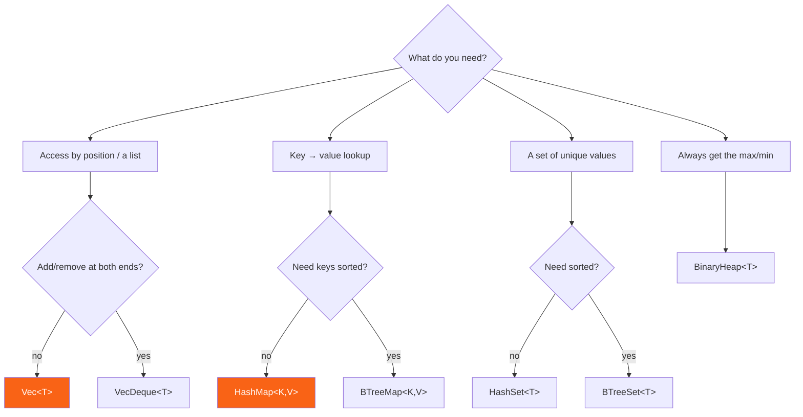

<h1><span class="h1-kicker">The Standard Library, Deep</span>std::collections Reference</h1>

The [Collections](#/ch/other-collections) chapter introduced each container. This reference is the **decision guide** — which collection to reach for, its performance and memory characteristics, and the shared vocabulary that works across all of them. When you're unsure "which one?", start here.

## The decision flowchart



## Performance at a glance (Big-O)

Knowing the cost of each operation guides your choice. `n` is the number of elements:

| Collection | Access | Insert | Remove | Search | Ordered? |
|------------|--------|--------|--------|--------|----------|
| `Vec<T>` | O(1) by index | O(1) amortized (end) | O(n) (middle), O(1) (end) | O(n) | insertion order |
| `VecDeque<T>` | O(1) by index | O(1) amortized (both ends) | O(1) (ends) | O(n) | insertion order |
| `HashMap<K,V>` | — | O(1) avg | O(1) avg | O(1) avg by key | none |
| `BTreeMap<K,V>` | — | O(log n) | O(log n) | O(log n) by key | sorted by key |
| `HashSet<T>` | — | O(1) avg | O(1) avg | O(1) avg | none |
| `BTreeSet<T>` | — | O(log n) | O(log n) | O(log n) | sorted |
| `BinaryHeap<T>` | O(1) peek max | O(log n) | O(log n) pop max | O(n) | max on top |
| `LinkedList<T>` | O(n) | O(1) at ends | O(1) at ends | O(n) | insertion order |

> [!warning] Big-O hides a constant factor that often decides the race
> `Vec::contains` is O(n) and `HashSet::contains` is O(1) — yet for twenty elements the `Vec` usually **wins**, because scanning twenty contiguous integers is a handful of cache-friendly comparisons while hashing costs a hash computation plus a random memory jump. Asymptotic complexity tells you which one wins *eventually*; measure to find out where the crossover actually is for your data. The rule of thumb: below ~32 elements, linear scans over a `Vec` are hard to beat.

### Where the crossover actually is

That claim is measurable, so measure it. Half of these probes miss, which is `Vec::contains`'s worst case — it has to scan everything before it can say no:

```rust
use std::collections::HashSet;
use std::time::Instant;

fn main() {
    println!("{:>6} {:>12} {:>12}  winner", "size", "Vec (ns/op)", "HashSet (ns/op)");
    for size in [8usize, 32, 128, 4096] {
        let v: Vec<u32> = (0..size as u32).collect();
        let s: HashSet<u32> = v.iter().copied().collect();
        let probes: Vec<u32> = (0..1000).map(|i| (i * 7919) % (size as u32 * 2)).collect();

        let reps = 200;
        let t = Instant::now();
        let mut hits = 0u64;
        for _ in 0..reps { for p in &probes { if v.contains(p) { hits += 1; } } }
        let vec_ns = t.elapsed().as_nanos() as f64 / (reps * probes.len()) as f64;

        let t = Instant::now();
        for _ in 0..reps { for p in &probes { if s.contains(p) { hits += 1; } } }
        let set_ns = t.elapsed().as_nanos() as f64 / (reps * probes.len()) as f64;

        println!("{size:>6} {vec_ns:>12.1} {set_ns:>12.1}  {}",
                 if vec_ns < set_ns { "Vec" } else { "HashSet" });
        std::hint::black_box(hits);
    }
}
```

```text
  size  Vec (ns/op) HashSet (ns/op)  winner
     8          3.9          7.0  Vec
    32          2.4          7.2  Vec
   128          6.1          7.2  Vec
  4096        176.4          7.6  HashSet
```

Read the two columns separately. The `HashSet` column is **flat** — about 7 ns whether it holds 8 items or 4,096, which is what O(1) looks like. The `Vec` column *grows with n*, but it starts so much lower that it stays ahead well past twenty elements. The 128 row is genuinely a coin flip that changes winner between runs on this machine — that *is* the crossover. Above it the O(n) scan loses badly: at 4,096 it is 25× slower.

> [!note] Reproduce this in **release** mode
> Those numbers come from an optimized build (`rustc -O`, or the Release option in the playground's mode selector). In a debug build everything is 20–40× slower and hashing suffers most, but the shape is identical and the crossover still lands between 32 and 128. Benchmark numbers from debug builds are never worth quoting.

## Memory cost: the handle and the heap

Every collection is a small fixed-size **handle** (what `size_of` reports, and what lives in your struct or on the stack) plus heap storage for the elements. The handles differ more than you'd expect:

<figure class="diagram">
<svg viewBox="0 0 640 250" role="img" aria-label="Bar chart of the handle size in bytes for each standard collection on a 64-bit platform">
  <style>
    .sz-l { font: 600 12px var(--font-mono); fill: var(--text); }
    .sz-n { font: 600 11px var(--font-mono); fill: var(--text-mute); }
    .sz-c { font: 11px var(--font-sans); fill: var(--text-mute); }
    .sz-b { fill: var(--rust-100); stroke: var(--rust-400); stroke-width: 1.5; }
    .sz-b2 { fill: var(--blue-soft); stroke: var(--blue); stroke-width: 1.5; }
  </style>
  <text x="20" y="18" class="sz-c">Handle size in bytes on a 64-bit target (one word = 8 bytes):</text>
  <text x="20" y="42" class="sz-l">&amp;[T] / &amp;str</text>
  <rect x="150" y="30" width="64" height="16" class="sz-b2"/><text x="222" y="43" class="sz-n">16 — ptr + len</text>
  <text x="20" y="68" class="sz-l">Box&lt;[T]&gt;</text>
  <rect x="150" y="56" width="64" height="16" class="sz-b2"/><text x="222" y="69" class="sz-n">16 — ptr + len</text>
  <text x="20" y="94" class="sz-l">Vec&lt;T&gt; / String</text>
  <rect x="150" y="82" width="96" height="16" class="sz-b"/><text x="254" y="95" class="sz-n">24 — ptr + len + cap</text>
  <text x="20" y="120" class="sz-l">BTreeMap/Set</text>
  <rect x="150" y="108" width="96" height="16" class="sz-b"/><text x="254" y="121" class="sz-n">24 — root ptr + len</text>
  <text x="20" y="146" class="sz-l">BinaryHeap&lt;T&gt;</text>
  <rect x="150" y="134" width="96" height="16" class="sz-b"/><text x="254" y="147" class="sz-n">24 — it wraps a Vec</text>
  <text x="20" y="172" class="sz-l">LinkedList&lt;T&gt;</text>
  <rect x="150" y="160" width="96" height="16" class="sz-b"/><text x="254" y="173" class="sz-n">24 — head + tail + len</text>
  <text x="20" y="198" class="sz-l">VecDeque&lt;T&gt;</text>
  <rect x="150" y="186" width="128" height="16" class="sz-b"/><text x="286" y="199" class="sz-n">32 — + head marker</text>
  <text x="20" y="224" class="sz-l">HashMap/Set</text>
  <rect x="150" y="212" width="192" height="16" class="sz-b"/><text x="350" y="225" class="sz-n">48 — table + hasher state</text>
  <text x="20" y="244" class="sz-c">Per-element overhead matters too: LinkedList pays two pointers per node; HashMap keeps spare slots.</text>
</svg>
<figcaption>The <b>handle</b> is what you store; the elements live on the heap. A <code>HashMap</code> field costs twice a <code>Vec</code> field before a single element exists.</figcaption>
</figure>

```rust
use std::collections::{BTreeMap, BinaryHeap, HashMap, HashSet, VecDeque};
use std::mem::size_of;

fn main() {
    println!("&[i32]            {} bytes", size_of::<&[i32]>());
    println!("Vec<i32>          {} bytes", size_of::<Vec<i32>>());
    println!("String            {} bytes", size_of::<String>());
    println!("BTreeMap<i32,i32> {} bytes", size_of::<BTreeMap<i32, i32>>());
    println!("BinaryHeap<i32>   {} bytes", size_of::<BinaryHeap<i32>>());
    println!("VecDeque<i32>     {} bytes", size_of::<VecDeque<i32>>());
    println!("HashMap<i32,i32>  {} bytes", size_of::<HashMap<i32, i32>>());
    println!("HashSet<i32>      {} bytes", size_of::<HashSet<i32>>());
}
```

| Collection | Handle | Per-element overhead | Notes |
|---|---|---|---|
| `Vec<T>` | 24 B | none | plus unused capacity |
| `VecDeque<T>` | 32 B | none | plus unused capacity |
| `String` | 24 B | none | bytes, not chars |
| `Box<[T]>` | 16 B | none | no spare capacity at all |
| `HashMap<K,V>` | 48 B | 1 control byte + empty slots | kept below ~87% full |
| `HashSet<T>` | 48 B | same as `HashMap<T, ()>` | it *is* a `HashMap` |
| `BTreeMap<K,V>` | 24 B | partially-filled nodes | up to 11 entries per node |
| `BinaryHeap<T>` | 24 B | none | a `Vec` with an ordering invariant |
| `LinkedList<T>` | 24 B | **2 pointers per element** | plus one allocation per node |

> [!performance] Shrink long-lived collections you'll never grow again
> A `Vec` built by pushing can end up with nearly double the capacity it needs. If it's going to live for the rest of the program — a lookup table loaded at startup, say — call `shrink_to_fit()`, or convert it with `into_boxed_slice()` to drop the capacity field entirely. On thousands of small vectors this adds up.

## Constructing collections

Several ergonomic ways to build them:

```rust
use std::collections::{BTreeMap, HashMap, HashSet};

fn main() {
    // From arrays (stable, ergonomic):
    let map = HashMap::from([("a", 1), ("b", 2)]);
    let set = HashSet::from([1, 2, 3, 3]); // duplicates collapse → 3 elements
    let sorted = BTreeMap::from([(3, "c"), (1, "a"), (2, "b")]);

    // From an iterator via collect:
    let squares: HashMap<i32, i32> = (1..=3).map(|n| (n, n * n)).collect();

    // With pre-allocated capacity (avoids reallocation):
    let mut big: Vec<i32> = Vec::with_capacity(1000);
    big.push(1);

    println!("{} {} {:?} {:?} {}", map.len(), set.len(), sorted, squares.get(&2), big.len());
}
```

| You have | You want | Call |
|---|---|---|
| an array literal | any collection | `Collection::from([…])` |
| any iterator | any collection | `.collect()` |
| two iterators | a map | `a.zip(b).collect()` |
| a known size | pre-allocated storage | `with_capacity(n)` |
| a `Vec` | a `BinaryHeap` | `BinaryHeap::from(vec)` — O(n) |
| a `Vec` with duplicates | unique values | `vec.into_iter().collect::<HashSet<_>>()` |
| a `HashMap` | sorted output | `map.into_iter().collect::<BTreeMap<_, _>>()` |
| a map | a `Vec` of pairs | `map.into_iter().collect::<Vec<_>>()` |
| a collection | a `String` | `.iter().map(…).collect::<Vec<_>>().join(", ")` |

## The universal vocabulary

Rust's collections deliberately share method names, so learning one teaches you the rest. This matrix shows what's available where:

| Method | `Vec` | `VecDeque` | `HashMap` | `BTreeMap` | `HashSet` | `BTreeSet` | `BinaryHeap` |
|---|---|---|---|---|---|---|---|
| `new()` / `with_capacity(n)` | ✅ | ✅ | ✅ | ✅ / — | ✅ | ✅ / — | ✅ |
| `len()` / `is_empty()` | ✅ | ✅ | ✅ | ✅ | ✅ | ✅ | ✅ |
| `clear()` | ✅ | ✅ | ✅ | ✅ | ✅ | ✅ | ✅ |
| `contains(&x)` / `contains_key(&k)` | ✅ | ✅ | ✅ | ✅ | ✅ | ✅ | — |
| `iter()` / `iter_mut()` | ✅ | ✅ | ✅ | ✅ | ✅ / — | ✅ / — | ✅ / — |
| `into_iter()` | ✅ | ✅ | ✅ | ✅ | ✅ | ✅ | ✅ |
| `extend(iter)` | ✅ | ✅ | ✅ | ✅ | ✅ | ✅ | ✅ |
| `retain(f)` | ✅ | ✅ | ✅ | ✅ | ✅ | ✅ | — |
| `drain(..)` | ✅ | ✅ | ✅ | — | ✅ | — | ✅ |
| `entry(k)` | — | — | ✅ | ✅ | — | — | — |
| `range(a..b)` | — | — | — | ✅ | — | ✅ | — |
| `append(&mut other)` | ✅ | ✅ | — | ✅ | — | ✅ | ✅ |
| `split_off(x)` | ✅ | ✅ | — | ✅ | — | ✅ | — |

> [!key] Sets are maps, and heaps are vectors
> `HashSet<T>` is literally implemented as `HashMap<T, ()>`, and `BinaryHeap<T>` wraps a `Vec<T>` with an ordering invariant. That's why their APIs feel familiar — and why `HashSet` has the same 48-byte handle as `HashMap`. Knowing what a collection is built *from* tells you what it will be good at.

## Iterator families

Every collection offers the same three-way choice, plus type-specific views:

| Call | Yields | The collection afterwards |
|---|---|---|
| `.iter()` / `&collection` | shared references | untouched |
| `.iter_mut()` / `&mut collection` | mutable references | elements editable |
| `.into_iter()` / `collection` | owned values | **consumed** |
| `.drain(..)` | owned values | emptied, capacity kept |
| `.keys()` / `.values()` / `.values_mut()` | one half of a map | untouched |
| `.into_keys()` / `.into_values()` | one half, owned | consumed |
| `.iter().rev()` | reverse order | untouched (needs `DoubleEndedIterator`) |
| `.iter().enumerate()` | `(index, item)` | untouched |

```rust
use std::collections::HashMap;

fn main() {
    let mut totals: HashMap<&str, i32> = HashMap::new();

    // extend adds many pairs at once:
    totals.extend([("a", 1), ("b", 2)]);

    // entry API: insert-or-update in one lookup:
    *totals.entry("a").or_insert(0) += 10;
    *totals.entry("c").or_insert(0) += 5;

    // Iterate (order is arbitrary for HashMap):
    let mut items: Vec<_> = totals.into_iter().collect();
    items.sort();
    println!("{items:?}"); // [("a", 11), ("b", 2), ("c", 5)]
}
```

## Iteration order: what is guaranteed, and what isn't

This is the most common source of "works on my machine" bugs with collections. `HashMap` and `HashSet` iterate in an order that is *unspecified* — and Rust goes further than most languages: each map instance is seeded differently, so two maps with identical contents in the *same run* iterate differently:

```rust
use std::collections::{HashMap, BTreeMap};

fn main() {
    // Two HashMaps with identical contents, in the SAME process:
    let a: HashMap<u32, ()> = (0..8).map(|n| (n, ())).collect();
    let b: HashMap<u32, ()> = (0..8).map(|n| (n, ())).collect();
    let ka: Vec<u32> = a.keys().copied().collect();
    let kb: Vec<u32> = b.keys().copied().collect();
    println!("map A order {ka:?}");
    println!("map B order {kb:?}");
    println!("same order? {}", ka == kb);
    println!("equal as maps? {}", a == b);

    // BTreeMap is always sorted by key -- guaranteed, reproducible.
    let t: BTreeMap<u32, ()> = (0..8).rev().map(|n| (n, ())).collect();
    println!("btree order {:?}", t.keys().copied().collect::<Vec<_>>());
}
```

```text
map A order [7, 6, 5, 1, 2, 3, 0, 4]
map B order [2, 0, 3, 4, 1, 5, 6, 7]
same order? false
equal as maps? true
btree order [0, 1, 2, 3, 4, 5, 6, 7]
```

Your two orders will be different again — that is the whole point. Note the third and fourth lines together: the iteration orders differ, yet the maps compare **equal**, because equality is defined on contents, not layout.

| Collection | Iteration order |
|---|---|
| `Vec`, `VecDeque`, `LinkedList` | insertion order — guaranteed |
| `BTreeMap`, `BTreeSet` | sorted by key — guaranteed |
| `HashMap`, `HashSet` | **unspecified**, differs per instance and per run |
| `BinaryHeap` | `peek`/`pop` give the max — but `iter()` order is **arbitrary**, not sorted |

> [!mistake] Never let `HashMap` order leak into output or tests
> Printing a `HashMap` in a test assertion, writing one to a config file, or hashing its iteration order all produce results that change between runs. Sort explicitly (`let mut v: Vec<_> = map.into_iter().collect(); v.sort();`) or use a `BTreeMap` when the order is part of what you're producing. The randomization is deliberate: it's the same defence against hash-flooding described at the end of this chapter.

> [!tip] `BinaryHeap::iter()` is not sorted
> Only the *top* of a heap is ordered. If you want every element in order, use `into_sorted_vec()` (which consumes the heap and costs O(n log n)) or pop repeatedly. Iterating a heap and expecting sorted output is a classic wrong assumption that happens to look right for tiny inputs.

## The `Entry` API in full

`entry` exists to answer one question in a single lookup: *"give me the value for this key, creating it if it isn't there."* Without it you write `contains_key` then `insert` then `get_mut` — three hashes of the same key, and awkward borrow-checker fights.

<figure class="diagram">
<svg viewBox="0 0 640 262" role="img" aria-label="map.entry(key) returns either an Occupied entry with get, get_mut, insert and remove, or a Vacant entry with insert; the convenience methods or_insert, or_default, or_insert_with and and_modify handle both cases and always return a mutable reference to the value">
  <style>
    .en-h { font: 700 11.5px var(--font-sans); }
    .en-m { font: 600 10.5px var(--font-mono); fill: var(--text); }
    .en-c { font: 10px var(--font-sans); fill: var(--text-mute); }
    .en-q { fill: var(--rust-100); stroke: var(--rust-400); stroke-width: 1.8; }
    .en-occ { fill: var(--green-soft); stroke: var(--green); stroke-width: 1.6; }
    .en-vac { fill: var(--blue-soft); stroke: var(--blue); stroke-width: 1.6; }
    .en-res { fill: var(--surface-2); stroke: var(--border-strong); stroke-width: 1.5; }
  </style>
  <rect x="228" y="16" width="184" height="34" rx="5" class="en-q"/><text x="242" y="38" class="en-m">map.entry(key)</text>
  <path d="M290 50 L150 82" stroke="var(--green)" stroke-width="1.5" marker-end="url(#en-a1)"/>
  <path d="M350 50 L490 82" stroke="var(--blue)" stroke-width="1.5" marker-end="url(#en-a2)"/>
  <text x="150" y="72" class="en-c" fill="var(--green)">key present</text>
  <text x="440" y="72" class="en-c" fill="var(--blue)">key missing</text>
  <rect x="20" y="86" width="272" height="66" rx="5" class="en-occ"/>
  <text x="32" y="104" class="en-m">Entry::Occupied</text>
  <text x="32" y="122" class="en-c">get() · get_mut() · into_mut()</text>
  <text x="32" y="138" class="en-c">insert(v) → old value · remove() → value</text>
  <rect x="348" y="86" width="272" height="66" rx="5" class="en-vac"/>
  <text x="360" y="104" class="en-m">Entry::Vacant</text>
  <text x="360" y="122" class="en-c">insert(v) → &amp;mut V</text>
  <text x="360" y="138" class="en-c">key() — the key you passed in</text>
  <path d="M156 152 L300 188" stroke="var(--text-mute)" stroke-width="1.3" marker-end="url(#en-a3)"/>
  <path d="M484 152 L340 188" stroke="var(--text-mute)" stroke-width="1.3" marker-end="url(#en-a3)"/>
  <rect x="150" y="192" width="340" height="40" rx="5" class="en-res"/>
  <text x="164" y="209" class="en-m">or_insert · or_default · or_insert_with · and_modify</text>
  <text x="164" y="225" class="en-c">handle both branches and hand you a <tspan font-family="var(--font-mono)">&amp;mut V</tspan></text>
  <text x="20" y="252" class="en-c">One hash, one probe, one borrow — versus <tspan font-family="var(--font-mono)">contains_key</tspan> + <tspan font-family="var(--font-mono)">insert</tspan> + <tspan font-family="var(--font-mono)">get_mut</tspan>, which hashes the key three times.</text>
  <defs>
    <marker id="en-a1" markerWidth="8" markerHeight="8" refX="6" refY="3" orient="auto"><path d="M0,0 L6,3 L0,6 Z" fill="var(--green)"/></marker>
    <marker id="en-a2" markerWidth="8" markerHeight="8" refX="6" refY="3" orient="auto"><path d="M0,0 L6,3 L0,6 Z" fill="var(--blue)"/></marker>
    <marker id="en-a3" markerWidth="8" markerHeight="8" refX="6" refY="3" orient="auto"><path d="M0,0 L6,3 L0,6 Z" fill="var(--text-mute)"/></marker>
  </defs>
</svg>
<figcaption><code>entry(key)</code> resolves to <code>Occupied</code> or <code>Vacant</code>; the <code>or_*</code> helpers collapse both branches into one <code>&amp;mut V</code>.</figcaption>
</figure>

```rust
use std::collections::HashMap;

fn main() {
    // 1. Counting: or_insert(0) then increment through the &mut it returns.
    let mut counts: HashMap<char, u32> = HashMap::new();
    for ch in "abracadabra".chars() { *counts.entry(ch).or_insert(0) += 1; }
    let mut c: Vec<_> = counts.iter().collect(); c.sort();
    println!("counts {c:?}");

    // 2. Grouping (a "multimap"): or_default gives an empty Vec to push into.
    let mut by_len: HashMap<usize, Vec<&str>> = HashMap::new();
    for w in ["fig", "apple", "kiwi", "plum", "cherry"] { by_len.entry(w.len()).or_default().push(w); }
    let mut g: Vec<_> = by_len.into_iter().collect(); g.sort();
    println!("grouped {g:?}");

    // 3. or_insert_with: build the default lazily (only when missing).
    let mut cache: HashMap<&str, String> = HashMap::new();
    let v = cache.entry("k").or_insert_with(|| { println!("  (computed once)"); "expensive".to_string() });
    v.push('!');
    cache.entry("k").or_insert_with(|| { println!("  (never printed)"); String::new() });
    println!("cache {:?}", cache);

    // 4. and_modify(..).or_insert(..): different action for present vs absent.
    let mut visits: HashMap<&str, u32> = HashMap::new();
    for user in ["ann", "bob", "ann"] {
        visits.entry(user).and_modify(|n| *n += 1).or_insert(1);
    }
    let mut v2: Vec<_> = visits.into_iter().collect(); v2.sort();
    println!("visits {v2:?}");

    // 5. or_insert_with_key: the default depends on the key itself.
    let mut lengths: HashMap<String, usize> = HashMap::new();
    lengths.entry("hello".to_string()).or_insert_with_key(|k| k.len());
    println!("lengths {lengths:?}");

    // 6. Matching the Entry enum directly, when you need the full picture.
    use std::collections::hash_map::Entry;
    let mut m: HashMap<&str, i32> = HashMap::from([("a", 1)]);
    for k in ["a", "b"] {
        match m.entry(k) {
            Entry::Occupied(mut e) => { println!("{k} was {} -> doubling", e.get()); *e.get_mut() *= 2; }
            Entry::Vacant(e) => { println!("{k} was missing -> inserting"); e.insert(100); }
        }
    }
    let mut m2: Vec<_> = m.into_iter().collect(); m2.sort();
    println!("{m2:?}");
}
```

```text
counts [('a', 5), ('b', 2), ('c', 1), ('d', 1), ('r', 2)]
grouped [(3, ["fig"]), (4, ["kiwi", "plum"]), (5, ["apple"]), (6, ["cherry"])]
  (computed once)
cache {"k": "expensive!"}
visits [("ann", 2), ("bob", 1)]
lengths {"hello": 5}
a was 1 -> doubling
b was missing -> inserting
[("a", 2), ("b", 100)]
```

| Call | Inserts when missing | Returns | Use for |
|---|---|---|---|
| `or_insert(v)` | `v`, always evaluated | `&mut V` | counters, cheap defaults |
| `or_insert_with(f)` | `f()`, only if needed | `&mut V` | expensive or allocating defaults |
| `or_insert_with_key(f)` | `f(&key)` | `&mut V` | the default depends on the key |
| `or_default()` | `V::default()` | `&mut V` | `Vec`/`String`/`0` values — the multimap idiom |
| `and_modify(f)` | nothing (edits if present) | `Entry` | chain before an `or_insert` |
| `match entry { Occupied / Vacant }` | up to you | either arm | when the two cases differ structurally |

> [!key] `entry` takes the key **by value**
> `map.entry(key)` must be able to insert, so it consumes an owned key — for a `HashMap<String, _>` that means allocating a `String` on *every* call, even when the key is already present. When lookups dominate and hits are the common case, check first and only pay on the miss:
> ```rust,ignore
> if let Some(v) = map.get_mut(name) { *v += 1; }
> else { map.insert(name.to_string(), 1); }
> ```
> That is two hashes on the rare miss instead of one allocation on every hit. Reach for it only when profiling says so — `entry` is the clearer default.

## `BTreeMap` ranges: what sorted keys buy you

A `BTreeMap` costs O(log n) per lookup where a `HashMap` costs O(1), so it pays for itself only if you use the ordering. Ranges are the payoff — the operations a hash map simply cannot do:

```rust
use std::collections::BTreeMap;
use std::ops::Bound;

fn main() {
    let mut events: BTreeMap<u32, &str> = BTreeMap::from([
        (100, "boot"), (250, "login"), (300, "query"), (480, "logout"), (900, "shutdown"),
    ]);

    // range: every entry in a key interval, in order, in O(log n + k).
    println!("200..=480  {:?}", events.range(200..=480).collect::<Vec<_>>());
    println!("..300      {:?}", events.range(..300).map(|(k, _)| *k).collect::<Vec<_>>());
    println!("400..      {:?}", events.range(400..).map(|(k, _)| *k).collect::<Vec<_>>());

    // "The latest event at or before t" -- what a sorted map is for.
    let t = 350;
    println!("at or before {t}: {:?}", events.range(..=t).next_back());
    println!("first after  {t}: {:?}", events.range((Bound::Excluded(t), Bound::Unbounded)).next());

    // Ends, and removing from the ends.
    println!("first {:?} last {:?}", events.first_key_value(), events.last_key_value());
    println!("pop_first {:?}", events.pop_first());
    println!("pop_last  {:?}", events.pop_last());

    // range_mut edits a window in place.
    for (_, v) in events.range_mut(200..400) { *v = "REDACTED"; }
    println!("{events:?}");

    // split_off cuts the map in two at a key.
    let mut m: BTreeMap<u32, u32> = (1..=6).map(|n| (n, n * n)).collect();
    let high = m.split_off(&4);
    println!("low {:?} high {:?}", m.keys().collect::<Vec<_>>(), high.keys().collect::<Vec<_>>());
}
```

```text
200..=480  [(250, "login"), (300, "query"), (480, "logout")]
..300      [100, 250]
400..      [480, 900]
at or before 350: Some((300, "query"))
first after  350: Some((480, "logout"))
first Some((100, "boot")) last Some((900, "shutdown"))
pop_first Some((100, "boot"))
pop_last  Some((900, "shutdown"))
{250: "REDACTED", 300: "REDACTED", 480: "logout"}
low [1, 2, 3] high [4, 5, 6]
```

> [!tip] `range(..=t).next_back()` is "the greatest key not exceeding t"
> That one line is the predecessor query: rate limiters, time-series lookups, version resolution, and interval maps are all built from it. `range(t..).next()` is the successor. For an *exclusive* bound on the low side — which `..` syntax can't express — pass a tuple of `Bound`s, as the `Bound::Excluded(t)` line shows. And note `pop_first`/`pop_last`: a `BTreeMap` is also a perfectly good double-ended priority queue.

## Set algebra

Both set types support the four combining operations plus the relationship tests. The operations return **lazy iterators**; the operators (`|`, `&`, `-`, `^`) return new owned sets:

```rust
use std::collections::{HashSet, BTreeSet};

fn main() {
    let a: HashSet<i32> = HashSet::from([1, 2, 3, 4]);
    let b: HashSet<i32> = HashSet::from([3, 4, 5]);

    let mut sorted = |mut v: Vec<i32>| { v.sort(); v };
    println!("union        {:?}", sorted(a.union(&b).copied().collect()));
    println!("intersection {:?}", sorted(a.intersection(&b).copied().collect()));
    println!("difference   {:?}", sorted(a.difference(&b).copied().collect()));
    println!("symmetric    {:?}", sorted(a.symmetric_difference(&b).copied().collect()));

    // Operators do the same thing and return owned sets.
    println!("a | b        {:?}", sorted((&a | &b).into_iter().collect()));
    println!("a & b        {:?}", sorted((&a & &b).into_iter().collect()));
    println!("a - b        {:?}", sorted((&a - &b).into_iter().collect()));
    println!("a ^ b        {:?}", sorted((&a ^ &b).into_iter().collect()));

    // Relationship tests are cheap -- no allocation.
    let small: HashSet<i32> = HashSet::from([1, 2]);
    println!("subset {} disjoint {} superset {}",
             small.is_subset(&a), small.is_disjoint(&b), a.is_superset(&small));

    // BTreeSet has the same operations, plus order and ranges.
    let x: BTreeSet<i32> = (1..=6).collect();
    println!("btree range 3..=5 {:?}", x.range(3..=5).collect::<Vec<_>>());
    println!("btree first/last  {:?} {:?}", x.first(), x.last());

    // insert reports whether the value was new; take returns the stored value.
    let mut s: HashSet<&str> = HashSet::new();
    println!("insert new {} again {}", s.insert("k"), s.insert("k"));
    println!("take {:?} remove {}", s.take("k"), s.remove("k"));
}
```

```text
union        [1, 2, 3, 4, 5]
intersection [3, 4]
difference   [1, 2]
symmetric    [1, 2, 5]
a | b        [1, 2, 3, 4, 5]
a & b        [3, 4]
a - b        [1, 2]
a ^ b        [1, 2, 5]
subset true disjoint true superset true
btree range 3..=5 [3, 4, 5]
btree first/last  Some(1) Some(6)
insert new true again false
take Some("k") remove false
```

| Operation | Method | Operator | Meaning |
|---|---|---|---|
| union | `a.union(&b)` | `&a \| &b` | in either |
| intersection | `a.intersection(&b)` | `&a & &b` | in both |
| difference | `a.difference(&b)` | `&a - &b` | in `a` only |
| symmetric difference | `a.symmetric_difference(&b)` | `&a ^ &b` | in exactly one |
| tests | `is_subset` / `is_superset` / `is_disjoint` | — | no allocation |
| insert / remove | `insert` → `bool`, `remove` → `bool` | — | `true` if it changed the set |
| get the stored value | `get(&x)` / `take(&x)` | — | useful when `T` carries more than its key identity |

> [!note] `insert` returning `bool` is a "have I seen this?" primitive
> `if !seen.insert(item) { /* duplicate */ }` tests membership and records the item in one lookup — the standard way to deduplicate a stream, detect cycles, or skip already-visited nodes. You'll write it constantly once you notice it.

## Bulk edits: `retain`, `dedup`, `drain`, and capacity

Removing many elements one at a time is both slow and awkward. These methods do it in one pass:

```rust
use std::collections::HashMap;

fn main() {
    // retain keeps what matches, in place, preserving order.
    let mut v: Vec<i32> = (1..=10).collect();
    v.retain(|n| n % 3 != 0);
    println!("retain    {v:?}");

    // dedup only removes CONSECUTIVE duplicates -- sort first if you want uniqueness.
    let mut d = vec![1, 1, 2, 1, 3, 3];
    d.dedup();
    println!("dedup     {d:?}");
    let mut d2 = vec![1, 1, 2, 1, 3, 3];
    d2.sort(); d2.dedup();
    println!("sort+dedup {d2:?}");

    // swap_remove is O(1) but reorders; remove is O(n) and keeps order.
    let mut s = vec!['a', 'b', 'c', 'd'];
    println!("swap_remove(1) -> {:?}, left {:?}", s.swap_remove(1), s);

    // drain yields the removed items and KEEPS the capacity; clear just drops them.
    let mut big: Vec<i32> = (1..=1000).collect();
    let cap = big.capacity();
    let taken: Vec<i32> = big.drain(..3).collect();
    println!("drained {taken:?}, len {} capacity kept {}", big.len(), big.capacity() == cap);

    // truncate / split_off / append / extend_from_slice
    let mut t: Vec<i32> = (1..=6).collect();
    t.truncate(3);
    let mut tail = t.split_off(1);
    t.append(&mut tail);
    t.extend_from_slice(&[9, 9]);
    println!("t {t:?}, tail is now empty: {}", tail.is_empty());

    // retain works on maps too, and gets &mut V so it can edit while filtering.
    let mut m: HashMap<&str, i32> = HashMap::from([("a", 1), ("b", 20), ("c", 3)]);
    m.retain(|_, v| { *v *= 10; *v > 100 });
    println!("map retain {m:?}");

    // Capacity is not part of equality, and shrink_to_fit gives memory back.
    let mut c: Vec<i32> = Vec::with_capacity(1000);
    c.extend(1..=3);
    print!("capacity {} -> ", c.capacity());
    c.shrink_to_fit();
    println!("{} after shrink_to_fit", c.capacity());
    let boxed: Box<[i32]> = c.into_boxed_slice();
    println!("Box<[i32]> has no capacity field: {} bytes", std::mem::size_of_val(&boxed));
}
```

```text
retain    [1, 2, 4, 5, 7, 8, 10]
dedup     [1, 2, 1, 3]
sort+dedup [1, 2, 3]
swap_remove(1) -> 'b', left ['a', 'd', 'c']
drained [1, 2, 3], len 997 capacity kept true
t [1, 2, 3, 9, 9], tail is now empty: true
map retain {"b": 200}
capacity 1000 -> 3 after shrink_to_fit
Box<[i32]> has no capacity field: 16 bytes
```

| Want to | Use | Cost |
|---|---|---|
| keep matching elements | `retain(f)` | one pass, order preserved |
| remove one element fast, order irrelevant | `swap_remove(i)` | O(1) |
| remove one element, keep order | `remove(i)` | O(n) shift |
| remove a run and use the values | `drain(range)` | O(n), capacity kept |
| empty it but reuse the buffer | `clear()` or `drain(..)` | capacity kept |
| drop duplicates | `sort()` then `dedup()` | O(n log n) |
| cut in two | `split_off(i)` | new allocation for the tail |
| move all of `b` into `a` | `a.append(&mut b)` | `b` ends up empty, keeps capacity |
| give memory back | `shrink_to_fit()` / `into_boxed_slice()` | one reallocation |

> [!mistake] `dedup` without sorting first
> `vec![1, 1, 2, 1].dedup()` gives `[1, 2, 1]`, not `[1, 2]` — it only collapses *adjacent* equal elements, exactly like the Unix `uniq` command. Sort first for true uniqueness, or collect into a `HashSet` when order doesn't matter. (`dedup_by_key` and `dedup_by` accept a custom notion of "the same", still adjacent-only.)

## `VecDeque` and `BinaryHeap` essentials

```rust
use std::collections::{VecDeque, BinaryHeap};
use std::cmp::Reverse;

fn main() {
    // VecDeque: a ring buffer -- O(1) at both ends, indexable, but not one slice.
    let mut q: VecDeque<i32> = VecDeque::from([2, 3]);
    q.push_front(1);
    q.push_back(4);
    println!("deque {q:?} front {:?} back {:?}", q.front(), q.back());
    println!("pop_front {:?} pop_back {:?} -> {q:?}", q.pop_front(), q.pop_back());

    // The elements can wrap around the end of the buffer, so there are TWO slices...
    let mut r: VecDeque<i32> = (1..=5).collect();
    r.rotate_left(3);
    println!("rotated as_slices {:?}", r.as_slices());
    println!("make_contiguous   {:?}", r.make_contiguous());

    // ...which is why a fixed-size sliding window is a deque, not a Vec.
    let mut window: VecDeque<i32> = VecDeque::with_capacity(3);
    for x in 1..=6 {
        if window.len() == 3 { window.pop_front(); }
        window.push_back(x);
    }
    println!("last three {window:?}");

    // BinaryHeap is a MAX-heap; wrap in Reverse for a min-heap.
    let mut max = BinaryHeap::from([3, 1, 4, 1, 5]);
    println!("peek {:?}", max.peek());
    println!("pop {:?} then {:?}", max.pop(), max.pop());
    let mut min = BinaryHeap::new();
    for n in [3, 1, 4, 1, 5] { min.push(Reverse(n)); }
    println!("min-heap pops {:?} {:?}", min.pop().map(|Reverse(n)| n), min.pop().map(|Reverse(n)| n));

    // peek_mut edits the top and re-heapifies on drop; into_sorted_vec drains it in order.
    let mut h = BinaryHeap::from([10, 20, 30]);
    if let Some(mut top) = h.peek_mut() { *top = 1; }
    println!("after peek_mut, sorted {:?}", h.into_sorted_vec());
}
```

```text
deque [1, 2, 3, 4] front Some(1) back Some(4)
pop_front Some(1) pop_back Some(4) -> [2, 3]
rotated as_slices ([4, 5], [1, 2, 3])
make_contiguous   [4, 5, 1, 2, 3]
last three [4, 5, 6]
peek Some(5)
pop Some(5) then Some(4)
min-heap pops Some(1) Some(1)
after peek_mut, sorted [1, 10, 20]
```

> [!key] A `VecDeque` is not one contiguous slice
> Because it's a ring buffer, its elements can wrap around the end of the allocation — which is why `as_slices()` returns *two* slices and there is no `&[T]` deref. Call `make_contiguous()` (which rotates the data, O(n)) when you need a single slice for a function that takes `&[T]`. This is the one ergonomic cost of getting O(1) `push_front`.

> [!tip] `Reverse` turns any max-structure into a min-structure
> `BinaryHeap<Reverse<T>>` is the min-heap Rust doesn't ship, and `sort_by_key(|x| Reverse(x.score))` sorts descending without writing a comparator. `Reverse` is a one-field wrapper whose `Ord` is flipped — the cheapest possible way to invert an ordering, and it works anywhere `Ord` is expected.

## The traits that make it all work

Because collections implement common traits, a lot of code works on *all* of them:

| Trait | What it gives you | Example |
|---|---|---|
| `IntoIterator` | `for x in collection` | works on `&c`, `&mut c`, and `c` |
| `FromIterator` | `.collect()` into it | `let v: Vec<_> = iter.collect()` |
| `Extend` | `c.extend(iter)` | append many at once |
| `Default` | `Collection::default()` | struct fields, `or_default()` |
| `Index` | `c[key]` | `Vec`, `VecDeque`, `HashMap`, `BTreeMap` (panics if absent) |
| `PartialEq` / `Eq` | `a == b` | compares contents, not order for sets/maps |
| `Debug` | `{:?}` printing | every collection |
| `Clone` | deep copy | requires `T: Clone` |

Writing a function that accepts *any* of them is then a matter of taking an iterator instead of a concrete type:

```rust
use std::collections::{BTreeSet, HashSet, VecDeque};

// Accepts a Vec, an array, a HashSet, a range — anything iterable of i64.
fn total(items: impl IntoIterator<Item = i64>) -> i64 {
    items.into_iter().sum()
}

// Borrowing version: accepts &Vec, &HashSet, &BTreeSet, &VecDeque, &[i64]…
fn largest<'a>(items: impl IntoIterator<Item = &'a i64>) -> Option<&'a i64> {
    items.into_iter().max()
}

fn main() {
    let v = vec![1i64, 2, 3];
    let hs: HashSet<i64> = HashSet::from([10, 20]);
    let bs: BTreeSet<i64> = BTreeSet::from([5, 15]);
    let dq: VecDeque<i64> = VecDeque::from([7, 8]);

    println!("{}", total(v.clone()));
    println!("{}", total(1..=10));
    println!("{:?}", largest(&hs));
    println!("{:?}", largest(&bs));
    println!("{:?}", largest(&dq));
    println!("{:?}", largest(&v));
}
```

> [!best] Take `impl IntoIterator` or `&[T]`, not `&Vec<T>`
> A function that takes `&Vec<T>` can only be called with a vector. Taking `&[T]` lets callers pass a `Vec`, an array, or any slice — and it's the same machine code. For anything iterable, `impl IntoIterator<Item = T>` is broader still. This one habit makes your APIs dramatically more reusable at zero cost.

> [!tip] `Entry` is the collections power tool
> Almost every `contains_key` + `insert` pair in your code wants to be one `entry` call — see the *`Entry` API in full* section above, and [Hash Maps](#/ch/hashmaps) for how it fits into everyday map code.

## Choosing the hasher

`HashMap` uses a DoS-resistant (but not fastest) hasher by default. For performance-critical maps with trusted keys, swap in a faster one via the third type parameter:

```rust,ignore
use std::collections::HashMap;
// With the ahash crate:
type FastMap<K, V> = HashMap<K, V, ahash::RandomState>;

let mut m: FastMap<u32, u32> = FastMap::default();
m.insert(1, 100);
```

| Hasher | Crate | Trade-off |
|---|---|---|
| SipHash-1-3 | std (default) | resists hash-flooding attacks; moderate speed |
| `ahash` | `ahash` | very fast, uses AES instructions; not attack-proof |
| `FxHasher` | `rustc-hash` | fastest for small keys; what the compiler itself uses |
| `fnv` | `fnv` | simple, good for very short keys |

> [!warning] Only swap the hasher for keys you control
> The default SipHash exists because an attacker who can choose your keys — usernames, HTTP headers, JSON fields — can craft thousands that all collide, turning your O(1) map into an O(n) list and your server into a paperweight. That's a real, exploited attack class. Use a fast hasher for internal IDs and compiler-style workloads; keep the default for anything reachable from user input.

> [!performance] Pre-size, and pick the right structure
> Two easy collection wins: (1) **`with_capacity(n)`** when you know the rough size — it avoids repeated reallocation as the collection grows; (2) choose the structure that matches your access pattern (a `HashSet` for membership tests instead of `Vec::contains`, which is O(n)). A `Vec::contains` in a hot loop over a large list is a common, avoidable O(n²) trap — a `HashSet` makes it O(n).

## Summary

- Use the **decision flowchart**: list → `Vec` (or `VecDeque` for both ends); key→value → `HashMap` (or `BTreeMap` for sorted); uniqueness → `HashSet`/`BTreeSet`; priority → `BinaryHeap`.
- Know the **Big-O** — but remember the constant factor: measured here, `HashSet::contains` is a flat ~7 ns at every size while a `Vec` scan starts at ~4 ns and only loses past roughly a hundred elements.
- Know the **memory cost** too: a `HashMap` handle is 48 bytes to a `Vec`'s 24, and a `LinkedList` pays two pointers per element.
- Collections share a **universal vocabulary** (`len`, `iter`, `extend`, `retain`, `drain`, `contains`) plus specialities (`entry` for maps, `range` for B-trees).
- **Only `Vec`/`VecDeque` (insertion) and `BTreeMap`/`BTreeSet` (sorted) have guaranteed iteration order.** `HashMap` order differs per instance *and* per run; `BinaryHeap::iter()` isn't sorted either.
- **`entry`** collapses `contains_key` + `insert` + `get_mut` into one lookup: `or_insert`, `or_default`, `or_insert_with`, `and_modify`, or match `Occupied`/`Vacant` directly. It takes the key by value, so a hit still allocates for `String` keys.
- A `BTreeMap` earns its O(log n) through **ranges**: `range(a..=b)`, `range(..=t).next_back()` for a predecessor query, `range_mut`, `pop_first`/`pop_last`, `split_off`.
- Sets do **algebra** (`union`/`intersection`/`difference`/`symmetric_difference`, or `| & - ^`) and relationship tests without allocating; `insert` returning `bool` is the "have I seen this?" primitive.
- Edit in bulk with **`retain`, `dedup` (adjacent only!), `drain`, `swap_remove`, `split_off`, `append`** — and give memory back with `shrink_to_fit`/`into_boxed_slice`.
- A **`VecDeque` is two slices**, not one (`make_contiguous` to fix that), and **`Reverse`** turns `BinaryHeap` into a min-heap.
- Build with `from([...])`, `.collect()`, or `with_capacity`; convert between collections with a single `.collect()`.
- Accept **`&[T]`** or **`impl IntoIterator`** in function signatures rather than `&Vec<T>`.
- **Default to `Vec` and `HashMap`**; specialize only for a concrete need, and only swap the hasher for keys attackers can't choose.

> [!exercise] Try it yourself
> 1. Build a "multimap" `HashMap<char, Vec<&str>>` grouping words by first letter, using `entry().or_default().push()`.
> 2. Given a `Vec<i32>` with duplicates, produce the sorted unique values using a `BTreeSet` — in one chained expression.
> 3. Write `fn count_items(items: impl IntoIterator<Item = String>) -> usize` and call it with a `Vec`, a `HashSet`, and a `BTreeSet` without changing the signature.
> 4. Print `size_of` for `Vec<u8>`, `HashMap<u8, u8>`, and `Box<[u8]>`. Explain why storing a thousand empty `HashMap`s costs far more than a thousand empty `Vec`s.
> 5. Re-run this chapter's crossover benchmark with `String` keys instead of `u32`, and with all-hits instead of half-misses. Which way does each change move the crossover?
> 6. Build a word-frequency counter with `entry().or_insert(0)`, then print the top five by count — remembering that `HashMap` iteration order is not the answer.
> 7. Store `(timestamp, reading)` pairs in a `BTreeMap` and write `fn latest_at(&self, t: u64) -> Option<&Reading>` using `range(..=t).next_back()`.
> 8. Given two `HashSet<String>`s of file names, print the files added, removed, and common — using set algebra rather than loops.
> 9. Deduplicate a `Vec<i32>` three ways (`sort`+`dedup`, `HashSet`, `BTreeSet`) and note which preserves order, which sorts, and which is fastest for 10 vs 10,000 elements.
> 10. Implement a rolling average over the last `k` readings with a `VecDeque`, and a "top 3 largest so far" with a `BinaryHeap<Reverse<i32>>`.

Next: a deeper reference on Rust's text types — **`String`, `str`, and friends**.
