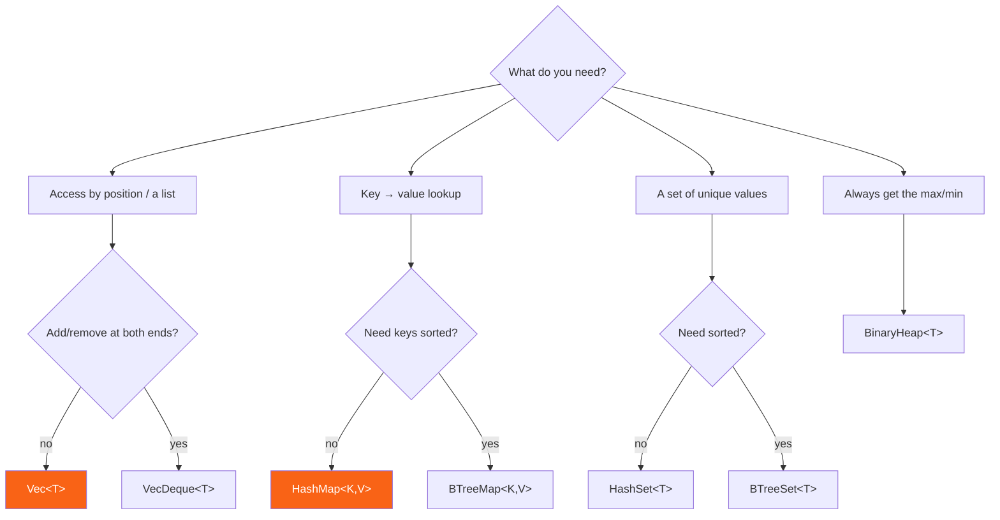

<h1><span class="h1-kicker">The Standard Library, Deep</span>std::collections Reference</h1>

The [Collections](#/ch/other-collections) chapter introduced each container. This reference is the **decision guide** — which collection to reach for, its performance and memory characteristics, and the shared vocabulary that works across all of them. When you're unsure "which one?", start here.

## The decision flowchart



## Performance at a glance (Big-O)

Knowing the cost of each operation guides your choice. `n` is the number of elements:

| Collection | Access | Insert | Remove | Search | Ordered? |
|------------|--------|--------|--------|--------|----------|
| `Vec<T>` | O(1) by index | O(1) amortized (end) | O(n) (middle), O(1) (end) | O(n) | insertion order |
| `VecDeque<T>` | O(1) by index | O(1) amortized (both ends) | O(1) (ends) | O(n) | insertion order |
| `HashMap<K,V>` | — | O(1) avg | O(1) avg | O(1) avg by key | none |
| `BTreeMap<K,V>` | — | O(log n) | O(log n) | O(log n) by key | sorted by key |
| `HashSet<T>` | — | O(1) avg | O(1) avg | O(1) avg | none |
| `BTreeSet<T>` | — | O(log n) | O(log n) | O(log n) | sorted |
| `BinaryHeap<T>` | O(1) peek max | O(log n) | O(log n) pop max | O(n) | max on top |
| `LinkedList<T>` | O(n) | O(1) at ends | O(1) at ends | O(n) | insertion order |

> [!warning] Big-O hides a constant factor that often decides the race
> `Vec::contains` is O(n) and `HashSet::contains` is O(1) — yet for twenty elements the `Vec` usually **wins**, because scanning twenty contiguous integers is a handful of cache-friendly comparisons while hashing costs a hash computation plus a random memory jump. Asymptotic complexity tells you which one wins *eventually*; measure to find out where the crossover actually is for your data. The rule of thumb: below ~32 elements, linear scans over a `Vec` are hard to beat.

## Memory cost: the handle and the heap

Every collection is a small fixed-size **handle** (what `size_of` reports, and what lives in your struct or on the stack) plus heap storage for the elements. The handles differ more than you'd expect:

<figure class="diagram">
<svg viewBox="0 0 640 250" role="img" aria-label="Bar chart of the handle size in bytes for each standard collection on a 64-bit platform">
  <style>
    .sz-l { font: 600 12px var(--font-mono); fill: var(--text); }
    .sz-n { font: 600 11px var(--font-mono); fill: var(--text-mute); }
    .sz-c { font: 11px var(--font-sans); fill: var(--text-mute); }
    .sz-b { fill: var(--rust-100); stroke: var(--rust-400); stroke-width: 1.5; }
    .sz-b2 { fill: var(--blue-soft); stroke: var(--blue); stroke-width: 1.5; }
  </style>
  <text x="20" y="18" class="sz-c">Handle size in bytes on a 64-bit target (one word = 8 bytes):</text>
  <text x="20" y="42" class="sz-l">&amp;[T] / &amp;str</text>
  <rect x="150" y="30" width="64" height="16" class="sz-b2"/><text x="222" y="43" class="sz-n">16 — ptr + len</text>
  <text x="20" y="68" class="sz-l">Box&lt;[T]&gt;</text>
  <rect x="150" y="56" width="64" height="16" class="sz-b2"/><text x="222" y="69" class="sz-n">16 — ptr + len</text>
  <text x="20" y="94" class="sz-l">Vec&lt;T&gt; / String</text>
  <rect x="150" y="82" width="96" height="16" class="sz-b"/><text x="254" y="95" class="sz-n">24 — ptr + len + cap</text>
  <text x="20" y="120" class="sz-l">BTreeMap/Set</text>
  <rect x="150" y="108" width="96" height="16" class="sz-b"/><text x="254" y="121" class="sz-n">24 — root ptr + len</text>
  <text x="20" y="146" class="sz-l">BinaryHeap&lt;T&gt;</text>
  <rect x="150" y="134" width="96" height="16" class="sz-b"/><text x="254" y="147" class="sz-n">24 — it wraps a Vec</text>
  <text x="20" y="172" class="sz-l">LinkedList&lt;T&gt;</text>
  <rect x="150" y="160" width="96" height="16" class="sz-b"/><text x="254" y="173" class="sz-n">24 — head + tail + len</text>
  <text x="20" y="198" class="sz-l">VecDeque&lt;T&gt;</text>
  <rect x="150" y="186" width="128" height="16" class="sz-b"/><text x="286" y="199" class="sz-n">32 — + head marker</text>
  <text x="20" y="224" class="sz-l">HashMap/Set</text>
  <rect x="150" y="212" width="192" height="16" class="sz-b"/><text x="350" y="225" class="sz-n">48 — table + hasher state</text>
  <text x="20" y="244" class="sz-c">Per-element overhead matters too: LinkedList pays two pointers per node; HashMap keeps spare slots.</text>
</svg>
<figcaption>The <b>handle</b> is what you store; the elements live on the heap. A <code>HashMap</code> field costs twice a <code>Vec</code> field before a single element exists.</figcaption>
</figure>

```rust
use std::collections::{BTreeMap, BinaryHeap, HashMap, HashSet, VecDeque};
use std::mem::size_of;

fn main() {
    println!("&[i32]            {} bytes", size_of::<&[i32]>());
    println!("Vec<i32>          {} bytes", size_of::<Vec<i32>>());
    println!("String            {} bytes", size_of::<String>());
    println!("BTreeMap<i32,i32> {} bytes", size_of::<BTreeMap<i32, i32>>());
    println!("BinaryHeap<i32>   {} bytes", size_of::<BinaryHeap<i32>>());
    println!("VecDeque<i32>     {} bytes", size_of::<VecDeque<i32>>());
    println!("HashMap<i32,i32>  {} bytes", size_of::<HashMap<i32, i32>>());
    println!("HashSet<i32>      {} bytes", size_of::<HashSet<i32>>());
}
```

| Collection | Handle | Per-element overhead | Notes |
|---|---|---|---|
| `Vec<T>` | 24 B | none | plus unused capacity |
| `VecDeque<T>` | 32 B | none | plus unused capacity |
| `String` | 24 B | none | bytes, not chars |
| `Box<[T]>` | 16 B | none | no spare capacity at all |
| `HashMap<K,V>` | 48 B | 1 control byte + empty slots | kept below ~87% full |
| `HashSet<T>` | 48 B | same as `HashMap<T, ()>` | it *is* a `HashMap` |
| `BTreeMap<K,V>` | 24 B | partially-filled nodes | up to 11 entries per node |
| `BinaryHeap<T>` | 24 B | none | a `Vec` with an ordering invariant |
| `LinkedList<T>` | 24 B | **2 pointers per element** | plus one allocation per node |

> [!performance] Shrink long-lived collections you'll never grow again
> A `Vec` built by pushing can end up with nearly double the capacity it needs. If it's going to live for the rest of the program — a lookup table loaded at startup, say — call `shrink_to_fit()`, or convert it with `into_boxed_slice()` to drop the capacity field entirely. On thousands of small vectors this adds up.

## Constructing collections

Several ergonomic ways to build them:

```rust
use std::collections::{BTreeMap, HashMap, HashSet};

fn main() {
    // From arrays (stable, ergonomic):
    let map = HashMap::from([("a", 1), ("b", 2)]);
    let set = HashSet::from([1, 2, 3, 3]); // duplicates collapse → 3 elements
    let sorted = BTreeMap::from([(3, "c"), (1, "a"), (2, "b")]);

    // From an iterator via collect:
    let squares: HashMap<i32, i32> = (1..=3).map(|n| (n, n * n)).collect();

    // With pre-allocated capacity (avoids reallocation):
    let mut big: Vec<i32> = Vec::with_capacity(1000);
    big.push(1);

    println!("{} {} {:?} {:?} {}", map.len(), set.len(), sorted, squares.get(&2), big.len());
}
```

| You have | You want | Call |
|---|---|---|
| an array literal | any collection | `Collection::from([…])` |
| any iterator | any collection | `.collect()` |
| two iterators | a map | `a.zip(b).collect()` |
| a known size | pre-allocated storage | `with_capacity(n)` |
| a `Vec` | a `BinaryHeap` | `BinaryHeap::from(vec)` — O(n) |
| a `Vec` with duplicates | unique values | `vec.into_iter().collect::<HashSet<_>>()` |
| a `HashMap` | sorted output | `map.into_iter().collect::<BTreeMap<_, _>>()` |
| a map | a `Vec` of pairs | `map.into_iter().collect::<Vec<_>>()` |
| a collection | a `String` | `.iter().map(…).collect::<Vec<_>>().join(", ")` |

## The universal vocabulary

Rust's collections deliberately share method names, so learning one teaches you the rest. This matrix shows what's available where:

| Method | `Vec` | `VecDeque` | `HashMap` | `BTreeMap` | `HashSet` | `BTreeSet` | `BinaryHeap` |
|---|---|---|---|---|---|---|---|
| `new()` / `with_capacity(n)` | ✅ | ✅ | ✅ | ✅ / — | ✅ | ✅ / — | ✅ |
| `len()` / `is_empty()` | ✅ | ✅ | ✅ | ✅ | ✅ | ✅ | ✅ |
| `clear()` | ✅ | ✅ | ✅ | ✅ | ✅ | ✅ | ✅ |
| `contains(&x)` / `contains_key(&k)` | ✅ | ✅ | ✅ | ✅ | ✅ | ✅ | — |
| `iter()` / `iter_mut()` | ✅ | ✅ | ✅ | ✅ | ✅ / — | ✅ / — | ✅ / — |
| `into_iter()` | ✅ | ✅ | ✅ | ✅ | ✅ | ✅ | ✅ |
| `extend(iter)` | ✅ | ✅ | ✅ | ✅ | ✅ | ✅ | ✅ |
| `retain(f)` | ✅ | ✅ | ✅ | ✅ | ✅ | ✅ | — |
| `drain(..)` | ✅ | ✅ | ✅ | — | ✅ | — | ✅ |
| `entry(k)` | — | — | ✅ | ✅ | — | — | — |
| `range(a..b)` | — | — | — | ✅ | — | ✅ | — |
| `append(&mut other)` | ✅ | ✅ | — | ✅ | — | ✅ | ✅ |
| `split_off(x)` | ✅ | ✅ | — | ✅ | — | ✅ | — |

> [!key] Sets are maps, and heaps are vectors
> `HashSet<T>` is literally implemented as `HashMap<T, ()>`, and `BinaryHeap<T>` wraps a `Vec<T>` with an ordering invariant. That's why their APIs feel familiar — and why `HashSet` has the same 48-byte handle as `HashMap`. Knowing what a collection is built *from* tells you what it will be good at.

## Iterator families

Every collection offers the same three-way choice, plus type-specific views:

| Call | Yields | The collection afterwards |
|---|---|---|
| `.iter()` / `&collection` | shared references | untouched |
| `.iter_mut()` / `&mut collection` | mutable references | elements editable |
| `.into_iter()` / `collection` | owned values | **consumed** |
| `.drain(..)` | owned values | emptied, capacity kept |
| `.keys()` / `.values()` / `.values_mut()` | one half of a map | untouched |
| `.into_keys()` / `.into_values()` | one half, owned | consumed |
| `.iter().rev()` | reverse order | untouched (needs `DoubleEndedIterator`) |
| `.iter().enumerate()` | `(index, item)` | untouched |

```rust
use std::collections::HashMap;

fn main() {
    let mut totals: HashMap<&str, i32> = HashMap::new();

    // extend adds many pairs at once:
    totals.extend([("a", 1), ("b", 2)]);

    // entry API: insert-or-update in one lookup:
    *totals.entry("a").or_insert(0) += 10;
    *totals.entry("c").or_insert(0) += 5;

    // Iterate (order is arbitrary for HashMap):
    let mut items: Vec<_> = totals.into_iter().collect();
    items.sort();
    println!("{items:?}"); // [("a", 11), ("b", 2), ("c", 5)]
}
```

## The traits that make it all work

Because collections implement common traits, a lot of code works on *all* of them:

| Trait | What it gives you | Example |
|---|---|---|
| `IntoIterator` | `for x in collection` | works on `&c`, `&mut c`, and `c` |
| `FromIterator` | `.collect()` into it | `let v: Vec<_> = iter.collect()` |
| `Extend` | `c.extend(iter)` | append many at once |
| `Default` | `Collection::default()` | struct fields, `or_default()` |
| `Index` | `c[key]` | `Vec`, `VecDeque`, `HashMap`, `BTreeMap` (panics if absent) |
| `PartialEq` / `Eq` | `a == b` | compares contents, not order for sets/maps |
| `Debug` | `{:?}` printing | every collection |
| `Clone` | deep copy | requires `T: Clone` |

Writing a function that accepts *any* of them is then a matter of taking an iterator instead of a concrete type:

```rust
use std::collections::{BTreeSet, HashSet, VecDeque};

// Accepts a Vec, an array, a HashSet, a range — anything iterable of i64.
fn total(items: impl IntoIterator<Item = i64>) -> i64 {
    items.into_iter().sum()
}

// Borrowing version: accepts &Vec, &HashSet, &BTreeSet, &VecDeque, &[i64]…
fn largest<'a>(items: impl IntoIterator<Item = &'a i64>) -> Option<&'a i64> {
    items.into_iter().max()
}

fn main() {
    let v = vec![1i64, 2, 3];
    let hs: HashSet<i64> = HashSet::from([10, 20]);
    let bs: BTreeSet<i64> = BTreeSet::from([5, 15]);
    let dq: VecDeque<i64> = VecDeque::from([7, 8]);

    println!("{}", total(v.clone()));
    println!("{}", total(1..=10));
    println!("{:?}", largest(&hs));
    println!("{:?}", largest(&bs));
    println!("{:?}", largest(&dq));
    println!("{:?}", largest(&v));
}
```

> [!best] Take `impl IntoIterator` or `&[T]`, not `&Vec<T>`
> A function that takes `&Vec<T>` can only be called with a vector. Taking `&[T]` lets callers pass a `Vec`, an array, or any slice — and it's the same machine code. For anything iterable, `impl IntoIterator<Item = T>` is broader still. This one habit makes your APIs dramatically more reusable at zero cost.

> [!tip] Learn the `Entry` API — it's the collections power tool
> `map.entry(key).or_insert_with(Vec::new).push(value)` is the idiomatic way to build a "multimap" (group values by key) in one lookup. Variants: `or_insert(v)`, `or_insert_with(f)` (lazy), `or_default()`, and `and_modify(f).or_insert(v)` (update-or-insert). Mastering `Entry` eliminates most `contains_key` + `insert` double-lookups. See [Hash Maps](#/ch/hashmaps) for the full table.

## Choosing the hasher

`HashMap` uses a DoS-resistant (but not fastest) hasher by default. For performance-critical maps with trusted keys, swap in a faster one via the third type parameter:

```rust,ignore
use std::collections::HashMap;
// With the ahash crate:
type FastMap<K, V> = HashMap<K, V, ahash::RandomState>;

let mut m: FastMap<u32, u32> = FastMap::default();
m.insert(1, 100);
```

| Hasher | Crate | Trade-off |
|---|---|---|
| SipHash-1-3 | std (default) | resists hash-flooding attacks; moderate speed |
| `ahash` | `ahash` | very fast, uses AES instructions; not attack-proof |
| `FxHasher` | `rustc-hash` | fastest for small keys; what the compiler itself uses |
| `fnv` | `fnv` | simple, good for very short keys |

> [!warning] Only swap the hasher for keys you control
> The default SipHash exists because an attacker who can choose your keys — usernames, HTTP headers, JSON fields — can craft thousands that all collide, turning your O(1) map into an O(n) list and your server into a paperweight. That's a real, exploited attack class. Use a fast hasher for internal IDs and compiler-style workloads; keep the default for anything reachable from user input.

> [!performance] Pre-size, and pick the right structure
> Two easy collection wins: (1) **`with_capacity(n)`** when you know the rough size — it avoids repeated reallocation as the collection grows; (2) choose the structure that matches your access pattern (a `HashSet` for membership tests instead of `Vec::contains`, which is O(n)). A `Vec::contains` in a hot loop over a large list is a common, avoidable O(n²) trap — a `HashSet` makes it O(n).

## Summary

- Use the **decision flowchart**: list → `Vec` (or `VecDeque` for both ends); key→value → `HashMap` (or `BTreeMap` for sorted); uniqueness → `HashSet`/`BTreeSet`; priority → `BinaryHeap`.
- Know the **Big-O** — but remember the constant factor: below ~32 elements a `Vec` scan usually beats a hash lookup.
- Know the **memory cost** too: a `HashMap` handle is 48 bytes to a `Vec`'s 24, and a `LinkedList` pays two pointers per element.
- Collections share a **universal vocabulary** (`len`, `iter`, `extend`, `retain`, `drain`, `contains`) plus specialities (`entry` for maps, `range` for B-trees).
- Build with `from([...])`, `.collect()`, or `with_capacity`; convert between collections with a single `.collect()`.
- Accept **`&[T]`** or **`impl IntoIterator`** in function signatures rather than `&Vec<T>`.
- **Default to `Vec` and `HashMap`**; specialize only for a concrete need, and only swap the hasher for keys attackers can't choose.

> [!exercise] Try it yourself
> 1. Build a "multimap" `HashMap<char, Vec<&str>>` grouping words by first letter, using `entry().or_default().push()`.
> 2. Given a `Vec<i32>` with duplicates, produce the sorted unique values using a `BTreeSet` — in one chained expression.
> 3. Write `fn count_items(items: impl IntoIterator<Item = String>) -> usize` and call it with a `Vec`, a `HashSet`, and a `BTreeSet` without changing the signature.
> 4. Print `size_of` for `Vec<u8>`, `HashMap<u8, u8>`, and `Box<[u8]>`. Explain why storing a thousand empty `HashMap`s costs far more than a thousand empty `Vec`s.
> 5. Benchmark (with `Instant`) 10,000 membership tests against a `Vec` and a `HashSet`, at sizes 8, 64, and 4,096. Where is the crossover?

Next: a deeper reference on Rust's text types — **`String`, `str`, and friends**.
