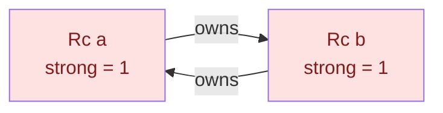

<h1><span class="h1-kicker">Smart Pointers</span>Weak & Breaking Reference Cycles</h1>

`Rc` is wonderful — until two `Rc`s point at *each other*. Then neither's count can ever reach zero, the data is never freed, and you have a **memory leak** even in safe Rust. This chapter shows how reference cycles happen and how **`Weak<T>`** — a non-owning reference — breaks them. It's the last piece of the smart-pointer puzzle, and the key to building trees and graphs correctly.

## The one hole in reference counting

Reference counting has a single, well-known weakness, and it's worth seeing it actually happen rather than taking it on faith. The program below builds two nodes that point at each other, then lets them fall out of scope. Their `Drop` impls print — and never run:

```rust
use std::cell::RefCell;
use std::rc::Rc;

struct Node {
    name: &'static str,
    other: RefCell<Option<Rc<Node>>>,
}

impl Drop for Node {
    fn drop(&mut self) {
        println!("  dropped {}", self.name);
    }
}

fn main() {
    println!("no cycle — both nodes drop normally:");
    {
        let _a = Rc::new(Node { name: "a (no cycle)", other: RefCell::new(None) });
        let _b = Rc::new(Node { name: "b (no cycle)", other: RefCell::new(None) });
    }

    println!("\nwith a cycle — watch for drop messages:");
    {
        let x = Rc::new(Node { name: "x", other: RefCell::new(None) });
        let y = Rc::new(Node { name: "y", other: RefCell::new(None) });

        // Each node now owns the other.
        *x.other.borrow_mut() = Some(Rc::clone(&y));
        *y.other.borrow_mut() = Some(Rc::clone(&x));

        println!("  inside the scope: x strong = {}, y strong = {}",
            Rc::strong_count(&x), Rc::strong_count(&y));
    } // x and y go out of scope here

    println!("  …scope ended, and nothing was dropped.");
    println!("\nThose two nodes are leaked for the rest of the program.");
}
```

Run it. The first block prints two drop messages; the second prints **none**. Both nodes' strong counts went from 2 down to 1 — never to 0 — because each is still held by the other.

> [!warning] Safe Rust prevents crashes, not leaks
> Rust guarantees memory *safety* (no use-after-free, no data races) — but a **memory leak is considered "safe"** (it doesn't corrupt anything), so the borrow checker won't stop you from creating a cycle. Leaks are a logic bug you must design around. `Weak` is how you do it.

## How a cycle leaks memory

Recall that an [`Rc`](#/ch/rc-arc) frees its data only when the strong count hits zero. Now imagine node `a` owns node `b`, and node `b` owns node `a`:



Even after your variables `a` and `b` go out of scope, each node is still kept alive by the *other* one. Both counts stay at 1 forever. Nothing frees them — the memory leaks for the rest of the program.

<figure class="diagram">
<svg viewBox="0 0 640 245" role="img" aria-label="With two strong links the counts stall at one when the outer variables are dropped, while replacing one link with a weak reference lets both counts reach zero">
  <style>
    .cy-h { font: 700 12px var(--font-sans); }
    .cy-m { font: 600 10.5px var(--font-mono); fill: var(--text); }
    .cy-c { font: 10.5px var(--font-sans); fill: var(--text-mute); }
    .cy-bad { fill: var(--red-soft); stroke: var(--red); stroke-width: 1.6; }
    .cy-ok { fill: var(--green-soft); stroke: var(--green); stroke-width: 1.6; }
    .cy-n { fill: var(--surface-2); stroke: var(--border-strong); stroke-width: 1.4; }
  </style>
  <text x="20" y="18" class="cy-h" fill="var(--red)">Two strong links — leaks</text>
  <rect x="20" y="28" width="100" height="40" rx="4" class="cy-bad"/>
  <text x="30" y="45" class="cy-m">x</text><text x="30" y="60" class="cy-c">strong 2→1</text>
  <rect x="190" y="28" width="100" height="40" rx="4" class="cy-bad"/>
  <text x="200" y="45" class="cy-m">y</text><text x="200" y="60" class="cy-c">strong 2→1</text>
  <path d="M122 40 L188 40" stroke="var(--red)" stroke-width="2.2" marker-end="url(#arr-cy)"/>
  <path d="M188 58 L122 58" stroke="var(--red)" stroke-width="2.2" marker-end="url(#arr-cy)"/>
  <text x="128" y="34" class="cy-c">Rc</text>
  <text x="128" y="76" class="cy-c">Rc</text>
  <text x="310" y="38" class="cy-c">Neither reaches 0.</text>
  <text x="310" y="54" class="cy-c">Drop never runs.</text>
  <text x="310" y="70" class="cy-c">Memory leaked. 💥</text>
  <text x="20" y="112" class="cy-h" fill="var(--green)">One link downgraded to Weak — frees correctly</text>
  <rect x="20" y="122" width="100" height="40" rx="4" class="cy-ok"/>
  <text x="30" y="139" class="cy-m">parent</text><text x="30" y="154" class="cy-c">strong 1→0 ✅</text>
  <rect x="190" y="122" width="100" height="40" rx="4" class="cy-ok"/>
  <text x="200" y="139" class="cy-m">child</text><text x="200" y="154" class="cy-c">strong 2→0 ✅</text>
  <path d="M122 134 L188 134" stroke="var(--green)" stroke-width="2.2" marker-end="url(#arr-cy2)"/>
  <path d="M188 152 L122 152" stroke="var(--text-mute)" stroke-width="1.8" stroke-dasharray="5 3" marker-end="url(#arr-cy3)"/>
  <text x="126" y="128" class="cy-c">Rc (owns)</text>
  <text x="122" y="172" class="cy-c">Weak (observes)</text>
  <text x="310" y="132" class="cy-c">Ownership forms a TREE,</text>
  <text x="310" y="148" class="cy-c">so the counts can unwind.</text>
  <text x="20" y="204" class="cy-h">The rule that follows</text>
  <text x="20" y="222" class="cy-c">Strong links must form an <tspan font-weight="700">acyclic</tspan> graph — a tree or a DAG. Every link that closes a loop</text>
  <text x="20" y="238" class="cy-c">(a back-pointer, an observer, a cache's owner) must be <tspan font-family="var(--font-mono)">Weak</tspan>.</text>
  <defs>
    <marker id="arr-cy" markerWidth="9" markerHeight="9" refX="7" refY="3" orient="auto"><path d="M0,0 L7,3 L0,6 Z" fill="var(--red)"/></marker>
    <marker id="arr-cy2" markerWidth="9" markerHeight="9" refX="7" refY="3" orient="auto"><path d="M0,0 L7,3 L0,6 Z" fill="var(--green)"/></marker>
    <marker id="arr-cy3" markerWidth="9" markerHeight="9" refX="7" refY="3" orient="auto"><path d="M0,0 L7,3 L0,6 Z" fill="var(--text-mute)"/></marker>
  </defs>
</svg>
<figcaption>A cycle of strong references props itself up above zero forever. Downgrading <b>one direction</b> to <code>Weak</code> lets the counts unwind.</figcaption>
</figure>

## `Weak<T>`: a reference that doesn't own

A **`Weak<T>`** is like an `Rc<T>`, but it does **not** count toward keeping the data alive. It's a non-owning "I'd like to look at this if it still exists" reference. The rules:

- Create one from an `Rc` with **`Rc::downgrade(&rc)`** — this bumps the *weak* count, not the strong count.
- Because the data might have been freed, you can't use a `Weak` directly. Call **`.upgrade()`**, which returns an **`Option<Rc<T>>`**: `Some` if the data still lives, `None` if it's gone.

<figure class="diagram">
<svg viewBox="0 0 640 150" role="img" aria-label="A strong Rc keeps data alive; a Weak reference points to it without owning it">
  <style>
    .wm2 { font: 600 12px var(--font-mono); fill: var(--text); }
    .wc2 { font: 11px var(--font-sans); fill: var(--text-mute); }
    .strong { fill: var(--rust-100); stroke: var(--rust-400); stroke-width: 2; }
    .weak { fill: var(--surface-2); stroke: var(--border-strong); stroke-width: 1.5; stroke-dasharray: 5 3; }
    .node { fill: var(--blue-soft); stroke: var(--blue); stroke-width: 1.5; }
  </style>
  <rect x="20" y="50" width="150" height="40" class="strong"/><text x="34" y="75" class="wm2">Rc (strong)</text>
  <rect x="470" y="50" width="150" height="40" class="weak"/><text x="484" y="75" class="wm2">Weak</text>
  <rect x="250" y="48" width="140" height="46" class="node"/><text x="264" y="68" class="wm2">the data</text><text x="264" y="86" class="wc2">strong=1 weak=1</text>
  <path d="M172 70 L248 70" stroke="var(--rust-500)" stroke-width="2.5" marker-end="url(#awk)"/>
  <text x="180" y="40" class="wc2">keeps alive ✅</text>
  <path d="M468 70 L392 70" stroke="var(--text-mute)" stroke-width="2" stroke-dasharray="5 3" marker-end="url(#awk2)"/>
  <text x="410" y="40" class="wc2">does NOT keep alive</text>
  <defs>
    <marker id="awk" markerWidth="9" markerHeight="9" refX="7" refY="3" orient="auto"><path d="M0,0 L7,3 L0,6 Z" fill="var(--rust-500)"/></marker>
    <marker id="awk2" markerWidth="9" markerHeight="9" refX="7" refY="3" orient="auto"><path d="M0,0 L7,3 L0,6 Z" fill="var(--text-mute)"/></marker>
  </defs>
</svg>
<figcaption>A <b>strong</b> <code>Rc</code> keeps data alive; a <b>Weak</b> only observes it — so it can't create a keep-alive cycle.</figcaption>
</figure>

### How to create one

| To get | Use | Notes |
|---|---|---|
| a `Weak` from an existing `Rc` | `Rc::downgrade(&rc)` | the usual route; bumps the weak count |
| an empty `Weak` placeholder | `Weak::new()` | upgrades to `None` forever; needs no `Rc` |
| a `Weak` inside the value it points to | `Rc::new_cyclic(\|weak\| …)` | for self-referential construction |
| an `Rc` back from a `Weak` | `weak.upgrade()` | `Option<Rc<T>>` — **always check it** |
| the same, across threads | `Arc::downgrade` / `upgrade` | identical API |

`Weak::new()` is the one people miss. It gives you a valid, permanently-dangling `Weak` with no `Rc` behind it — exactly what you need for a "no parent yet" field, which is how the tree example below initializes:

```rust
use std::rc::{Rc, Weak};

fn main() {
    // An empty Weak needs no Rc at all. It simply never upgrades.
    let nothing: Weak<i32> = Weak::new();
    println!("empty upgrade:      {:?}", nothing.upgrade());
    println!("empty strong_count: {}", nothing.strong_count());

    // The normal lifecycle: downgrade, observe, then watch it expire.
    let owner = Rc::new(String::from("the data"));
    let observer = Rc::downgrade(&owner);

    println!("\nwhile the Rc lives:");
    println!("  strong = {}, weak = {}", Rc::strong_count(&owner), Rc::weak_count(&owner));
    println!("  upgrade = {:?}", observer.upgrade());

    drop(owner); // the last strong reference goes away

    println!("\nafter the Rc is dropped:");
    println!("  upgrade = {:?}", observer.upgrade()); // None — safely, not a dangling pointer
    println!("  strong_count via weak = {}", observer.strong_count());

    // Two Weaks to the same allocation can be compared by identity.
    let a = Rc::new(1);
    let w1 = Rc::downgrade(&a);
    let w2 = Rc::downgrade(&a);
    println!("\nsame target? {}", w1.ptr_eq(&w2));
}
```

> [!key] `upgrade()` is what makes `Weak` safe rather than dangling
> A `Weak` is conceptually a pointer that may point at freed data — which in C would be a use-after-free waiting to happen. Rust makes that impossible by refusing to let you touch the value directly. The **only** way in is `upgrade()`, which checks the strong count and hands back `None` if the data is gone. So a stale `Weak` can cause a logic bug ("the parent vanished") but never memory unsafety. Every `upgrade()` therefore forces you to decide what to do when the target has died.

## The classic fix: parent ↔ child trees

The textbook cycle is a tree where children know their parent and parents know their children. If *both* links were strong `Rc`s, parent and child would keep each other alive forever. The rule that breaks it:

> [!key] Own downward, observe upward
> In a tree, let the **parent own its children with `Rc`** (strong — children should live as long as the parent references them), but let each **child point to its parent with `Weak`** (non-owning — a child shouldn't keep its parent alive). Ownership flows *down* the tree; the *up* link is a weak observer. No cycle, no leak.

```rust
use std::rc::{Rc, Weak};
use std::cell::RefCell;

#[derive(Debug)]
struct Node {
    value: i32,
    parent: RefCell<Weak<Node>>,      // Weak: does NOT keep the parent alive
    children: RefCell<Vec<Rc<Node>>>, // Rc: parent owns its children
}

fn main() {
    let leaf = Rc::new(Node {
        value: 3,
        parent: RefCell::new(Weak::new()), // no parent yet
        children: RefCell::new(vec![]),
    });

    let branch = Rc::new(Node {
        value: 5,
        parent: RefCell::new(Weak::new()),
        children: RefCell::new(vec![Rc::clone(&leaf)]), // branch owns leaf
    });

    // Point leaf's parent at branch — but WEAKLY, so no cycle forms:
    *leaf.parent.borrow_mut() = Rc::downgrade(&branch);

    // upgrade() gives Some(Rc) while the parent lives:
    let parent_value = leaf.parent.borrow().upgrade().map(|n| n.value);
    println!("leaf's parent value = {parent_value:?}"); // Some(5)

    // Counts show the design is sound:
    println!("branch: strong = {}, weak = {}",
        Rc::strong_count(&branch), Rc::weak_count(&branch)); // strong=1, weak=1
    println!("leaf:   strong = {}, weak = {}",
        Rc::strong_count(&leaf), Rc::weak_count(&leaf));     // strong=2, weak=0
}
```

Because the parent link is `Weak`, `branch`'s strong count is 1 (not 2). When `branch` goes out of scope, its count hits zero and it's freed — no leak. And `leaf` can still safely ask "who's my parent?" via `upgrade()`.

### Building a self-reference with `Rc::new_cyclic`

The example above needed a two-step dance: construct the node with an empty `Weak`, then patch the parent link afterwards — which is why `parent` had to be a `RefCell`. When a value needs a `Weak` to *itself*, `Rc::new_cyclic` does it in one step, with no `RefCell` required:

```rust
use std::rc::{Rc, Weak};

struct Node {
    value: i32,
    // A plain Weak — no RefCell needed, because it's set at construction.
    myself: Weak<Node>,
}

impl Node {
    fn new(value: i32) -> Rc<Node> {
        // The closure receives a Weak to the allocation being created,
        // before the value itself exists.
        Rc::new_cyclic(|me| Node { value, myself: me.clone() })
    }

    /// A method that returns a new owning handle to self — impossible
    /// without a stored Weak, because `&self` can't produce an `Rc<Self>`.
    fn share(&self) -> Option<Rc<Node>> {
        self.myself.upgrade()
    }
}

fn main() {
    let node = Node::new(42);
    println!("value = {}", node.value);

    let another_handle = node.share().expect("we're still alive");
    println!("shared handle value = {}", another_handle.value);
    println!("strong = {}, weak = {}",
        Rc::strong_count(&node), Rc::weak_count(&node));

    // Because the self-link is Weak, this still frees correctly.
    println!("same allocation? {}", Rc::ptr_eq(&node, &another_handle));
}
```

> [!tip] `new_cyclic` solves "how do I get an `Rc<Self>` from `&self`?"
> This question comes up constantly — a node that must hand out owning handles to itself, an observer that registers itself with a subject, a task that reschedules itself. You can't produce an `Rc<Self>` from a `&self`, because a reference carries no ownership information. Storing a `Weak<Self>` at construction time via `Rc::new_cyclic` is the standard answer, and `upgrade()` then gives you a fresh `Rc` whenever you need one. It's also strictly better than the patch-it-afterwards approach, because the field can be a plain `Weak` rather than a `RefCell<Weak<_>>`.

## The full `Weak` API

`Weak` is deliberately minimal — there's very little you can do without upgrading first:

| Method | Returns | Notes |
|---|---|---|
| `Rc::downgrade(&rc)` | `Weak<T>` | create from a strong reference |
| `Weak::new()` | `Weak<T>` | an empty placeholder; upgrades to `None` |
| `weak.upgrade()` | `Option<Rc<T>>` | **the only way to reach the value** |
| `weak.strong_count()` | `usize` | 0 if the value is gone |
| `weak.weak_count()` | `usize` | how many `Weak`s exist |
| `weak.ptr_eq(&other)` | `bool` | do both point at the same allocation? |
| `weak.clone()` | `Weak<T>` | cheap; bumps only the weak count |
| `Arc::downgrade` / same methods | — | identical, thread-safe |

## Reading the counts

`Rc` tracks two numbers, and understanding them makes cycles obvious:

- **`Rc::strong_count`** — how many owners keep the data alive. Data is freed when this reaches **0**.
- **`Rc::weak_count`** — how many `Weak` references exist. This does **not** prevent freeing.

A cycle is exactly the situation where two strong counts prop each other up above zero forever. Replace one direction of the cycle with `Weak`, and the counts can finally fall to zero.

| Event | strong | weak | What happens |
|---|---|---|---|
| `Rc::new(v)` | 1 | 0 | allocate; `v` lives |
| `Rc::clone(&rc)` | +1 | — | another owner |
| `Rc::downgrade(&rc)` | — | +1 | an observer; lifetime unaffected |
| an `Rc` drops | −1 | — | — |
| **strong reaches 0** | 0 | n | **the `T` is dropped**; the allocation survives |
| a `Weak` drops | — | −1 | — |
| **both reach 0** | 0 | 0 | the allocation is finally freed |

> [!deep] Why the allocation outlives the value
> When the last `Rc` drops, `T`'s destructor runs immediately — but the *allocation* can't be freed yet, because the surviving `Weak`s still point at it and need somewhere to read the counts from. So the memory stays (with the value's slot logically empty) until the last `Weak` also disappears. That's why `Weak` isn't entirely free: a single lingering `Weak` to a 10 MB value keeps 10 MB of address space reserved even though the data itself is gone. It's rarely a problem, but if you cache `Weak` handles you should prune the dead ones rather than accumulating them forever.

> [!best] Any back-reference or observer should be `Weak`
> The pattern generalizes far beyond trees. Whenever a data structure has a "back-link" or an "observer" that shouldn't control the target's lifetime — a child→parent link, a cache entry→owner, an event listener→subject, a doubly-linked list's backward pointers — make it a **`Weak`**. Ownership (strong `Rc`) should form a *tree* or *DAG* (no cycles); everything else observes with `Weak`.

| Relationship | Direction | Use |
|---|---|---|
| parent → child | downward | `Rc` (owns) |
| child → parent | upward | **`Weak`** |
| a node → its siblings | sideways | **`Weak`** |
| a subject → its observers | outward | **`Weak`** (or the observers leak) |
| a cache → its entries | downward | `Rc` |
| an entry → the cache it lives in | upward | **`Weak`** |
| a doubly-linked list's `next` | forward | `Rc` |
| a doubly-linked list's `prev` | backward | **`Weak`** |
| a value → itself | self | **`Weak`**, via `Rc::new_cyclic` |

> [!note] Not sure if you have a cycle?
> If a program's memory grows and never shrinks even as things "go out of scope," suspect an `Rc` cycle. Print `Rc::strong_count` at key points: a count that never returns to what you expect is the tell-tale sign. Adding a `Drop` impl that prints is even more direct — as the first example in this chapter shows, a missing drop message *is* the leak. For a systematic check, `cargo +nightly miri test` reports leaked allocations at the end of a run.

## When to avoid `Rc`/`Weak` entirely

Before you build a graph out of `Rc<RefCell<Node>>` and `Weak` back-links, consider that Rust has a much simpler idiom for exactly this shape:

```rust
/// An arena: nodes live in a Vec, and links are plain indices.
/// No Rc, no RefCell, no Weak, no cycles to leak.
struct Tree {
    nodes: Vec<Node>,
}

struct Node {
    value: i32,
    parent: Option<usize>, // just an index — a "weak reference" for free
    children: Vec<usize>,
}

impl Tree {
    fn new() -> Self {
        Tree { nodes: Vec::new() }
    }

    fn add(&mut self, value: i32, parent: Option<usize>) -> usize {
        let id = self.nodes.len();
        self.nodes.push(Node { value, parent, children: Vec::new() });
        if let Some(p) = parent {
            self.nodes[p].children.push(id);
        }
        id
    }

    /// Walking up is trivial — and can't leak, because nothing owns anything.
    fn path_to_root(&self, mut id: usize) -> Vec<i32> {
        let mut path = vec![self.nodes[id].value];
        while let Some(p) = self.nodes[id].parent {
            path.push(self.nodes[p].value);
            id = p;
        }
        path
    }
}

fn main() {
    let mut tree = Tree::new();
    let root = tree.add(1, None);
    let branch = tree.add(5, Some(root));
    let leaf = tree.add(3, Some(branch));

    println!("children of root: {:?}", tree.nodes[root].children);
    println!("leaf → root path: {:?}", tree.path_to_root(leaf));
    println!("total nodes: {}", tree.nodes.len());
    // Dropping `tree` frees everything at once. No counts, no cycles.
}
```

> [!best] Reach for an index arena before `Rc<RefCell<Node>>`
> The arena version has no reference counts, no runtime borrow checks, no `Weak`, and no possible cycle leak — and every node sits contiguously in memory, so traversals are far more cache-friendly. The trade-off is that an index can become logically stale (pointing at a slot you've since reused), which `Weak` would have caught; the usual answer is to tombstone rather than remove entries. Essentially every serious Rust graph library — `petgraph`, and the compiler's own data structures — works this way. Use `Rc`/`Weak` when nodes genuinely have independent lifetimes; use an arena when they live and die together. See [Designing Your Own Data Structures](#/ch/dsa-design) and [Anti-Patterns](#/ch/anti-patterns).

## Summary

- Two `Rc`s that reference each other form a **cycle**: their strong counts never reach zero, so the data **leaks** (and Rust considers leaks "safe," so it won't stop you). A missing `Drop` message is the proof.
- **`Weak<T>`** is a **non-owning** reference: create it with **`Rc::downgrade`** or **`Weak::new()`**, and access the data with **`.upgrade()`**, which returns `Option<Rc<T>>` (`None` if the data is gone).
- `upgrade()` is what makes `Weak` **safe rather than dangling** — a stale `Weak` is a logic problem, never memory unsafety.
- The canonical fix for trees: **parent owns children with `Rc`, child points to parent with `Weak`** — own downward, observe upward. Strong links must form a tree or DAG.
- **`Rc::new_cyclic`** builds a value holding a `Weak` to itself — the answer to "how do I get an `Rc<Self>` from `&self`?"
- **`strong_count`** decides when the **value** is dropped; the **allocation** survives until `weak_count` also reaches zero.
- Make any back-reference, sibling link, or observer a **`Weak`** so ownership stays acyclic.
- For graphs and trees, consider an **index arena** (`Vec<Node>` + `usize` links) instead — no counts, no cycles, better locality.

> [!exercise] Try it yourself
> 1. Run the first example and confirm the cycle prints no drop messages. Then change one `Rc` to a `Weak` and watch both nodes drop.
> 2. Build the `leaf`/`branch` example, then add a second leaf to `branch` and print all the counts.
> 3. Call `.upgrade()` on a `Weak` whose `Rc` has been dropped and confirm you get `None`. Then check `strong_count()` on that same `Weak`.
> 4. Use `Rc::new_cyclic` to make a type whose method returns an `Rc<Self>`. Why can't you write that method with a plain `&self`?
> 5. Print `size_of::<Weak<i32>>()` and `size_of::<Option<Weak<i32>>>()`. Explain why they're the same.
> 6. Rewrite the parent/child tree as an index arena and compare the two implementations. Which would you rather debug?

You now understand every smart pointer Rust ships — heap allocation, shared ownership, interior mutability, and non-owning links. One thing remains: putting the pieces together to **build a smart pointer of your own**.
