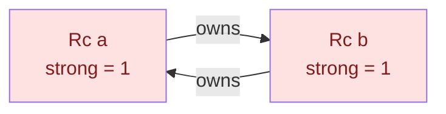

<h1><span class="h1-kicker">Smart Pointers</span>Weak & Breaking Reference Cycles</h1>

`Rc` is wonderful — until two `Rc`s point at *each other*. Then neither's count can ever reach zero, the data is never freed, and you have a **memory leak** even in safe Rust. This chapter shows how reference cycles happen and how **`Weak<T>`** — a non-owning reference — breaks them. It's the last piece of the smart-pointer puzzle, and the key to building trees and graphs correctly.

## How a cycle leaks memory

Recall that an [`Rc`](#/ch/rc-arc) frees its data only when the strong count hits zero. Now imagine node `a` owns node `b`, and node `b` owns node `a`:



Even after your variables `a` and `b` go out of scope, each node is still kept alive by the *other* one. Both counts stay at 1 forever. Nothing frees them — the memory leaks for the rest of the program.

> [!warning] Safe Rust prevents crashes, not leaks
> Rust guarantees memory *safety* (no use-after-free, no data races) — but a **memory leak is considered "safe"** (it doesn't corrupt anything), so the borrow checker won't stop you from creating a cycle. Leaks are a logic bug you must design around. `Weak` is how you do it.

## `Weak<T>`: a reference that doesn't own

A **`Weak<T>`** is like an `Rc<T>`, but it does **not** count toward keeping the data alive. It's a non-owning "I'd like to look at this if it still exists" reference. The rules:

- Create one from an `Rc` with **`Rc::downgrade(&rc)`** — this bumps the *weak* count, not the strong count.
- Because the data might have been freed, you can't use a `Weak` directly. Call **`.upgrade()`**, which returns an **`Option<Rc<T>>`**: `Some` if the data still lives, `None` if it's gone.

<figure class="diagram">
<svg viewBox="0 0 640 150" role="img" aria-label="A strong Rc keeps data alive; a Weak reference points to it without owning it">
  <style>
    .wm2 { font: 600 12px var(--font-mono); fill: var(--text); }
    .wc2 { font: 11px var(--font-sans); fill: var(--text-mute); }
    .strong { fill: var(--rust-100); stroke: var(--rust-400); stroke-width: 2; }
    .weak { fill: var(--surface-2); stroke: var(--border-strong); stroke-width: 1.5; stroke-dasharray: 5 3; }
    .node { fill: var(--blue-soft); stroke: var(--blue); stroke-width: 1.5; }
  </style>
  <rect x="20" y="50" width="150" height="40" class="strong"/><text x="34" y="75" class="wm2">Rc (strong)</text>
  <rect x="470" y="50" width="150" height="40" class="weak"/><text x="484" y="75" class="wm2">Weak</text>
  <rect x="250" y="48" width="140" height="46" class="node"/><text x="264" y="68" class="wm2">the data</text><text x="264" y="86" class="wc2">strong=1 weak=1</text>
  <path d="M172 70 L248 70" stroke="var(--rust-500)" stroke-width="2.5" marker-end="url(#awk)"/>
  <text x="180" y="40" class="wc2">keeps alive ✅</text>
  <path d="M468 70 L392 70" stroke="var(--text-mute)" stroke-width="2" stroke-dasharray="5 3" marker-end="url(#awk2)"/>
  <text x="410" y="40" class="wc2">does NOT keep alive</text>
  <defs>
    <marker id="awk" markerWidth="9" markerHeight="9" refX="7" refY="3" orient="auto"><path d="M0,0 L7,3 L0,6 Z" fill="var(--rust-500)"/></marker>
    <marker id="awk2" markerWidth="9" markerHeight="9" refX="7" refY="3" orient="auto"><path d="M0,0 L7,3 L0,6 Z" fill="var(--text-mute)"/></marker>
  </defs>
</svg>
<figcaption>A <b>strong</b> <code>Rc</code> keeps data alive; a <b>Weak</b> only observes it — so it can't create a keep-alive cycle.</figcaption>
</figure>

## The classic fix: parent ↔ child trees

The textbook cycle is a tree where children know their parent and parents know their children. If *both* links were strong `Rc`s, parent and child would keep each other alive forever. The rule that breaks it:

> [!key] Own downward, observe upward
> In a tree, let the **parent own its children with `Rc`** (strong — children should live as long as the parent references them), but let each **child point to its parent with `Weak`** (non-owning — a child shouldn't keep its parent alive). Ownership flows *down* the tree; the *up* link is a weak observer. No cycle, no leak.

```rust
use std::rc::{Rc, Weak};
use std::cell::RefCell;

#[derive(Debug)]
struct Node {
    value: i32,
    parent: RefCell<Weak<Node>>,      // Weak: does NOT keep the parent alive
    children: RefCell<Vec<Rc<Node>>>, // Rc: parent owns its children
}

fn main() {
    let leaf = Rc::new(Node {
        value: 3,
        parent: RefCell::new(Weak::new()), // no parent yet
        children: RefCell::new(vec![]),
    });

    let branch = Rc::new(Node {
        value: 5,
        parent: RefCell::new(Weak::new()),
        children: RefCell::new(vec![Rc::clone(&leaf)]), // branch owns leaf
    });

    // Point leaf's parent at branch — but WEAKLY, so no cycle forms:
    *leaf.parent.borrow_mut() = Rc::downgrade(&branch);

    // upgrade() gives Some(Rc) while the parent lives:
    let parent_value = leaf.parent.borrow().upgrade().map(|n| n.value);
    println!("leaf's parent value = {parent_value:?}"); // Some(5)

    // Counts show the design is sound:
    println!("branch: strong = {}, weak = {}",
        Rc::strong_count(&branch), Rc::weak_count(&branch)); // strong=1, weak=1
    println!("leaf:   strong = {}, weak = {}",
        Rc::strong_count(&leaf), Rc::weak_count(&leaf));     // strong=2, weak=0
}
```

Because the parent link is `Weak`, `branch`'s strong count is 1 (not 2). When `branch` goes out of scope, its count hits zero and it's freed — no leak. And `leaf` can still safely ask "who's my parent?" via `upgrade()`.

## Reading the counts

`Rc` tracks two numbers, and understanding them makes cycles obvious:

- **`Rc::strong_count`** — how many owners keep the data alive. Data is freed when this reaches **0**.
- **`Rc::weak_count`** — how many `Weak` references exist. This does **not** prevent freeing.

A cycle is exactly the situation where two strong counts prop each other up above zero forever. Replace one direction of the cycle with `Weak`, and the counts can finally fall to zero.

> [!best] Any back-reference or observer should be `Weak`
> The pattern generalizes far beyond trees. Whenever a data structure has a "back-link" or an "observer" that shouldn't control the target's lifetime — a child→parent link, a cache entry→owner, an event listener→subject, a doubly-linked list's backward pointers — make it a **`Weak`**. Ownership (strong `Rc`) should form a *tree* or *DAG* (no cycles); everything else observes with `Weak`.

> [!note] Not sure if you have a cycle?
> If a program's memory grows and never shrinks even as things "go out of scope," suspect an `Rc` cycle. Print `Rc::strong_count` at key points: a count that never returns to what you expect is the tell-tale sign. The fix is almost always "turn one link into a `Weak`."

## Summary

- Two `Rc`s that reference each other form a **cycle**: their strong counts never reach zero, so the data **leaks** (and Rust considers leaks "safe," so it won't stop you).
- **`Weak<T>`** is a **non-owning** reference: create it with **`Rc::downgrade`**, and access the data with **`.upgrade()`**, which returns `Option<Rc<T>>` (`None` if the data is gone).
- The canonical fix for trees: **parent owns children with `Rc`, child points to parent with `Weak`** — own downward, observe upward.
- **`strong_count`** decides lifetime (freed at 0); **`weak_count`** does not keep data alive.
- Make any back-reference or observer link a **`Weak`** so ownership stays acyclic.

> [!exercise] Try it yourself
> 1. Build the `leaf`/`branch` example, then add a second leaf to `branch` and print all the counts.
> 2. Call `.upgrade()` on a `Weak` whose `Rc` has been dropped and confirm you get `None`.
> 3. Deliberately make the parent link an `Rc` instead of `Weak`, add prints in a `Drop` impl, and observe that the nodes are *never* dropped (the leak). Then switch it back to `Weak` and watch them drop.

That completes smart pointers — you now understand every tool Rust gives you for heap allocation, shared ownership, and interior mutability. Next, we put multiple threads to work safely: **fearless concurrency**.
