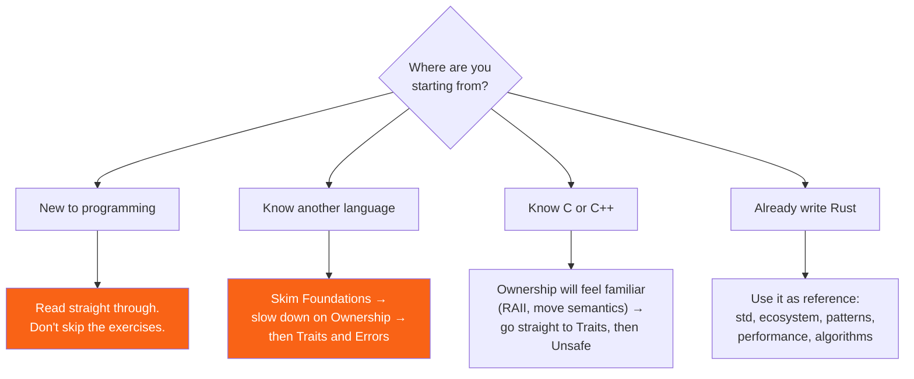

<h1><span class="h1-kicker">Getting Started</span>Welcome & How to Use This Book</h1>

Welcome! 🦀 You're about to learn **Rust** — a programming language that gives you the raw speed of C and C++ *together with* a guarantee that entire categories of bugs simply cannot happen. Rust has been voted the most-loved programming language for years running, and it now powers Windows, Linux, Android, Firefox, Discord, Dropbox, Cloudflare, and huge parts of the cloud.

This book is designed to take you **all the way** — from your very first `println!` to writing async network servers, `unsafe` code, and your own procedural macros — without ever losing you along the way.

> [!key] Who this book is for
> **Complete beginners** can read straight through from the top. **Working programmers** new to Rust can skim the fundamentals and dive into ownership, traits, and async. **Experienced Rustaceans** will find the standard-library and algorithms sections a handy reference. There's a path for you no matter where you're starting.

## What makes this book different

- **🎨 Visual.** Concepts like ownership, borrowing, lifetimes, and async are shown with colorful diagrams — not just described in words. If you can *see* it, you can understand it.
- **▶️ Runnable.** Nearly every code example has a **Run** button. It compiles and executes your code live using the official Rust compiler — no installation needed to follow along. Click **Edit** to change any example and run your own version.
- **📖 Plain English.** We keep the language friendly and explain every piece of jargon (technical vocabulary) *the moment* it appears, right there in parentheses.
- **💡 Tips everywhere.** Throughout the book you'll find colored boxes with tips, warnings, common mistakes, and deep dives — the kind of hard-won advice you'd get from a mentor sitting beside you.

## The journey ahead

Rust has a reputation for being hard. It isn't, really — but it *is* front-loaded. There's one genuinely new idea (ownership), and once it clicks the rest of the language follows naturally. Here's the shape of the climb:

<figure class="diagram">
<svg viewBox="0 0 640 260" role="img" aria-label="A staircase showing the progression from foundations through ownership, everyday Rust, systems programming and production, with ownership marked as the key step">
  <style>
    .wl-h { font: 700 12px var(--font-sans); fill: var(--text); }
    .wl-m { font: 600 11px var(--font-mono); fill: var(--text); }
    .wl-c { font: 10.5px var(--font-sans); fill: var(--text-mute); }
    .wl-step { fill: var(--surface-2); stroke: var(--border-strong); stroke-width: 1.5; }
    .wl-key { fill: var(--rust-100); stroke: var(--rust-500); stroke-width: 2.5; }
    .wl-done { fill: var(--green-soft); stroke: var(--green); stroke-width: 1.8; }
  </style>
  <rect x="20" y="196" width="112" height="44" rx="4" class="wl-done"/>
  <text x="30" y="216" class="wl-h">1 · Foundations</text>
  <text x="30" y="231" class="wl-c">types, functions, flow</text>
  <rect x="140" y="150" width="112" height="90" rx="4" class="wl-key"/>
  <text x="150" y="170" class="wl-h" fill="var(--rust-600)">2 · Ownership</text>
  <text x="150" y="185" class="wl-c">the one new idea</text>
  <text x="150" y="199" class="wl-c">borrowing, lifetimes</text>
  <text x="150" y="220" class="wl-m" fill="var(--rust-600)">← the hard part</text>
  <text x="150" y="234" class="wl-c">everything after is easier</text>
  <rect x="260" y="112" width="112" height="128" rx="4" class="wl-step"/>
  <text x="270" y="132" class="wl-h">3 · Everyday</text>
  <text x="270" y="147" class="wl-c">collections, errors</text>
  <text x="270" y="161" class="wl-c">traits, generics</text>
  <text x="270" y="175" class="wl-c">iterators, testing</text>
  <text x="270" y="189" class="wl-c">smart pointers</text>
  <text x="270" y="203" class="wl-c">idioms &amp; patterns</text>
  <rect x="380" y="74" width="112" height="166" rx="4" class="wl-step"/>
  <text x="390" y="94" class="wl-h">4 · Systems</text>
  <text x="390" y="109" class="wl-c">threads, async</text>
  <text x="390" y="123" class="wl-c">unsafe, macros</text>
  <text x="390" y="137" class="wl-c">FFI, editions</text>
  <text x="390" y="151" class="wl-c">const generics</text>
  <rect x="500" y="36" width="118" height="204" rx="4" class="wl-step"/>
  <text x="510" y="56" class="wl-h">5 · Shipping</text>
  <text x="510" y="71" class="wl-c">std &amp; the ecosystem</text>
  <text x="510" y="85" class="wl-c">tooling, debugging</text>
  <text x="510" y="99" class="wl-c">profiling, deployment</text>
  <text x="510" y="113" class="wl-c">real projects</text>
  <text x="510" y="127" class="wl-c">algorithms course</text>
  <text x="20" y="22" class="wl-h" fill="var(--green)">▲ you are here</text>
  <path d="M60 30 L60 190" stroke="var(--green)" stroke-width="2" stroke-dasharray="4 3" fill="none"/>
  <text x="20" y="256" class="wl-c">Each part assumes only the parts before it. Nothing later is a prerequisite for anything earlier.</text>
</svg>
<figcaption>The climb is <b>front-loaded</b>. Ownership is the one genuinely new idea; once it clicks, the rest of Rust follows from it.</figcaption>
</figure>

> [!key] Ownership is the whole game
> If you take one thing from this book, make it [Ownership](#/ch/ownership) and [References & Borrowing](#/ch/references-borrowing). Almost every confusing Rust error message, and almost every "why won't this compile?" moment, traces back to those two chapters. Readers who slow down there find the remaining nine-tenths of the language straightforward. Readers who rush past them fight the compiler for months.

## How to read the code boxes

Here's a live example. Press **▶ Run** to compile and execute it on the spot, then try clicking **✎ Edit** and changing the message:

```rust
fn main() {
    let name = "future Rustacean";
    println!("Hello, {name}! Your Rust journey starts now. 🦀");
}
```

Code blocks come in a few flavours, and it's worth knowing the difference:

| What you see | What it means |
|---|---|
| a **Run** button | complete, compiles, and executes on the real Rust compiler |
| no Run button | a fragment, or code shown *failing on purpose* to make a point |
| a `// ❌` comment | this line would not compile — that's the lesson |
| a `// ✅` comment | this is the working version, for contrast |
| a `bash` block | a command to type in your terminal |
| a `toml` block | goes in your `Cargo.toml` (your project's manifest) |
| a `text` block | expected output, or a directory layout |

> [!tip] Break the examples on purpose
> The single fastest way to learn Rust is to make an example fail. Click **Edit**, delete an `&`, use a variable after moving it, remove a `mut` — then read what the compiler says. Rust's error messages are genuinely the best in the industry: they name the problem, point at the exact span, and usually suggest the fix. Treating the compiler as a teacher rather than a gatekeeper is the mindset shift that makes Rust click.

## The callout boxes

You'll meet several kinds of callout boxes. Here's the whole family, so you'll recognize them:

> [!tip] Tip
> A handy shortcut, best practice, or piece of practical advice.

> [!note] Note
> Extra context or a clarification worth keeping in mind.

> [!warning] Warning
> A pitfall, gotcha, or something that can bite you. Read these carefully.

> [!key] Key Idea
> A core concept. If you remember nothing else from a section, remember this.

> [!jargon] Jargon Buster
> A plain-English definition of a technical term.

> [!mistake] Common Mistake
> An error nearly everyone makes at first — and how to avoid it.

> [!best] Best Practice
> The idiomatic, "this is how Rustaceans do it" way.

> [!deep] Deep Dive
> An optional, deeper look under the hood. Safe to skip on a first read.

> [!performance] Performance
> A note about speed, memory, or efficiency.

> [!exercise] Try It Yourself
> A small challenge to cement what you just learned.

If you're short on time, the ones to never skip are **Key Idea** and **Common Mistake**. **Deep Dive** is always optional.

## Choosing your path

The book is written to be read front to back, but it doesn't have to be. Pick the route that matches where you're starting:



| If you… | Start at | Then | Skip for now |
|---|---|---|---|
| are new to programming | [Installing Rust](#/ch/installation) | read straight through | Advanced Rust, DSA |
| know Python or JavaScript | [Data Types](#/ch/data-types) | [Ownership](#/ch/ownership), then [Traits](#/ch/traits) | nothing — the type system is the new part |
| know Java or C# | [Ownership](#/ch/ownership) | [Traits](#/ch/traits) (there's no inheritance) | Foundations |
| know C or C++ | [Ownership](#/ch/ownership) | [Traits](#/ch/traits), then [Unsafe Rust](#/ch/unsafe) | Foundations |
| know Go | [Ownership](#/ch/ownership) | [Error Handling](#/ch/result-option), [Async](#/ch/async-intro) | Foundations |
| already write Rust | [Rust Design Patterns](#/ch/idioms-patterns) | [API Design](#/ch/api-design), [Optimization](#/ch/optimization) | Foundations, Ownership |
| are preparing for interviews | [Big-O](#/ch/dsa-intro) | the DSA part, then [Interview Preparation](#/ch/dsa-interview) | the ecosystem part |
| need to ship something today | [Cargo](#/ch/cargo) | [Essential Crates](#/ch/essential-crates), [Deployment](#/ch/deployment) | come back for the rest |

## What's in the book

Twenty-two parts, each assuming only what came before:

| Part | Covers |
|---|---|
| **Getting Started** | installing Rust, Cargo, your first program |
| **Rust Foundations** | variables, types, functions, control flow, comments |
| **Ownership** | the borrow checker, references, slices, stack and heap |
| **Structuring Data** | structs, enums, pattern matching, methods |
| **Organizing Code** | modules, crates, workspaces |
| **Common Collections** | `Vec`, `String`, `HashMap`, and the recipes that use them |
| **Error Handling** | `panic!`, `Result`, `?`, custom error types |
| **Generics, Traits & Lifetimes** | the type system that makes Rust expressive |
| **Functional Rust** | closures and iterators |
| **Testing & Quality** | unit tests, integration tests, benchmarks, Clippy |
| **Smart Pointers** | `Box`, `Rc`/`Arc`, `RefCell`, `Weak` |
| **Idioms & Design Patterns** | newtypes, builders, typestates, API design, anti-patterns |
| **Fearless Concurrency** | threads, channels, mutexes, atomics, Rayon |
| **Asynchronous Rust** | `async`/`await`, futures, Tokio, pinning |
| **Advanced Rust** | `unsafe`, macros, FFI, editions, const generics |
| **The Standard Library, Deep** | a reference to the modules you use most |
| **The Crate Ecosystem** | serde, tokio, axum, sqlx, clap, and twenty more |
| **Tooling & Workflow** | the Cargo toolbox, build scripts, features, debugging |
| **Performance & Production** | profiling, memory layout, deployment, CI/CD, observability |
| **Building Real Projects** | a CLI tool, a web service, WebAssembly, embedded |
| **Data Structures & Algorithms** | a full 29-chapter course, from Big-O to network flow |
| **Appendices** | keywords, operators, derivable traits, glossary, cheat sheet |

## Getting around

A few things worth knowing about this site:

| Action | How |
|---|---|
| search everything | press `/` or `Ctrl`+`K` |
| next / previous chapter | the arrows at the foot of each chapter |
| jump within a chapter | the on-this-page list in the sidebar |
| switch light / dark theme | the toggle in the header |
| run a code example | the **▶ Run** button |
| edit and run your own version | **✎ Edit**, then **Run** |
| look up a term | the [Glossary](#/ch/appendix-glossary) |
| find a syntax reminder | the [Cheat Sheet](#/ch/appendix-cheatsheet) |

> [!tip] You don't have to install anything yet
> Because every example runs in your browser, you can read the first several chapters on any device — even your phone. When you're ready to build real projects, the very next chapter shows you how to install Rust properly.

> [!note] What Rust asks of you, honestly
> Rust will reject programs that other languages happily accept, and at first that feels like an obstacle. It isn't arbitrary: each rejection is a bug the compiler found before your users did. Expect the first week to feel slow and the third to feel fast. The single best predictor of getting there is reading the compiler's messages properly instead of guessing — they are unusually good, and they are trying to help.

## Summary

- This book goes from your first `println!` to async, `unsafe`, macros, and a full algorithms course — with every runnable example compiled against the real Rust compiler.
- The learning curve is **front-loaded**: [Ownership](#/ch/ownership) and [References & Borrowing](#/ch/references-borrowing) are the hard part, and the rest of the language follows from them.
- **Code blocks with a Run button** are complete programs; ones without are fragments or deliberate failures. Break them on purpose and read the errors.
- Never skip **Key Idea** and **Common Mistake** callouts; **Deep Dive** is always optional.
- Use the **path table** above to start in the right place for your background.
- Press `/` or `Ctrl`+`K` to search, and keep the [Cheat Sheet](#/ch/appendix-cheatsheet) and [Glossary](#/ch/appendix-glossary) to hand.

Ready? Let's install Rust and write your first real program. 👉
