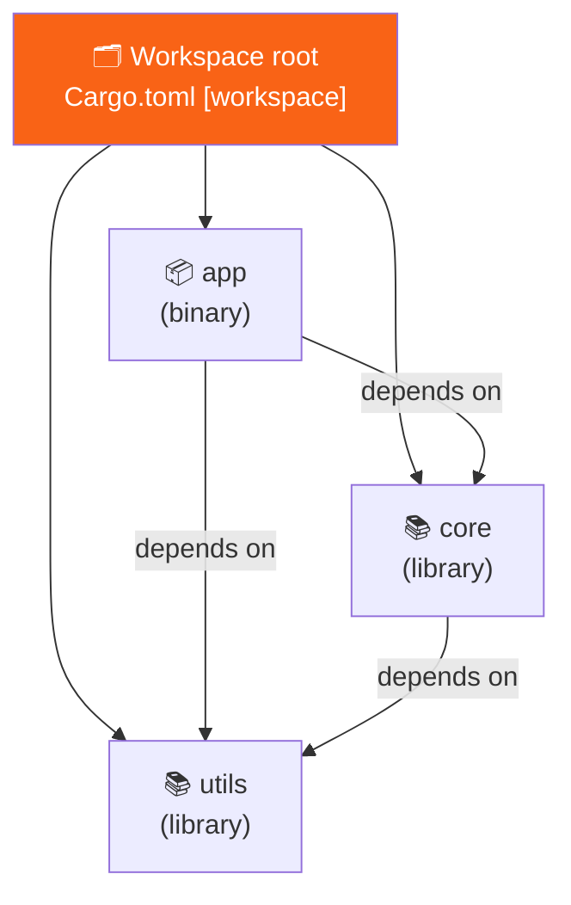

<h1><span class="h1-kicker">Organizing Code</span>Cargo Workspaces</h1>

As a project grows, cramming everything into one crate becomes unwieldy — and duplicating shared code across separate projects is worse. A Cargo **workspace** lets a set of related crates live together in one repository, share a single dependency lockfile and build directory, and depend on each other easily. It's how large Rust projects (and monorepos) stay organized.

## What a workspace is

A **workspace** is a collection of packages managed together. They share:

- **one `Cargo.lock`** — so every crate resolves dependencies to the exact same versions, guaranteeing consistency;
- **one `target/` directory** — so a dependency used by several crates is compiled just once, saving time and disk;
- **workspace-wide commands** — `cargo build` or `cargo test` at the root builds or tests *every* member.



## Setting one up

At the repository root, create a `Cargo.toml` with a `[workspace]` section listing the member crates — note this root file has **no** `[package]` of its own:

```toml
# Cargo.toml (at the repo root)
[workspace]
resolver = "2"
members = [
    "app",
    "core",
    "utils",
]
```

Then each member is a normal package in its own subfolder:

```text
my_workspace/
├── Cargo.toml          # the [workspace] file above
├── Cargo.lock          # ONE lockfile, shared by all members
├── target/             # ONE build output, shared by all members
├── app/
│   ├── Cargo.toml
│   └── src/main.rs
├── core/
│   ├── Cargo.toml
│   └── src/lib.rs
└── utils/
    ├── Cargo.toml
    └── src/lib.rs
```

## Crates depending on each other

Within a workspace, one member depends on another with a **path dependency** — you point at its folder instead of fetching from crates.io:

```toml
# app/Cargo.toml
[package]
name = "app"
version = "0.1.0"
edition = "2021"

[dependencies]
core = { path = "../core" }    # depend on our own `core` crate
utils = { path = "../utils" }
```

Now `app` can `use core::…` just like any external crate. Change `core` and rebuild `app` — Cargo recompiles only what's needed.

## Running workspace commands

From the workspace root, Cargo commands apply to the whole workspace by default, and `-p` (package) targets a single member:

```bash
cargo build                 # build every member
cargo test                  # test every member
cargo run -p app            # run a specific member's binary
cargo test -p core          # test just the `core` crate
cargo build -p utils        # build just `utils`
```

## Sharing dependency versions across members

To stop three crates from each pinning a *different* version of `serde`, workspaces let you declare shared dependency versions once at the root and inherit them in members — keeping everything consistent:

```toml
# root Cargo.toml
[workspace.dependencies]
serde = { version = "1.0", features = ["derive"] }
```

```toml
# core/Cargo.toml
[dependencies]
serde = { workspace = true }   # inherit the version from the workspace
```

> [!best] When to reach for a workspace
> Use a workspace when you have **multiple crates developed together**: a library plus a CLI that uses it; a web server split into `api`, `db`, and `domain` layers; a family of related tools; or shared code you want to reuse across binaries without publishing to crates.io. The payoff is a single `cargo test` for everything, one consistent set of dependency versions, and fast shared builds. For a single-purpose program, one package is simpler — don't reach for a workspace before you need it.

> [!tip] Split by responsibility, not by whim
> A good workspace layout mirrors your architecture: a pure-logic `core`/`domain` library with no I/O (easy to test), thin adapter crates for the outside world (database, HTTP), and a small binary that wires them together. This keeps compile times and dependencies isolated — a change to your web layer needn't recompile your core logic — and makes the boundaries in your system explicit.

## Summary

- A **workspace** groups related packages that share one **`Cargo.lock`**, one **`target/`**, and workspace-wide `cargo` commands.
- The root `Cargo.toml` has a **`[workspace]`** section listing `members` and **no `[package]`** of its own.
- Members depend on each other via **path dependencies** (`{ path = "../core" }`).
- Target a single member with **`-p <name>`**; omit it to act on the whole workspace.
- Share versions with **`[workspace.dependencies]`** + `{ workspace = true }` so all members stay consistent.
- Use a workspace when several crates are developed together; keep a single package for a single purpose.

> [!exercise] Try it yourself
> 1. Create a workspace with a `core` library (a `pub fn greeting() -> String`) and an `app` binary that depends on it and prints the greeting.
> 2. From the root, run `cargo run -p app`, then `cargo test` to test both crates at once.
> 3. Add a `[workspace.dependencies]` entry and inherit it in a member with `{ workspace = true }`.

That completes organizing code — from modules within a file all the way up to multi-crate workspaces. You now have the *entire core and intermediate language* under your belt. From here, the book branches into concurrency, async, advanced features, the standard library, the crate ecosystem, real projects, and a full algorithms course. Onward to **fearless concurrency**!
