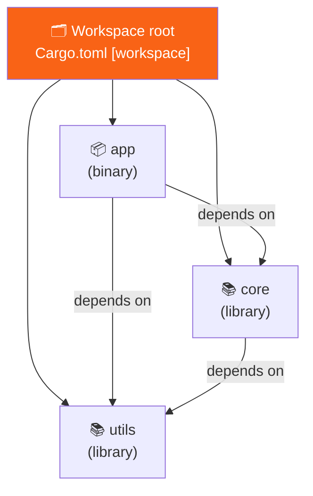

<h1><span class="h1-kicker">Organizing Code</span>Cargo Workspaces</h1>

As a project grows, cramming everything into one crate becomes unwieldy — and duplicating shared code across separate projects is worse. A Cargo **workspace** lets a set of related crates live together in one repository, share a single dependency lockfile and build directory, and depend on each other easily. It's how large Rust projects (and monorepos) stay organized.

## What a workspace is

A **workspace** is a collection of packages managed together. They share:

- **one `Cargo.lock`** — so every crate resolves dependencies to the exact same versions, guaranteeing consistency;
- **one `target/` directory** — so a dependency used by several crates is compiled just once, saving time and disk;
- **workspace-wide commands** — `cargo build` or `cargo test` at the root builds or tests *every* member.

That second point is the one with real teeth. Consider three separate projects that all use `serde`, versus the same three as workspace members:

<figure class="diagram">
<svg viewBox="0 0 640 250" role="img" aria-label="Three separate projects each compile their own copy of a dependency into their own target directory, while three workspace members share one compiled copy in a single target directory">
  <style>
    .ws-h { font: 700 12px var(--font-sans); }
    .ws-m { font: 600 10.5px var(--font-mono); fill: var(--text); }
    .ws-c { font: 10.5px var(--font-sans); fill: var(--text-mute); }
    .ws-crate { fill: var(--surface-2); stroke: var(--border-strong); stroke-width: 1.3; }
    .ws-dup { fill: var(--red-soft); stroke: var(--red); stroke-width: 1.3; }
    .ws-shared { fill: var(--green-soft); stroke: var(--green); stroke-width: 2; }
    .ws-line { stroke: var(--green); stroke-width: 1.6; fill: none; }
  </style>
  <text x="20" y="18" class="ws-h" fill="var(--red)">Three separate projects</text>
  <rect x="20" y="28" width="80" height="22" rx="3" class="ws-crate"/><text x="28" y="44" class="ws-m">app/</text>
  <rect x="20" y="54" width="80" height="22" rx="3" class="ws-dup"/><text x="28" y="70" class="ws-m">serde ×1</text>
  <rect x="110" y="28" width="80" height="22" rx="3" class="ws-crate"/><text x="118" y="44" class="ws-m">core/</text>
  <rect x="110" y="54" width="80" height="22" rx="3" class="ws-dup"/><text x="118" y="70" class="ws-m">serde ×2</text>
  <rect x="200" y="28" width="80" height="22" rx="3" class="ws-crate"/><text x="208" y="44" class="ws-m">cli/</text>
  <rect x="200" y="54" width="80" height="22" rx="3" class="ws-dup"/><text x="208" y="70" class="ws-m">serde ×3</text>
  <text x="20" y="96" class="ws-c">3 lockfiles · 3 target/ dirs · serde compiled 3×</text>
  <text x="20" y="112" class="ws-c">versions can silently drift apart</text>
  <text x="360" y="18" class="ws-h" fill="var(--green)">One workspace</text>
  <rect x="360" y="28" width="80" height="22" rx="3" class="ws-crate"/><text x="368" y="44" class="ws-m">app/</text>
  <rect x="450" y="28" width="80" height="22" rx="3" class="ws-crate"/><text x="458" y="44" class="ws-m">core/</text>
  <rect x="540" y="28" width="80" height="22" rx="3" class="ws-crate"/><text x="548" y="44" class="ws-m">cli/</text>
  <rect x="400" y="86" width="180" height="26" rx="3" class="ws-shared"/>
  <text x="408" y="104" class="ws-m">serde, compiled ONCE</text>
  <path d="M400 52 L470 84" class="ws-line"/>
  <path d="M490 52 L490 84" class="ws-line"/>
  <path d="M580 52 L510 84" class="ws-line"/>
  <rect x="400" y="120" width="180" height="26" rx="3" class="ws-shared"/>
  <text x="408" y="138" class="ws-m">one Cargo.lock, one target/</text>
  <text x="360" y="166" class="ws-c">versions cannot drift — there is only one answer</text>
  <text x="20" y="196" class="ws-h">Why it compounds</text>
  <text x="20" y="214" class="ws-c">A real tree has hundreds of transitive dependencies, not one. Sharing the cache turns "rebuild everything</text>
  <text x="20" y="228" class="ws-c">three times" into "rebuild once", which is usually the difference between a 20-second and a 3-minute test run.</text>
  <text x="20" y="244" class="ws-c">It also removes an entire class of bug: two members disagreeing about which version of a shared type they use.</text>
</svg>
<figcaption>The shared <code>target/</code> is a <b>compilation cache</b>, and the shared <code>Cargo.lock</code> makes version drift between members impossible.</figcaption>
</figure>

> [!key] Two crates on different versions of a library cannot talk to each other
> This is the deeper reason workspaces matter, beyond build speed. If `core` resolves `serde 1.0.190` and `app` resolves `serde 1.0.210`, Cargo treats those as **two different crates** — so a `serde::Value` produced by `core` is a *different type* from the one `app` expects, and you get an error message that appears to say `expected Value, found Value`. A single shared lockfile makes that situation impossible by construction. It's the same problem `cargo tree -d` exists to diagnose.



## Setting one up

At the repository root, create a `Cargo.toml` with a `[workspace]` section listing the member crates — note this root file has **no** `[package]` of its own:

```toml
# Cargo.toml (at the repo root)
[workspace]
resolver = "2"
members = [
    "app",
    "core",
    "utils",
]
```

Two things in that file deserve explanation.

A root manifest with `[workspace]` but no `[package]` is called a **virtual manifest**. The root isn't a crate at all — it's purely an organizing node. That's the usual shape, and it's the right one: it keeps "the repository" and "a crate in the repository" as separate ideas. (You *can* put a `[package]` at the root, making it both a workspace and a member, but then that crate's dependencies become subtly privileged and the layout gets harder to reason about.)

The **`resolver`** setting controls how Cargo combines feature flags across the graph — and it matters more than its obscurity suggests.

> [!deep] What the resolver actually resolves
> Cargo **unifies features**: if any crate in the graph enables a feature of `serde`, that feature is on for *everyone* who uses `serde`, because only one copy is compiled. Resolver **1** unified too aggressively — a feature enabled by a `build-dependency`, a `dev-dependency`, or a platform-specific dependency leaked into your normal build. So a crate needed only for tests could quietly enable `std` in a `no_std` build, or a Windows-only dependency's features could apply on Linux.
>
> Resolver **2** keeps those three categories separate, which is almost always what you want. It became the default for edition 2021, and resolver **3** (edition 2024) adds MSRV-aware version selection. In a **virtual manifest there is no edition to infer it from**, so the resolver silently falls back to version 1 unless you state it — which is exactly why `resolver = "2"` appears in the example above. If you take one thing from this: always set it explicitly in a workspace root.

> [!warning] Feature unification means building the workspace differs from building one member
> `cargo build -p core` compiles `core` with just its own features. `cargo build` at the root compiles it with the **union** of features requested by every member. So a member can work alone and fail in the workspace build, or vice versa — and the error can be a missing feature in something you never touched. When a build succeeds locally and fails in CI, this is a prime suspect. The fix is usually to test both ways: `cargo check -p <member>` as well as `cargo check --workspace`. See [Conditional Compilation & Features](#/ch/conditional-compilation).

Then each member is a normal package in its own subfolder:

```text
my_workspace/
├── Cargo.toml          # the [workspace] file above
├── Cargo.lock          # ONE lockfile, shared by all members
├── target/             # ONE build output, shared by all members
├── app/
│   ├── Cargo.toml
│   └── src/main.rs
├── core/
│   ├── Cargo.toml
│   └── src/lib.rs
└── utils/
    ├── Cargo.toml
    └── src/lib.rs
```

## Crates depending on each other

Within a workspace, one member depends on another with a **path dependency** — you point at its folder instead of fetching from crates.io:

```toml
# app/Cargo.toml
[package]
name = "app"
version = "0.1.0"
edition = "2021"

[dependencies]
core = { path = "../core" }    # depend on our own `core` crate
utils = { path = "../utils" }
```

Now `app` can `use core::…` just like any external crate. Change `core` and rebuild `app` — Cargo recompiles only what's needed.

## Running workspace commands

From the workspace root, Cargo commands apply to the whole workspace by default, and `-p` (package) targets a single member:

```bash
cargo build                 # build every member
cargo test                  # test every member
cargo run -p app            # run a specific member's binary
cargo test -p core          # test just the `core` crate
cargo build -p utils        # build just `utils`
```

| Command | Applies to |
|---|---|
| `cargo build` | the default members (all of them, unless you set `default-members`) |
| `cargo build --workspace` | **every** member, explicitly — including any excluded from the default set |
| `cargo build -p core` | one member only |
| `cargo build -p core -p utils` | several named members |
| `cargo build --workspace --exclude heavy-crate` | everything except one |
| `cargo run -p app` | required if more than one member has a binary |
| `cargo test --workspace --all-features` | the thorough CI invocation |
| `cargo tree -p app` | the dependency graph of one member |
| `cargo add serde -p core` | add a dependency to a specific member |

> [!mistake] `cargo run` fails when several members have binaries
> At the root of a workspace with more than one runnable crate, plain `cargo run` can't guess which you meant and errors out. Use `cargo run -p app`, or set a default so the common case just works:
> ```toml
> [workspace]
> members = ["app", "core", "utils"]
> default-members = ["app"]
> ```
> `default-members` also narrows what a bare `cargo build` compiles — useful when one member is slow and rarely touched. Note that `--workspace` ignores it and always does everything, which is what you want in CI.

## Sharing dependency versions across members

To stop three crates from each pinning a *different* version of `serde`, workspaces let you declare shared dependency versions once at the root and inherit them in members — keeping everything consistent:

```toml
# root Cargo.toml
[workspace.dependencies]
serde = { version = "1.0", features = ["derive"] }
```

```toml
# core/Cargo.toml
[dependencies]
serde = { workspace = true }   # inherit the version from the workspace
```

A member can inherit the version and *add* to it, which is the usual pattern when one crate needs an extra feature:

```toml
# app/Cargo.toml — same version as the workspace, plus one more feature
[dependencies]
serde = { workspace = true, features = ["rc"] }
```

The same inheritance works for package **metadata**, so you don't repeat the version, licence, and edition in every member:

```toml
# root Cargo.toml
[workspace.package]
version = "0.4.2"
edition = "2021"
license = "MIT OR Apache-2.0"
repository = "https://github.com/me/my-project"
rust-version = "1.74"

[workspace.lints.clippy]
unwrap_used = "deny"
```

```toml
# core/Cargo.toml
[package]
name = "my-project-core"
version.workspace = true
edition.workspace = true
license.workspace = true
repository.workspace = true

[lints]
workspace = true               # adopt the shared lint policy
```

> [!best] Inherit everything you can from the root
> In a five-member workspace, an un-inherited version number means five places to edit for every release — and one of them will eventually be missed. `[workspace.package]` and `[workspace.dependencies]` make the root the single source of truth, and `[workspace.lints]` (Rust 1.74+) does the same for your lint policy so members can't drift into different standards. It's the same reasoning as [DRY](#/ch/api-design) applied to configuration.

### Publishing workspace members

One rule catches people out. A `path` dependency works locally but means nothing to crates.io, so a member you intend to publish needs **both**:

```toml
# app/Cargo.toml
[dependencies]
# `path` is used for local builds; `version` is what gets published.
my-project-core = { path = "../core", version = "0.4.2" }
```

Cargo uses the path when building in the workspace and rewrites the dependency to the version when packaging. Publish in dependency order — `core` before `app` — because each crate must already exist on the registry before something that depends on it can be uploaded.

| Situation | What to do |
|---|---|
| a private/internal workspace | `path` alone is fine |
| a member you publish | `path` **and** `version` |
| a member you never publish | add `publish = false` to its `[package]` |
| releasing several members together | publish in dependency order, or use `release-plz` |

> [!best] When to reach for a workspace
> Use a workspace when you have **multiple crates developed together**: a library plus a CLI that uses it; a web server split into `api`, `db`, and `domain` layers; a family of related tools; or shared code you want to reuse across binaries without publishing to crates.io. The payoff is a single `cargo test` for everything, one consistent set of dependency versions, and fast shared builds. For a single-purpose program, one package is simpler — don't reach for a workspace before you need it.

> [!tip] Split by responsibility, not by whim
> A good workspace layout mirrors your architecture: a pure-logic `core`/`domain` library with no I/O (easy to test), thin adapter crates for the outside world (database, HTTP), and a small binary that wires them together. This keeps compile times and dependencies isolated — a change to your web layer needn't recompile your core logic — and makes the boundaries in your system explicit.

| Member | Contains | Depends on | Heavy dependencies? |
|---|---|---|---|
| `core` / `domain` | types and rules, **no I/O** | nothing | none — this is the point |
| `storage` | database access | `core` | `sqlx`, drivers |
| `api` | HTTP handlers | `core`, `storage` | `axum`, `tower` |
| `cli` | argument parsing | `core`, `storage` | `clap` |
| `app` (binary) | wiring and startup | all of the above | — |

The reason this ordering pays off is that dependencies only ever point *inward*. `core` doesn't know the database exists, so editing a SQL query recompiles `storage` and `api` but never `core` — and `core`'s tests need no database, no runtime, and no fixtures. Here's what "pure logic with no I/O" buys you, in a form you can run:

```rust
// This is the kind of code that belongs in `core`: rules, no I/O.
#[derive(Debug, PartialEq)]
pub enum Decision {
    Approve,
    Review { reason: &'static str },
    Reject { reason: &'static str },
}

/// Pure: same inputs always give the same answer. No database, no clock,
/// no network — so a test is just a function call.
pub fn assess(amount_cents: u64, account_age_days: u32, is_flagged: bool) -> Decision {
    if is_flagged {
        return Decision::Reject { reason: "account flagged" };
    }
    if amount_cents > 1_000_000 && account_age_days < 30 {
        return Decision::Review { reason: "large amount, new account" };
    }
    if amount_cents > 5_000_000 {
        return Decision::Review { reason: "very large amount" };
    }
    Decision::Approve
}

fn main() {
    // Every interesting case is one line to exercise.
    println!("{:?}", assess(5_000, 400, false));
    println!("{:?}", assess(2_000_000, 5, false));
    println!("{:?}", assess(9_000_000, 900, false));
    println!("{:?}", assess(100, 900, true));

    // The same tests would need a running database if this logic
    // lived inside a request handler or a SQL query.
    assert_eq!(assess(5_000, 400, false), Decision::Approve);
    assert_eq!(assess(100, 900, true), Decision::Reject { reason: "account flagged" });
    println!("\nall assertions passed — no I/O required");
}
```

> [!warning] Don't split before you have a reason
> A workspace has real costs: more manifests, `pub` boundaries where a private function would have done, and refactoring across crates is genuinely harder than moving code between modules. Start with **one package and several modules**. Split out a crate when you have a concrete trigger — you need to publish part of it, compile times have become painful, two binaries must share code, or you want to enforce a dependency direction the compiler can check. "It feels tidier" is not a trigger. Note also that **workspaces cannot nest**: a member cannot itself be a workspace root.

## Summary

- A **workspace** groups related packages that share one **`Cargo.lock`**, one **`target/`**, and workspace-wide `cargo` commands.
- The shared `target/` is a **compilation cache** (a dependency is built once for all members) and the shared lockfile makes **version drift between members impossible** — which matters because two crates on different versions of a library have mutually incompatible types.
- The root `Cargo.toml` has a **`[workspace]`** section listing `members` and **no `[package]`** of its own — a **virtual manifest**.
- Always set **`resolver = "2"`** in a virtual manifest: with no edition to infer it from, Cargo falls back to resolver 1, which leaks `dev`-, `build`-, and target-specific features into your normal build.
- Cargo **unifies features** across members, so `cargo build` at the root can give a member different features than `cargo build -p member`. Check both.
- Members depend on each other via **path dependencies** (`{ path = "../core" }`) — and a member you intend to **publish** needs a `version` alongside the `path`.
- Target a single member with **`-p <name>`**, everything with **`--workspace`**, and set **`default-members`** so a bare `cargo run` isn't ambiguous.
- Inherit from the root with **`[workspace.dependencies]`**, **`[workspace.package]`**, and **`[workspace.lints]`** so there's one source of truth.
- Layout so dependencies point **inward**: a pure `core` with no I/O, adapters around it, a thin binary on top.
- **Don't split before you have a reason.** Start with one package and modules; workspaces cannot nest.

> [!exercise] Try it yourself
> 1. Create a workspace with a `core` library (a `pub fn greeting() -> String`) and an `app` binary that depends on it and prints the greeting.
> 2. From the root, run `cargo run -p app`, then `cargo test` to test both crates at once.
> 3. Add a `[workspace.dependencies]` entry and inherit it in a member with `{ workspace = true }`. Then have one member add an extra feature with `{ workspace = true, features = [...] }`.
> 4. Add a second binary member and run plain `cargo run` at the root. Read the error, then fix it with `default-members`.
> 5. Move the `assess` function above into a `core` member and write its tests there. Confirm `cargo test -p core` needs no other member to be built.
> 6. Omit `resolver = "2"` from a virtual manifest and run `cargo build`. Does Cargo warn you? Explain which resolver you actually got.

That completes organizing code — from modules within a file all the way up to multi-crate workspaces. You now have the *entire core and intermediate language* under your belt. From here, the book branches into concurrency, async, advanced features, the standard library, the crate ecosystem, real projects, and a full algorithms course. Onward to **fearless concurrency**!
